# خواننده تلگرام

<!-- TOP_NAV START -->

<!-- TOP_NAV END -->

<!-- MSG START -->

---
📅 بروزرسانی: 1405/02/23 02:15
---

## VahidOOnLine — post 239809

  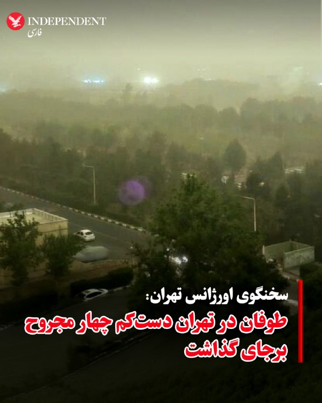

♦️شروین تبریزی، سخنگوی اورژانس تهران سه‌شنبه‌شب، ۲۲ اردیبهشت گفت: «طوفان در تهران تاکنون چهار مجروح داشته که البته همه این افراد در محل درمان شدند.» او گفت: «با توجه به اینکه وزش باد دقایقی قبل متوقف شد احتمال افزایش مجروحان وجود دارد».
‌🇸🇦 Indypersian

🤖 @VahidOOnLine

## VahidOOnLine — post 239808

  <a href="telegram/content/VahidOOnLine_239808_1778625957.mp4" target="_blank">🎬 Download video</a>

ویدیوهای منتشرشده در رسانه‌های ایران، وضعیت شهروندان را پس از زلزله شامگاه سه‌شنبه ۲۲ اردیبهشت‌ماه در بومهن و پردیس استان تهران نشان می‌دهد؛ شهروندانی که پس از زلزله به خیابان آمده‌اند و شب را کنار خیابان یا در خودروهای خود، در فضای باز پارک‌ها، سپری می‌کنند.
بر اساس گزارش‌های منتشرشده، زمین‌لرزه‌ای به بزرگی ۴.۶ مرز استان‌های تهران و مازندران را لرزاند که تاکنون با چندین پس‌لرزه همراه بوده است.
به گزارش سازمان مدیریت بحران، این زلزله خسارتی نداشته است.
‌🏁 🇬🇧 IranintlTV

🤖 @VahidOOnLine

## VahidOOnLine — post 239807

  <a href="telegram/content/VahidOOnLine_239807_1778625959.mp4" target="_blank">🎬 Download video</a>

♦️دونالد ترامپ، رئیس‌جمهوری ایالات متحده، بعدازظهر سه‌شنبه، ۲۲ اردیبهشت‌‌ماه، سفر چندروزه خود را برای دیدار با شی جین‌پینگ، رئیس جمهوری چین آغاز کرد. انتظار می‌رود خاورمیانه و پیامدهای اقتصادی مربوط به جنگ، از محورهای اصلی گفتگوها میان دو رهبر باشد.
‌🇸🇦 Indypersian

🤖 @VahidOOnLine

## VahidOOnLine — post 239806

  <a href="telegram/content/VahidOOnLine_239806_1778625962.mp4" target="_blank">🎬 Download video</a>

‌
الجزیره به نقل از منابع دیپلماتیک گزارش داد ۱۱۲ کشور به پیش‌نویس قطعنامه‌ای در شورای امنیت سازمان ملل پیوسته‌اند که از سوی آمریکا و کشورهای خلیج فارس درباره آزادی کشتیرانی در تنگه هرمز ارائه شده است.

به گفته این منابع، هند، ژاپن و بیشتر کشورهای اروپایی در میان حامیان این پیش‌نویس قرار دارند.

منابع الجزیره همچنین گفتند حمایت ۱۱۲ کشور از این قطعنامه، نشان‌دهنده پشتیبانی گسترده بین‌المللی از ابتکار آمریکا و کشورهای خلیج فارس درباره تنگه هرمز است.
‌🏁 🇬🇧 ManotoTV

🤖 @VahidOOnLine

## VahidOOnLine — post 239804

  

شروین تبریزی، سخنگوی اورژانس تهران اعلام کرد طوفان در تهران تاکنون چهار مصدوم داشته است که البته همه این مصدومان در محل درمان شدند.
او خاطرنشان کرد با توجه به اینکه وزش باد دقایقی پیش متوقف شد، احتمال افزایش مصدومان وجود دارد.

‌🏁 🇬🇧 IranintlTV

🤖 @VahidOOnLine

## VahidOOnLine — post 239803

  

♦️اسماعیل بقایی، سخنگوی وزارت امور خارجه جمهوری اسلامی، با انتشار پیامی در اکس، درگیری‌های جاری را «نبردی سرنوشت‌ساز برای آینده بشریت» توصیف کرد و گفت: «ایالات متحده و اسرائیل این جنگ تجاوزکارانه را در ۲۸ فوریه ۲۰۲۶، برای دومین بار در کمتر از یک سال و در حالی که ایران و آمریکا در حال مذاکرات دیپلماتیک بودند، آغاز کردند.» بقایی با تاکید بر اینکه این تنها جنگی بر سر زمین یا ژئوپلیتیک نیست، گفت: «این نبردی است میان دروغگویان حرفه‌ای که برای جنایات خود توجیه می‌تراشند و ملتی سربلند که با تکیه بر قدرت و اراده خود از میهن و کرامت انسانی دفاع می‌کنند.» او سکوت در برابر این وضعیت را همدستی با شر دانست و گفت: «شجاعت اخلاقی برای سخن گفتن، عمل کردن و ایستادن در سمت درست تاریخ را پیدا کنید، پیش از آنکه جهان به ورطه بی‌قانونی و انقیاد سقوط کند. انتخاب با شماست و تاریخ آن را به یاد خواهد داشت».
‌🇸🇦 Indypersian

🤖 @VahidOOnLine

## VahidOOnLine — post 239802

  

سازمان مدیریت بحران اعلام کرد باتوجه به بررسی‌های اولیه و ارزیابی تیم‌های کارشناسی، زمین‌لرزه‌ها در مرز استان‌های تهران و مازندران خساراتی درپی نداشته است.
مرکز لرزه‌نگاری در اطلاعیه‌ای اعلام کرد ساعت ۲۳:۴۶ سه‌شنبه شب زمین‌لرزه‌ای به بزرگی ۴.۶ مرز تهران و مازندران را لرزاند. زمین‌لرزه در تهران حدود ۱۰ ثانیه طول کشید.
این لرزش در شرق تهران، ورامین، پاکدشت، پردیس و بخش‌هایی از شمیرانات بیشتر احساس شد.
همچنین چهار پس‌لرزه‌ در استان تهران رخ داد که آخرین پس‌لرزه‌ها به بزرگی ۴ و ۳.۴ بودند.

‌🏁 🇬🇧 IranintlTV

🤖 @VahidOOnLine

## VahidOOnLine — post 239801

  

♦️به گزارش رویترز، عراق و پاکستان برای انتقال نفت و گاز طبیعی مایع (LNG) از خلیج فارس با تهران به توافق رسیده‌اند؛ اقدامی که به گفته «پنج منبع آگاه»، نشان‌دهنده توانایی رژیم ایران در هدایت جریان انرژی از طریق تنگه هرمز است. این توافق‌های جدید در حالی صورت می‌گیرد که اشراف تهران بر این آبراه حیاتی، قدرت چانه‌زنی این کشور در معادلات انرژی منطقه را افزایش داده و مسیرهای تازه‌ای را برای صادرات سوخت در بازارهای منطقه‌ای ایجاد کرده است.
‌🇸🇦 Indypersian

🤖 @VahidOOnLine

## VahidOOnLine — post 239800

  <a href="telegram/content/VahidOOnLine_239800_1778625966.mp4" target="_blank">🎬 Download video</a>

رئیس سازمان هلال احمر اعلام کرد زلزله در تهران و کرج «هیچ» خسارت مالی و جانی در پی نداشته است.
پیش‌تر زلزله‌ای به بزرگی ۴.۶ در مقیاس ریشتر، مرز استان‌های تهران و مازندران را لرزاند.
‌🏁 🇬🇧 ManotoTV

🤖 @VahidOOnLine

## VahidOOnLine — post 239799

  

♦️به گزارش مرکز لرزه‌نگاری ایران، در نخستین ساعت بامداد چهارشنبه، ۲۳ اردیبهشت‌ماه، وقوع دو پس‌لرزه به‌ترتیب به بزرگی ۴ و ۳.۴ در پردیس، تهران را لرزاند. براساس گزارش فارس، این پس‌لرزه‌ها در ورامین، پاکدشت، پردیس و بخش‌هایی از شمیرانات حس شده است. پیش از این، زلزله به بزرگی ۴.۶ در مرز تهران و مازندران رخ داد که پردیس مرکز آن اعلام شد.
‌🇸🇦 Indypersian

🤖 @VahidOOnLine

## VahidOOnLine — post 239798

  

♦️دونالد ترامپ، رئیس‌جمهوری ایالات متحده، با انتشار پیامی در شبکه اجتماعی «تروث سوشال»، گزارش‌های رسانه‌ها درباره موفقیت‌های نظامی جمهوری اسلامی در برابر آمریکا را «دروغین» و مصداق عینی «خیانت» خواند و گفت: «این اظهارات مضحک تنها به ایران امیدی واهی می‌دهد؛ این‌ها ترسوهای آمریکایی هستند که علیه کشور خودشان ریشه می‌دوانند و با حمایت از دشمن، به آن‌‌ها کمک می‌کنند.» ترامپ با اشاره به نابودی توان نظامی جمهوری اسلامی گفت: «ایران درگیر یک فاجعه اقتصادی است.» او در پایان تاکید کرد که تنها «بازندگان، افراد ناسپاس و احمق‌ها» می‌توانند علیه آمریکا استدلال کنند.
‌🇸🇦 Indypersian

🤖 @VahidOOnLine

## VahidOOnLine — post 239797

  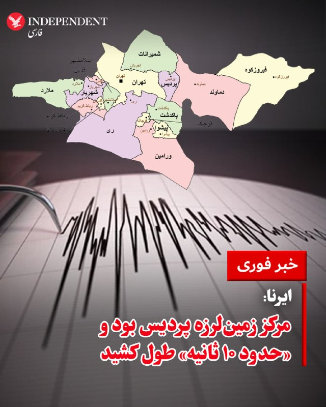

♦️به گزارش ایرنا، مرکز زمین‌لرزه سه‌شنبه‌شب تهران، در مرز این استان با مازندران در حوالی پردیس بوده است. براساس این گزارش، این زلزله به بزرگی ۴.۶، ساعت ۲۳:۴۶:۰۷ سه‌شنبه‌شب، ۲۲ اردیبهشت‌ماه، در عمق ۱۰ کیلومتر رخداد و حدود ۱۰ ثانیه به طول انجامید. همزمان، سخنگوی اورژانس تهران اعلام کرد در پی زمین لرزه در تهران تا این لحظه مصدومی گزارش نشده است
‌🇸🇦 Indypersian

🤖 @VahidOOnLine

## VahidOOnLine — post 239796

  

♦️خبرگزاری تسنیم، وابسته به سپاه پاسداران، گزارش داد عباس عراقچی، وزیر خارجه جمهوری اسلامی، در دیدار با معاون وزیر خارجه نروژ، مدعی شد «فقدان حسن‌نیت، زیاده‌خواهی و عدم صداقت آمریکا» مهم‌ترین مانع پایان قطعی جنگ و دستیابی به توافق احتمالی است. او همچنین آمریکا و اسرائیل را عامل وضعیت جاری در تنگه هرمز معرفی کرد و گفت جمهوری اسلامی در حال بررسی تدوین مقررات مرتبط با این آبراه بر اساس حقوق بین‌الملل است.
‌🇸🇦 Indypersian

🤖 @VahidOOnLine

## VahidOOnLine — post 239795

  

دونالد ترامپ در شبکه تروث سوشال نوشت وقتی رسانه‌های «جعلی» می‌گویند دشمن ایرانی از نظر نظامی در برابر آمریکا عملکرد خوبی دارد، این نوعی خیانت است، زیرا چنین ادعایی کاملا نادرست و حتی مضحک است.
او افزود: آن‌ها در حال کمک به دشمن هستند و به جمهوری اسلامی امید می‌دهند در حالی که نباید هیچ امیدی برای او وجود داشته باشد.
‌🏁 🇬🇧 IranintlTV

🤖 @VahidOOnLine

## VahidOOnLine — post 239794

  

علی احتشام، امام جمعه کاشان گفت: «جمهوری اسلامی نه یکی از چهار قدرت، بلکه تنها ابرقدرت جهان است و ملت ایران هشت کشور منطقه و آمریکا را از کمال ارتفاع ساقط کرد و امروز با حضور در خیابان‌ها اجازه نداد جام زهر دیگری نوشیده شود.»

او افزود: «اگر مردم کف خیابان نبودند، چه بسا جام زهر دیگری نوشیده می‌شد.»
‌🏁 🇬🇧 IranintlTV

🤖 @VahidOOnLine

## VahidOOnLine — post 239793

  

♦️به گزارش فارس، زلزله‌ای به بزرگی ۴.۶، سه‌شنبه‌شب، ۲۲ اردیبهشت‌ماه، مرز تهران و مازندران را لرزاند.
‌🇸🇦 Indypersian

🤖 @VahidOOnLine

## VahidOOnLine — post 239792

  

رسانه‌های ایران از وقوع زمین‌لرزه به بزرگی ۴.۶ در مرز استان‌های تهران و مازندران خبر دادند.

خبرگزاری فارس همچنین از زمین‌لرزه در کرج خبر داد.

همزمان خبرگزاری دولتی ایرنا گزارش داد زمین‌لرزه در تهران حدود ۱۰ ثانیه طول کشیده است.
‌🏁 🇬🇧 IranintlTV

🤖 @VahidOOnLine

## VahidOOnLine — post 239790

  <a href="telegram/content/VahidOOnLine_239790_1778625974.mp4" target="_blank">🎬 Download video</a>

‌
خبرگزاری‌های داخل ایران گزارش دادند دقایقی پیش زلزله تهران و کرج را لرزاند. به گزارش این خبرگزاری‌ها سمت شرق تهران زمین‌لرزه بسیار شدیدتر بوده است.
‌🏁 🇬🇧 ManotoTV

🤖 @VahidOOnLine

## VahidOOnLine — post 239789

  

سعید سیاه‌سرانی، دبیر ستاد راهیان نور دریایی، گفت: «بدون اراده جمهوری اسلامی اجازه عبور حتی یک لیتر نفت از تنگه هرمز داده نمی‌شود.»

او افزود: «تنگه هرمز جزو خاک ما است، شناورهایی که رد می‌شوند باید اجازه بگیرند و به زبان فارسی صحبت کنند و از نقاطی که ما تعیین می‌کنیم عبور کنند.»
‌🏁 🇬🇧 IranintlTV

🤖 @VahidOOnLine

## VahidOOnLine — post 239788

  

♦️وزارت امور خارجه جمهوری اسلامی روز سه‌شنبه ۲۲ اردیبهشت، بازداشت چهار نفر توسط کویت را که گفته می‌شود با سپاه پاسداران در ارتباط هستند، محکوم کرد. این وزارتخانه اعلام کرد که این افراد در حال گشت‌زنی دریایی بوده‌اند و تنها به دلیل «اختلال در سیستم ناوبری» وارد آب‌های سرزمینی این کشور حوزه خلیج فارس شده‌اند.

همچنین وزارت خارجه جمهوری اسلامی اظهارات مقامات کویتی مبنی بر برنامه‌ریزی ایران برای انجام «اقدامات خصمانه» علیه این کشور را به شدت رد کرد. این تنش دیپلماتیک در حالی رخ می‌دهد که امنیت دریانوردی در منطقه به موضوعی حساس تبدیل شده است.
‌🇸🇦 Indypersian

🤖 @VahidOOnLine

## WithYashar — post 11106

نمیتونن از قصد ی جوری پس لرزه اینجاد کنن که نفهمن تست اتمه؟

## WithYashar — post 11105

نمیتونن از قصد ی جوری پس لرزه اینجاد کنن که نفهمن تست اتمه؟

## WithYashar — post 11104

گزارش مقدماتی زمین‌لرزه بزرگی: ۴.۶ ریشتر محل وقوع: مرز استانهای تهران و مازندران - حوالی پرديس تاریخ و زمان وقوع به وقت محلی: 1405/02/22 23:46:07 عمق زمین‌لرزه: 10 کیلومتر @withyashar همچنین اورژانس تهران اعلام کرده در پی طوفان و باد شدید با سرعت ۵۵…

## WithYashar — post 11103

  <a href="telegram/content/WithYashar_11103_1778625976.mp4" target="_blank">🎬 Download video</a>

اتاق جنگ با یاشار : بلرزونش ، هواپیمای جاسوسی آواکس و زلزله… حجم کم
@withyashar

## WithYashar — post 11102

رویترز: دو تانکر حامل ال‌ان‌جی قطر، به دنبال توافق دوجانبه جداگانه بین اسلام‌آباد و تهران، به سمت پاکستان در حرکت هستند
@withyashar

## WithYashar — post 11101

گزارش مقدماتی زمین‌لرزه

بزرگی: ۴.۶ ریشتر
محل وقوع: مرز استانهای تهران و مازندران - حوالی پرديس
تاریخ و زمان وقوع به وقت محلی: 1405/02/22 23:46:07

عمق زمین‌لرزه: 10 کیلومتر
@withyashar
همچنین اورژانس تهران اعلام کرده در پی طوفان و باد شدید با سرعت ۵۵ کیلومتر در تهران تاکنون ۱۱ حادثه به این سازمان امدادی گزارش شده است.

سخنگوی اورژانس تهران نوشته تاکنون ۷ مصدوم که ۵ نفر آنها سرپایی درمان شده‌اند، در ماموریت‌های امدادگران ثبت شده‌اند اما ممکن است آمار مصدومان بیشتر شود.
@withyashar

## WithYashar — post 11100

کاور @withyashar

## WithYashar — post 11099

  

ترامپ در تروث :
وقتی رسانه‌های دروغ‌پراکن می‌گویند دشمن ایرانی از نظر نظامی در برابر ما عملکرد خوبی دارد، این عملاً نوعی خیانت است؛ چون چنین ادعایی کاملاً دروغ و حتی مضحک است. آنها دارند به دشمن کمک و همراهی می‌کنند!

تنها کاری که این حرف‌ها می‌کند این است که به ایران امید واهی می‌دهد، در حالی که هیچ امیدی نباید وجود داشته باشد. اینها ترسوهای آمریکایی هستند که علیه کشور خودشان طرفداری می‌کنند.

ایران ۱۵۹ کشتی در نیروی دریایی خود داشت — اکنون تک‌تک آن‌ها در کف دریا قرار دارند. آنها دیگر نیروی دریایی ندارند، نیروی هوایی‌شان نابود شده، تمام فناوری‌شان از بین رفته، «رهبرانشان» دیگر در میان ما نیستند، و کشورشان یک فاجعه اقتصادی است.

فقط بازنده‌ها، ناسپاس‌ها و احمق‌ها می‌توانند علیه آمریکا استدلال کنند!
@withyashar

## WithYashar — post 11098

وزارت خارجه آمریکا: با چین توافق کرده‌ایم اجازه اعمال عوارض بر عبور کشتی‌ها از تنگه هرمز داده نشود.
@withyashar

## WithYashar — post 11097

اتاق جنگ با یاشار : جابجای‌های غول آسا دو شماره یک «AirForce1» هواپیمای ویژه ریاست جمهوری و «B1 »بمب افکن اسطورهی آمریکا و خبر ویژه از داخل ایران

https://www.instagram.com/reel/DYQCr39RJ4i/?igsh=MThycjJiYWZmbnJ3dA==

کارای اداریش رو انجام بدید تا بعدش بریم برای سوال جوای

## WithYashar — post 11096

  

کاور
@withyashar

## WithYashar — post 11095

## WithYashar — post 11094

  <a href="telegram/content/WithYashar_11094_1778625982.mp4" target="_blank">🎬 Download video</a>

ترامپ سوار ایرفرس وان شد و رفت به سمت چین
@withyashar

## WithYashar — post 11093

دوباره ترامپ یک خبرنگار دیگرو هم فیتیله پیچ میکنه اعصاب نداره امشب این بازیکن

خبرنگار: تورم الان تو بالاترین سطح خودش توی ۳ سال گذشته هست. آیا سیاست‌های شما کار نمی‌کنن؟

ترامپ: سیاست‌های من به طرز شگفت‌انگیزی کار می‌کنن! اگه به قبل از جنگ برگردین، تورم ۱.۷٪ بود. اگه می‌خوای این دیوانه‌ها سلاح هسته‌ای داشته باشن، پس تو آدم احمقی هستی و من تو رو خیلی خوب می‌شناسم!

@withyashar

## WithYashar — post 11092

ترامپ یک خبرنگار رو به توپ بست

ترامپ: ما یک سالن رقص داریم که هزینه ساختش کمتر از بودجه هست. اینجا ساخته می‌شه. من اندازه‌اش رو دو برابر میکنم چون مشخصه که بهش نیاز داریم.

خبرنگار: هزینه‌ش دو برابر شده

ترامپ: من اندازه‌اش رو دو برابر کردم، آدم احمق! تو آدم باهوشی نیستی
@withyashar

## mwarmonitor — post 9010

  

🔴بر اساس گزارش CBS درباره ادعای نگهداری هواپیماهای ایرانی توسط پاکستان در پایگاه هوایی نورخان، تصاویر منتشرشده توسط شرکت چینی تحت تحریم «Mizarvision» در آوریل ۲۰۲۶ نشان می‌دهد یک هواپیمای C-130 با استتار شنی در این محل حضور دارد. اگر پاکستان از این نوع رنگ‌آمیزی…

## mwarmonitor — post 9009

  

📰(رویترز) - کلودیا شینباوم، رئیس‌جمهور مکزیک، روز دوشنبه اعلام کرد که از همکاری مقامات سفارت آمریکا با ایالت شمالی «چی‌واوا» برای مبارزه با کارتل‌های مواد مخدر اطلاعی نداشته است. وی در پی کشته شدن این مقامات در یک تصادف رانندگی، گفت که دولتش بررسی خواهد کرد…

## mwarmonitor — post 9008

  

🇺🇸✈️🇨🇳 ترامپ واشنگتن را به مقصد پکن، چین ترک کرد.

هواپیمای ریاست‌جمهوری آمریکا (Air Force One) بوئینگ VC-25A با شماره ثبت 92-9000

@mwarmonitor

## mwarmonitor — post 9007

📝 به نظر می‌رسد سیستمِ مدیریتِ بلایایِ الهی هم به این نتیجه رسیده که در ایران، مرگِ تدریجی دیگر از مد افتاده و باید کمی هیجان و سرعت به فرآیندِ انقراضِ ما تزریق کند. انگار فرشته‌ی عذاب نشسته بالای سرِ تقویمِ تهران و با خودش می‌گوید: «خب، این‌ها که تحریم هستند،…

## mwarmonitor — post 9005

✈️پرواز بمب‌افکن‌های راهبردی از نوع B-1B Lancer از پایگاه RAF Fairford ✈️به‌طور جالب توجهی، بمب‌افکن تک‌فروندی B-1B با نام “Lancer” که از RAF Fairford (کد EGVA) پرواز می‌کند (و چهلمین مأموریت آموزشی از این پایگاه از زمان آغاز آتش‌بس را انجام می‌دهد)، موقعیت…

## mwarmonitor — post 9004

🇮🇱اسرائیل نگران است که ترامپ با ایران یک «توافق بد» امضا کند؛ توافقی که برنامه هسته‌ای ایران را تا حدی دست‌نخورده باقی بگذارد و برنامه موشکی بالستیک ایران و همچنین حمایت این کشور از نیروهای نیابتی منطقه‌ای را نادیده بگیرد - CNN

🇮🇱یک مقام اسرائیلی به CNN گفته است: «اگر هیچ توافقی حاصل نشود خوشحال خواهیم شد» و «اگر محاصره/بسته بودن تنگه هرمز ادامه پیدا کند هم خوشحال خواهیم شد».

@mwarmonitor

## mwarmonitor — post 9003

🔸خبرنگار: آقای رئیس‌جمهور، پیامتان به مردم چین در آستانه این نشست (اجلاس سران) چیست؟ 🔹ترامپ: این است که ما برای دهه‌های متمادی، رابطه‌ی فوق‌العاده‌ای خواهیم داشت. رابطه‌ی من با رئیس‌جمهور «شی»، رابطه‌ای بی‌نظیر است؛ ما همیشه با هم کنار آمده‌ایم. ما با چین…

## mwarmonitor — post 9002

  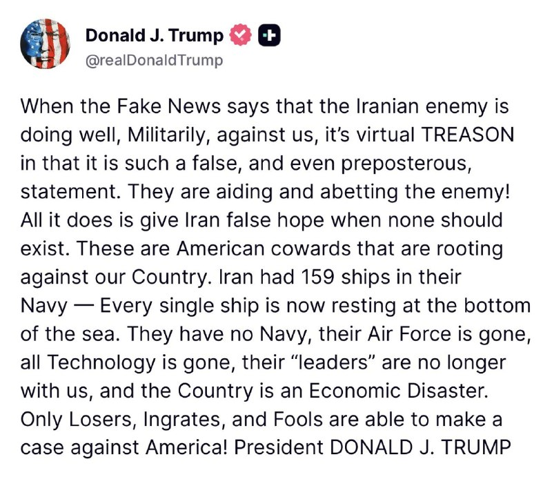

«وقتی «اخبار جعلی» (Fake News) می‌گویند که دشمن ایرانی از نظر نظامی در برابر ما خوب عمل می‌کند، این عملاً به مثابه خیانت است، زیرا چنین اظهارنظری کذب و حتی مضحک است. آن‌ها در حال کمک و یاری رساندن به دشمن هستند!
تمام کاری که این کار انجام می‌دهد، دادن امید واهی به ایران است، در حالی که هیچ امیدی نباید وجود داشته باشد. این‌ها ترسوهای آمریکایی هستند که علیه کشورمان فعالیت می‌کنند. ایران ۱۵۹ کشتی در نیروی دریایی خود داشت — اکنون تک‌تک آن کشتی‌ها در کف دریا آرام گرفته‌اند. آن‌ها دیگر نیروی دریایی ندارند، نیروی هوایی‌شان از بین رفته، تمام تکنولوژی‌شان نابود شده، «رهبرانشان» دیگر در میان ما نیستند و این کشور یک فاجعه اقتصادی است.
فقط بازنده‌ها، ناسپاس‌ها و احمق‌ها می‌توانند علیه آمریکا استدلال کنند!

رئیس‌جمهور دونالد جی. ترامپ»

@mwarmonitor

## mwarmonitor — post 9001

تهران یه بچه زلزله امده

## mwarmonitor — post 9000

🔸خبرنگار: تالار پذیرایی شما چه تفاوتی با بقیه دارد؟ 🔹دونالد ترامپ: اتفاقی که افتاده این است که ما یک تالار پذیرایی داریم که هزینه‌اش کمتر از بودجه پیش‌بینی شده بوده، دقیقاً همین‌جا در حال ساخت است. من اندازه‌اش را دو برابر کردم چون مسلماً به آن نیاز داریم.…

## mwarmonitor — post 8999

🔸خبرنگار: آقای رئیس‌جمهور، شما قول داده بودید که تورم را پایین بیاورید. اما الان در بالاترین سطح خود در سه سال اخیر است. آیا سیاست‌های شما کار نمی‌کنند؟ چه اتفاقی دارد می‌افتد؟ 🔹ترامپ: سیاست‌های من فوق‌العاده خوب کار می‌کنند. اگر به زمان دقیقاً قبل از شروع…

## mwarmonitor — post 8998

🔸خبرنگار: آقای رئیس‌جمهور، تا چه زمانی به مذاکره با ایران ادامه می‌دهید؟ (چه زمانی مذاکره با ایران تمام می‌شود؟) 🔹ترامپ: خب، خواهیم دید چه پیش می‌آید. ما فقط یک توافق خوب خواهیم کرد. ارتش آن‌ها از بین رفته، نابود شده است. ما فقط یک توافق خوب خواهیم کرد و خواهیم…

## mwarmonitor — post 8997

🔸خبرنگار: آقای رئیس‌جمهور، تا چه زمانی به مذاکره با ایران ادامه می‌دهید؟ (چه زمانی مذاکره با ایران تمام می‌شود؟)
🔹ترامپ: خب، خواهیم دید چه پیش می‌آید. ما فقط یک توافق خوب خواهیم کرد. ارتش آن‌ها از بین رفته، نابود شده است. ما فقط یک توافق خوب خواهیم کرد و خواهیم دید چه می‌شود. اما من معتقدم که به هر شکلی، این [توافق] برای مردم آمریکا و در واقع برای مردم ایران بسیار خوب خواهد بود.
🔸خبرنگار: آیا شما پاکستانی‌ها را به عنوان میانجی در نظر می‌گیرید؟
🔹ترامپ: نه، آن‌ها عالی هستند. من فکر می‌کنم پاکستانی‌ها عالی بوده‌اند. فیلد مارشال و نخست‌وزیر پاکستان مطلقاً عالی بوده‌اند.
🔸خبرنگار: آقای رئیس‌جمهور، پیام شما به رئیس‌جمهور "شی" [رئیس‌جمهور چین] در رابطه با جنگ ایران چیست؟
🔹ترامپ: خب، فکر می‌کنم اولاً ما در مورد آن صحبت مفصلی خواهیم داشت. فکر می‌کنم او نسبتاً خوب بوده است، اگر صادقانه بگویم. به محاصره نگاه کنید، مشکلی نیست. آن‌ها مقدار زیادی از نفت خود را از آن منطقه می‌گیرند. ما مشکلی نداشتیم و او دوست من بوده است، کسی است که با هم کنار می‌آییم. و فکر می‌کنم خواهید دید که اتفاقات خوبی رخ خواهد داد. این سفر بسیار هیجان‌انگیزی خواهد بود و اتفاقات خوب زیادی خواهد افتاد.
🔸خبرنگار: آقای رئیس‌جمهور، آیا فکر می‌کنید او (رئیس‌جمهور چین) اصلاً نیاز دارد در مورد ایرانی‌ها مداخله کند؟ فکر می‌کنید او می‌تواند به هر شکلی کمک کند؟
🔹ترامپ: نه، فکر نمی‌کنم در مورد ایران به کمکی نیاز داشته باشیم. ما به هر شکلی پیروز می‌شویم. ما به صورت مسالمت‌آمیز یا غیر از آن پیروز می‌شویم. نیروی دریایی آن‌ها رفته، نیروی هوایی‌شان رفته، تک‌تک عناصر ماشین جنگی آن‌ها از بین رفته است. آن‌ها افراد زیادی را کشته‌اند، حداقل ۴۲ هزار نفر را در یک ماه و نیم گذشته کشته‌اند. ما پیروز می‌شویم، مهم نیست چطور حساب کنید.
🔸خبرنگار: آقای رئیس‌جمهور، آیا معتقدید سفر شما به چین بر اقتصاد بین‌الملل و قیمت نفت تأثیر خواهد گذاشت؟
🔹ترامپ: تأثیر مثبتی خواهد داشت. ما دیدار بسیار خوبی خواهیم داشت. من با رئیس‌جمهور شی صحبت کردم. هر دوی ما مشتاقانه منتظر این دیدار هستیم. عالی خواهد بود.
🔸خبرنگار: آقای رئیس‌جمهور، خط قرمز شما برای پایان دادن به این آتش‌بس چه خواهد بود؟ چه چیزی باعث می‌شود که شما همکاری را قطع کنید؟
🔹ترامپ: خب، خواهیم دید. در طول پرواز به آن فکر خواهیم کرد و برای مدتی در موردش تأمل می‌کنیم. اما ما ارتش آن‌ها را به سختی شکست داده‌ایم، آن تمام شده است. محاصره بسیار مؤثر است، ۱۰۰ درصد مؤثر بوده است. و به هر شکلی، همه چیز خیلی خوب پیش خواهد رفت. فکر می‌کنم آن‌قدر نفت خواهید داشت که مثل گذشته فوران نفت (فراوانی نفت) داشته باشید. بنابراین وقتی قیمت نفت کمی بالا می‌رود... من فکر می‌کردم اگر به سه چهار ماه پیش، زمانی که در حال برنامه‌ریزی بودیم برگردید، قیمت خیلی بیشتر بالا برود. دیروز قیمت ۹۹ دلار بود. و اگر به آن فکر کنید، من کل روز آن [قیمت] را می‌پذیرفتم (با آن قیمت مشکلی نداشتم).

@mwarmonitor

## mwarmonitor — post 8996

## mwarmonitor — post 8995

🔴تا جایی که اطلاع داریم، ایران در ۲۸ روز گذشته هیچ نفت خامی را از طریق دریا به‌طور موفقیت‌آمیز صادر نکرده است. بخشی از فرآورده‌های پالایش‌شده توانسته‌اند خارج شوند، زیرا دفتر کنترل دارایی‌های خارجی آمریکا (OFAC) روی آن نفتکش‌ها تحریم اعمال نکرده است.

🔴علاوه بر این، جزیره خارگ از تاریخ 2026-05-06 تاکنون هیچ نفتکشی را بارگیری نکرده است؛ این موضوع در نتیجه نشت نفتی است که تهران وقوع آن را انکار کرده است.

🔴با این حال، هنوز تعداد زیادی نفتکشِ خالی در داخل و خارج از محدوده محاصره وجود دارد؛ همچنین تعداد زیادی نفتکشِ پر از محموله که در نزدیکی پاکستان به‌صورت گروهی تجمع کرده‌اند.

🔸(تعریف به‌روزشده ما از «صادرات» از ایران این است که یک نفتکش از خط محاصره نیروی دریایی آمریکا عبور کند و بدون نفت به ایران بازنگردد.)
TANKER TRACKER

@mwarmonitor

## mwarmonitor — post 8994

  

🚨 تغییر معنادار در ماموریت بمب‌افکن‌های استراتژیک آمریکا 📌 رصد تحرکات هوایی نشان‌دهنده تغییر الگو و خروج بمب‌افکن‌های USAF از روال عادی پروازهای تمرینی است. 📍 جزئیات کلیدی: بمب‌افکن: یک فروند B-1B Lancer (شناسه ZENER 01) از پایگاه فایرفورد به پرواز درآمد.…

## mwarmonitor — post 8993

🔴«رویترز به نقل از منابع آگاه: عراق و پاکستان با ایران توافق‌هایی امضا کرده‌اند که بر اساس آن اجازه حمل نفت و گاز مایع از خلیج فارس داده می‌شود.»

@mwarmonitor

## mwarmonitor — post 8992

🛰دفتر بودجه کنگره آمریکا (CBO) برآورد کرده است که پروژه «گنبد طلایی برای آمریکا» حدود ۱.۲ تریلیون دلار هزینه خواهد داشت تا طی ۲۰ سال توسعه، استقرار و بهره‌برداری شود؛ که تنها هزینه‌های خرید و تأمین تجهیزات آن کمی بیش از ۱ تریلیون دلار برآورد شده است.

@mwarmonitor

## mwarmonitor — post 8991

🔴(رویترز) – دونالد ترامپ، رئیس‌جمهور آمریکا، روز سه‌شنبه گفت که در جریان سفر پیش‌روی خود به چین، گفت‌وگویی طولانی با شی جین‌پینگ درباره جنگ ایران خواهد داشت، اما افزود که فکر نمی‌کند به کمک شی نیازی داشته باشد.

🔸ترامپ هنگام ترک کاخ سفید به مقصد چین به خبرنگاران گفت: «فکر نمی‌کنم ما به هیچ کمکی درباره ایران نیاز داشته باشیم. ما این جنگ را به هر شکلی—چه مسالمت‌آمیز و چه غیر از آن—خواهیم برد.»

📝ویدیو به‌همراه متن ترجمه‌شده مصاحبه با خبرنگاران، پس از آماده‌سازی کامل، در کانال منتشر خواهد شد.

@mwarmonitor

## FoxNewsTwitter — post 341618

  <a href="telegram/content/FoxNewsTwitter_341618_1778625988.mp4" target="_blank">🎬 Download video</a>

Fox News (Twitter/X)

A trapped dog was rescued after falling more than 21 feet "deep underground" in England's North York Moors.

A brave cave diver managed to squeeze through the tight gaps to reach the trapped pup and lift her to safety.

## FoxNewsTwitter — post 341617

  <a href="telegram/content/FoxNewsTwitter_341617_1778625991.mp4" target="_blank">🎬 Download video</a>

Fox News (Twitter/X)

RT @TheStoryFNC: EXCLUSIVE: @SecMullinDHS says China can’t ’outmaneuver’ President Trump like it did President Biden ahead of high-stakes summit

## FoxNewsTwitter — post 341616

  

Fox News (Twitter/X)

100 Days Missing.

Nancy Guthrie, 84, has now been missing for 100 days after investigators say she was abducted from her Tucson-area home. Authorities say the investigation remains active, though no major new leads have been announced.

Pima County Sheriff Chris Nanos has faced sharp criticism over his handling of the case — including from FBI Director Kash Patel, who alleged the sheriff’s office delayed the FBI's involvement in the investigation. Nanos is facing calls from local officials to vacate his office amid unrelated misconduct allegations.

A combined reward of more than $1.2M remains unclaimed. The family is urging anyone with information to call 1-800-CALL-FBI.

## FoxNewsTwitter — post 341615

  <a href="telegram/content/FoxNewsTwitter_341615_1778625994.mp4" target="_blank">🎬 Download video</a>

Fox News (Twitter/X)

NEW: A heated exchange erupts in the Senate as FBI Director Kash Patel and Dem Sen. Chris Van Hollen trade barbs over accusations of "excessive drinking" against Patel—while the director blasts Van Hollen, claiming he was "slinging margaritas" during a controversial trip to El Salvador.

“The only person that was slinging margaritas in El Salvador on the taxpayer dollar with a convicted, gang-banging rapist was you.”

“The only individual in this room that has been drinking on the taxpayer dime during the day is you.”

"This is the ultimate example of hypocrisy. I will not be tarnished by baseless allegations."

## FoxNewsTwitter — post 341613

Fox News (Twitter/X)

Deputy sheriff by day, country artist by night.

A Virginia officer is taking that second role nationwide, with his single “What Do You Want” set to debut on major country radio.

“I felt like law enforcement could use something to lift up their spirits.”

Virginia-based Deputy Sheriff Chris Darlington describes the song as a message to back the men and women behind the badge.

## FoxNewsTwitter — post 341612

  <a href="telegram/content/FoxNewsTwitter_341612_1778625997.mp4" target="_blank">🎬 Download video</a>

Fox News (Twitter/X)

NOW: President Trump boards Air Force One en route to China for his high-stakes meeting with President Xi.

## pm_afshaa — post 90665

  <a href="telegram/content/pm_afshaa_90665_1778625999.webm" target="_blank">🎬 Download video</a>

🔴سی‌ان‌ان: اسرائیل نگرانه ترامپ ممکنه قبل از حل کامل مسائل اصلی جنگ، با ایران به یه توافق سریع برسه. ترس اصلی اینه که ترامپ از روند مذاکرات خسته بشه و هر توافقی حتی با امتیازهای لحظه آخری رو قبول کنه.

اسرائیل میگه آمریکا درباره اورانیوم غنی‌شده اطمینان داده، ولی نگرانی اصلیشون اینه که موضوع موشک‌های بالستیک و شبکه نیروهای نیابتی ایران اصلاً تو توافق نیاد.
همچنین می‌ترسن یه توافق نصفه‌نیمه باعث بشه تحریم‌ها سبک بشه و ایران دوباره از نظر اقتصادی و سیاسی قوی‌تر بشه.

💧Rainbet.com the #1 Non-KYC Crypto Casino & Sportsbook @rainbetcom

😁 @Pm_Afshaa

## pm_afshaa — post 90664

  <a href="telegram/content/pm_afshaa_90664_1778626000.webm" target="_blank">🎬 Download video</a>

🔴دو زمین لرزه 4 و 3.4 ریشتری در فاصله 6 دقیقه در پردیس تهران

💧 Rainbet.com the #1 Non-KYC Crypto Casino & Sportsbook @rainbetcom

😁 @Pm_Afshaa

## pm_afshaa — post 90663

این یکی کمتر بود پس لرزه بود

## pm_afshaa — post 90662

  <a href="telegram/content/pm_afshaa_90662_1778626001.webm" target="_blank">🎬 Download video</a>

🔴زلزله مجدد در تهران

💧 Rainbet.com the #1 Non-KYC Crypto Casino & Sportsbook @rainbetcom

😁 @Pm_Afshaa

## pm_afshaa — post 90661

  <a href="telegram/content/pm_afshaa_90661_1778626002.webm" target="_blank">🎬 Download video</a>

ساعت ۸ یه زلزله پردیس تهران اومد الانم یه زلزله مرز تهران و مازندران امشب رو مراقب و هوشیار باشید

## pm_afshaa — post 90660

  <a href="telegram/content/pm_afshaa_90660_1778626003.webm" target="_blank">🎬 Download video</a>

🔴پست جدید ترامپ:

وقتی رسانه‌های فیک‌نیوز می‌گویند دشمن ایرانی از نظر نظامی مقابل ما عملکرد خوبی دارد، این عملاً نوعی خیانت است، چون چنین ادعایی کاملاً دروغ و حتی مضحک است. آن‌ها دارند به دشمن کمک می‌کنند و به او امید واهی می‌دهند، در حالی که هیچ امیدی نباید وجود داشته باشد. این‌ها آمریکایی‌های ترسویی هستند که علیه کشور ما موضع گرفته‌اند. ایران ۱۵۹ کشتی در نیروی دریایی خود داشت — حالا تک‌تک آن‌ها در کف دریا قرار دارند. آن‌ها دیگر نیروی دریایی ندارند، نیروی هوایی‌شان از بین رفته، تمام فناوری‌شان نابود شده، «رهبرانشان» دیگر در میان ما نیستند و کشورشان به یک فاجعه اقتصادی تبدیل شده است. فقط بازنده‌ها، ناسپاس‌ها و احمق‌ها می‌توانند علیه آمریکا استدلال کنند!

💧 Rainbet.com the #1 Non-KYC Crypto Casino & Sportsbook @rainbetcom

😁 @Pm_Afshaa

## pm_afshaa — post 90659

  

کانون زلزله لحظات قبل تهران

💧 Rainbet.com the #1 Non-KYC Crypto Casino & Sportsbook @rainbetcom

😁 @Pm_Afshaa

## pm_afshaa — post 90658

ساعت ۸ یه زلزله پردیس تهران اومد
الانم یه زلزله مرز تهران و مازندران
امشب رو مراقب و هوشیار باشید

## pm_afshaa — post 90657

فک کنم خدا گفته ترامپ خایه نداره بزار خودم بزنم

## pm_afshaa — post 90656

امشب هم طوفان داشتیم هم زلزله

## pm_afshaa — post 90655

  <a href="telegram/content/pm_afshaa_90655_1778626004.webm" target="_blank">🎬 Download video</a>

🔴مرکز لرزه‌نگاری: لحظاتی پیش زلزلهٔ 4.6 ریشتری مرز استان‌های تهران و مازندران رو لرزوند. 
💧 Rainbet.com the #1 Non-KYC Crypto Casino & Sportsbook @rainbetcom 
😁 @Pm_Afshaa

## pm_afshaa — post 90654

  <a href="telegram/content/pm_afshaa_90654_1778626005.webm" target="_blank">🎬 Download video</a>

🔴مرکز لرزه‌نگاری:
لحظاتی پیش زلزلهٔ 4.6 ریشتری مرز استان‌های تهران و مازندران رو لرزوند.

💧 Rainbet.com the #1 Non-KYC Crypto Casino & Sportsbook @rainbetcom

😁 @Pm_Afshaa

## pm_afshaa — post 90653

میگید زلزله کجا بود یا تست اتم رو دوباره بیاریم وسط

## pm_afshaa — post 90651

زلزله ۳.۴ ریشتر پردیس که چنلا دارن میزنن واسه ساعت ۸/۹ شب بود واسه الان نیست

## pm_afshaa — post 90650

  <a href="telegram/content/pm_afshaa_90650_1778626006.webm" target="_blank">🎬 Download video</a>

🔴زلزله نسبتا شدید در تهران

💧 Rainbet.com the #1 Non-KYC Crypto Casino & Sportsbook @rainbetcom

😁 @Pm_Afshaa

## pm_afshaa — post 90649

  <a href="telegram/content/pm_afshaa_90649_1778626007.webm" target="_blank">🎬 Download video</a>

🔴ان‌بی‌سی نیوز: ارتش ایالات متحده در نظر داره در صورت فروپاشی آتش‌بس و تصمیم ترامپ برای از سرگیری عملیات‌های عمده رزمی، نام درگیری خود با ایران رو به عملیات «چکش سنگین» تغییر بده و این جایگزین نام قبلی عملیات خشم حماسی خواهد شد.

این تغییر نام میتونه به دولت آمریکا اجازه بده درگیری‌های جدید رو یک عملیات نظامی تازه معرفی کنه؛ اقدامی که عملاً مهلت 60 روزه اختیارات جنگی رئیس‌جمهور آمریکا تحت قانون «اختیارات جنگی ۱۹۷۳» رو از نو آغاز میکنه.

💧 Rainbet.com the #1 Non-KYC Crypto Casino & Sportsbook @rainbetcom

😁 @Pm_Afshaa

## pm_afshaa — post 90648

  <a href="telegram/content/pm_afshaa_90648_1778626008.webm" target="_blank">🎬 Download video</a>

🔴رویترز: عربستان در اواخر ماه مارس یک سری حملات تلافی جویانه غیرعلنی علیه ایران در طول جنگ انجام داد. 
💧 Rainbet.com the #1 Non-KYC Crypto Casino & Sportsbook @rainbetcom 
😁 @Pm_Afshaa

## pm_afshaa — post 90647

  <a href="telegram/content/pm_afshaa_90647_1778626008.mp4" target="_blank">🎬 Download video</a>

ترامپ راهی چین شد

💧 Rainbet.com the #1 Non-KYC Crypto Casino & Sportsbook @rainbetcom

😁 @Pm_Afshaa

## pm_afshaa — post 90646

  <a href="telegram/content/pm_afshaa_90646_1778626010.webm" target="_blank">🎬 Download video</a>

🔴تغییر معنادار در ماموریت بمب‌افکن‌های استراتژیک آمریکا

رصد تحرکات هوایی آمریکا نشون میده یک بمب‌افکن استراتژیک B-1B برخلاف پروازهای روتین اخیر، این بار مسیر خودش رو به سمت جنوب تغییر داده و دو هواپیمای سوخت‌رسان هم به‌صورت مخفیانه اونو همراهی کردن.

این تغییر غیرعادی در الگوی پرواز، گمانه‌زنی‌ها درباره احتمال یک عملیات یا تحرک نظامی جدید رو افزایش داده.

💧 Rainbet.com the #1 Non-KYC Crypto Casino & Sportsbook @rainbetcom

😁 @Pm_Afshaa

## pm_afshaa — post 90645

🔴ترامپ:شما دوران طلایی آمریکا را زمانی خواهید دید که این جنگ به پایان برسد، و شما اکنون آن را می‌بینید

💧 Rainbet.com the #1 Non-KYC Crypto Casino & Sportsbook @rainbetcom

😁 @Pm_Afshaa

## iaghapour — post 2604

اکانت های هوش مصنوعی رو با یک دهم قیمت بخر 
🛍

🔆 ChatGPT Plus :
- اکانت از پیش ساخته شده ی Plus
- پلاس شخصی ( نسخه 20$ )
- مناسب برنامه نویسی
- ساخت عکس فارسی و تجزیه تحلیل
- مناسب تحقیق عمیق
- جامع ترین هوش مصنوعی در حال حاضر

🏳️‍🌈 Gemini Pro :
( گزینه ی اقتصادی )
- پلن مشابه GPT Plus از شرکت گوگل
- پشتیبانی از Antigravity
- ساخت عکس و ویدیو فارسی
- تجزیه و تحلیل و تحقیق عمیق
- فعال سازی روی ایمیل شما
- قیمت :
یک ماهه : 275 هزار تومان
یک ساله : 1200 هزار تومان

🌐 Kiro.dev Pro
( جایگزین اقتصادی Claude )
- ایجنت برنامه نویسی شرکت آمازون
- پشتیبانی از تمامی مدل های Claude
- ارزان و اقتصادی و با کیفیت
- مناسب فقط برنامه نویسان

خرید و توضیحات بیشتر از ربات :

🤖 @ChatGPT_StoreBOT

## DEJradio — post 4601

  <a href="telegram/content/DEJradio_4601_1778626011.webm" target="_blank">🎬 Download video</a>

🚨
🔸 خبر ۲۱
سه‌شنبه ۲۲ اردیبهشت ۱۴۰۵

#خبر۲۱
@DEJradio

## DEJradio — post 4600

  <a href="telegram/content/DEJradio_4600_1778626011.webm" target="_blank">🎬 Download video</a>

🚨
🔸 حامد فرد هنرمند ملی‌گرا موزیک ویدیو «موشتباه» را منتشر کرد. او در صفحه اینستاگرام خود نوشته دو و ماه و نیم از کشته شدن علی خامنه‌ای گذشته اما جسدش را دفن نکرده‌اند و مضحک ماجرا اینجاست که مراسم چهلمش را در یک کلیسا در تهران برگزار کردند؛ آن هم چهلم کسی را که در تمام دوران حکومت ظالمانه‌اش نه‌تنها آزادی مذهب وجود نداشت، بلکه پیروان آیین مسیح و نوکیشان مسیحی تحت آزار و سـ.ـرکوب قرار داد.

او تأکید کرد کشته شدن خامنه‌ای هرچند برای بسیاری از مردم ایران مرهمی بر دل‌های خونین و زخمی بود، اما چیزی جز یک مُسکن کوتاه‌مدت و موقتی نبود و نیست. عطش انتـ.ـقام ما ملت ایران با حذف یک نفر پایان پیدا نمی‌کند.»

حامد فرد تأکید کرد «تا زمانی که حقیقت تمام جـ.ـنایت‌ها ا آشکار نشود، تا زمانی که خانواده‌های قربانیان دادخواهی نکنند، و تا زمانی که جمهوری اسلامی و تمام نمادها، ساختارها و نشانه‌های آن به‌طور کامل از ایران برچیده نشوند، آرام نخواهیم گرفت. ما تا اانـ.ـقام تمام قربانیان این رژیم اهریمنی، از بهمن شوم ۵۷ تا امروز را نگیریم، از پا نخواهیم نشست.»

#موشتبا #جمهوری_اسلامی
@DEJradio

## DEJradio — post 4599

  <a href="telegram/content/DEJradio_4599_1778626012.mp4" target="_blank">🎬 Download video</a>

🔺📢 پیام شهروندان در #تهران در واکنش به تهدید جنسی دانش‌آموزان مدرسه دخترانه شرافت در منطقه ۱۳ تهران: سکوت نکنیم، امروز مدرسه شرافت بود فردا مدرسه‌ای دیگر.

#مدرسه_شرافت #جمهوری_اسلامی
@DEJradio

## DEJradio — post 4598

  <a href="telegram/content/DEJradio_4598_1778626014.mp4" target="_blank">🎬 Download video</a>

🚨
🔸 شهرام سبزواری کارشناس نظامی با اشاره به استقرار تکاوران تیپ ۴۵ شوشتر در اطراف تاسیسات اتمی اصفهان بیان می‌کند احتمال عملیات زمینی برای خارج کردن اورانیوم‌ها از ایران زیاد است و همزمان ممکن است پشت صحنه بین دولت‌ها و برخی فرماندهان داخلی توافق‌هایی صورت گرفته باشد و پیامد آن قربانی شدن نیروهای تامینی باشد.

#تاسیسات_اتمی #جمهوری_اسلامی
@DEJradio

## DEJradio — post 4597

  <a href="telegram/content/DEJradio_4597_1778626017.mp4" target="_blank">🎬 Download video</a>

🔺📢 یک شهروند از تهران با ارسال ویدیویی به دژ نوشت، عامل تعرض به دانش‌آموزان مدرسه شرافت مزدور بودند.
براساس آخرین خبرها پیگیری خانواده این دختران و شکایت آنها از نیروهای امنیتی که دختران را تهدید به تجاوز کرده‌اند بی‌نتیجه مانده است.

#مدرسه_شرافت #جمهوری_اسلامی
@DEJradio

## DEJradio — post 4596

  <a href="telegram/content/DEJradio_4596_1778626019.webm" target="_blank">🎬 Download video</a>

🚨
⭕️ دقایقی پیش زلزله، تهران وکرج را لرزاند.
بر اساس گزارش‌های منتشر شده زلزله‌ای باقدرت ۳/۴ دهم ریشتر دقایقی پیش شهر پردیس را لرزاند و منجر به قطعی برق در برخی مناطق شد.

#فوری #زلزله
@DEJradio

## mamlekate — post 103518

📝 رویترز از حملات اعلام‌نشده عربستان سعودی به ایران در جریان جنگ خبر داد

پس از افشای حملات تلافی‌جویانه امارات متحده عربی به اهدافی در لاوان و عسلویه، خبرگزاری رویترز گزارش داد که عربستان سعودی نیز در واکنش به حملات جمهوری اسلامی به خاک این کشور در جریان جنگ اخیر، چندین حمله اعلام‌نشده علیه ایران انجام داده است.

@mamlekate

## mamlekate — post 103517

📝 سلام ساعت ۲۳:۴۵ چیتگر لرزید

📝 ۲۲ اردیبهشت - ۲۳:۴۸ - غرب تهران یه چیزی مثل زلزله حس کردیم.

📝 سلام لرزش عجیب و بی صدای تهران شرق و جنوب شرق ساعت ۱۱:۴۶

📝 ستارخان تهران رو تخت خوابیده بودم قشنگ زیرم تکون خورد و لرزید بعد هم سبد وسیله ها تکون خورد و لوسترها ،کامل لرزیدم فکر کردم سرگیجه گرفتم ولی زلزله بود طول کشید چند ثانیه

📝 منم توی رودهن هستم و لرزش اولش ضعیف و بعد خیلی شدید شد. صدا نداشت اما خیلی لرزش کوتاه اما ترسناکی بود

❓ سلام. مهرشهر. ۱۲:۲۲ دوبار لرزید. مثل زلزله بود.

@mamlekate

## VahidOnline — post 75438

  

زمین‌لرزه چهارم

پیام‌های دریافتی:

دوباره لرزید شرق همین الان 12:33

بازم اومد ولی ریزتر از قبلی

همین الان دوباره لرزید (نارمک ) ۰۰:۳۳

من الان دوباره لرزیدم

وحیددد نزدیک چهاربار تو پردیس #زلزله اومد نمیدونی تختم چجوری میلرزید

🔄آپدیت: تصویر دریافتی بالا و متن رسانه‌های داخلی به نقل از مرکز لرزه‌نگاری:

بزرگی: ۳.۴
🔹محل وقوع: حوالی پرديس
🔹زمان وقوع: ۳۲ دقیقه بامداد
🔹عمق زمین‌لرزه: ۱۰ کیلومتر

🔹نزدیک‌ترین شهرها:
۱۰ کیلومتری پرديس (تهران)
۱۱ کیلومتری بومهن (تهران)
۱۲ کیلومتری رودهن (تهران)

🔹نزدیکترین مراکز استان:
۴۱ کیلومتری تهران
۷۶ کیلومتری كرج

#زلزله
📡 @VahidOnline

## VahidOnline — post 75437

زمین‌لرزه دیگری به بزرگی ۴
این میشه سومین بار ظرف چند ساعت گذشته! اولین باردر شرق استان احساس شد و پیام‌ها از پردیس و بومهن و دماوند بود و یکی هم از لواسان]
پیام‌های دریافتی لرزش سوم:

تهران مجددا لرزید

دوباره لرزید کمی خفیف‌تر

وحید جان دوباره لرزیدیم شرق تهران .. ۲۷

دوباره! پس لرزه بود.

دوباره هم اومد ولی ضعیف بود خوشبختانه

وحید جان شاید باورت نشه اما سومیش هم همین الان اومد، منتها خیلی کوتاه و کم بود...

ان، زلزله، ۰۰:۲۷
باز اومد، کوتاه، شاید پس لرزه باشه

دوباره اومد
یعنی اون رفت این برگشت

دوباره زلزله اومد

باز هم لرزش ۱۲:۲۷

سلام بازم لرزید حدود دو سه دقیقه پیش طوفانم هست خدا رحم کنه تو این شرایط فقط بلایای طبیعی کم داریم

اینجا ازگل، ۱۲:۲۷دقیقه، دوباره لرزید

🔄 رسانه‌های داخلی به نقل از مرکز لرزه‌نگاری:
🔹بزرگی: ۴
🔹محل وقوع: حوالی پرديس
🔹زمان: ۲۶ دقیقه بامداد
🔹عمق زمین‌لرزه: ۸ کیلومتر

🔹نزدیک‌ترین شهرها:
۹ کیلومتری پرديس (تهران)
۱۱ کیلومتری بومهن (تهران)
۱۲ کیلومتری رودهن (تهران)

🔹نزدیکترین مراکز استان:
۴۰ کیلومتری تهران
۷۶ کیلومتری كرج
#زلزله
📡 @VahidOnline

## VahidOnline — post 75436

  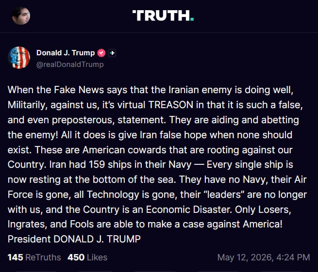

پست ترامپ، ترجمه ماشین:
وقتی «رسانه‌های جعلی» می‌گویند دشمن ایرانی از نظر نظامی در برابر ما عملکرد خوبی دارد، این عملاً خیانت است؛ چون چنین ادعایی کاملاً دروغ و حتی مضحک است. آن‌ها به دشمن کمک و از او حمایت می‌کنند! تنها نتیجه‌اش این است که به ایران امیدی واهی می‌دهد؛ در حالی که اصلاً نباید چنین امیدی وجود داشته باشد. این‌ها بزدل‌های آمریکایی هستند که علیه کشور خودمان طرف می‌گیرند.

ایران ۱۵۹ کشتی در نیروی دریایی خود داشت؛ تک‌تک آن کشتی‌ها اکنون در کف دریا آرمیده‌اند. آن‌ها دیگر نیروی دریایی ندارند، نیروی هوایی‌شان از بین رفته، تمام فناوری‌شان نابود شده، «رهبران»شان دیگر در میان ما نیستند، و کشورشان یک فاجعه اقتصادی است.

فقط بازنده‌ها، ناسپاس‌ها و احمق‌ها می‌توانند علیه آمریکا استدلالی مطرح کنند!

رئیس‌جمهور دونالد جی. ترامپ
realDonaldTrump

📡 @VahidOnline

## VahidOnline — post 75435

"وحید تهران لرزید"

+ ده‌ها پیام دریافتی مشابه درباره احساس لرزش زمین در مناطق مختلف تهران

به نظر می‌رسه بیشتر پیام‌ها از سمت شرق و شمال شرق تهران هستند گرچه در غرب شهر هم کاملا حس شده.
حدود سه ساعت پیش هم در شرق استان تهران حوالی پردیس و بومهن و دماوند زمین‌‌لرزه خفیف‌تری حس شده بود و غیر از اون مناطق فقط یک پیام از لواسان داشتم و پیامی از خود تهران نداشتم.

🔄 رسانه‌های داخلی:
زمین‌لرزه‌ای به بزرگی ۴.۶ ساعت ۲۳:۴۶ امشب مرز استان‌های تهران و مازندران را لرزاند.
این زلزله در حوالی شهر پردیس و در عمق ۱۰ کیلومتری زمین به وقوع پیوسته و در بخش‌هایی از پایتخت نیز احساس شده است.
بزرگی: 4.6
محل وقوع: مرز استانهای تهران و مازندران - حوالی پرديس
تاریخ و زمان وقوع به وقت محلی: 1405/02/22 23:46:07
طول جغرافیایی: 51.83
عرض جغرافیایی: 35.82
عمق زمین‌لرزه: 10 کیلومتر

نزدیک‌ترین شهرها:
8 کیلومتری پرديس (تهران)
10 کیلومتری بومهن (تهران)
11 کیلومتری رودهن (تهران)

نزدیکترین مراکز استان:
41 کیلومتری تهران
77 کیلومتری كرج
#زلزله
📡 @VahidOnline

## VahidOnline — post 75433

  <a href="telegram/content/VahidOnline_75433_1778626021.mp4" target="_blank">🎬 Download video</a>

ترامپ: خواهیم دید چه خواهد شد

دونالد ترامپ، رئیس‌جمهور آمریکا، پیش از سفر به پکن گفت که رئیس‌جمهور چین درباره جنگ ایران «نسبتاً خوب» عمل کرده است، اما واشینگتن به کمک او نیازی ندارد.

او روز سه شنبه در جمع خبرنگاران افزود که قرار است با شی جین‌پینگ «گفت‌وگویی طولانی» درباره ایران داشته باشد.
ترامپ تصریح کرد: «فکر نمی‌کنم ما به هیچ کمکی درباره ایران نیاز داشته باشیم. ما به هر شکلی که باشد پیروز خواهیم شد. یا به‌صورت مسالمت‌آمیز پیروز می‌شویم یا به شکل دیگری.»

رئیس‌جمهور آمریکا با اشاره به این که توان نظامی ایران در جنگ اخیر از بین رفته است، هشدار داد: ««ایران یا کار درست را انجام خواهد داد یا ما کار را تمام خواهیم کرد.»

او به جزئیات بیشتری درباره این هشدار اشاره نکرد، اما این اظهارات در حالی است که ترامپ پیشنهاد آخر ایران برای توافق پایان جنگ را در روزهای اخیر رد کرده و آن را «کاملا غیر قابل قبول» و «فوق‌العاده ضعیف» خوانده است.
رئیس‌جمهور آمریکا قرار است چهارشنبه برای دیداری رسمی وارد پایتخت چین شود. این سفر که قرار بود در ماه مارس انجام شود، به دلیل درگیری نظامی آمریکا و اسرائیل با ایران چند هفته به تأخیر افتاد.
@VahidHeadline

📡 @VahidOnline

## kianmeli1 — post 87374

  <a href="telegram/content/kianmeli1_87374_1778626022.mp4" target="_blank">🎬 Download video</a>

🔴وضعیت خیابان‌ها و پارک‌های پردیس پس از زلزله امشب
https://t.me/kianmeli1

## kianmeli1 — post 87373

  <a href="telegram/content/kianmeli1_87373_1778626025.mp4" target="_blank">🎬 Download video</a>

🔴حضور مردم در حاشیه شهر بومهن پس از وقوع زلزله امشب

برخی مردم در خیابان خوابیده اند
https://t.me/kianmeli1

## kianmeli1 — post 87372

  

🔴رؤیافروشی تلویزیون ها پایانی ندارد

قبل از علی خامنه ای میگفتند با کشته شدن خامنه ای کار تمام است
امروز میگویند با پایان لایه بعدی کار تمام است

هموطن٫ کار تمام است اما وقتی که «سازماندهی هوشمندانه و شبکه سازی شهری» دیده شود

از ۱۸ دی تا امروز کدام شبکه سازی در کشور توانسته یک قاضی قاتل را از بین ببرد که احساس کنیم نیروهای سازماندهی در حال تلاش است!

با رویافروشی شبکه ها که مدام تحلیل غلط به خوردتان میدهند ٫ براندازی محقق نمی شود

«براندازی بدون سازماندهی ٫ شکست سنگین ادامه دارد»

این صحبت تلخ است اما حقیقت است
https://t.me/kianmeli1

## kianmeli1 — post 87371

🔴طبق گزارش NBCNews : ارتش ایالات متحده در نظر دارد در صورت فروپاشی آتش‌بس و تصمیم ترامپ برای از سرگیری عملیات‌های عمده رزمی، نام درگیری خود با ایران را به عملیات چکش سنگین تغییر دهد و این جایگزین نام قبلی عملیات خشم حماسی خواهد شد.
https://t.me/kianmeli1

## IranIntlTV — post 336895

  <a href="https://t.me/IranintlTV/336895" target="_blank">📎 Download file</a>

🎧نسخه صوتی سیاست با مراد ویسی: چرا به خواندن اسامی جاویدنام‌ها ادامه خواهم داد؟
@iranintlTV

## IranIntlTV — post 336894

  <a href="telegram/content/IranIntlTV_336894_1778626028.mp4" target="_blank">🎬 Download video</a>

ویدیوهای منتشرشده در رسانه‌های ایران، وضعیت شهروندان را پس از زلزله شامگاه سه‌شنبه ۲۲ اردیبهشت‌ماه در بومهن و پردیس استان تهران نشان می‌دهد؛ شهروندانی که پس از زلزله به خیابان آمده‌اند و شب را کنار خیابان یا در خودروهای خود، در فضای باز پارک‌ها، سپری می‌کنند.
بر اساس گزارش‌های منتشرشده، زمین‌لرزه‌ای به بزرگی ۴.۶ مرز استان‌های تهران و مازندران را لرزاند که تاکنون با چندین پس‌لرزه همراه بوده است.
به گزارش سازمان مدیریت بحران، این زلزله خسارتی نداشته است.

## IranIntlTV — post 336893

  <a href="https://t.me/IranintlTV/336893" target="_blank">📎 Download file</a>

🎧نسخه صوتی برنامه با کامبیز حسینی؛ خشم انباشتهٔ مردم کی فوران خواهد کرد؟

## IranIntlTV — post 336892

  <a href="telegram/content/IranIntlTV_336892_1778626031.mp4" target="_blank">🎬 Download video</a>

چرا به خواندن اسامی جاویدنام‌ها ادامه خواهم داد؟ چرا تکرار نام جاویدنام‌ها اهمیت ملی دارد؟ و چرا جمهوری اسلامی از تکرار نام جاویدنام خشمگین و عصبانی است؟

@iranintltv

## IranIntlTV — post 336891

  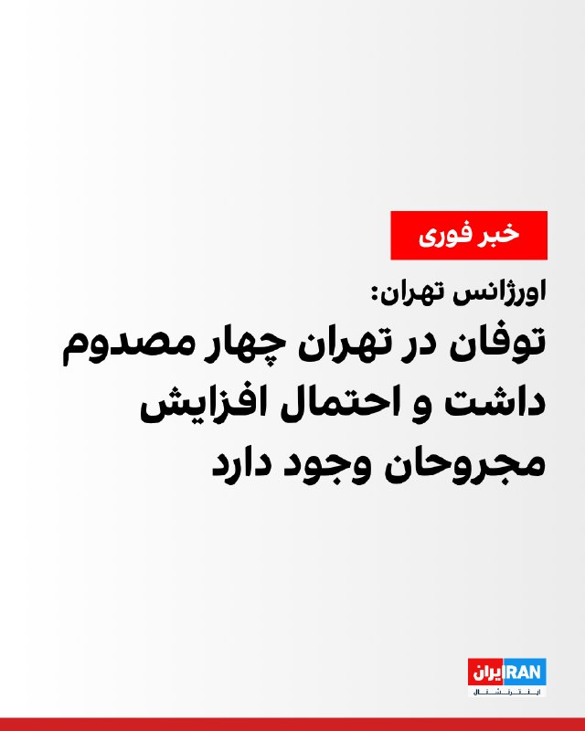

شروین تبریزی، سخنگوی اورژانس تهران اعلام کرد طوفان در تهران تاکنون چهار مصدوم داشته است که البته همه این مصدومان در محل درمان شدند.
او خاطرنشان کرد با توجه به اینکه وزش باد دقایقی پیش متوقف شد، احتمال افزایش مصدومان وجود دارد.

https://iranintl.com/202605126188

## IranIntlTV — post 336890

  <a href="telegram/content/IranIntlTV_336890_1778626034.mp4" target="_blank">🎬 Download video</a>

مراد ویسی، تحلیل‌گر ارشد ایران‌اینترنشنال، در واکنش به صحبت‌های محسنی اژه‌ای، رییس قوه قضاییه که گفت مردم نباید بدبین شوند، گفت:‌ «حکومتی که با کشتار، سرکوب، قطع اینترنت، نابودی کسب‌وکارها و تحمیل بحران‌های اقتصادی و امنیتی زندگی مردم را مختل کرده، خود عامل این بی‌اعتمادی و بدبینی است. جامعه ایران فراتر از بدبینی، خواهان پایان این وضعیت و سرنگونی جمهوری اسلامی است.»

@iranintltv

## IranIntlTV — post 336889

  <a href="telegram/content/IranIntlTV_336889_1778626036.mp4" target="_blank">🎬 Download video</a>

مراد ویسی، تحلیل‌گر ارشد ایران‌اینترنشنال، گفت:‌ «ترامپ زمان زیادی ندارد؛ چون با نزدیک شدن به انتخابات کنگره، اگر نتواند جمهوری اسلامی را به‌روشنی شکست دهد یا به اهدافش برسد، ممکن است اکثریت کنگره را به دموکرات‌ها واگذار کند.»

@iranintltv

## IranIntlTV — post 336888

  

سازمان مدیریت بحران اعلام کرد باتوجه به بررسی‌های اولیه و ارزیابی تیم‌های کارشناسی، زمین‌لرزه‌ها در مرز استان‌های تهران و مازندران خساراتی درپی نداشته است.
مرکز لرزه‌نگاری در اطلاعیه‌ای اعلام کرد ساعت ۲۳:۴۶ سه‌شنبه شب زمین‌لرزه‌ای به بزرگی ۴.۶ مرز تهران و مازندران را لرزاند. زمین‌لرزه در تهران حدود ۱۰ ثانیه طول کشید.
این لرزش در شرق تهران، ورامین، پاکدشت، پردیس و بخش‌هایی از شمیرانات بیشتر احساس شد.
همچنین چهار پس‌لرزه‌ در استان تهران رخ داد که آخرین پس‌لرزه‌ها به بزرگی ۴ و ۳.۴ بودند.

https://iranintl.com/202605124199

## IranIntlTV — post 336887

  <a href="telegram/content/IranIntlTV_336887_1778626038.mp4" target="_blank">🎬 Download video</a>

🔻علیرضا دبیر، رییس فدراسیون کشتی در گفتگویی با خبرنگاران مدعی شد فدراسیون و خانه کشتی در غرب تهران در تمام روزهای جنگ ۴۰ روزه، مورد هدف قرار گرفته است.

🔹او گفت بیش از ۱۵۰تا ۱۶۰ موشک به این محل اصابت کرده است.

🔹در هفته اول جنگ، ایران‌اینترنشنال گزارش داد که پس از آغاز حملات اسرائیل و آمریکا در نهم اسفندماه، به کارکنان و پرسنل فدراسیون‌ها و مراکز مستقر در مجموعه ورزشی آزادی در تهران دستور داده شد ساختمان‌ها و سالن‌های ورزشی این مجموعه را تخلیه کنند.

🔹طبق این اطلاعات، پس از تخلیه کارکنان، نیروهای حکومتی از جمله یگان ویژه و بسیج در بخش‌های مختلف این مجموعه مستقر شدند.

🔹پس از این ماموران در سالن‌های مختلف از جمله ورزشگاه ۱۲ هزار نفری آزادی و همچنین سالن‌ها و ساختمان‌های متعلق به فدراسیون‌های ورزشی از جمله کشتی، والیبال، بسکتبال و وزنه‌برداری مستقر شدند.

🔹در پی این اقدامات، سالن ۱۲ هزار نفری ورزشگاه آزادی در حملات هوایی روز پنجشنبه ۱۴ اسفند ۱۴۰۴، تخریب شد.

🔹به گفته علیرضا دبیر، برای بازسازی خانه کشتی، تاکنون بیش از ۴۰۰ میلیارد تومان هزینه شده است.

@iranintltvsport

## IranIntlTV — post 336885

  

دونالد ترامپ در شبکه تروث سوشال نوشت وقتی رسانه‌های «جعلی» می‌گویند دشمن ایرانی از نظر نظامی در برابر آمریکا عملکرد خوبی دارد، این نوعی خیانت است، زیرا چنین ادعایی کاملا نادرست و حتی مضحک است.
او افزود: آن‌ها در حال کمک به دشمن هستند و به جمهوری اسلامی امید می‌دهند در حالی که نباید هیچ امیدی برای او وجود داشته باشد.
https://iranintl.com/202605125060

## IranIntlTV — post 336884

  

علی احتشام، امام جمعه کاشان گفت: «جمهوری اسلامی نه یکی از چهار قدرت، بلکه تنها ابرقدرت جهان است و ملت ایران هشت کشور منطقه و آمریکا را از کمال ارتفاع ساقط کرد و امروز با حضور در خیابان‌ها اجازه نداد جام زهر دیگری نوشیده شود.»

او افزود: «اگر مردم کف خیابان نبودند، چه بسا جام زهر دیگری نوشیده می‌شد.»
https://iranintl.com/202605128116

## IranIntlTV — post 336883

  

رسانه‌های ایران از وقوع زمین‌لرزه به بزرگی ۴.۶ در مرز استان‌های تهران و مازندران خبر دادند.

خبرگزاری فارس همچنین از زمین‌لرزه در کرج خبر داد.

همزمان خبرگزاری دولتی ایرنا گزارش داد زمین‌لرزه در تهران حدود ۱۰ ثانیه طول کشیده است.
https://iranintl.com/202605123583

## IranIntlTV — post 336882

  

سعید سیاه‌سرانی، دبیر ستاد راهیان نور دریایی، گفت: «بدون اراده جمهوری اسلامی اجازه عبور حتی یک لیتر نفت از تنگه هرمز داده نمی‌شود.»

او افزود: «تنگه هرمز جزو خاک ما است، شناورهایی که رد می‌شوند باید اجازه بگیرند و به زبان فارسی صحبت کنند و از نقاطی که ما تعیین می‌کنیم عبور کنند.»
https://iranintl.com/202605123958

## IranIntlTV — post 336881

  <a href="telegram/content/IranIntlTV_336881_1778626044.mp4" target="_blank">🎬 Download video</a>

خبرگزاری رویترز به نقل از دو مقام غربی گزارش داد که عربستان سعودی در جریان جنگ اخیر در خاورمیانه، در واکنش به حملاتی که در خاک این کشور انجام شده بود، چند حمله هوایی اعلام‌نشده علیه مواضعی در ایران انجام داده است.

گفت‌وگو با شهرام خلدی، پژوهشگر تاریخ خاورمیانه و روابط بین‌الملل

@iranintltv

## IranIntlTV — post 336880

  <a href="telegram/content/IranIntlTV_336880_1778626047.mp4" target="_blank">🎬 Download video</a>

هم‌زمان با سفر ترامپ به چین، گزارش‌ها حاکی است جمهوری اسلامی از پکن خواسته پیام‌های خود را به واشینگتن منتقل کند و چین را به‌عنوان ضامن احتمالی هر توافق آینده مطرح کرده است. سفیر ایران در چین نیز گفته پکن با ارائه طرح‌های صلح و رایزنی‌های منطقه‌ای تلاش دارد مسیر گفت‌وگوها را باز نگه دارد.

گفت‌وگو با آرام حسامی، استاد علوم سیاسی کالج مونتگومری

@iranintltv

## IranIntlTV — post 336879

  <a href="telegram/content/IranIntlTV_336879_1778626049.mp4" target="_blank">🎬 Download video</a>

انجمن قلم آمریکا در گزارش سالانه خود اعلام کرد؛ شمار نویسندگان زندانی در جهان برای نخستین‌بار از ۴۰۰ نفر عبور کرده است. این نهاد گفت؛ چین با ۱۱۹ مورد در صدر قرار دارد و ایران با زندانی‌کردن ۵۳ نویسنده در رتبه دوم ایستاده است.

در این گزارش آمده است؛ عربستان سعودی با ۲۷ نویسنده زندانی در رتبۀ سوم قرار دارد. پن آمریکا تاکید کرد؛ سرکوب نویسندگان و اهل قلم در ایران، به‌ویژه پس از «جنگ ۱۲روزه»، شدت گرفته است.
گفت‌وگو با اردوان روزبه، خبرنگار ایران‌اینترنشنال
@iranintltv

## IranIntlTV — post 336878

  <a href="https://t.me/IranintlTV/336878" target="_blank">📎 Download file</a>

🎧نسخه صوتی ‌‌‏۲۴ با فرداد فرحزاد: ترامپ: برای توافق با جمهوری اسلامی عجله ندارم
@iranintlTV

## IranIntlTV — post 336877

  

امارات متحده عربی اعلام کرد ۱۶ شهروند لبنانی و پنج نهاد مستقر در لبنان را به دلیل ارتباط با حزب‌الله در فهرست تروریستی این کشور قرار داده است.

در همین چارچوب، «موسسه قرض‌الحسن» و چهار نهاد دیگر نیز به دلیل ارتباط با حزب‌الله در این فهرست قرار گرفته‌اند.

امارات متحده عربی تاکید کرد این اقدامات در راستای مهار آفات تروریسم، محدود کردن گسترش آن و قطع تامین مالی فرامرزی انجام شده است.
https://iranintl.com/202605127283

## IranIntlTV — post 336876

  <a href="https://t.me/IranintlTV/336876" target="_blank">📎 Download file</a>

🎧نسخه صوتی چشم‌انداز: جهنم قطع اینترنت چگونه به پایان می‌رسد؟
@iranintlTV

## IranIntlTV — post 336875

  <a href="telegram/content/IranIntlTV_336875_1778626054.mp4" target="_blank">🎬 Download video</a>

بنا بر گزارش‌ها هم‌زمان با سفر دونالد ترامپ به چین، جمهوری اسلامی تلاش کرده است از پکن برای رساندن پیامش به واشینگتن استفاده کند و گفته است چین می‌تواند نقش ضامن هر توافق احتمالی را داشته باشد.

گفت‌وگو با جمشید برزگر، روزنامه‌نگار و تحلیل‌گر سیاسی
@iranintltv

## Shin_Persian — post 5983

Shin ✓ @hey_itsmyturn
Tue, 12 May 2026 21:17:38 UTC

Someone wrote “Tehran is having a wild orgasm” in Telegram 😭😭😭

فارسی

یک نفر در تلگرام نوشته «تهران دارد به ارگاسم وحشیانه می‌رسد» 😭😭😭

𝕏 · @shin_persian

## Shin_Persian — post 5982

Shin ✓ @hey_itsmyturn
Tue, 12 May 2026 21:16:15 UTC

And another aftershock rn

فارسی

و یک پس‌لرزه دیگر همین الان

𝕏 · @shin_persian

## Shin_Persian — post 5981

Shin ✓ @hey_itsmyturn
Tue, 12 May 2026 21:06:37 UTC

And we are back at “It’s HAARP” dumbfucks.

فارسی

و دوباره برگشتیم سر احمق‌هایی که می‌گویند «کار هارپ (HAARP) است».

𝕏 · @shin_persian

## Shin_Persian — post 5980

Shin ✓ @hey_itsmyturn
Tue, 12 May 2026 21:00:34 UTC

Another earthquake shook Tehran just now

فارسی

همین الان زلزله دیگری تهران را لرزاند

𝕏 · @shin_persian

## Shin_Persian — post 5979

  

Shin ✓ @hey_itsmyturn Tue, 12 May 2026 20:25:23 UTC President Trump @POTUS: "When the Fake News says that the Iranian enemy is doing well, Militarily, against us, it’s virtual TREASON in that it is such a false, and even preposterous, statement. They are…

## Shin_Persian — post 5978

Shin ✓ @hey_itsmyturn
Tue, 12 May 2026 20:25:23 UTC

President Trump @POTUS:
"When the Fake News says that the Iranian enemy is doing well, Militarily, against us, it’s virtual TREASON in that it is such a false, and even preposterous, statement. They are aiding and abetting the enemy! All it does is give Iran false hope when none should exist. These are American cowards that are rooting against our Country. Iran had 159 ships in their Navy — Every single ship is now resting at the bottom of the sea. They have no Navy, their Air Force is gone, all Technology is gone, their “leaders” are no longer with us, and the Country is an Economic Disaster. Only Losers, Ingrates, and Fools are able to make a case against America! President DONALD J. TRUMP"

فارسی

رئیس‌جمهور ترامپ @POTUS:
«وقتی اخبار جعلی می‌گویند که دشمن ایرانی از نظر نظامی در برابر ما خوب عمل می‌کند، این در واقع خیانتی مجازی است، چرا که چنین ادعایی کذب و حتی مضحک است. آن‌ها در حال کمک و یاری رساندن به دشمن هستند! تمام کاری که این حرف‌ها انجام می‌دهد، دادن امید واهی به ایران است، در حالی که هیچ امیدی نباید وجود داشته باشد. این‌ها بزدلانی آمریکایی هستند که علیه کشورمان ریشه دوانده‌اند. ایران ۱۵۹ کشتی در نیروی دریایی خود داشت — اکنون تک‌تک آن کشتی‌ها در کف دریا آرام گرفته‌اند. آن‌ها دیگر نیروی دریایی ندارند، نیروی هوایی‌شان از بین رفته، تمام تکنولوژی‌شان نابود شده، "رهبرانشان" دیگر در میان ما نیستند و آن کشور یک فاجعه اقتصادی است. فقط بازنده‌ها، ناسپاس‌ها و احمق‌ها می‌توانند علیه آمریکا استدلال کنند! رئیس‌جمهور دونالد جی. ترامپ»

𝕏 · @shin_persian

## Shin_Persian — post 5977

Shin ✓ @hey_itsmyturn
Tue, 12 May 2026 20:17:27 UTC

Quake in Tehran right now.

فارسی

هم‌اکنون زلزله در تهران.

𝕏 · @shin_persian

## Shin_Persian — post 5976

  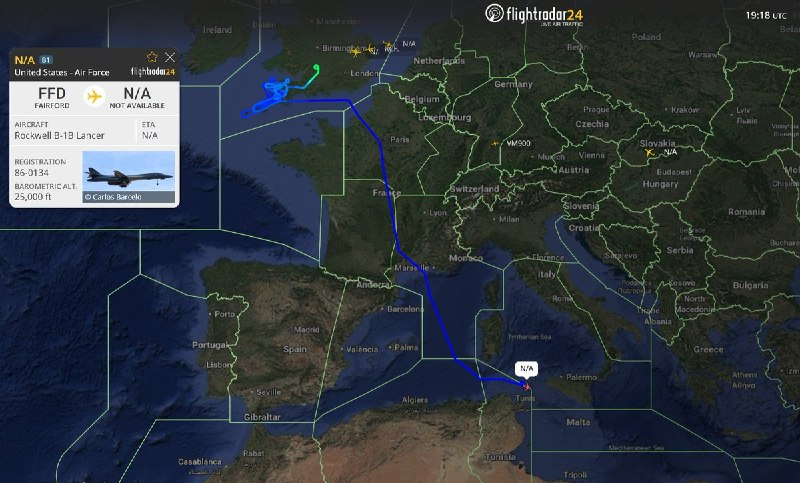

DefenceGeek 🇬🇧 ✓ @DefenceGeek Tue, 12 May 2026 19:21:43 UTC 40th Bomber Training Flight from Fairford #FreeIran‌ --- Operation EPIC FURY / Project FREEDOM --- Rather helpfully, the solo B-1B "Lancer" bomber from RAF Fairford (EGVA) (which is flying the…

## Shin_Persian — post 5975

DefenceGeek 🇬🇧 ✓ @DefenceGeek
Tue, 12 May 2026 19:21:43 UTC

40th Bomber Training Flight from Fairford #FreeIran‌
--- Operation EPIC FURY / Project FREEDOM ---

Rather helpfully, the solo B-1B "Lancer" bomber from RAF Fairford (EGVA) (which is flying the 40th training mission from the base since the ceasefire began), has been broadcasting it's location for all to see!

This route has been a fairly routine pattern for the training flights, and for many of the 62 bomber missions flown by B-1B and B-52H types during the war in Iran.

B-1B "ZENER01" 86-0134 #AE6C05 "Thunderbird"

@MATA_osint @ArmchairAdml @Andyyyyrrrr @jamjake01 @LHA2709 @vcdgf555

فارسی

چهلمین پرواز آموزشی بمب‌افکن از فیرفورد #FreeIran
--- عملیات خشم حماسی (EPIC FURY) / پروژه آزادی ---

بمب‌افکن تک‌فروندی B-1B "لنسر" از پایگاه نیروی هوایی سلطنتی فیرفورد (EGVA) (که در حال انجام چهلمین ماموریت آموزشی از این پایگاه پس از آغاز آتش‌بس است)، به شکلی کاملاً مفید در حال مخابره موقعیت مکانی خود برای مشاهده همگان بوده است!

این مسیر یک الگوی نسبتاً معمول برای پروازهای آموزشی و همچنین برای بسیاری از ۶۲ ماموریت بمب‌افکنی انجام شده توسط انواع B-1B و B-52H در طول جنگ در ایران بوده است.

B-1B "ZENER01" 86-0134 #AE6C05 "Thunderbird"

@MATA_osint @ArmchairAdml @Andyyyyrrrr @jamjake01 @LHA2709 @vcdgf555

𝕏 · @shin_persian

## Shin_Persian — post 5974

  <a href="telegram/content/Shin_Persian_5974_1778626059.mp4" target="_blank">🎬 Download video</a>

Rapid Response 47 ✓ @RapidResponse47
Tue, 12 May 2026 18:01:20 UTC

.@POTUS: "It's very simple: Iran cannot have a nuclear weapon... We don't play games. They're not going to have a nuclear weapon."

فارسی

.@POTUS: "بسیار ساده است: ایران نمی‌تواند سلاح هسته‌ای داشته باشد... ما بازی نمی‌کنیم. آن‌ها قرار نیست سلاح هسته‌ای داشته باشند."

𝕏 · @shin_persian

## ManotoTV — post 105382

  <a href="telegram/content/ManotoTV_105382_1778626062.mp4" target="_blank">🎬 Download video</a>

‌
الجزیره به نقل از منابع دیپلماتیک گزارش داد ۱۱۲ کشور به پیش‌نویس قطعنامه‌ای در شورای امنیت سازمان ملل پیوسته‌اند که از سوی آمریکا و کشورهای خلیج فارس درباره آزادی کشتیرانی در تنگه هرمز ارائه شده است.

به گفته این منابع، هند، ژاپن و بیشتر کشورهای اروپایی در میان حامیان این پیش‌نویس قرار دارند.

منابع الجزیره همچنین گفتند حمایت ۱۱۲ کشور از این قطعنامه، نشان‌دهنده پشتیبانی گسترده بین‌المللی از ابتکار آمریکا و کشورهای خلیج فارس درباره تنگه هرمز است.

## ManotoTV — post 105380

  <a href="telegram/content/ManotoTV_105380_1778626063.mp4" target="_blank">🎬 Download video</a>

تماسی از تهران:
«می‌گفت جنگ شد و بعد رها شد… همه‌چیز روی هوا موند و شرایط افتضاح‌تر شد.
می‌گفت قبلش حداقل یه جور داشتیم زندگی می‌کردیم

## ManotoTV — post 105379

  <a href="telegram/content/ManotoTV_105379_1778626065.mp4" target="_blank">🎬 Download video</a>

رئیس سازمان هلال احمر اعلام کرد زلزله در تهران و کرج «هیچ» خسارت مالی و جانی در پی نداشته است.
پیش‌تر زلزله‌ای به بزرگی ۴.۶ در مقیاس ریشتر، مرز استان‌های تهران و مازندران را لرزاند.

## ManotoTV — post 105378

  <a href="telegram/content/ManotoTV_105378_1778626066.mp4" target="_blank">🎬 Download video</a>

شاهزاده رضا پهلوی در نشست امنیتی سالانه پولیتیکو گفت مردم ایران، نه نیروهای خارجی، باید نقش اصلی را در تغییر حکومت جمهوری اسلامی ایفا کنند؛ اما برای این کار به «حمایت و پوشش» نیاز دارند.

او گفت: «نیروهای روی زمین در ایران، خود مردم ایران هستند. ما نیازی نداریم نیروهای خارجی این کار را برای ما انجام دهند.»

شاهزاده رضا پهلوی با اشاره به سرکوب اعتراضات دی‌ماه گفت در کمتر از ۴۸ ساعت بیش از ۴۰ هزار نفر کشته شدند و افزود بدون حمایت، نمی‌توان از مردم انتظار داشت دوباره به خیابان‌ها بیایند.

او گفت: «به همین دلیل بود که به کارزار هوایی و پوشش هوایی نیاز داشتیم.»

شاهزاده رضا پهلوی همچنین تأکید کرد باید یک استراتژی روشن برای پایان دادن به جمهوری اسلامی وجود داشته باشد؛ استراتژی‌ای که هم مردم را برای قیام تشویق کند و هم زمینه پیوستن نیروهایی از ارتش و دستگاه امنیتی به مردم را فراهم سازد.

او افزود: «نمی‌شود از یک طرف گفت مردم قیام کنند و همزمان گفت در حال مذاکره هستیم؛ این همه را گیج می‌کند.»

شاهزاده رضا پهلوی همچنین گفت حملات انجام‌شده علیه جمهوری اسلامی، ملت ایران را هدف نگرفته بود، بلکه زیرساخت‌های سرکوب حکومت، از جمله دستگاه اطلاعاتی و سپاه پاسداران، را هدف قرار داده بود.

او افزود: «مردم آن‌قدر باهوش هستند که تفاوت میان حمله به ملت ایران و حمله به حکومت را تشخیص دهند.»

## ManotoTV — post 105377

  <a href="telegram/content/ManotoTV_105377_1778626070.mp4" target="_blank">🎬 Download video</a>

‌
خبرگزاری‌های داخل ایران گزارش دادند دقایقی پیش زلزله تهران و کرج را لرزاند. به گزارش این خبرگزاری‌ها سمت شرق تهران زمین‌لرزه بسیار شدیدتر بوده است.

## ManotoTV — post 105376

  <a href="telegram/content/ManotoTV_105376_1778626070.mp4" target="_blank">🎬 Download video</a>

تماسی از ایران؛
«می‌گفت تغییر از بیرون نیست…
کار خود مردمه، حتی با این وضعیت سخت.»

## ManotoTV — post 105375

  <a href="telegram/content/ManotoTV_105375_1778626073.mp4" target="_blank">🎬 Download video</a>

رویترز به نقل از دو مقام غربی و دو مقام ایرانی گزارش داد عربستان سعودی در واکنش به حملات انجام‌شده علیه این کشور، چند حمله نظامی اعلام‌نشده علیه جمهوری اسلامی انجام داده است.

بر اساس این گزارش، حملات هوایی عربستان در اواخر ماه مارس توسط نیروی هوایی این کشور انجام شده و نخستین مورد شناخته‌شده از حمله مستقیم نظامی عربستان به خاک ایران به شمار می‌رود.

رویترز نوشت این حملات پس از آن انجام شد که جمهوری اسلامی در جریان جنگ اخیر، همه کشورهای عضو شورای همکاری خلیج فارس را با موشک و پهپاد هدف قرار داد و به زیرساخت‌های نفتی، فرودگاه‌ها و مراکز غیرنظامی حمله کرد.

به گفته منابع رویترز، پس از حملات عربستان، تهران و ریاض وارد تماس‌های فشرده دیپلماتیک شدند و عربستان نیز هشدار داده بود در صورت ادامه حملات، پاسخ‌های بیشتری خواهد داد.

یک مقام ایرانی به رویترز گفت تهران و ریاض در نهایت برای کاهش تنش به تفاهم رسیدند؛ تفاهمی که هدف آن «توقف درگیری‌ها، حفظ منافع متقابل و جلوگیری از تشدید تنش» بوده است.

رویترز همچنین گزارش داد شمار حملات موشکی و پهپادی علیه عربستان پس از این تفاهم به‌طور قابل توجهی کاهش یافت.

## ManotoTV — post 105374

  <a href="telegram/content/ManotoTV_105374_1778626074.mp4" target="_blank">🎬 Download video</a>

‌
شاهزاده رضا پهلوی، در نشست امنیتی سالانه پولیتیکو، در واکنش به تهدید دونالد ترامپ درباره نابودی زیرساخت‌های غیرنظامی ایران، گفت چنین اظهاراتی «پیام اشتباه» به مردم ایران می‌فرستد.

او گفت: «سؤال این است که آیا شما اینجا هستید که ما را آزاد کنید یا بیشتر به ما آسیب بزنید؟»

شاهزاده رضا پهلوی افزود آنچه به مردم ایران آسیب می‌زند «زیرساخت‌های غیرنظامی» است و تأکید کرد باید میان مردم ایران و حکومت جمهوری اسلامی تفاوت قائل شد.

او گفت: «چیزی که به ما کمک می‌کند، هدف قرار دادن حکومت و زیرساخت‌های آن است.»

شاهزاده رضا پهلوی همچنین گفت جمهوری اسلامی مانند حماس در غزه، از مردم به‌عنوان «سپر انسانی» استفاده می‌کند و نیروهای امنیتی خود را در مدارس و بیمارستان‌ها مستقر می‌کند.

او افزود: «هرچه زودتر به این حکومت پایان دهیم، زودتر می‌توانیم جان انسان‌های بی‌گناه بیشتری را در کشورم حفظ کنیم.»

## ManotoTV — post 105373

  <a href="telegram/content/ManotoTV_105373_1778626076.mp4" target="_blank">🎬 Download video</a>

دونالد ترامپ در واکنش به افزایش تورم ناشی از جنگ با ایران، گفت پایان جنگ «خیلی دور نیست» و با پایان درگیری‌ها، قیمت نفت و تورم به‌سرعت کاهش خواهد یافت.
رئیس‌جمهور آمریکا به خبرنگاران گفت: «به‌محض پایان جنگ، شاهد سقوط قیمت نفت و جهش بازار سهام خواهید بود.»
او افزود صدها کشتی حامل نفت آماده خروج هستند و با باز شدن مسیرها، حجم زیادی نفت وارد بازار خواهد شد که به کاهش شدید تورم کمک می‌کند.

## ManotoTV — post 105372

  <a href="telegram/content/ManotoTV_105372_1778626077.mp4" target="_blank">🎬 Download video</a>

دونالد ترامپ پیش از سفر رسمی خود به چین اعلام کرد در دیدار با شی جین‌پینگ گفت‌وگویی طولانی خواهد داشت، اما نیازی به صحبت درباره جمهوری‌اسلامی نمی‌بیند؛ چون به گفته او، «ایران کاملاً تحت کنترل است».
رئیس‌جمهور آمریکا بار دیگر تأکید کرد جمهوری‌اسلامی «به سلاح هسته‌ای دست نخواهد یافت» و گفت اقدامات آمریکا علیه تهران «کاملا مؤثر» بوده است.

## ManotoTV — post 105371

  <a href="telegram/content/ManotoTV_105371_1778626078.mp4" target="_blank">🎬 Download video</a>

تماسی از مشهد:
«می‌گفت بلاتکلیفی کنکور، گرونی منابع و قطعی اینترنت، دانش‌آموزها رو زیر فشار شدید گذاشته.»

## FarsiVOA — post 217580

🔺انجمن قلم آمریکا: جمهوری اسلامی بزرگترین دشمن زنان اهل قلم و ایران دومین زندان نویسندگان جهان است

▪️انجمن قلم آمریکا، روز سه‌شنبه ۲۲ اردیبهشت در تازه‌ترین گزارش خود از «شاخص آزادی نوشتن» اعلام کرد جمهوری اسلامی ایران پس از چین، دومین زندان نویسندگان در جهان است و دو برابر میانگین جهانی، زنان اهل قلم را زندانی کرده است.

⬇️ بیشتر بخوانید:
https://ir.voanews.com/a/iran-pen-american-center-writers-prison/8149274.html
@FarsiVOA

## FarsiVOA — post 217579

🔺جروزالم پست: عربستان سعودی در جریان عملیات «خشم حماسی» به مواضع رژیم ایران حمله‌ کرد

▪️روزنامه اسرائیلی جروزالم پست به نقل از مقام‌های غربی و ایرانی گزارش داده است که عربستان سعودی در جریان عملیات «خشم حماسی» حملات هوایی مخفیانه‌ای را علیه برخی مواضع رژیم جمهوری اسلامی در ایران انجام داده است. اقدامی که در صورت تأیید، نخستین عملیات مستقیم نظامی شناخته‌شده عربستان سعودی در خاک ایران محسوب می‌شود.

⬇️ بیشتر بخوانید:
https://ir.voanews.com/a/jpost-saudi-arabia-attacked-iran-epic-fury/8149291.html
@FarsiVOA

## FarsiVOA — post 217578

🔺پرزیدنت ترامپ: بیان ادعاهای دروغین درباره مناسب بودن شرایط نظامی رژیم ایران «خیانت» است

▪️رئیس جمهوری ایالات متحده با انتقاد شدید از انتشار اخبار دروغین در برخی از رسانه‌ها و مطرح کردن ادعاهای «وضعیت خوب» رژیم ایران از لحاظ نظامی در مقابل ارتش آمریکا، آن‌ را «عملا خیانت» به کشور دانست.

⬇️ بیشتر بخوانید:
https://ir.voanews.com/a/trump-iran-nuclear-inflation-travel-china/8149296.html
@FarsiVOA

## FarsiVOA — post 217577

⚡️توافق امنیتی یا نقض حاکمیت؟ پشت‌ پرده فشار جمهوری اسلامی برای پاکسازی کامل مرزی با عراق
@FarsiVOA

## FarsiVOA — post 217576

  

⚡️رسانه‌های داخلی و منابع مردمی شامگاه سه‌شنبه ۲۲ اردیبهشت از وقوع زمین‌لرزه در تهران و کرج خبر دادند.

رسانه‌های داخلی دقایقی پیش از نیمه‌شب سه‌شنبه از وقوع یک زمین‌لرزه نسبتا شدید در شهر تهران و بخش‌هایی از استان البرز خبر دادند.

وحیدآنلاین براساس گزارش‌های مردمی اعلام کرد این زلزله در شرق و شمال شرق تهران بیشتر حس شده است اما اهالی غرب پایتخت نیز وقوع آنرا گزارش کرده‌اند.

مرکز لرزه‌نگاری دانشگاه تهران بزرگای این زلزله را ۴.۶ ریشتر و محل وقوع آن را در عمق ۱۰ کیلومتری زمین در حوالی پردیس، در مرز استان‌های تهران و مازندارن، اعلام کرده است.

شامگاه سه‌شنبه نیز لرزه خفیفی حدودا ۳.۵ ریشتری حوالی پردیس و بومهن در شرق استان تهران گزارش شده بود.
@FarsiVOA

## FarsiVOA — post 217575

⚡️دونالد ترامپ، رئیس جمهوری آمریکا، روز سه‌شنبه ۲۲ اردیبهشت پیش از ترک آمریکا به مقصد چین، به پرسش‌های خبرنگاران پاسخ داد.
@FarsiVOA

## FarsiVOA — post 217574

🔺بیش از ۱۱۰ برنده جایزه نوبل خواستار آزادی فوری نرگس محمدی شدند

▪️بیش از ۱۱۰ برنده جایزه نوبل در بیانیه‌ای مشترک خواستار آزادی فوری و بدون قید و شرط نرگس محمدی، فعال حقوق بشر و برنده ایرانی جایزه صلح نوبل، شدند، و نسبت به وضعیت جسمانی او در زندان ابراز نگرانی شدید کردند.

⬇️ بیشتر بخوانید:
https://ir.voanews.com/a/nobel-laureates-narges-mohammadi-release/8149256.html
@FarsiVOA

## FarsiVOA — post 217573

⚡️دونالد ترامپ، رئیس جمهوری آمریکا، روز سه‌شنبه ۲۲ اردیبهشت پیش از ترک آمریکا به مقصد چین، به پرسش‌های خبرنگاران پاسخ داد. بخش‌هایی از این پرسش و پاسخ با ترجمه همزمان پژواک کیومرثی از صدای آمریکا پخش شد.
@FarsiVOA

## FarsiVOA — post 217572

⚡️دونالد ترامپ، رئیس جمهوری آمریکا، روز سه‌شنبه ۲۲ اردیبهشت پیش از ترک آمریکا به مقصد چین، به پرسش‌های خبرنگاران پاسخ داد.
@FarsiVOA

## FarsiVOA — post 217571

  <a href="telegram/content/FarsiVOA_217571_1778626081.mp4" target="_blank">🎬 Download video</a>

⚡️کامبیز غفوری در برنامه تفسیر خبر: بزرگترین امتیاز جمهوری اسلامی در توافق ادامه حیات است
@FarsiVOA

## FarsiVOA — post 217570

🔺بازداشت «ژنرال بمب‌های بشکه‌ای»؛ فرمانده نیروی هوایی رژیم اسد محاکمه می‌شود

▪️وزارت کشور سوریه روز سه‌شنبه ۲۲ اردبیهشت اعلام کرد، جایز حمود موسی، فرمانده سابق نیروی هوایی سوریه، را بازداشت کرده است. او طراح ریختن بمب‌های بشکه‌ای بر مناطق تحت سلطه مخالفان است؛ اقدامی که به قربانی شدن هزاران تن از مردم سوریه، از جمله تعداد زیادی از زنان و کودکان، منجر شد.

⬇️ بیشتر بخوانید:
https://ir.voanews.com/a/syria-bashar-alassad-crime-revolution-irgc/8149228.html
@FarsiVOA

## FarsiVOA — post 217569

⚡️برگزاری دو نشست دفاعی در اروپا؛ حمایت از اوکراین تا امنیت تنگه هرمز و پیامدهای جنگ خاورمیانه
@FarsiVOA

## FarsiVOA — post 217568

  <a href="telegram/content/FarsiVOA_217568_1778626083.mp4" target="_blank">🎬 Download video</a>

⚡️هیمن سیدی در برنامه تفسیر خبر: جمهوری اسلامی استاد محاسبات غلط از سر ناچاری است
@FarsiVOA

## FarsiVOA — post 217567

⚡️ادامه بحران دارو و کمبود موادغذایی زیر سایه خاموشی دیجیتال؛ واکنش کاربران شبکه‌های اجتماعی

@FarsiVOA

## FarsiVOA — post 217566

⚡️در گفت‌وگو با موسی برزین، حقوقدان، از اعدام عبدالجلیل شه‌بخش، شهروند بلوچ، و سرکوب ساختاری اقلیت‌ها گفتیم و پرسیدیم چرا حکومت با استفاده از الگوی تکراری دادرسی ناعادلانه و اخذ اعترافات اجباری در زیرشکنجه، به اجرای احکام اعدام زندانیان سیاسی از جمله اقلیت‌های قومی کرد و بلوچ سرعت داده است.
@FarsiVOA

## FarsiVOA — post 217565

  <a href="telegram/content/FarsiVOA_217565_1778626084.mp4" target="_blank">🎬 Download video</a>

⚡️علی جوانمردی: روابط آمریکا و کردها و سلاح‌هایی کە پرزیدنت ترامپ گفتە بە کردها دادە
@FarsiVOA

## FarsiVOA — post 217564

🔺پرزیدنت ترامپ: یا رژیم ایران توافق می‌کند و یا ما کار را تمام خواهیم کرد

▪️رئیس جمهوری ایالات متحده، در آستانه سفر به چین در پاسخ به پرسشی درباره افزایش تورم کالاها و افزایش قیمت نفت همزمان با آغاز جنگ جمهوری اسلامی با اسرائیل و ایالات متحده گفت: «ما، بین دستیابی جمهوری اسلامی به سلاح هسته‌ای و تورم کوتاه مدت، دومی را انتخاب کردیم.»

⬇️ بیشتر بخوانید:
https://ir.voanews.com/a/trump-iran-nuclear-inflation-travel-china/8149279.html
@FarsiVOA

## FarsiVOA — post 217563

⚡️در برنامه تفسیر خبر امروز، مهدی آقازمانی با کارشناسان مهمان، درباره جلسه رییس جمهور آمریکا با تیم امنیت ملی کاخ سفید درباره حکومت ایران یک روز پیش از سفر به چین، تحریم‌های تازه آمریکا علیه شبکه مالی سپاه و طرح ۱۴ ماده‌ای جمهوری اسلامی برای مذاکرات، گفتگو می‌کند
@FarsiVOA

## FarsiVOA — post 217562

⚡️بعد از حدود دو ماه و نیم که از تعطیلی بازار سرمایه ایران می‌گذرد، حمید یاری، معاون نظارت بر بورس‌ها و ناشران سازمان بورس و اوراق بهادار، از نهایی شدن تحقق الزامات بازگشایی بازار سهام بر خبر داد.
@FarsiVOA

## FarsiVOA — post 217561

  <a href="telegram/content/FarsiVOA_217561_1778626085.mp4" target="_blank">🎬 Download video</a>

ناسا تصاویری تازه از مریخ‌نورد «پشتکار» منتشر کرد.

ناسا اعلام کرد این دورترین نقطه‌ای است که مریخ‌نورد «پشتکار» تاکنون در سیاره سرخ به آن رسیده است.

دانشمندان امیدوارند بررسی این منطقه به شناخت بهتر سیاره مریخ کمک کند.

@FarsiVOA

## DW_Farsi — post 124629

  

🔶 ترامپ: یا ایران کار درست را انجام می‌دهد یا ما کار را تمام می‌کنیم

دونالد ترامپ، رئیس ‌جمهور ایالات متحده آمریکا، روز سه‌شنبه ۱۲ مه (۲۲ اردیبهشت) در آغاز سفر خود به چین برای ملاقات با شی جین‌پینگ، رئیس ‌جمهور چین، اختلافات خود با شی بر سر جنگ آمریکا با ایران را کم‌اهمیت جلوه داد.

ترامپ پیش از این تلاش کرده بود شی را تحت فشار قرار دهد تا از نفوذ قابل‌توجه چین استفاده کرده و ایران را به پذیرش شروط آمریکا برای پایان دادن به جنگ یا باز کردن تنگه هرمز ترغیب کند.

ترامپ درباره برنامه خود برای گفت‌وگو با شی درباره جنگ با ایران گفت: «فکر می‌کنم او نسبتا خوب عمل کرده است.»

ترامپ افزود: «ما موضوعات زیادی برای گفت‌وگو داریم. راستش را بخواهید، نمی‌گویم ایران یکی از آن‌هاست، چون ما ایران را تا حد زیادی تحت کنترل داریم.»

رئیس جمهور آمریکا در عین حال اذعان کرد که دولت شی، ماه گذشته، زمانی که گفت‌وگوها دچار تزلزل شده بود، با ترغیب تهران به بازگشت به مذاکرات آتش‌بس به کاهش تنش‌ها کمک کرد.

@dw_farsi

## DW_Farsi — post 124628

  

🔶 نخستین حمله پهپادی از سمت شرق به جنوب اسرائیل پس از آتش‌بس ایران

ارتش اسرائیل اعلام کرد یک پهپاد را که از سمت شرق پرتاب شده بود، در نزدیکی ایلات، جنوبی‌ترین شهر اسرائیل، رهگیری کرده است.

ارتش اسرائیل گفته این پهپاد احتمالا از یمن پرتاب شده، هرچند همچنان در حال بررسی خاستگاه دقیق آن است.

طبق اعلام ارتش اسرائیل، مطابق دستورالعمل‌ها آژیر هشدار به صدا درنیامد. این نخستین حمله پهپادی به ایلات از زمان اجرایی شدن آتش‌بس‌ها در ایران و لبنان در ماه گذشته محسوب می‌شود.

شبه‌نظامیان حوثی مورد حمایت جمهوری اسلامی، در جریان جنگ اخیر بارها موشک و پهپاد به سمت اسرائیل شلیک کرده بودند.

@dw_farsi

## DW_Farsi — post 124627

  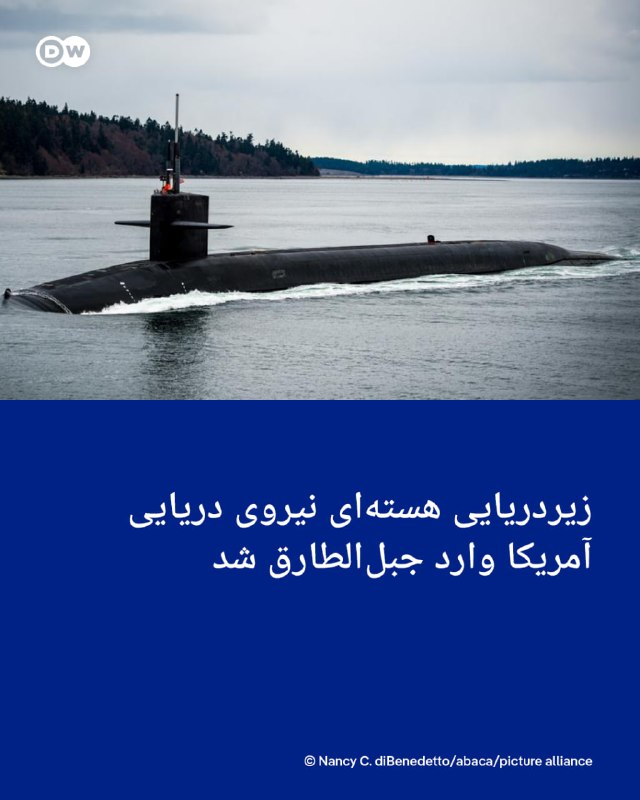

🟠 زیردریایی هسته‌ای نیروی دریایی آمریکا وارد جبل‌الطارق شد

یک زیردریایی هسته‌ای نیروی دریایی آمریکا وارد تنگه جبل‌الطارق شده است. ناوگان ششم نیروی دریایی آمریکا ضمن اعلام این خبر اعلام کرد: «این توقف بندری، توانمندی، انعطاف‌پذیری و تعهد مداوم ایالات متحده آمریکا به متحدان ناتو را نشان می‌دهد.»

اینکه آیا این شناور در ارتباط با جنگایران به جبل‌الطارق اعزام شده یا نه، مشخص نیست. این زیردریایی هسته‌ای از کلاس موسوم به اوهایو، از روز یکشنبه وارد منطقه شده است. زیردریایی‌های کلاس اوهایو به موشک‌های موسوم به Trident 2 D5 مجهز هستند که می‌توانند به چند کلاهک هسته‌ای مجهز شوند.

مشخص نیست زیردریایی‌ای که اکنون در جبل‌الطارق دیده شده، تسلیحات هسته‌ای حمل می‌کند یا نه. نیروی دریایی آمریکا در بیانیه خود تنها به "موشک‌های بالستیک" اشاره کرده است.

@dw_farsi

## DW_Farsi — post 124626

  

🔶 سی‌اِن‌اِن: هزینه جنگ با ایران از ۲۵ میلیارد دلار اعلام شده بیشتر است

خبرگزاری سی‌ان‌ا‌ن به نقل از سه منبع آگاه گزارش داده که برآورد ۲۵ میلیارد دلاری که یک مقام ارشد پنتاگون روز چهارشنبه درباره مجموع هزینه جنگ با ایران تا این لحظه به قانون‌گذاران این کشور ارائه کرد، "رقمی کمتر از واقعیت است و هزینه تعمیر خسارت‌های گسترده واردشده به پایگاه‌های آمریکا در منطقه را شامل نمی‌شود."

یکی از این منابع به سی‌ان‌ا‌ن گفت برآورد واقعی، با در نظر گرفتن هزینه بازسازی تاسیسات نظامی آمریکا و جایگزینی تجهیزات نابودشده، به حدود ۴۰ تا ۵۰ میلیارد دلار نزدیک‌تر است.

سی‌اِن‌اِن همچنین گزارش داده است که حملات جمهوری اسلامی در سراسر خلیج فارس در روزهای ابتدایی جنگ، تنها ظرف ۴۸ ساعت دست‌کم به ۹ پایگاه نظامی آمریکا آسیب قابل‌توجه وارد کرد و تاسیساتی در بحرین، کویت، عراق، امارات متحده عربی و قطر را هدف قرار داد.

در گزارش سی‌ان‌ان همچنین آمده که چند سامانه مهم راداری آمریکا و تجهیزات دیگر در سراسر خاورمیانه ظاهرا در حملات جمهوری اسلامی منهدم شدند؛ از جمله سامانه راداری یک سامانه موشکی تاد آمریکا در اردن و ساختمان‌هایی که سامانه‌های راداری مشابه را در دو نقطه در امارات متحده عربی در خود جای داده بودند. یک هواپیمای ای-۳ سنتری (Boeing E-3 Sentry) نیروی هوایی آمریکا نیز در حمله ایران به یک پایگاه هوایی در عربستان سعودی نابود شد.

سی‌ان‌ان پیش از این گزارش داده بود مقام‌های پنتاگون به کنگره گفته بودند این جنگ تنها در شش روز نخست حدود ۱۱ میلیارد دلار هزینه داشته است. همچنین وزارت دفاع آمریکا ماه گذشته از کاخ سفید خواست با درخواست ارائه بیش از ۲۰۰ میلیارد دلار بودجه نظامی اضافی به کنگره برای ادامه جنگ موافقت کند.

@dw_farsi

## DW_Farsi — post 124625

  

🔶 شکایت جمهوری اسلامی از آمریکا در دیوان داوری لاهه

دولت جمهوری اسلامی با طرح دعوی در دیوان داوری لاهه، از ایالات متحده آمریکا به‌ خاطر آن چه که "تجاوز نظامی به تأسیسات هسته‌ای ایران"، "اعمال تحریم‌های اقتصادی" و "تهدید به توسل به زور" خوانده شکایت کرد.

به گزارش خبرگزاری مهر، این دادخواست بر مبنای مفاد بیانیه‌های ۱۹۸۱ الجزایر و هم چنین بر اساس آن چه که "نقض تعهدات بین‌المللی آمریکا در جنگ ۱۲ روزه" توصیف شده در اسفندماه سال ۱۴۰۴، در دیوان داوری دعاوی ایران و آمریکا ثبت شده است.

جمهوری اسلامی در دادخواست خود که با عنوان پرونده الف- ۳۴ در دیوان داوری به ثبت رسیده، بر مبنای بند اول بیانیه الجزایر، با اشاره به "اعمال تحریم‌های اقتصادی و تهدید توسل به زور"، از دیوان خواسته است آمریکا را به نقض بند اول بیانیه محکوم کرده و این کشور را ملزم کند "فورا به مداخلات مستقیم و غیرمستقیم خود در امور داخلی ایران" پایان دهد.

در این دادخواست همچنین خواسته شده که آمریکا "ضمن ارائه تضمین عدم تکرار اعمال متخلفانه مزبور، خسارات وارده به ایران را نیز به طور کامل جبران کند".

بیانیه‌های الجزایر قراردادی است که با میانجیگری کشور الجزایر، میان نمایندگان ایران و ایالات متحده امریکا در ۱۹ ژانویه ۱۹۸۱ به امضا رسید و به گروگان‌گیری در سفارت آمریکا در تهران پایان داد.

@dw_farsi

## Persian_Trend_Official — post 14021

  <a href="telegram/content/Persian_Trend_Official_14021_1778626090.mp4" target="_blank">🎬 Download video</a>

مجری:
اگر رژیم سقوط کند شما خود را در موقعیت رهبری دوران گذار میبینید و شما حدود 50 سال در ایران نبودید و رییس جمهور ترامپ گفت که مطمئن نیست شما به اندازه کافی در ایران حامی داشته باشید. به ایرانیان داخل و خارج از کشور که خواهان سقوط رژیم فعلی هستند اما شما را به عنوان رهبر بعدی نمیبینند، چه میگویید؟

شاهزاده رضا پهلوی:
من فکر می‌کنم میلیون‌ها نفری که به فراخوان من پاسخ دادند، گواه زنده‌ای بر این واقعیت هستند که من از حمایت گسترده‌ای در داخل ایران برخوردارم. و باز هم می‌گویم، به محض اینکه این قطع اینترنت برطرف شود، شما خواهید توانست دقیقاً بشنوید که مردم ایران چه می‌گویند.
پیام آخر من قبل از قطعی اینترنت نود میلیون بازدید داشت که پس از قطعی اینترنت به نزدیک شش میلیون رسید. این یعنی تمام پایگاه مخاطبان من در ایران هستند، همان افرادی که به فراخوان من پاسخ دادند.
ما گروگان این رژیم هستیم و گاهی اوقات گروگان‌ها نمی‌توانند بدون کمک خارجی خود را آزاد کنند. به همین دلیل است که ما به کمک خارجی نیاز داریم. باقی کارها را خودمان انجام خواهیم داد و دخالت خارجی را در این موارد نمی‌پذیریم.

📌 @persian_trend_official

## Persian_Trend_Official — post 14020

  <a href="telegram/content/Persian_Trend_Official_14020_1778626093.mp4" target="_blank">🎬 Download video</a>

⭕️ بنیامین نتانیاهو:

تنها کسی که رئیس موساد را منصوب می‌کند، نخست وزیر است. رومن توسط من به عنوان رئیس بعدی موساد کشور اسرائیل انتخاب شد - و او موساد را از قدرتی به قدرت دیگر رهبری خواهد کرد.

📝 Nick

📌 @persian_trend_official
پرشین ترند | متفاوت‌ترین کانال نظامی

## Persian_Trend_Official — post 14019

  <a href="telegram/content/Persian_Trend_Official_14019_1778626096.mp4" target="_blank">🎬 Download video</a>

⭕️ ویدئو منتشر شده در اینستاگرام بنیامین نتانیاهو:

*لیکود اسم یک حزب راست‌گرا است به معنای استحکام. (حزبی که بنیامین نتانیاهو عضو آن است.)

📝 Nick

📌 @persian_trend_official
پرشین ترند | متفاوت‌ترین کانال نظامی

## Persian_Trend_Official — post 14018

  <a href="telegram/content/Persian_Trend_Official_14018_1778626099.webm" target="_blank">🎬 Download video</a>

#طنز_تلخ

⭕️ بیانیه عرش الهی:

مجدد زلزله ای زیبا نازل کردیم.
خواهیم دید چه خواهد شد.
از توجه شما به این موضوع سپاس گزاریم.

📝 Nick

📌 @persian_trend_official
پرشین ترند | متفاوت‌ترین کانال نظامی

## Persian_Trend_Official — post 14017

  <a href="telegram/content/Persian_Trend_Official_14017_1778626100.mp4" target="_blank">🎬 Download video</a>

💢این ویدئو بهت نشون میده که پناه‌گیری درست چطور جانت رو حفظ می‌کنه در زمان زلزله

🫆:Tony

📌 @persian_trend_official
پرشین ترند | متفاوت‌ترین کانال نظامی

## Persian_Trend_Official — post 14016

🔴کولیوند: زلزله پردیس تهران، خسارت مالی و جانی نداشت

💢 رئیس جمعیت هلال احمر: مردم نگران نباشند؛ زلزله پردیس تهران، خسارت مالی و جانی در پی نداشته است.

💢 ۲ پس لرزه ۴ و ۳.۴ ریشتری دیگر تهران را لرزاند.

🫆:Tony

📌 @persian_trend_official
پرشین ترند | متفاوت‌ترین کانال نظامی

## Persian_Trend_Official — post 14015

🔴آماده باش مدیریت بحران پردیس؛ در پی زلزله مردم پردیس از خانه‌ها خارج شدند

💢در حالی که فرماندار شهرستان پردیس گفت: در پی وقوع زمین لرزه استان ستاد مدیریت بحران شهرستان در آماده باش کامل است، خبرنگار ایرنا از پردیس گزارش می‌دهد شهروندان پردیسی از خانه‌ها خارج شده و در پارک‌ها و خودروها مستقر شده‌اند.

🫆:Tony

📌 @persian_trend_official
پرشین ترند | متفاوت‌ترین کانال نظامی

## Persian_Trend_Official — post 14014

🔴گزارش جدیدترین پس‌لرزه در استان تهران

بزرگی: 3.4
محل وقوع: حوالی پرديس
تاریخ و زمان وقوع به وقت محلی: 1405/02/23 00:32:44
طول جغرافیایی: 51.83
عرض جغرافیایی: 35.83
عمق زمین‌لرزه: 10 کیلومتر

نزدیک‌ترین شهرها:
10 کیلومتری پرديس (تهران)
11 کیلومتری بومهن (تهران)
12 کیلومتری رودهن (تهران)

نزدیکترین مراکز استان:
41 کیلومتری تهران
76 کیلومتری كرج

🫆:Tony

📌 @persian_trend_official
پرشین ترند | متفاوت‌ترین کانال نظامی

## Persian_Trend_Official — post 14013

🔴 سخنگوی اورژانس تهران:

در پی زمین لرزه در تهران تا این لحظه مصدومی گزارش نشده است

🫆:Tony

📌 @persian_trend_official
پرشین ترند | متفاوت‌ترین کانال نظامی

## Persian_Trend_Official — post 14012

  <a href="telegram/content/Persian_Trend_Official_14012_1778626102.webm" target="_blank">🎬 Download video</a>

🔴حین و بعد از زلزله چه باید کرد؟

🫆:Tony

📌 @persian_trend_official
پرشین ترند | متفاوت‌ترین کانال نظامی

## Persian_Trend_Official — post 14010

  <a href="telegram/content/Persian_Trend_Official_14010_1778626103.webm" target="_blank">🎬 Download video</a>

🔴زلزله در تهران احساس شد 🫆:Tony 📌 @persian_trend_official پرشین ترند | متفاوت‌ترین کانال نظامی

## Persian_Trend_Official — post 14009

خب دیگه بلا های آسمانی هم سر شوخی رو با مردم ایران باز کردن 🤦🏻‍♂️

📝 Nick

## Persian_Trend_Official — post 14008

🔴زلزله در تهران احساس شد 🫆:Tony 📌 @persian_trend_official پرشین ترند | متفاوت‌ترین کانال نظامی

## Persian_Trend_Official — post 14007

🔴زلزله در تهران احساس شد

🫆:Tony

📌 @persian_trend_official
پرشین ترند | متفاوت‌ترین کانال نظامی

## Persian_Trend_Official — post 14006

https://youtube.com/live/rrGzLhyQoaY?feature=share

## Persian_Trend_Official — post 14005

  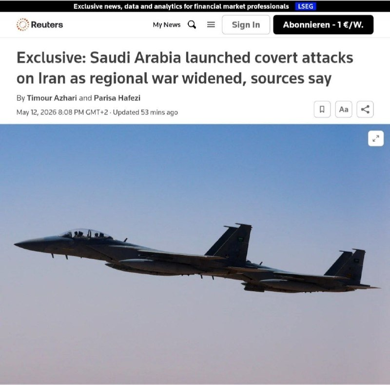

🇸🇦🇮🇷 — خبرگزاری رویترز درگزارشی مدعیست که عربستان سعودی در اواخر ماه مارس، حملات هوایی محرمانه‌ تلافی جویانه ای را در پاسخ به ایران انجام داده است.

☆Phantom☆

📌 @persian_trend_official
پرشین ترند | متفاوت‌ترین کانال نظامی

## Persian_Trend_Official — post 14004

  <a href="telegram/content/Persian_Trend_Official_14004_1778626105.mp4" target="_blank">🎬 Download video</a>

🔴ویدیو منتشر شده از کشتی کره ای آسیب دیده در حملات جمهوری اسلامی در روز های گذشته

🫆:Tony

📌 @persian_trend_official
پرشین ترند | متفاوت‌ترین کانال نظامی

## Persian_Trend_Official — post 14003

  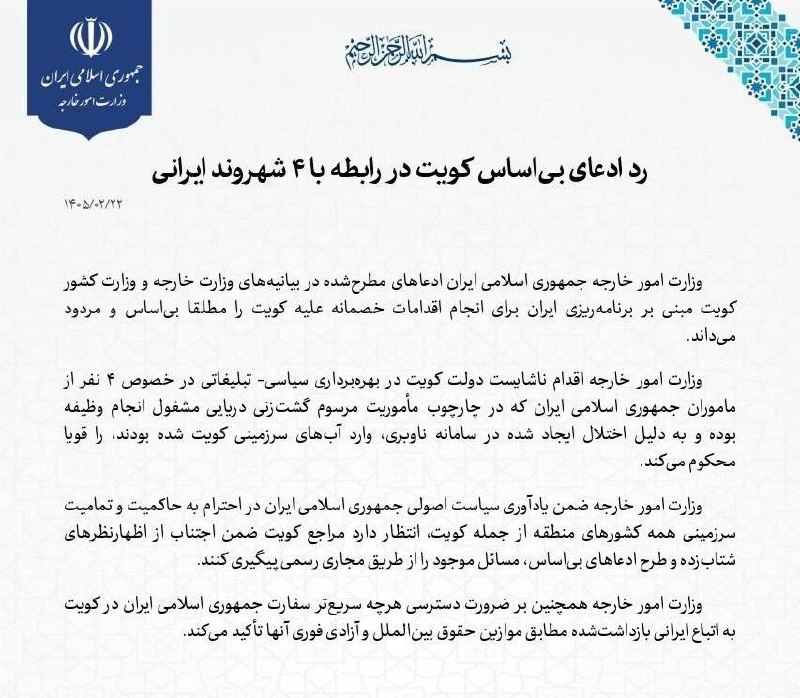

🔴 تهران ادعاهای کویت علیه ۴ شهروند ایرانی را رد کرد

جمهوری اسلامی ادعاهای مطرح‌شده از سوی وزارت خارجه و وزارت کشور کویت درباره برنامه‌ریزی ایران برای انجام اقدامات خصمانه علیه این کشور را «کاملاً بی‌اساس» و مردود دانست.

بر اساس موضع تهران:

▪️ اتهامات مطرح‌شده علیه ۴ شهروند ایرانی رد شده است
▪️ ایران تأکید کرده هیچ برنامه‌ای برای اقدام علیه کویت نداشته است
▪️ جمهوری اسلامی این ادعاها را فاقد اعتبار توصیف کرده است

▪️این واکنش پس از آن مطرح می‌شود که کویت از شناسایی و برخورد با آنچه «تهدیدات امنیتی» خوانده بود خبر داده بود.

🫆:Tony

📌 @persian_trend_official
پرشین ترند | متفاوت‌ترین کانال نظامی

## Persian_Trend_Official — post 14002

  

جنگنده کره‌ای KF-21 بیش از 16000 پرواز آزمایشی تاکنون انجام داده و به مراحل پایانی تست‌های خود رسیده است.

📝 Nick

📌 @persian_trend_official
پرشین ترند | متفاوت‌ترین کانال نظامی

## RadioFarda — post 157111

🔸خبرگزاری رویترز روز سه‌شنبه در گزارشی اختصاصی به نقل از دو مقام غربی و دو مقام ایرانی اعلام کرد که در جریان جنگ اخیر، عربستان سعودی در واکنش به حملات تهران به این کشور، چندین حمله به اهدافی در ایران انجام داده بود. 🔸این حملات عربستان سعودی که پیش‌تر گزارش…

## RadioFarda — post 157110

  

🔸خبرگزاری رویترز روز سه‌شنبه در گزارشی اختصاصی به نقل از دو مقام غربی و دو مقام ایرانی اعلام کرد که در جریان جنگ اخیر، عربستان سعودی در واکنش به حملات تهران به این کشور، چندین حمله به اهدافی در ایران انجام داده بود.

🔸این حملات عربستان سعودی که پیش‌تر گزارش نشده بودند، نخستین مورد شناخته‌شده از اقدام مستقیم نظامی این کشور در خاک ایران به شمار می‌روند.

🔸به گفته دو مقام غربی، این حملات که توسط نیروی هوایی عربستان انجام شده‌اند، در اواخر ماه مارس صورت گرفته‌اند. یکی از آن‌ها گفت این حملات «اقدامات تلافی‌جویانه متقابل در پاسخ به حمله به عربستان» بوده است.

🔸رویترز می‌گوید نتوانسته است اهداف دقیق این حملات را تأیید کند.

🔸در پاسخ به درخواست اظهار نظر، یک مقام ارشد وزارت خارجه عربستان به‌طور مستقیم به این سوال که آیا چنین حملاتی انجام شده یا نه پاسخ نداد. وزارت خارجه ایران نیز به درخواست اظهار نظر پاسخ نداد.

@RadioFarda

## RadioFarda — post 157109

  

🔸وزارت خارجه جمهوری اسلامی بازداشت چهار نفر در کویت را که مقام‌های کویتی آن‌ها را وابسته به سپاه پاسداران معرفی کرده‌اند، تأیید کرد اما اتهام برنامه‌ریزی برای «اقدامات خصمانه» علیه کویت را رد کرد.

🔸وزارت خارجه ایران روز سه‌شنبه اعلام کرد این افراد در حال گشت دریایی بوده‌اند و به دلیل «اختلال در سیستم ناوبری» وارد آب‌های سرزمینی کویت شده‌اند.

🔸این وزارتخانه همچنین اظهارات مقام‌های کویتی درباره قصد ایران برای انجام عملیات خصمانه را رد و آن را بی‌اساس توصیف کرد.

🔸پیشتر وزارت کشور کویت اعلام کرده بود چهار «نفوذی» وابسته به سپاه پاسداران انقلاب اسلامی را پس از تلاش برای ورود دریایی به این کشور بازداشت کرده است.

🔸رسانه‌های دولتی کویت همچنین گزارش داده بودند که بازداشت‌شدگان در بازجویی‌ها گفته‌اند مأموریت داشته‌اند با یک قایق ماهیگیری به جزیره بوبیان نفوذ کنند.

@RadioFarda

## RadioFarda — post 157108

🔸وزارت خارجه ایالات متحده روز سه‌شنبه در بیانیه‌ای که در اختیار خبرگزاری رویترز قرار داد، اعلام کرد که مقام‌های ارشد آمریکا و چین توافق دارند که هیچ کشوری نباید اجازه داشته باشد برای عبور از تنگه هرمز عوارض کشتیرانی دریافت کند. 🔸این بیانیه وزارت خارجه آمریکا…

## RadioFarda — post 157107

  

🔸وزارت خارجه ایالات متحده روز سه‌شنبه در بیانیه‌ای که در اختیار خبرگزاری رویترز قرار داد، اعلام کرد که مقام‌های ارشد آمریکا و چین توافق دارند که هیچ کشوری نباید اجازه داشته باشد برای عبور از تنگه هرمز عوارض کشتیرانی دریافت کند.

🔸این بیانیه وزارت خارجه آمریکا پیش از نشست پیش‌روی دونالد ترامپ و شی جین‌پینگ، همتای چینی او، منتشر شده است؛ نشستی که در آن کنترل ایران بر تنگه هرمز در دستور کار خواهد بود.

🔸وزارت خارجه آمریکا گفت وانگ یی، وزیر خارجه چین، و مارکو روبیو، وزیر خارجه آمریکا، در یک تماس تلفنی در ماه گذشته میلادی دربارهٔ این موضوع گفت‌وگو کرده‌اند.

🔸تامِی پیگوت، سخنگوی وزارت خارجه، در پاسخ به پرسش‌های رویترز دربارهٔ این تماس گفت: «آن‌ها توافق کردند که هیچ کشور یا سازمانی نباید اجازه داشته باشد برای عبور از آبراه‌های بین‌المللی مانند تنگه هرمز عوارض دریافت کند.»

🔸رویترز می‌گوید وزارت خارجه آمریکا برخلاف رویه معمول خود، پیش‌تر گزارشی از این تماس منتشر نکرده بود.

@RadioFarda

## RadioFarda — post 157106

🔸دونالد ترامپ، رئیس‌جمهور آمریکا، پیش از سفر به پکن گفت که رئیس‌جمهور چین درباره جنگ ایران «نسبتاً خوب» عمل کرده است، اما واشینگتن به کمک او نیازی ندارد.

🔸او روز سه‌شنبه در محوطه کاخ سفید در جمع خبرنگاران افزود که قرار است با شی جین‌پینگ «گفت‌وگویی طولانی» درباره ایران داشته باشد.

🔸ترامپ تصریح کرد: «فکر نمی‌کنم ما به هیچ کمکی درباره ایران نیاز داشته باشیم. ما به هر شکلی که باشد پیروز خواهیم شد. یا به‌صورت مسالمت‌آمیز پیروز می‌شویم یا به شکل دیگری.»

🔸رئیس‌جمهور آمریکا با اشاره به این که توان نظامی ایران در جنگ اخیر از بین رفته است، هشدار داد: ««ایران یا کار درست را انجام خواهد داد یا ما کار را تمام خواهیم کرد.»

@RadioFarda

## RadioFarda — post 157105

  

🔸دولت بریتانیا می‌گوید ناوشکن اچ‌ام‌اس دراگون، چندین جنگندۀ تایفون و شهپادهای مین‌روب را در قالب یک عملیات چندملیتی برای تضمین امنیت کشتیرانی در تنگۀ هرمز، به این منطقه اعزام خواهد کرد.

🔸جان هیلی، وزیر دفاع بریتانیا این موضوع را روز سه‌شنبه در جریان یک نشست آنلاین با همتایانش از بیش از چهل کشور دیگر عضو این عملیات اعلام کرد؛ عملیاتی که به گفتۀ او، پس از آماده‌شدن شرایط اجرایی خواهد شد.

🔸وزیر دفاع بریتانیا در بیانیه‌ای گفت: «این عملیات با شراکت متحدانمان، عملیاتی دفاعی، مستقل و معتبر خواهد بود».

🔸مشارکت بریتانیا در این عملیات،‌ شامل ۱۱۵ میلیون پوند (بیش از ۱۵۵ میلیون دلار) سرمایه‌گذاری جدید در زمینۀ شهپادهای مین‌روب و سامانه‌های ضد پهپاد هم خواهد بود.

🔸بریتانیا در حال حاضر بیش از یک‌هزار نیروی نظامی در منطقه دارد که در قالب عملیات و همکاری‌های دفاعی با کشورهای منطقه، از جمله در زمینۀ مقابله با پهپادها در کشورهای متحد این کشور مستقر شده‌اند. ناوشکن اچ‌ام‌اس دراگون هم در مسیر خاورمیانه قرار دارد.

@RadioFarda

## RadioFarda — post 157104

  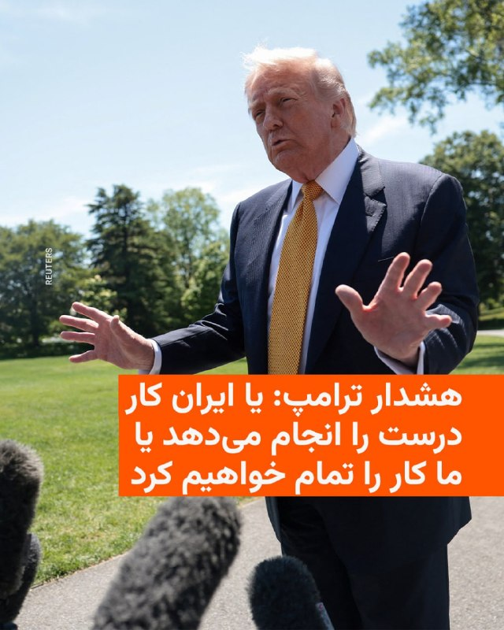

🔸دونالد ترامپ، رئیس‌جمهور آمریکا، پیش از سفر به پکن گفت که رئیس‌جمهور چین درباره جنگ ایران «نسبتاً خوب» عمل کرده است، اما واشینگتن به کمک او نیازی ندارد.

🔸او روز سه‌شنبه در جمع خبرنگاران افزود که قرار است با شی جین‌پینگ «گفت‌وگویی طولانی» درباره ایران داشته باشد.

🔸ترامپ تصریح کرد: «فکر نمی‌کنم ما به هیچ کمکی درباره ایران نیاز داشته باشیم. ما به هر شکلی که باشد پیروز خواهیم شد. یا به‌صورت مسالمت‌آمیز پیروز می‌شویم یا به شکل دیگری.»

🔸رئیس‌جمهور آمریکا با اشاره به این که توان نظامی ایران در جنگ اخیر از بین رفته است، هشدار داد: ««ایران یا کار درست را انجام خواهد داد یا ما کار را تمام خواهیم کرد.»

🔸او به جزئیات بیشتری درباره این هشدار اشاره نکرد، اما این اظهارات در حالی است که ترامپ پیشنهاد آخر ایران برای توافق پایان جنگ را در روزهای اخیر رد کرده و آن را «کاملا غیر قابل قبول» و «فوق‌العاده ضعیف» خوانده است.

🔸رئیس‌جمهور آمریکا قرار است چهارشنبه برای دیداری رسمی وارد پایتخت چین شود. این سفر که قرار بود در ماه مارس انجام شود، به دلیل درگیری نظامی آمریکا و اسرائیل با ایران به تأخیر افتاد.

@RadioFarda

## IranianMinds — post 20048

@IranianMindsGroup

ایدی گروه کامنتا ( تو کامنتا خیلی درخواست داده بودید )

## IranianMinds — post 20047

  

🔴 ترامپ:

وقتی اخبار جعلی می‌گویند دشمن ایرانی در مقابله با ما از نظر نظامی خوب عمل کرده است، این عملاً خیانت است، چون خبری کاملاً دروغین و حتی مضحک است. آن‌ها به دشمن کمک می‌کنند! این کار تنها به ایران امید دروغین می‌دهد، در حالی که نباید هیچ امیدی وجود داشته باشد.

این‌ها آمریکایی‌های بزدل هستند که علیه کشور ما ریشه دوانده‌اند. ایران ۱۵۹ کشتی در نیروی دریایی داشت حالا هر کشتی‌ای در کف دریا است. نیروی دریایی ندارند، نیروی هوایی‌شان از بین رفته، تمام فناوری‌هایشان از بین رفته، «رهبران»شان دیگر با ما نیستند و کشور در بحران اقتصادی است!

@IranianMinds

## IranianMinds — post 20046

  <a href="telegram/content/IranianMinds_20046_1778626113.mp4" target="_blank">🎬 Download video</a>

بچه ها اسم این بازی عبور مرغ از خیابون  هست ویدئو نگاه کنید خیلی راحت 8 میلیون ازش سود گرفتیم😍

😤اگ توم دوس داری خیلی راحت از بازی های انلاین پول در بیاری حتما عضو کازینو شبانه شو
✅

توی کازینو شبانه بهت اموزش میدیم از بازی های انلاین پول دربیاری👌

کازینو شبانه راهی برای چند برابر کردن سرمایت 🤷‍♂

کسب درامد انلاین با یه ادم حرفه ای یاد بگیر و‌ پول دربیار 
💵
ae22
🎯همین حالا عضو شو و شروع کن👇
https://t.me/+OS-QBvyDO4M2ZGY0
https://t.me/+OS-QBvyDO4M2ZGY0

## IranianMinds — post 20045

  

جمهوری اسلامی از اورک ها هم‌ داره استفاده میکنه

@IranianMinds

## IranianMinds — post 20044

🔴 امام جمعه کاشان پا منقل :

جمهوری اسلامی تنها ابرقدرت جهان است هیچ کشوری توان مقابله با ما رو‌ نداره !

@IranianMinds

## IranianMinds — post 20043

ترامپ هم‌ تو‌ راه چین نشسته یه متن بالا بلند نوشته و دوباره گفته فیک‌ نیوزا شعر میگن ما ارتش ایران و رهبریشو‌ از بین بردیم

@IranianMinds

## IranianMinds — post 20042

🔴 مرکز لرزه نگاری :

زلزله ۴.۶ ریشتری مرز استان های تهران و مازندران را لرزاند.

@IranianMinds

## IranianMinds — post 20041

یادش بخیر جنگ ۱۲ روزه هر زلزله ای میومد میگفتن تموم شد تست بمب اتم‌ بود

## IranianMinds — post 20040

🔴 زلزله نسبتا شدیدی در تهران رخ داد @IranianMinds

## IranianMinds — post 20039

  <a href="telegram/content/IranianMinds_20039_1778626117.mp4" target="_blank">🎬 Download video</a>

🔴 شاهزاده رضا پهلوی از استراتژی ترامپ درباره ایران انتقاد کرد:

از یک سو می‌گوید مردم باید قیام کنند و از سوی دیگر می‌گوید صبر کنید، ما در حال مذاکره هستیم. این موضوع همه را کاملاً گیج کرده است.

نمی‌توان پیام‌های متناقض فرستاد.

@IranianMinds

## IranianMinds — post 20038

🔴 زلزله نسبتا شدیدی در تهران رخ داد

@IranianMinds

## IranianMinds — post 20037

  

🔴 ۷۴ روزه که اینترنت توسط جمهوری اسلامی قطع شده

میلیون ها کسب و کار نابود شدن و میلیون ها نفر از نون خوردن افتادن ، در‌ حالی که جمهوری اسلامی با فروش اینترنت پرو داره درآمد برا خودش قطع میکنه و از این سود میبره …

@IranianMinds

## IranianMinds — post 20036

  

🔴 شاهزاده رضا پهلوی تو نشست امنیتی سالانه پولیتیکو:

الان ما با یه جونورِ زخمی طرفیم و نباید بذاریم فرصت از دست بره، کار رو باید یه بار واسه همیشه تموم کنیم.

سیاست مماشات با جمهوری اسلامی که راهبرد خیلی از دولت‌ها بود، شکست خورده.
مردم به‌اندازه کافی هوشمند هستنن که تفاوت بین حمله به یه ملت و حمله به یه رژیم رو تشخیص بدن.
ما فقط زمانی می‌تونیم مردم رو به بازگشت به خیابون‌ها فرا بخوانیم که اونا هم سطحی از توان مقابله رو داشته باشن.

@IranianMinds

## IranianMinds — post 20035

  

🔴 ان بی سی نیوز :

پنتاگون در حال بررسی نام‌گذاری مجدد جنگ با ایران به «عملیات چکش سنگین» در صورت فروپاشی آتش‌بس و از سرگیری عملیات‌های رزمی گسترده توسط ترامپ است

@IranianMinds

## IranianMinds — post 20034

🔴 ترامپ حرکت کرد به سمت چین

@IranianMinds

## IranianMinds — post 20033

🔴 خبرگزاری فارس :

پیشنهادات آمریکاییا برای مذاکرات کاملا یک طرفه است و فقط منافع خودشون براشون مهمه هیچ اهمیتی به ما نمیدن

@IranianMinds

## BBCPersian — post 280881

🔻اورژانس تهران اعلام کرده در پی طوفان و باد شدید در تهران تاکنون ۱۱ حادثه به این سازمان امدادی گزارش شده است.

خبرگزاری مهر به نقل از شروین تبریزی، سخنگوی اورژانس تهران نوشته تاکنون ۷ مصدوم که ۵ نفر آنها سرپایی درمان شده‌اند، در ماموریت‌های امدادگران ثبت شده اند اما ممکن است آمار تعداد مصدومان بیشتر شود.

در همین حال، خبرگزاری‌های ایران از وقوع زمین لرزه در حوالی تهران خبر داده‌اند.
زلزله در حوالی شهر پردیس - شرق تهران - و به بزرگی ۴/۶ گزارش شده است و به گزارش ایرنا درشهرهای بومهن و رودهن احساس شده و در شهر دماوند موجب قطعی برق شده است.

قطعی برق در برخی از مناطق تهران هم گزارش شده اما علت آن وزش تندباد با سرعتی بالای ۵۵ کیلومتر در ساعت گزارش شده است که موجب شکستن درختان در نقاطی هم شده است.

@BBCPersian

## BBCPersian — post 280880

🔻کایا کالاس، مسئول سیاست خارجی اتحادیه اروپا، گفت این اتحادیه ممکن است مأموریت دریایی خود در دریای سرخ را پس از پایان جنگ ایران، به تنگه هرمز نیز گسترش دهد.

مأموریت اتحادیه اروپا در سال ۲۰۲۴ برای حفاظت از کشتیرانی در دریای سرخ، یکی دیگر از آبراه‌های مهم خاورمیانه، در برابر حملات حوثی‌های یمن آغاز شد.

خانم کالاس پس از نشست وزیران دفاع اتحادیه اروپا گفت عملیات اتحادیه اروپا هم‌اکنون نقش مهمی در حفاظت از کشتیرانی در دریای سرخ دارد و فعالیت‌های آن می‌تواند به تنگه هرمز هم گسترش یابد.

او افزود که برخی کشورها از هم‌اکنون وعده داده‌اند کشتی‌های بیشتری در اختیار این مأموریت قرار دهند و این موضوع می‌تواند در صورت تصمیم برای گسترش دامنه عملیات، کمک‌کننده باشد.

وزیران دفاع اتحادیه اروپا در ماه گذشته میلادی در ابتدا پیشنهاد گسترش مأموریت دریای سرخ را رد کرده بودند.

به نظر می‌رسد مذاکرات میان آمریکا و ایران برای پایان دادن به جنگ خاورمیانه و بازگشایی این آبراه حیاتی، متوقف شده است.

انسداد تنگه هرمز از سوی ایران باعث افزایش قیمت جهانی انرژی شده است.
@BBCPersian

## BBCPersian — post 280879

🔻دونالد ترامپ، رئیس‌جمهوری آمریکا پیش از عزیمت به چین گفت که برای پایان دادن به جنگ با ایران به کمک این کشور نیازی ندارد.

آقای ترامپ در عین حال اعلام کرد که در جریان نشست این هفته خود با شی جین‌پینگ، رئیس‌جمهور چین گفت‌وگویی مفصل خواهد داشت.

چین یکی از مهم‌ترین شرکای اقتصادی ایران است و بخش بزرگی از صادرات نفت این کشور را خریداری می‌کند. پکن همچنین از حامیان مهم ایران است.

آقای ترامپ تأکید کرد که برای یافتن راه خروج از درگیری‌ای که دو ماه و نیم پیش با حمله گسترده آمریکا و اسرائیل آغاز شد و سپس بر سر کنترل مسیر کشتیرانی تنگه هرمز به بن‌بست رسید، به شی جین‌پینگ نیازی ندارد.

آقای ترامپ گفت: «موضوعات زیادی برای گفت‌وگو داریم. راستش را بخواهید، نمی‌گویم ایران یکی از آنهاست، چون ما ایران را کاملا تحت کنترل داریم.»

او افزود: «یا به توافق می‌رسیم یا آنها نابود خواهند شد.»

در حالی که گزارش‌هایی منتشر شده مبنی بر این‌که چین همچنان به تسلیح ایران کمک می‌کند و نفت تحریم‌شده ایران را می‌خرد، آقای ترامپ گفت شی جین‌پینگ «نسبتا خوب» عمل کرده است.
@BBCPersian

## BBCPersian — post 280878

  <a href="https://t.me/bbcpersian/280878" target="_blank">📎 Download file</a>

این نسخه رادیویی برنامه شصت دقیقه تلویزیون فارسی بی‌بی‌سی است که هرشب بعد از پخش، با حجم کم از اپلیکیشن‌های پادگیر و صفحه تلگرام بی‌بی‌سی فارسی در دسترس است. 
با هشتگ BBCPersianRadio با ما در ارتباط باشید.

## BBCPersian — post 280876

  <a href="https://t.me/bbcpersian/280876" target="_blank">📎 Download file</a>

پادکست برنامه شصت دقیقه سه‌شنبه ۲۲ اردیبهشت ۱۴۰۵
این نسخه رادیویی برنامه شصت دقیقه تلویزیون فارسی بی‌بی‌سی است که هرشب بعد از پخش، با حجم کم از اپلیکیشن‌های پادگیر و صفحه تلگرام بی‌بی‌سی فارسی در دسترس است.
با هشتگ BBCPersianRadio# با ما در ارتباط باشید.

## Dirty_Kids — post 389353

‏۲۵۰۰ سال تاریخ داریم، دریغ از یه مثقال آینده.

@Dirty_Kids 👻

## Dirty_Kids — post 389352

  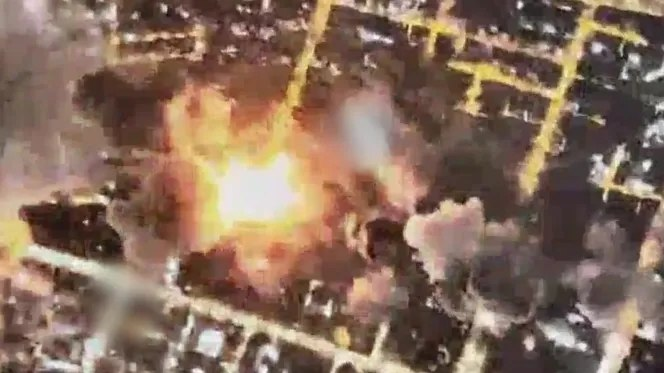

یادآوری آن روز باشکوه.

*تصویر حمله هوایی به بیت رهبری

@Dirty_Kids 👻

## Dirty_Kids — post 389350

  <a href="telegram/content/Dirty_Kids_389350_1778626125.mp4" target="_blank">🎬 Download video</a>

وسط این بگاییا یه پسره به اسم امیر قاسم ملقب به بتمن :))))))) با این ویس هاپ هاپ مخ ۶۰ نفر زده، الان لو رفته دخترا به جون هم افتادن چت و اسکرین شات و نود همدیگه‌رو دارن پخش میکنن

با نود و چتاشون کاری ندارم ولی این ویس خیلی خنده بود

@Dirty_Kids 👻

## Dirty_Kids — post 389349

  <a href="telegram/content/Dirty_Kids_389349_1778626125.mp4" target="_blank">🎬 Download video</a>

کارمندان آینده #ساواک پخششکنید ببینم چقدیم

@Dirty_Kids 👻

## Dirty_Kids — post 389346

تهران مجددا بصورت خفیف لرزید

@Dirty_Kids 👻

## Dirty_Kids — post 389345

قدیم اگه همچین زلزله‌ای میومد ملت تا صبح تو ماشینا و پارکا می‌خوابیدن، ببین چقدر پوستمون کلفت شده که کیرمونم نیست.

@Dirty_Kids 👻

## Dirty_Kids — post 389343

امشب هم طوفان اومد، هم زلزله شد، بعدی حمله‌ی زامبیاس.

@Dirty_Kids 👻

## Dirty_Kids — post 389342

الان باید تن‌ماهی بخریم یا بنزین بزنیم؟

@Dirty_Kids 👻

## Dirty_Kids — post 389341

  

🔴 زلزله تهران به مرکز پردیس، 3.4 ریشتر بود.

@Dirty_Kids 👻

## Dirty_Kids — post 389340

🔴 فوری: وسط این همه بگایی تهران زلزله اومد!

@Dirty_Kids 👻

## Dirty_Kids — post 389339

  

واکنش شهبازی (اسکل نظام) به وضعیت اینترنت مردم ایران و کشورهای منطقه: اگه خیلی این چیزها مهمه، برید همون افغانستان و سوریه زندگی کنید! هاهاهاها + هاهاها و ک...خر @Dirty_Kids 👻

## Dirty_Kids — post 389338

  

این پردیس احمدیه افغانی رفته خادم رضا شده

رقابت سنگینی هست بین این بی‌هنرا تو مالیدن تا بارشونو ببندن

@Dirty_Kids 👻

## Dirty_Kids — post 389337

  <a href="telegram/content/Dirty_Kids_389337_1778626128.mp4" target="_blank">🎬 Download video</a>

عشق این شکلیه 👆

@Dirty_Kids 👻

## Dirty_Kids — post 389336

ترامپ گفته مسئولین حکومت خیلی بی‌شرفن.
فکر کن یارو تازه غیرمستقیم باهاشون هم‌کلام شده اینجوری میگه. اونم چندهفته نه ۴۷ سال...

@Dirty_Kids 👻

## Hranews — post 112916

گزارشی از تجمع اعتراضی اساتید اخراجی دانشگاه فرهنگیان در تهران

❗️
❗️
❗️
❗️
❗️ – روز یکشنبه ۲۰ اردیبهشت‌ماه، شماری از اساتید اخراجی دانشگاه فرهنگیان در مقابل ساختمان‌های سازمان بازرسی کل کشور و وزارت آموزش و پرورش در اعتراض به عدم رسیدگی به مطالباتشان دست به #تجمع زدند.

ادامه مطلب

↘️
@hranews_bot تماس ✉️ -  @Hranews  کانال هرانا 🆑

## Hranews — post 112915

گزارشی از مرگ یک کودک ۳ ساله بر اثر مصرف متادون؛ قرار مجرمیت نامادری صادر شد

❗️
❗️
❗️
❗️
❗️ – پرونده مرگ یک #کودک سه ساله در تهران که در سال ۱۴۰۳ بر اثر مصرف متادون جان خود را از دست داده بود، اکنون با صدور قرار مجرمیت برای نامادری او، به دادگاه کیفری استان تهران ارجاع شده است. مقام‌های قضایی، اتهام مطروحه علیه این زن را «قتل شبه‌عمد» عنوان کرده‌اند.

ادامه مطلب

↘️
@hranews_bot تماس ✉️ -  @Hranews  کانال هرانا 🆑

## Hranews — post 112914

تایید حکم اعدام یک زندانی در دیوان عالی کشور/ رهایی ۲ تن از چوبه‌دار

❗️
❗️
❗️
❗️
❗️ – حکم یک زندانی که پیشتر توسط دادگاه کیفری تهران از بابت اتهام قتل به #اعدام محکوم شده بود، برای بار دوم در دیوان عالی کشور تایید شد. از سوی دیگر، دو زندانی محکوم به اعدام در بروجرد و تهران، با اعلام رضایت اولیای دم از مجازات مرگ رهایی یافتند.

ادامه مطلب

↘️
@hranews_bot تماس ✉️ -  @Hranews  کانال هرانا 🆑

## Hranews — post 112913

سیدیاسین حسن‌زاده، دانشجوی دانشگاه تهران بازداشت شد

❗️
❗️
❗️
❗️
❗️ – سیدیاسین حسن‌زاده، دبیر انجمن اسلامی دانشجویان دانشگاه تهران امروز #بازداشت و به مکان نامعلومی منتقل شد.

ادامه مطلب

#سیدیاسین_حسن‌زاده

↘️
@hranews_bot تماس ✉️ -  @Hranews  کانال هرانا 🆑

## manototv — post 105382

  <a href="telegram/content/manototv_105382_1778626131.mp4" target="_blank">🎬 Download video</a>

‌
الجزیره به نقل از منابع دیپلماتیک گزارش داد ۱۱۲ کشور به پیش‌نویس قطعنامه‌ای در شورای امنیت سازمان ملل پیوسته‌اند که از سوی آمریکا و کشورهای خلیج فارس درباره آزادی کشتیرانی در تنگه هرمز ارائه شده است.

به گفته این منابع، هند، ژاپن و بیشتر کشورهای اروپایی در میان حامیان این پیش‌نویس قرار دارند.

منابع الجزیره همچنین گفتند حمایت ۱۱۲ کشور از این قطعنامه، نشان‌دهنده پشتیبانی گسترده بین‌المللی از ابتکار آمریکا و کشورهای خلیج فارس درباره تنگه هرمز است.

## manototv — post 105380

  <a href="telegram/content/manototv_105380_1778626132.mp4" target="_blank">🎬 Download video</a>

تماسی از تهران:
«می‌گفت جنگ شد و بعد رها شد… همه‌چیز روی هوا موند و شرایط افتضاح‌تر شد.
می‌گفت قبلش حداقل یه جور داشتیم زندگی می‌کردیم

## manototv — post 105379

  <a href="telegram/content/manototv_105379_1778626134.mp4" target="_blank">🎬 Download video</a>

رئیس سازمان هلال احمر اعلام کرد زلزله در تهران و کرج «هیچ» خسارت مالی و جانی در پی نداشته است.
پیش‌تر زلزله‌ای به بزرگی ۴.۶ در مقیاس ریشتر، مرز استان‌های تهران و مازندران را لرزاند.

## manototv — post 105378

  <a href="telegram/content/manototv_105378_1778626135.mp4" target="_blank">🎬 Download video</a>

شاهزاده رضا پهلوی در نشست امنیتی سالانه پولیتیکو گفت مردم ایران، نه نیروهای خارجی، باید نقش اصلی را در تغییر حکومت جمهوری اسلامی ایفا کنند؛ اما برای این کار به «حمایت و پوشش» نیاز دارند.

او گفت: «نیروهای روی زمین در ایران، خود مردم ایران هستند. ما نیازی نداریم نیروهای خارجی این کار را برای ما انجام دهند.»

شاهزاده رضا پهلوی با اشاره به سرکوب اعتراضات دی‌ماه گفت در کمتر از ۴۸ ساعت بیش از ۴۰ هزار نفر کشته شدند و افزود بدون حمایت، نمی‌توان از مردم انتظار داشت دوباره به خیابان‌ها بیایند.

او گفت: «به همین دلیل بود که به کارزار هوایی و پوشش هوایی نیاز داشتیم.»

شاهزاده رضا پهلوی همچنین تأکید کرد باید یک استراتژی روشن برای پایان دادن به جمهوری اسلامی وجود داشته باشد؛ استراتژی‌ای که هم مردم را برای قیام تشویق کند و هم زمینه پیوستن نیروهایی از ارتش و دستگاه امنیتی به مردم را فراهم سازد.

او افزود: «نمی‌شود از یک طرف گفت مردم قیام کنند و همزمان گفت در حال مذاکره هستیم؛ این همه را گیج می‌کند.»

شاهزاده رضا پهلوی همچنین گفت حملات انجام‌شده علیه جمهوری اسلامی، ملت ایران را هدف نگرفته بود، بلکه زیرساخت‌های سرکوب حکومت، از جمله دستگاه اطلاعاتی و سپاه پاسداران، را هدف قرار داده بود.

او افزود: «مردم آن‌قدر باهوش هستند که تفاوت میان حمله به ملت ایران و حمله به حکومت را تشخیص دهند.»

## manototv — post 105377

  <a href="telegram/content/manototv_105377_1778626138.mp4" target="_blank">🎬 Download video</a>

‌
خبرگزاری‌های داخل ایران گزارش دادند دقایقی پیش زلزله تهران و کرج را لرزاند. به گزارش این خبرگزاری‌ها سمت شرق تهران زمین‌لرزه بسیار شدیدتر بوده است.

## manototv — post 105376

  <a href="telegram/content/manototv_105376_1778626139.mp4" target="_blank">🎬 Download video</a>

تماسی از ایران؛
«می‌گفت تغییر از بیرون نیست…
کار خود مردمه، حتی با این وضعیت سخت.»

## manototv — post 105375

  <a href="telegram/content/manototv_105375_1778626141.mp4" target="_blank">🎬 Download video</a>

رویترز به نقل از دو مقام غربی و دو مقام ایرانی گزارش داد عربستان سعودی در واکنش به حملات انجام‌شده علیه این کشور، چند حمله نظامی اعلام‌نشده علیه جمهوری اسلامی انجام داده است.

بر اساس این گزارش، حملات هوایی عربستان در اواخر ماه مارس توسط نیروی هوایی این کشور انجام شده و نخستین مورد شناخته‌شده از حمله مستقیم نظامی عربستان به خاک ایران به شمار می‌رود.

رویترز نوشت این حملات پس از آن انجام شد که جمهوری اسلامی در جریان جنگ اخیر، همه کشورهای عضو شورای همکاری خلیج فارس را با موشک و پهپاد هدف قرار داد و به زیرساخت‌های نفتی، فرودگاه‌ها و مراکز غیرنظامی حمله کرد.

به گفته منابع رویترز، پس از حملات عربستان، تهران و ریاض وارد تماس‌های فشرده دیپلماتیک شدند و عربستان نیز هشدار داده بود در صورت ادامه حملات، پاسخ‌های بیشتری خواهد داد.

یک مقام ایرانی به رویترز گفت تهران و ریاض در نهایت برای کاهش تنش به تفاهم رسیدند؛ تفاهمی که هدف آن «توقف درگیری‌ها، حفظ منافع متقابل و جلوگیری از تشدید تنش» بوده است.

رویترز همچنین گزارش داد شمار حملات موشکی و پهپادی علیه عربستان پس از این تفاهم به‌طور قابل توجهی کاهش یافت.

## manototv — post 105374

  <a href="telegram/content/manototv_105374_1778626143.mp4" target="_blank">🎬 Download video</a>

‌
شاهزاده رضا پهلوی، در نشست امنیتی سالانه پولیتیکو، در واکنش به تهدید دونالد ترامپ درباره نابودی زیرساخت‌های غیرنظامی ایران، گفت چنین اظهاراتی «پیام اشتباه» به مردم ایران می‌فرستد.

او گفت: «سؤال این است که آیا شما اینجا هستید که ما را آزاد کنید یا بیشتر به ما آسیب بزنید؟»

شاهزاده رضا پهلوی افزود آنچه به مردم ایران آسیب می‌زند «زیرساخت‌های غیرنظامی» است و تأکید کرد باید میان مردم ایران و حکومت جمهوری اسلامی تفاوت قائل شد.

او گفت: «چیزی که به ما کمک می‌کند، هدف قرار دادن حکومت و زیرساخت‌های آن است.»

شاهزاده رضا پهلوی همچنین گفت جمهوری اسلامی مانند حماس در غزه، از مردم به‌عنوان «سپر انسانی» استفاده می‌کند و نیروهای امنیتی خود را در مدارس و بیمارستان‌ها مستقر می‌کند.

او افزود: «هرچه زودتر به این حکومت پایان دهیم، زودتر می‌توانیم جان انسان‌های بی‌گناه بیشتری را در کشورم حفظ کنیم.»

## manototv — post 105373

  <a href="telegram/content/manototv_105373_1778626145.mp4" target="_blank">🎬 Download video</a>

دونالد ترامپ در واکنش به افزایش تورم ناشی از جنگ با ایران، گفت پایان جنگ «خیلی دور نیست» و با پایان درگیری‌ها، قیمت نفت و تورم به‌سرعت کاهش خواهد یافت.
رئیس‌جمهور آمریکا به خبرنگاران گفت: «به‌محض پایان جنگ، شاهد سقوط قیمت نفت و جهش بازار سهام خواهید بود.»
او افزود صدها کشتی حامل نفت آماده خروج هستند و با باز شدن مسیرها، حجم زیادی نفت وارد بازار خواهد شد که به کاهش شدید تورم کمک می‌کند.

## manototv — post 105372

  <a href="telegram/content/manototv_105372_1778626146.mp4" target="_blank">🎬 Download video</a>

دونالد ترامپ پیش از سفر رسمی خود به چین اعلام کرد در دیدار با شی جین‌پینگ گفت‌وگویی طولانی خواهد داشت، اما نیازی به صحبت درباره جمهوری‌اسلامی نمی‌بیند؛ چون به گفته او، «ایران کاملاً تحت کنترل است».
رئیس‌جمهور آمریکا بار دیگر تأکید کرد جمهوری‌اسلامی «به سلاح هسته‌ای دست نخواهد یافت» و گفت اقدامات آمریکا علیه تهران «کاملا مؤثر» بوده است.

## alonews — post 119631

  <a href="telegram/content/alonews_119631_1778626147.webm" target="_blank">🎬 Download video</a>

👈تهران امشب رو ویبره بود

✅ @AloNews خبر جنگ

## alonews — post 119630

  <a href="telegram/content/alonews_119630_1778626147.mp4" target="_blank">🎬 Download video</a>

👈حضور مردم در حاشیه شهر بومهن پس از وقوع زلزله امشب

🔴برخی مردم در خیابان خوابیده اند

✅ @AloNews خبر جنگ

## alonews — post 119629

  <a href="telegram/content/alonews_119629_1778626149.webm" target="_blank">🎬 Download video</a>

👈رویترز: منابع میگن عربستان مخفیانه حملاتی علیه ایران شروع کرده و تنش‌های منطقه‌ای هم شدیدتر شده

✅ @AloNews خبر جنگ

## alonews — post 119628

  <a href="telegram/content/alonews_119628_1778626150.webm" target="_blank">🎬 Download video</a>

👈یک مقام ارشد اسرائیلی به سی‌ان‌ان گفت: اگر توافقی حاصل نشود خوشحال خواهیم شد اگر محاصره ادامه یابد خوشحال خواهیم شد و اگر چند حمله دیگر هم به ایران شود، خوشحال خواهیم شد

✅ @AloNews خبر جنگ

## alonews — post 119627

  <a href="telegram/content/alonews_119627_1778626150.webm" target="_blank">🎬 Download video</a>

👈طبق معمول پمپ بنزینای تهران شلوغ شد

✅ @AloNews خبر جنگ

## alonews — post 119626

  <a href="telegram/content/alonews_119626_1778626150.webm" target="_blank">🎬 Download video</a>

👈گزارش مقدماتی زمین‌لرزه مجدد در تهران

🔴 بزرگی: ۴ ریشتر
محل وقوع: حوالی پرديس
زمان: ۲۶ دقیقه بامداد
عمق زمین‌لرزه: ۸ کیلومتر

🔴نزدیک‌ترین شهرها:
۹ کیلومتری پرديس (تهران)
۱۱ کیلومتری بومهن (تهران)
۱۲ کیلومتری رودهن (تهران)

🔴نزدیکترین مراکز استان:
۴۰ کیلومتری تهران
۷۶ کیلومتری كرج

✅ @AloNews خبر جنگ

## alonews — post 119625

  <a href="telegram/content/alonews_119625_1778626150.webm" target="_blank">🎬 Download video</a>

👈چندین پس لرزه خفیف در تهران ثبت شد

✅ @AloNews خبر جنگ

## alonews — post 119624

  <a href="telegram/content/alonews_119624_1778626151.webm" target="_blank">🎬 Download video</a>

👈عوضش اورانیوم ۶۰درصد داریم میتونیم بزاریم تو شیشه نگاش کنیم و روز به روز بدبختر بشیم😍

✅ @AloNews خبر جنگ

## alonews — post 119623

  <a href="telegram/content/alonews_119623_1778626151.webm" target="_blank">🎬 Download video</a>

🔴فوری/زلزله مجدد در پردیس تهران

✅ @AloNews خبر جنگ

## alonews — post 119622

  <a href="telegram/content/alonews_119622_1778626151.webm" target="_blank">🎬 Download video</a>

👈مردم تهران باید امشب رو هوشیار باشن و زیر وسایل خطرساز مثل لوسترها و پنجره‌ها نخوابن، احتمال لرزش‌های شدیدتر است

✅ @AloNews خبر جنگ

## alonews — post 119621

  <a href="telegram/content/alonews_119621_1778626152.webm" target="_blank">🎬 Download video</a>

👈پس لرزه‌ها تو تهران شروع شده

✅ @AloNews خبر جنگ

## alonews — post 119620

  <a href="telegram/content/alonews_119620_1778626152.webm" target="_blank">🎬 Download video</a>

🔴فوری/زلزله مجدد در تهران

✅ @AloNews خبر جنگ

## alonews — post 119619

  <a href="telegram/content/alonews_119619_1778626152.webm" target="_blank">🎬 Download video</a>

👈رسایی: مردم بعدا میفهمن با قطع اینترنت چه خدمتی به ایران کردیم

🔴دشمن برنامه‌ها داشت

✅ @AloNews خبر جنگ

## alonews — post 119618

اخبار جنگ الونیوز AloNews pinned «
⭕️
⭕️ حجم 1 تا 100 گیگ بدون ضریب با لینک ساب بدون قطعی سرعت بالا و ضمانت بازگشت وجه قیمت هر گیگ 235 
💸 برای خرید به ادمین چنل پیام بدید خرید آسان و راحت با کارت ب کارت ثبت سفارش از طریق ربات: و اگر تمایل به همکاری دارید کافیه به ساپورت چنل مراجعه کنید…»

## alonews — post 119617

  <a href="telegram/content/alonews_119617_1778626153.webm" target="_blank">🎬 Download video</a>

👈سخنگوی اورژانس تهران: در پی زمین لرزه در تهران تا این لحظه مصدومی گزارش نشده است

✅ @AloNews خبر جنگ

## alonews — post 119616

  <a href="telegram/content/alonews_119616_1778626153.webm" target="_blank">🎬 Download video</a>

👈در زمان زلزله چه باید کرد؟

✅ @AloNews خبر جنگ

## alonews — post 119614

  <a href="telegram/content/alonews_119614_1778626153.webm" target="_blank">🎬 Download video</a>

👈کانون زلزله لحظات قبل تهران

✅ @AloNews خبر جنگ

## alonews — post 119613

  <a href="telegram/content/alonews_119613_1778626154.webm" target="_blank">🎬 Download video</a>

👈مردم تهران امشب هوشیار بخوابن

✅ @AloNews خبر جنگ

## alonews — post 119612

  <a href="telegram/content/alonews_119612_1778626154.webm" target="_blank">🎬 Download video</a>

👈ترامپ از طریق Truth Social: وقتی اخبار جعلی می‌گویند که دشمن ایرانی در مقابل ما از نظر نظامی خوب عمل می‌کند، این عملاً خیانت است چون چنین بیانی کاملاً نادرست و حتی مضحک است. آنها به دشمن کمک و یاری می‌رسانند! این فقط به ایران امید کاذب می‌دهد در حالی که نباید هیچ امیدی وجود داشته باشد.

🔴این‌ها ترسوهای آمریکایی هستند که علیه کشور ما ریشه دوانده‌اند. ایران ۱۵۹ کشتی در نیروی دریایی خود داشت — هر کشتی اکنون در کف دریا استراحت می‌کند. آنها نیروی دریایی ندارند، نیروی هوایی‌شان از بین رفته، تمام فناوری‌ها از دست رفته، «رهبران» آنها دیگر با ما نیستند و کشور یک فاجعه اقتصادی است.

🔴فقط بازندگان، ناسپاسان و احمق‌ها قادر به ارائه استدلال علیه آمریکا هستند!

✅ @AloNews خبر جنگ

## alonews — post 119611

  <a href="telegram/content/alonews_119611_1778626154.webm" target="_blank">🎬 Download video</a>

👈گزارش مقدماتی زمین‌لرزه

🔴بزرگی: ۴.۶ ریشتر

🔴محل وقوع: مرز استانهای تهران و مازندران  - حوالی پرديس

🔴تاریخ و زمان وقوع به وقت محلی: 1405/02/22 23:46:07

🔴عمق زمین‌لرزه: 10 کیلومتر

🔴نزدیک‌ترین شهرها:

🔴8 کیلومتری پرديس (تهران)

🔴10 کیلومتری بومهن (تهران)

🔴11 کیلومتری رودهن (تهران)
    

🔴نزدیکترین مراکز استان:

🔴41 کیلومتری تهران

🔴77 کیلومتری كرج

✅ @AloNews خبر جنگ

---
📅 بروزرسانی: 1405/02/22 21:59
---

## VahidOOnLine — post 239760

  

بریتانیا سه‌شنبه اعلام کرد که تجهیزات خودکار مین‌روبی، جنگنده‌های تایفون و ناو جنگی اچ‌ام‌اس دراگون را به یک ماموریت دفاعی چندملیتی با هدف تامین امنیت کشتیرانی در تنگه هرمز اختصاص خواهد داد.

دولت بریتانیا با انتشار بیانیه‌ای نوشت که ماموریت دفاعی بریتانیا با ۱۱۵ میلیون پوند بودجه جدید برای پهپادهای مین‌روب و سامانه‌های مقابله با پهپاد پشتیبانی می‌شود.

جان هیلی، وزیر دفاع بریتانیا که ریاست اولین نشست وزیران دفاع ائتلافی متشکل از ۴۰ کشور را به‌طور مشترک با همتای فرانسوی خود برعهده داشت، گفت: «همراه با متحدان‌مان، این ماموریت چندملیتی، دفاعی، مستقل و معتبر خواهد بود.»
‌🏁 🇬🇧 IranintlTV

🤖 @VahidOOnLine

## VahidOOnLine — post 239759

  <a href="telegram/content/VahidOOnLine_239759_1778610569.mp4" target="_blank">🎬 Download video</a>

♦️ ۲۲ اردیبهشت، زادروز مریم میرزاخانی، به عنوان روز جهانی زنان در ریاضیات شناخته می‌شود؛ ریاضیدان ایرانی‌ای که نامش برای همیشه در تاریخ علم ماندگار شد.

میرزاخانی در سال ۱۳۷۳ مدال طلای المپیاد ریاضی ایران و در سال ۱۹۹۴ مدال طلای المپیاد جهانی ریاضی در هنگ‌کنگ را کسب کرد. یک سال بعد، در ۱۹۹۵، دوباره طلای جهانی گرفت و با کسب نمره کامل، نامش را در تاریخ المپیادها ثبت کرد.

او پس از تحصیل در دانشگاه صنعتی شریف، برای ادامه تحصیل به آمریکا رفت و دکترای خود را از دانشگاه هاروارد گرفت. مریم بعدها استاد دانشگاه استنفورد شد و در سال ۲۰۱۴ به عنوان نخستین زن تاریخ، مدال فیلدز، معتبرترین جایزه دنیای ریاضیات، را دریافت کرد.

داستان او فقط درباره ریاضی نیست؛ درباره کنجکاوی، پشتکار و شکستن مرزهایی‌ست که غیرممکن به نظر می‌رسیدند.
‌🇸🇦 Indypersian

🤖 @VahidOOnLine

## VahidOOnLine — post 239758

  <a href="telegram/content/VahidOOnLine_239758_1778610571.mp4" target="_blank">🎬 Download video</a>

ژنرال دن کین، رئیس ستاد مشترک ارتش آمریکا، اعلام کرد جمهوری‌اسلامی تحت فشار شدید ناشی از تحریم‌ها و محاصره قرار دارد و واشنگتن همچنان «طیفی از گزینه‌های نظامی» را در اختیار دارد.
در جلسه استماع سنای آمریکا، کریس مورفی، سناتور دموکرات، با اشاره به افزایش شدید قیمت سوخت پرسید آیا راهی جز دیپلماسی برای بازگشایی تنگه هرمز وجود دارد یا نه.
پیت هگست، وزیر دفاع آمریکا، در پاسخ گفت واشنگتن «قطعاً» ابزارهای نظامی لازم برای باز کردن تنگه هرمز را در اختیار دارد؛ از جمله حمله به اهداف زمینی و استفاده از توان دریایی و محاصره نظامی.
‌🏁 🇬🇧 ManotoTV

🤖 @VahidOOnLine

## VahidOOnLine — post 239757

  <a href="telegram/content/VahidOOnLine_239757_1778610574.mp4" target="_blank">🎬 Download video</a>

♦️دونالد ترامپ، رئیس‌جمهوری آمریکا، روز سه‌شنبه ۲۲ اردیبهشت‌ماه، در پاسخ به سوالی درباره زمان پایان مذاکرات با ایران گفت: «خواهیم دید چه اتفاقی می‌افتد. ما فقط یک توافق خوب انجام خواهیم داد.»

ترامپ همچنین گفت نیروی نظامی جمهوری اسلامی «از بین رفته» و «کاملا نابود شده است» و افزود: «خواهیم دید چه اتفاقی می‌افتد.»

رئیس‌جمهوری آمریکا تاکید کرد به هر شکلی که این روند پیش برود، نتیجه آن برای مردم آمریکا و همچنین مردم ایران «بسیار خوب» خواهد بود.
‌🇸🇦 Indypersian

🤖 @VahidOOnLine

## VahidOOnLine — post 239756

  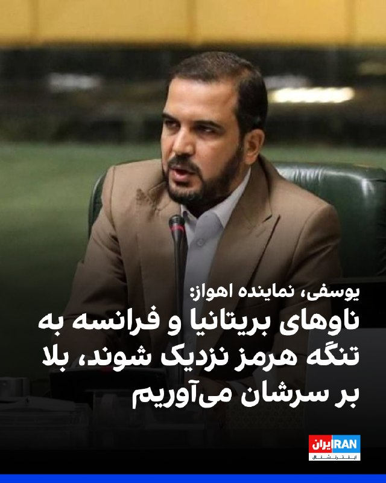

مجتبی یوسفی، نماینده اهواز در مجلس به سایت دیده‌بان ایران گفت: «ناوهای بریتانیا و فرانسه به تنگه هرمز نزدیک شوند، ببینند چه بلایی سرشان می آوریم. ما هم می‌گوییم بیایید نزدیک تنگه هرمز و آن را باز کنید.»

او ادامه داد: «اگر بناست اروپایی‌ها ما را امتحان کنند، بدانند که پایگاه‌های نظامی، کشورهای اروپایی و هر کشور متخاصم هدف مشروع ما است. ما بلوف نمی‌زنیم بلکه عمل می‌کنیم.»
‌🏁 🇬🇧 IranintlTV

🤖 @VahidOOnLine

## VahidOOnLine — post 239755

  

♦️ دونالد ترامپ، رئیس‌جمهوری ایالات متحده روز سه‌شنبه ۲۲ اردیبهشت، با انتشار تصویری ساخته هوش مصنوعی در شبکه اجتماعی تروث‌سوشال، تصویری از مقابله پهپادهای آمریکا با قایق‌های تندرو سپاه در تنگه هرمز را ارائه کرد. این تصویر که به شکلی اغراق‌شده و طنزآمیز ساخته شده، یک پهپاد را در حال منهدم کردن دو قایق با پرچم جمهوری اسلامی نشان می‌دهد.

ترامپ پیش از این با اشاره به سلاح لیزری نیروی دریایی آمریکا که در ناو جورج بوش نصب شده، تصویر ساخته شده با هوش مصنوعی از هدف قرار گرفتن پهپادهای جمهوری اسلامی را نیز منتشر کرده بود. در موردی دیگر نیز ناوگان نیروی دریایی ایران را در کف آب‌های عمیق خلیج فارس و دریای عمان نشان داده بود.

رئیس‌جمهوری آمریکا در موارد مختلف برای کنایه زدن به رقبا یا دشمنان از تصاویر ساخت هوش مصنوعی استفاده می‌کند.
‌🇸🇦 Indypersian

🤖 @VahidOOnLine

## VahidOOnLine — post 239754

  

بلومبرگ گزارش داد امارات متحده عربی از زمان آغاز کارزار آمریکا و اسرائیل علیه جمهوری اسلامی در اسفند ماه، بیش از یک‌بار ایران را هدف حمله قرار داده است.بلومبرگ به نقل از «افراد مطلع» نوشت این حملات هم پیش از برقراری آتش‌بس و هم پس از آن انجام شده است.

براساس این گزارش، در طول جنگ، همکاری میان امارات متحده عربی و اسرائیل شامل تبادل اطلاعات، شناسایی و رهگیری موشک‌ها و پهپادهای ایرانی و همچنین انتخاب اهداف در ایران بوده است.
‌🏁 🇬🇧 IranintlTV

🤖 @VahidOOnLine

## VahidOOnLine — post 239753

  <a href="telegram/content/VahidOOnLine_239753_1778610577.mp4" target="_blank">🎬 Download video</a>

جان هیلی، وزیر دفاع بریتانیا، اعلام کرد لندن جنگنده، پهپاد و یک ناو جنگی را به مأموریت چندملیتی حفاظت از تردد کشتی‌ها در تنگه هرمز اعزام خواهد کرد.

هیلی این خبر را پس از نشست مشترک با وزرای دفاع ۴۰ کشور اعلام کرد؛ نشستی که با هدف جلب حمایت برای مأموریت تحت رهبری بریتانیا جهت تأمین امنیت کشتیرانی در تنگه هرمز برگزار شد.

بریتانیا می‌گوید این مأموریت در واکنش به محاصره تنگه هرمز از سوی جمهوری اسلامی انجام می‌شود.
‌🏁 🇬🇧 ManotoTV

🤖 @VahidOOnLine

## VahidOOnLine — post 239752

  

هاکان فیدان، وزیر خارجه ترکیه، در گفت‌وگو با الجزیره گفت اولویت اصلی آنکارا حفظ آتش‌بس میان واشینگتن و تهران است و تاکید کرد فوری‌ترین نگرانی ترکیه تداوم این آتش‌بس است، زیرا در حال حاضر این موضوع بیشترین اهمیت را دارد.

وزیر خارجه ترکیه افزود هیچ‌کس خواهان بازگشت به جنگ نیست، چرا که اقتصاد جهانی و امنیت انرژی جهان همین حالا نیز به اندازه کافی آسیب دیده است.

هاکان فیدان همچنین گفت ترکیه و دیگر کشورهای منطقه از جمله قطر برای حمایت از پاکستان به‌عنوان میانجی اصلی همکاری می‌کنند و در روند میانجی‌گری، زمانی که کار به بن‌بست می‌رسد، دشوارترین بخش یافتن ایده‌های خلاقانه است؛ گاهی طرفین و حتی خود میانجی نیز قادر به ارائه چنین ایده‌هایی نیستند.
‌🏁 🇬🇧 IranintlTV

🤖 @VahidOOnLine

## VahidOOnLine — post 239751

♦️ژنرال دن کین، رئیس ستاد مشترک نیروهای مسلح آمریکا، روز سه‌شنبه ۲۲ اردیبهشت‌ماه در جلسه استماع بودجه در کنگره گفت ایران قطعا فشار ناشی از محاصره و تحریم‌ها را احساس می‌کند.

او افزود این فشار تنها به محاصره محدود نمی‌شود و ادامه تحریم‌هایی که وزارت خزانه‌داری و دیگر نهادهای آمریکایی اعمال کرده‌اند نیز بخشی از آن است. دن کین همچنین تاکید کرد آمریکا همچنان «مجموعه‌ای از گزینه‌های نظامی» را در اختیار دارد.
‌🇸🇦 Indypersian

🤖 @VahidOOnLine

## VahidOOnLine — post 239750

  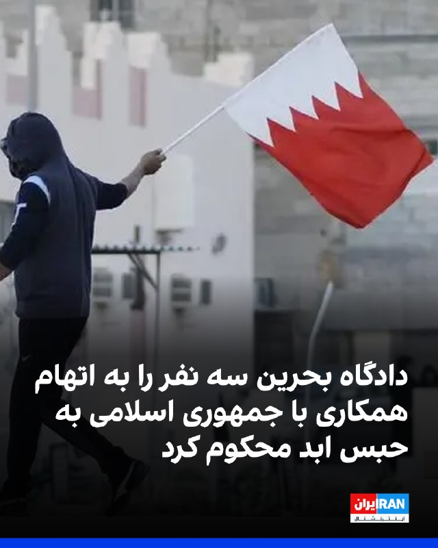

دادگاه کیفری عالی بحرین سه نفر از جمله یک زن را به اتهام «همکاری» با جمهوری اسلامی به حبس ابد محکوم کرد.
دادستان‌ها اعلام کردند این زن در «ارتباط» با سپاه پاسداران بوده و قصد داشته «اقدامات تروریستی خصمانه» در بحرین انجام دهد.
در پرونده‌های جداگانه، ۱۰ نفر دیگر به اتهام «حمایت و تایید حملات تروریستی جمهوری اسلامی علیه بحرین»، انتشار اطلاعات ممنوع و عکسبرداری از اماکن ممنوعه، به احکام حبس تا ۱۰ سال محکوم شدند.

پیش‌تر نیز وزارت کشور بحرین اعلام کرد دستگاه‌های امنیتی این کشور یک تشکیلات مرتبط با سپاه پاسداران و تفکر «ولایت فقیه» را شناسایی کرده‌اند و ۴۱ نفر از اعضای آن را بازداشت کرده‌اند.
‌🏁 🇬🇧 IranintlTV

🤖 @VahidOOnLine

## VahidOOnLine — post 239749

  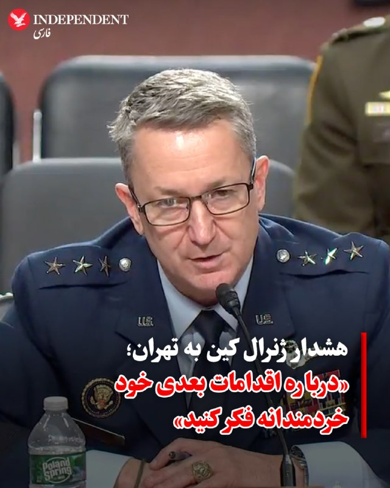

♦️ دیک دوربین، سناتور دموکرات ایالت ایلینوی، روز سه‌شنبه ۲۲ اردیبهشت، در جلسه کمیته تخصیص بودجه سنا از ژنرال دن کین، رئیس ستاد مشترک ارتش آمریکا، پرسید که ایران چگونه همچنان توانایی متوقف کردن تردد کشتی‌ها در تنگه هرمز را دارد؟

ژنرال کین در پاسخ به اعضای این کمیته گفت: «اوضاع در آنجا پیچیده است؛ قایق‌های کوچک متعدد و توانمندی‌های دیگری در منطقه حضور دارند. بخشی از این مشکل به ترددکنندگان تجاری برمی‌گردد، اما ریشه اصلی مسئله به همان مشکل همیشگی، یعنی گروگان گرفته شدن اقتصاد جهانی توسط ایران از طریق این تنگه مربوط می‌شود.»

او در ادامه افزود: «من آن‌ها را تشویق می‌کنم که درباره اقدامات بعدی خود خردمندانه فکر کنند و از این فرصت برای بازگشایی تنگه استفاده نمایند؛ این انتخابی است که آن‌ها باید انجام دهند.»
‌🇸🇦 Indypersian

🤖 @VahidOOnLine

## VahidOOnLine — post 239748

  <a href="telegram/content/VahidOOnLine_239748_1778610581.mp4" target="_blank">🎬 Download video</a>

سازمان جهانی بهداشت هشدار داد شمار موارد ابتلا به هانتاویروس، پس از شیوع این ویروس در یک کشتی گردشگری در اقیانوس اطلس، احتمالاً افزایش پیدا خواهد کرد.
تدروس آدهانوم، مدیرکل سازمان جهانی بهداشت، اعلام کرد تاکنون ۹ مورد ابتلای قطعی و دو مورد مشکوک ثبت شده و انتظار می‌رود افراد بیشتری نیز به ویروس مبتلا شده باشند. با این حال او تأکید کرد خطر شیوع گسترده جهانی همچنان «پایین» ارزیابی می‌شود.
شیوع بیماری در کشتی «ام‌وی هوندیوس» آغاز شد؛ جایی که سه مسافر، شامل یک زوج هلندی و یک زن آلمانی، جان خود را از دست دادند. این کشتی در حال سفر ۳۵ روزه در اقیانوس اطلس بود.
هانتاویروس معمولاً از طریق ادرار، بزاق یا فضولات جوندگان منتقل می‌شود. گونه «آندِس» تنها نوع شناخته‌شده‌ای است که می‌تواند از انسان به انسان منتقل شود.
در پی این بحران، صدها مسافر و خدمه در کشورهای مختلف تحت قرنطینه یا مراقبت پزشکی قرار گرفته‌اند. مقام‌های بهداشتی در اروپا و آمریکا نیز در حال ردیابی تماس‌های مرتبط با مبتلایان هستند.
‌🏁 🇬🇧 ManotoTV

🤖 @VahidOOnLine

## VahidOOnLine — post 239747

  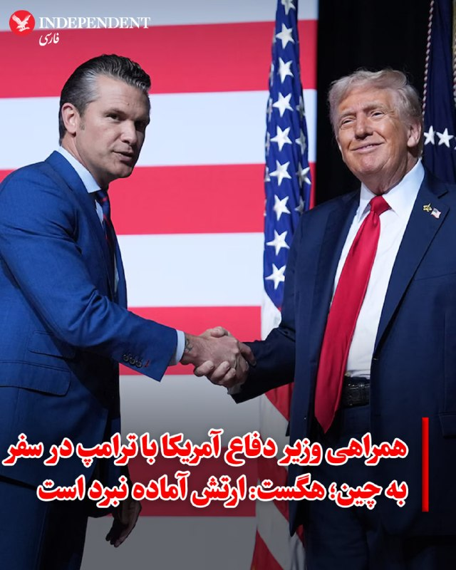

♦️ پیت هگست، وزیر دفاع ایالات متحده، روز سه‌شنبه ۲۲ اردیبهشت، به قانون‌گذاران اعلام کرد که در سفر قریب‌الوقوع دونالد ترامپ به چین، او را همراهی خواهد کرد؛ سفری که در میانه ابهامات شدید پیرامون پایداری آتش‌بس با ایران صورت می‌گیرد.

هگست در پاسخ به پرسشی درباره وضعیت فروش تسلیحات به تایوان گفت: «رئیس‌جمهور در آستانه سفر است و من همراه ایشان خواهم بود؛ تمامی تصمیمات مربوط به این موضوع توسط خود ایشان اتخاذ خواهد شد.» انتظار می‌رود ترامپ بعدازظهر امروز واشنگتن را به مقصد پکن ترک کند.

سفیر ایران در چین روز سه‌شنبه اظهار داشت که پکن می‌تواند «نیروی مهمی برای کاهش تنش‌ها» میان واشنگتن و تهران باشد. با این حال، دونالد ترامپ روز دوشنبه با انتقاد شدید از وضعیت فعلی، آتش‌بس با ایران را «بسیار ضعیف» توصیف کرد و گفت که این توافق «تنها با کمک دستگاه زنده است». هگست نیز تاکید کرد که ارتش آمریکا آماده است تا در صورت صدور فرمان، عملیات نظامی علیه جمهوری اسلامی را بلافاصله از سر بگیرد.
‌🇸🇦 Indypersian

🤖 @VahidOOnLine

## VahidOOnLine — post 239746

  

شاهزاده رضا پهلوی در نشست امنیتی سالانه پولیتیکو گفت: «ما فقط زمانی می‌توانیم مردم را به بازگشت به خیابان‌ها فرا بخوانیم که آن‌ها از سطحی از برابری در توان مقابله برخوردار باشند؛ نه زمانی که رژیم بتواند اوباش و نیروهای سرکوبگرش را برای کشتن مردم در خیابان‌ها اعزام کند.»

او ادامه داد: «اما برای رسیدن به آن نقطه، باید پیام روشنی وجود داشته باشد. باید راهبردی شفاف برای پایان دادن به این رژیم وجود داشته باشد؛ فراخوانی روشن برای قیام مردم، و همچنین پیامی برای نیروهای نظامی و امنیتی از حکومت جدا شوند و به مردم بپیوندند. همه این‌ها باید در قالب یک راهبرد منسجم هماهنگ شود.»
‌🏁 🇬🇧 IranintlTV

🤖 @VahidOOnLine

## VahidOOnLine — post 239745

  <a href="telegram/content/VahidOOnLine_239745_1778610583.mp4" target="_blank">🎬 Download video</a>

♦️پیت هگست، وزیر جنگ آمریکا، روز سه‌شنبه ۲۲ اردیبهشت‌ماه در جلسه استماع کنگره آمریکا گفت ایالات متحده در هر شرایطی برای پیروزی می‌جنگد؛ از جمله برای اطمینان از اینکه ایران هرگز به سلاح هسته‌ای دست پیدا نکند.

او این اظهارات را در ادامه مواضع دولت دونالد ترامپ درباره برنامه هسته‌ای جمهوری اسلامی مطرح کرد.
‌🇸🇦 Indypersian

🤖 @VahidOOnLine

## VahidOOnLine — post 239744

  

♦️ لیندزی گراهام، سناتور جمهوری‌خواه و از حامیان سرسخت سیاست‌های جنگی دولت ترامپ، روز سه‌شنبه ۲۲ اردیبهشت، از رئیس‌جمهوری آمریکا خواست تا در سفر به چین، موضعی قاطع در برابر پکن اتخاذ کند. گراهام طی یک جلسه استماع در سنا تاکید کرد که شی جین‌پینگ در حال حمایت هم‌زمان از روسیه و جمهوری اسلامی است.

این سناتور کارولینای جنوبی با انتقاد از نقش چین در خرید مقادیر کلان نفت از ایران و روسیه، نسبت به عملکرد پاکستان نیز ابراز نارضایتی کرد. او با استناد به گزارش «سی‌بی‌اس نیوز» یادآوری کرد که اسلام‌آباد به هواپیماهای نظامی ایران اجازه داده است در فرودگاه‌های این کشور مستقر شوند.

وزارت امور خارجه پاکستان با رد قاطعانه این ادعا، اعلام کرد که حضور هواپیماهای ایرانی و آمریکایی در خاک این کشور صرفا جهت تسهیل تردد تیم‌های دیپلماتیک و اداری مربوط به «مذاکرات اسلام‌آباد» پس از برقراری آتش‌بس بوده است. مقامات پاکستانی تاکید کردند که این پروازها هیچ ارتباطی با ترتیبات نظامی یا پشتیبانی جنگی ندارند. با این حال، گراهام هشدار داد که واشنگتن باید فشار بر متحدان و شرکای تجاری جمهوری اسلامی را به شدت افزایش دهد.
‌🇸🇦 Indypersian

🤖 @VahidOOnLine

## VahidOOnLine — post 239743

  <a href="telegram/content/VahidOOnLine_239743_1778610585.mp4" target="_blank">🎬 Download video</a>

مقام‌های آمریکایی اعلام کردند نیروهای این کشور مانع عبور یک نفتکش با پرچم جمهوری مالت از تنگه هرمز شده‌اند.
سخنگوی ستاد فرماندهی مرکزی آمریکا سنتکام؛ به الجزیره گفت نفتکش «آگیوس فانوریوس» به‌دلیل نقض محاصره دریایی، اجازه عبور پیدا نکرده است. به گفته او، این کشتی حامل نفت ایران نبوده است.
مقام‌های آمریکایی همچنین اعلام کردند چند نفتکش دیگر نیز به‌دلیل نقض تحریم‌ها و محاصره اعمال‌شده علیه بنادر ایران، متوقف شده‌اند.
‌🏁 🇬🇧 ManotoTV

🤖 @VahidOOnLine

## VahidOOnLine — post 239742

  <a href="telegram/content/VahidOOnLine_239742_1778610586.mp4" target="_blank">🎬 Download video</a>

«اینترنت را قطع کردند تا صدای مردم خاموش شود.»
‌🏁 🇬🇧 ManotoTV

🤖 @VahidOOnLine

## VahidOOnLine — post 239741

  

شاهزاده رضا پهلوی در نشست امنیتی سالانه پولیتیکو گفت سیاست مماشات با رژیم جمهوری اسلامی که راهبرد بسیاری از دولت‌ها بود، شکست خورده است.
او افزود اکنون که با یک «جانور زخمی» روبه‌رو هستیم، این فرصتی است که نباید از دست برود، بلکه باید کار را یک‌بار برای همیشه تمام کرد؛ موضوعی که نه‌تنها میلیون‌ها ایرانی، بلکه بسیاری از کشورهای منطقه نیز انتظار آن را دارند.

شاهزاده رضا پهلوی درباره جنگ علیه جمهوری اسلامی نیز گفت مردم به‌اندازه کافی هوشمند هستند که تفاوت میان حمله به یک ملت و حمله به یک رژیم را تشخیص دهند و آن کارزار، حمله‌ای علیه ملت ایران نبود، بلکه علیه رژیم بود.
‌🏁 🇬🇧 IranintlTV

🤖 @VahidOOnLine

## WithYashar — post 11091

## WithYashar — post 11090

Yashar jan, Chera enghadr faaliat kam shode top Paget? Aghaaaa enghad zahmat mikeshe Like konid

## WithYashar — post 11089

ترامپ به سیم آخر زد و برای با ‌چهار هزارم گفت :

من به وضعیت مالی آمریکایی‌ها فکر نمی‌کنم.کلا به هیچ‌کس فکر نمی‌کنم!

فقط به یک چیز فکر می‌کنم: نمی‌توانیم اجازه دهیم ایران سلاح هسته‌ای داشته باشد. همین
@withyashar

## WithYashar — post 11088

خبرنگار: فکر می‌کنید شی جین‌پینگ باید اصلاً در موضوع ایران دخالت کند؟ یا می‌تواند به نوعی کمک کند؟

ترامپ: فکر نمی‌کنم ما نیازی به هیچ کمکی درباره ایران داشته باشیم. ما این موضوع را یک‌طور یا به‌هرحال حل خواهیم کرد. یا به‌صورت مسالمت‌آمیز پیروز می‌شویم یا به شکل دیگری. تمام ماشین جنگی آن‌ها از بین رفته است
@withyashar

## WithYashar — post 11087

ترامپ: درباره جنگ ایران گفت‌وگوی طولانی با شی خواهم داشت

ایران یا کار درست را انجام خواهد داد یا ما کار را تمام خواهیم کرد
@withyashar

## WithYashar — post 11086

همراه با ترامپ قرار است یک تیم اقتصادی بزرگ از روسای برخی از شرکت‌های بزرگ آمریکا و جهان به چین سفر کنند تا روابط تجاری میان واشنگتن و پکن را تقویت ببخشند،این تجارت‌های کلان اگر موافقت شود برای هردو کشور سودمند‌ است.پیت هگست نیز امروز گفت ترامپ می‌خواهد از…

## WithYashar — post 11085

  

همراه با ترامپ قرار است یک تیم اقتصادی بزرگ از روسای برخی از شرکت‌های بزرگ آمریکا و جهان به چین سفر کنند تا روابط تجاری میان واشنگتن و پکن را تقویت ببخشند،این تجارت‌های کلان اگر موافقت شود برای هردو کشور سودمند‌ است.پیت هگست نیز امروز گفت ترامپ می‌خواهد از نفوذ چین در برخی از نقاط جهان(ایران)
برای اهداف مشترک استفاده کند.
@withyashar

## WithYashar — post 11084

چهار نیرو سپاه تروریستی توسط کویت دستگیر شدند.

سرهنگ امیرحسین عبدمحمد زارعی (سرهنگ نیروی دریایی)
سرهنگ عبدالصمد یدالله کنواتی (سرهنگ نیروی دریایی)
سرگرد احمد جمشید غلامرضا ذوالفقاری (کاپیتان نیروی دریایی)
ستوان محمدحسین سهراب فروغی راد (ستوان یکم نیروی دریایی)
@withyashar

## WithYashar — post 11083

شاهزاده رضا پهلوی در نشست امنیتی سالانه پولیتیکو:
سیاست مماشات با رژیم جمهوری اسلامی که راهبرد بسیاری از دولت‌ها بود، شکست خورده.
با یک جانور زخمی روبه‌رو هستیم، این فرصتیه که نباید از دست بره
بلکه باید کار رو یک‌بار برای همیشه تموم کرد؛ موضوعی که نه‌تنها میلیون‌ها ایرانی، بلکه خیلی از کشورهای منطقه هم انتظارشو دارن
مردم به‌اندازه کافی هوشمند هستن که تفاوت بین حمله به یک ملت و حمله به یک رژیم رو تشخیص بدن و اون کارزار، حمله‌ای علیه ملت ایران نبود، بلکه علیه رژیم بود.
ما فقط زمانی می‌تونیم مردم رو به بازگشت به خیابان‌ها فرا بخونیم که اونا از سطحی از برابری در توان مقابله برخوردار باشن.
نه زمانی که رژیم بتونه اوباش و نیروهای سرکوبگرشو برای کشتن مردم در خیابان‌ها اعزام کنن.
اما برای رسیدن به اون نقطه، باید پیام روشنی وجود داشته باشه. باید راهبردی شفاف برای پایان دادن به این رژیم وجود داشته باشه.
فراخوانی روشن برای قیام مردم، و همچنین پیامی برای نیروهای نظامی و امنیتی از حکومت جدا بشن و به مردم بپیوندن
@withyashar

## WithYashar — post 11082

رئیس جلسه: آقای وزیر، اجازه بدهید به سؤال سناتور کونز پاسخ دهید. سؤال ساده‌ای است: چطور قرار است تنگه را باز کنیم؟ در جلسات محرمانه، افرادی از تیم شما به ما گفته‌اند که راه‌حل نظامی برای بازگشایی تنگه وجود ندارد و در نهایت این یک تصمیم سیاسی از سوی ایران خواهد بود. شما هم ظاهراً همین را می‌گویید؛ اینکه فشار اقتصادی، تهران را مجبور به باز کردن تنگه می‌کند.
پس آیا تأیید می‌کنید که راه‌حل نهایی دیپلماتیک و اقتصادی است، نه نظامی؟»
وزیر جنگ : من می‌گویم قطعاً ابزارهای نظامی برای باز کردن تنگه وجود دارد؛ چه از طریق اهداف زمینی، چه توان دریایی ما و چه محاصرهٔ دریایی.»
رئیس جلسه:
اگر این درست است، چرا تا حالا انجامش نداده‌اید؟»

وزیر جنگ:چون راه‌حل بلندمدت و ترجیحی این است که توافقی حاصل شود که ایران تنگه را باز کند و دست از دزدی دریایی بردارد. این فقط کشتی‌های آمریکا نیستند که متوقف شده‌اند؛ کشتی‌های سراسر جهان درگیرند و این فشار بیشتری بر دیگر کشورها وارد می‌کند
@withyashar

## WithYashar — post 11081

سناتور : من هیچ‌وقت از رئیس‌جمهور نشنیدم که بگوید هدفش تغییر رژیم در ایران است یا می‌خواهد همهٔ مواد شکافت‌پذیر آن‌ها را تصاحب کند. چیزی که من شنیدم این بود که هدف ما فلج کردن توان آن‌ها برای باج‌گیری از جهان است.حالا شاید دوستان دموکرات من بخواهند بگویند ما شکست خورده‌ایم. ولی من نمی‌فهمم چطور شکست خورده‌ایم. آیا تنگه بسته شده؟ بله. اما اگر این محاصره ادامه پیدا کند و هیچ‌چیز وارد یا خارج نشود، در نهایت مجبور می‌شوند چاه‌های نفتشان را تعطیل کنند. نیمی از میادین نفتی‌شان وابسته به فشار طبیعی است؛ اگر خاموش شوند، دوباره راه‌اندازی‌شان بسیار سخت خواهد بود. چیزی را اشتباه متوجه شده‌ام؟»

وزیر جنگ:
نه، به همین دلیل است که رئیس‌جمهور می‌گوید همهٔ کارت‌ها دست ماست. و ما بهترین معامله‌گر دنیا را داریم که می‌تواند بهترین توافق را برای آمریکا رقم بزند. و اگر لازم باشد دوباره وارد عمل نظامی شویم، وزارت جنگ هم آماده است
@withyashar

## WithYashar — post 11080

سناتور کونز:
حالا دربارهٔ ایران امروز صحبت کنیم. آیا موافقید که ایران چه در بخش دولتی و چه خصوصی الان عملاً با تف و چسب نواری سرِ پا نگه داشته شده؟

وزیر جنگ پیت هگست:
اصطلاح “تف و چسب نواری” اصطلاح دکترین نظامی نیست، سناتور، ولی در کل با این توصیف موافقم
@withyashar

## WithYashar — post 11079

سناتور کونز : دستگاه اطلاعاتی ما مدتی پیش کشف کرد که رژیم ایران یک طرح جدید برای برنامهٔ تسلیحات هسته‌ای‌اش یک نقشهٔ بازی تازه طراحی کرده بود.
طرحشان این بود که تولید موشک‌های بالستیک، موشک‌های کروز و پهپادها را به‌شدت افزایش دهند و یک انبار عظیم از موشک و پهپاد بسازند. بعد از آن به آمریکا، اسرائیل و بقیهٔ دنیا بگویند: اگر دوباره مثل ژوئن(جنگ ۱۲ روزه) ما را بمباران کنید، برنامهٔ تسلیحات هسته‌ای را از سر می‌گیریم و خاورمیانه را نابود خواهیم کرد؛ و ضمناً موشک‌های ما حالا می‌توانند به برلین، لندن و پاریس برسند.
آیا برداشت من درست است که یکی از دلایل اصلی حملهٔ ما به ایران همین بود؟»

وزیر جنگ پیت هگست :
«فکر می‌کنم این موضوع را خیلی خوب بیان کردید، سناتور. آن‌ها تلاش می‌کردند با تکیه بر زرادخانهٔ متعارف خود، جهان را برای رسیدن به سلاح هسته‌ای باج‌گیری کنند.
@withyashar

## WithYashar — post 11078

سازمان اطلاعات سپاه اعلام کرد که پنج شبکه قاچاق سلاح مرتبط با اسرائیل را خنثی کرده است.

۲۰ فرد مرتبط با آنچه آن را شبکه‌های سازمان‌یافته «بی‌امنی» مرتبط با «گروه‌های تروریستی و قاچاقچیان سلاح» توصیف کرد، شناسایی و دستگیر شدند؛ این اقدام پس از اقدامات اطلاعاتی و عملیاتی نظارت بر محموله‌های غیرمجاز سلاح انجام شد.
بیش از ۵۰ سلاح گرم، ۷۰ کیلوگرم مواد منفجره، حدود ۲۰۰۰ فشنگ و مهمات اضافی در جریان این عملیات توقیف شدند
@withyashar

## WithYashar — post 11077

هدف جنگ از زبان روبیو: بازگشت به زمان قبل از جنگ

مارکو روبیو گفت: «ترجیح ما این است که تنگه هرمز باز باشد، به همان شکلی که قرار است باز باشد و به همان شکلی برگردد که قبلاً بود.»
@withyashar

## WithYashar — post 11076

بازگرداندن اولین نفتکش غیرایرانی از محاصره آمریکا نفتکش حامل نفت عراق به دلیل اینکه با اجازه ایران از تنگه هرمز عبور کرده بود، توسط نیروی دریایی آمریکا بازگردانده شد. @withyashar

## WithYashar — post 11075

وعده سر خرمن پزشکیان درباره اینترنت :
ارتباطات و اینترنت به بخش جدانشدنی زندگی مردم تبدیل شده
به آقای عارف ماموریت دادم با لحاظ حساسیت‌های حکمرانی، نظر رهبری و وعده‌ای که به مردم داده بودم، در قالب ساختاری چابک موجبات خدمت‌رسانی بهتر دولت و تحقق انتظارات عمومی رو فراهم کنه.
@withyashar

## WithYashar — post 11074

️عراقچی: هر کسی که فکر می‌کند ایران به دونالد ترامپ توافقی می‌دهد که می‌تواند به آن ببالد، در خیال‌پردازی زندگی می‌کند
@withyashar

## WithYashar — post 11073

نتانیاهو : پاکستان از ربات‌هایی استفاده می‌کند که خود را آمریکایی جا می‌زنند تا شبکه‌های اجتماعی را علیه اسرائیل دستکاری کنند
@withyashar

## WithYashar — post 11072

به گزارش ایرنا، ایران و عمان اوایل امروز یک نشست فنی و حقوقی با محوریت تنگه هرمز و عبور ایمن کشتی‌ها در مسقط برگزار کردند.
از سوی طرف ایرانی توسط عباس باقرپور، مدیرکل امور حقوق بین‌الملل وزارت امور خارجه، به همراه نمایندگانی از چندین سازمان دولتی هدایت شد.
@withyashar

## mwarmonitor — post 8990

🔴«گزارش فوری: عربستان سعودی در جریان جنگ، در پاسخ به حملات ایران، علیه ایران حملات هوایی انجام داده است - رویترز» @mwarmonitor

## mwarmonitor — post 8989

🔴«گزارش فوری: عربستان سعودی در جریان جنگ، در پاسخ به حملات ایران، علیه ایران حملات هوایی انجام داده است - رویترز»

@mwarmonitor

## mwarmonitor — post 8988

  

✈️🇺🇸«نیروی هوایی ایالات متحده آمریکا (USAF) ✈️۱ فروند هواپیمای بمب‌افکن استراتژیک Rockwell B-1B Lancer AE6C05 86-0134 - ZENER 01 🔹 بعدازظهر امروز بر فراز جنوب غرب انگلستان از پایگاه RAF Fairford در حال عملیات بوده است. دو هواپیمای سوخت‌رسان KC-135 با شناسه‌های…

## mwarmonitor — post 8987

🇮🇱مقام‌های امنیتی اسرائیل به همتایان آمریکایی خود گفته‌اند که «در آستانه ازسرگیری درگیری‌ها در غزه هستند»، در حالی که تنش‌ها بر سر امتناع حماس از خلع سلاح یا واگذاری کنترل افزایش یافته است — به گزارش کان نیوز.

این گزارش می‌گوید گروه حماس با تهدید مسلحانه پیمانکاران محلی در غزه، آن‌ها را از مشارکت در کارهای ساختمانی یک شهر فلسطینی برنامه‌ریزی‌شده در رفح که با تأمین مالی امارات متحده عربی انجام می‌شود، منع کرده است. این پروژه با هماهنگی اسرائیل و یک ساختار فرماندهی تحت رهبری آمریکا در حال پیگیری بوده است.

@mwarmonitor

## mwarmonitor — post 8986

🇬🇧بریتانیا روز سه‌شنبه متعهد شد در صورت برقراری یک آتش‌بس پایدار در خاورمیانه، برای حفاظت از تنگه هرمز شناورهای خودران در اختیار قرار دهد.

🇬🇧بریتانیا پیشنهاد داده است شناورهای سطحی بدون سرنشین (USV) را به یک مأموریت چندملیتی به رهبری بریتانیا و فرانسه ارائه کند تا در صورت برقراری آتش‌بس پایدار، امنیت کشتیرانی بین‌المللی را تضمین کند.

🇬🇧این پیشنهاد علاوه بر سامانه‌های خودکار مین‌روبی نیروی دریایی سلطنتی بریتانیا و همچنین استقرار پیش‌دستانه ناوشکن پدافند هوایی کلاس Daring یعنی HMS Dragon است.

🇬🇧این مأموریت‌ها با هدف افزایش اطمینان برای کشتیرانی بین‌المللی در منطقه و به‌ویژه در Strait of Hormuz انجام می‌شود.

@mwarmonitor

## mwarmonitor — post 8985

🇮🇷ایران اعلام کرد تا زمانی که این شروط برآورده نشود، با ایالات متحده درباره مسئله هسته‌ای گفت‌وگو نخواهد کرد — الجزیره 📌پایان جنگ در «همه جبهه‌ها» 📌لغو کامل تمامی تحریم‌ها 📌آزادسازی دارایی‌های مسدودشده ایران 📌پرداخت غرامت‌های جنگی 📌به‌رسمیت شناختن حق…

## mwarmonitor — post 8983

🇮🇷ایران اعلام کرد تا زمانی که این شروط برآورده نشود، با ایالات متحده درباره مسئله هسته‌ای گفت‌وگو نخواهد کرد — الجزیره

📌پایان جنگ در «همه جبهه‌ها»

📌لغو کامل تمامی تحریم‌ها

📌آزادسازی دارایی‌های مسدودشده ایران

📌پرداخت غرامت‌های جنگی

📌به‌رسمیت شناختن حق حاکمیت ایران بر تنگه هرمز

@mwarmonitor

## mwarmonitor — post 8982

🇦🇹اتریش امروز دو فروند جنگنده Eurofighter Typhoon را برای شناسایی و رهگیری دو فروند هواپیمای PC-12 نیروی هوایی ایالات متحده که بدون مجوز وارد حریم هوایی این کشور شده بودند، به پرواز درآورد.
✈️گزارش‌ها حاکی است که هواپیماهای United States Air Force پس از رهگیری، تغییر مسیر داده و در مونیخ فرود آمدند.

@mwarmonitor

## mwarmonitor — post 8981

🔴«گروهی از مردان که به اتهام تلاش برای ورود به کشور از طریق دریا بازداشت شده بودند، در جریان بازجویی اعتراف کردند که عضو سپاه پاسداران انقلاب اسلامی ایران هستند، به گفته وزارت کشور کویت.» @mwarmonitor

## mwarmonitor — post 8979

  <a href="telegram/content/mwarmonitor_8979_1778610591.mp4" target="_blank">🎬 Download video</a>

✈️۱۵ فروند هواپیمای کوچک آمریکایی 🇺🇸 (احتمالاً F-16) که دیروز وارد شده‌اند در عربستان سعودی 🇸🇦، در اپرون (محوطه پارکینگ) آمریکایی پایگاه Prince Sultan Air Base (PSAB) در مختصات زیر مشاهده شدند:
24.0637, 47.5684

📌این موضوع تأیید می‌کند که محدودیت‌های عملیاتی عربستان علیه پروژه آمریکایی Project Freedom برداشته شده است.

✈️گفته می‌شود ۵۳ فروند جنگنده F-16 در پایگاه PSAB مستقر هستند.

@mwarmonitor

## mwarmonitor — post 8978

🔸سناتور گراهام: ژنرال کِین، آیا شما از گزارش‌هایی مبنی بر اینکه پاکستان اجازه می‌دهد از پایگاه‌هایش برای استقرار هواپیماهای ایرانی استفاده شود، اطلاعی دارید؟
🔹ژنرال کِین: قربان، من یک گزارش در این باره دیده‌ام.
🔸سناتور گراهام: خب، آیا این گزارش دقیق است؟
🔹ژنرال کِین: قربان، فکر می‌کنم با توجه به مسائل طبقه‌بندی شده مختلفی که دیده‌ام...
🔸سناتور گراهام (میان کلام او): اجازه دهید فقط این را بگویم؛ اگر این گزارش دقیق باشد، با نقش پاکستان به عنوان یک میانجی صلح در تضاد است، قبول دارید؟
🔹ژنرال کِین: قربان، من تمایلی ندارم بر اساس مذاکرات جاری و نقش پاکستان در این زمینه اظهار نظر کنم.
🔸سناتور گراهام: ممنون. آقای وزیر هِگسِت، اگر یک میانجی اجازه دهد هواپیماهای شناسایی ایران در پایگاه‌های هوایی پاکستان مستقر شوند، به نظر شما این با میانجی‌گری منصفانه همخوانی دارد؟
🔹وزیر هِگسِت: مجدداً عرض می‌کنم، من نمی‌خواهم در میانه این مذاکرات وارد شوم. من خواهان حداکثر اثربخشی برای...
🔸سناتور گراهام (با تندی): اما من می‌خواهم! من می‌خواهم وسط این مذاکرات باشم. من به اندازه یک پرتاب دست هم به پاکستان اعتماد ندارم. اگر آن‌ها واقعاً هواپیماهای ایرانی را برای محافظت از دارایی‌های نظامی ایران در پایگاه‌های خود مستقر کرده‌اند، به من می‌گوید که شاید باید به دنبال شخص دیگری برای میانجی‌گری باشیم. تعجبی ندارد که این مذاکرات لعنتی به هیچ‌جا نمی‌رسد.

@mwarmonitor

## mwarmonitor — post 8977

  <a href="telegram/content/mwarmonitor_8977_1778610593.mp4" target="_blank">🎬 Download video</a>

🔴سناتور لیندسی گراهام ؛ اگر این گزارش‌ها درست باشد، مستلزم بازنگری کامل در نقشی است که پاکستان به‌عنوان میانجی میان ایران، ایالات متحده و سایر طرف‌ها ایفا می‌کند. ‼️با توجه به برخی اظهارات پیشین مقام‌های دفاعی پاکستان علیه اسرائیل، اگر این موضوع صحت داشته…

## mwarmonitor — post 8976

  

🔴پنتاگون اعلام کرد یک زیردریایی هسته‌ایِ نیروی دریایی آمریکا در جبل‌الطارق مستقر شده است؛ اقدامی که به‌ندرت درباره محل حضور یکی از محرمانه‌ترین تسلیحات آمریکا به‌صورت علنی اعلام می‌شود. این خبر یک روز پس از آن منتشر شد که رئیس‌جمهور ترامپ به‌طور قاطع آخرین…

## mwarmonitor — post 8975

  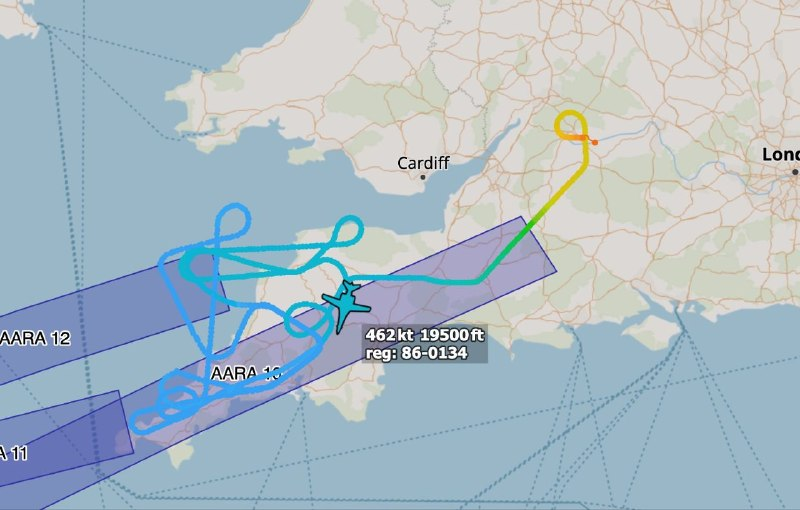

✈️🇺🇸«نیروی هوایی ایالات متحده آمریکا (USAF)

✈️۱ فروند هواپیمای بمب‌افکن استراتژیک Rockwell B-1B Lancer
AE6C05 86-0134 - ZENER 01

🔹 بعدازظهر امروز بر فراز جنوب غرب انگلستان از پایگاه RAF Fairford در حال عملیات بوده است. دو هواپیمای سوخت‌رسان KC-135 با شناسه‌های GOLD 65/66 از پایگاه هوایی رامشتاین بدون سیگنال Mode-S برای دیدار با ZENER 01 پرواز کرده‌اند.

@mwarmonitor

## mwarmonitor — post 8973

🔴«ترامپ که از بن‌بست در مذاکرات ناراضی است، اکنون با جدیت بیشتری به ازسرگیری عملیات نظامی در ایران فکر می‌کند، هرچند به گفته منابع، تصمیم مهمی پیش از سفر او به چین بعید است گرفته شود.» CNN

@mwarmonitor

## mwarmonitor — post 8972

🇮🇷«ایران به‌طور قابل توجهی تعریف خود از تنگه هرمز را گسترش داده و اکنون منطقه‌ای بسیار بزرگ‌تر از قبل از جنگ را ادعا می‌کند. یک مقام نیروی دریایی سپاه پاسداران هشدار داده است که ایران «اجازه هیچ‌گونه تعرض به آب‌ها و منافع خود را نخواهد داد» - وال‌استریت ژورنال»

@mwarmonitor

## mwarmonitor — post 8971

🚢غول حمل‌ونقل دریایی مِرسک (Maersk)، دومین شرکت بزرگ کانتینری جهان، اعلام کرده است که همچنان از عبور از تنگه هرمز خودداری می‌کند.

@mwarmonitor

## mwarmonitor — post 8970

  

🇺🇸ناو هواپیمابر USS Abraham Lincoln (CVN 72) به عملیات خود در دریای عرب ادامه می‌دهد، از جمله اجرای محاصره آمریکا علیه ایران. به گفته سنتکام، نیروهای آمریکایی ۶۵ کشتی تجاری را تغییر مسیر داده و ۴ کشتی را از کار انداخته‌اند.

@mwarmonitor

## mwarmonitor — post 8969

✈️🇺🇸«یونایتد ایرلاینز اعلام کرد که پروازهای خود به ونزوئلا را از ۱۱ آگوست از سر خواهد گرفت.»

@mwarmonitor

## mwarmonitor — post 8968

🇺🇸نیروی دریایی آمریکا روز دوشنبه اعلام کرد که ناو جنگی جدیدی که به نام رئیس‌جمهور ترامپ نام‌گذاری شده، هسته‌ای خواهد بود؛ اقدامی که انتظار می‌رود هزینه و پیچیدگی این پروژه چند میلیارد دلاری را افزایش دهد، پروژه‌ای که پیش‌تر نیز درباره عملی شدن ساخت آن تردیدهایی وجود داشت. WSJ

@mwarmonitor

## FoxNewsTwitter — post 341611

  <a href="telegram/content/FoxNewsTwitter_341611_1778610597.mp4" target="_blank">🎬 Download video</a>

Fox News (Twitter/X)

JUST IN: President Trump responds to Dr. Marty Makary resigning from his post as FDA Commissioner:

"Everybody wants that job. It's a very important job... He was having some difficulties, he's a great doctor and he was having some difficulties. But he's going to go on and he's going to do well."

## FoxNewsTwitter — post 341610

  <a href="telegram/content/FoxNewsTwitter_341610_1778610600.mp4" target="_blank">🎬 Download video</a>

Fox News (Twitter/X)

NOW: President Trump says he hopes White House and D.C. renovations will be completed in time for Chinese President Xi's visit to the U.S.:

"President XI will be coming here towards the end of the year. So that will be exciting. I only wish we had the ballroom finished."

"You also may want to do one other thing. You may want to go see the reflecting pool, because that's under construction. And for the first time since 1922, it's gonna work properly."

## FoxNewsTwitter — post 341609

  <a href="telegram/content/FoxNewsTwitter_341609_1778610602.mp4" target="_blank">🎬 Download video</a>

Fox News (Twitter/X)

BREAKING: President Trump dismisses questions about him asking Chinese President Xi for help with the Iran war:

"I don't think we need any help with Iran. They'll do the right thing or we'll finish the job."

## FoxNewsTwitter — post 341608

  <a href="telegram/content/FoxNewsTwitter_341608_1778610605.mp4" target="_blank">🎬 Download video</a>

Fox News (Twitter/X)

RT @i: BREAKING: "As soon as this war is over, which will not be long, you're going to see oil prices drop and you're going to see a stock market which is already at the highest point in history, go through the roof.

"With all of this, inflation is much lower than it was under Biden. Biden had the highest inflation in the history of our country... Our inflation is just short term." - President Trump

## FoxNewsTwitter — post 341607

Fox News (Twitter/X)

RT @i: WATCH LIVE: FBI Director Patel faces senators on Capitol Hill https://twitter.com/i/broadcasts/1yxBeMayeVyJN

## FoxNewsTwitter — post 341606

  <a href="telegram/content/FoxNewsTwitter_341606_1778610607.mp4" target="_blank">🎬 Download video</a>

Fox News (Twitter/X)

RT @i: JUST IN: President Trump refuses to say when he'll end negotiations with the Iranian regime as peace talks between the U.S. and the Islamic Republic continue to play out:

"We're only making a good deal. Their military's gone. It's wiped out, and we're only going to make a good deal and we'll see what happens. But, I believe that one way or the other, it's going to be very good for the American people. And I think actually very good for the Iranian people."

## FoxNewsTwitter — post 341605

  <a href="telegram/content/FoxNewsTwitter_341605_1778610610.mp4" target="_blank">🎬 Download video</a>

Fox News (Twitter/X)

RT @i: NOW: "We had a choice. Let these lunatics have a nuclear weapon. If you want to do that, then you're a stupid person. And you happen to be! I mean, I know you very well."

"Anybody that wants them to have a nuclear weapon is a stupid person." –President Trump

## FoxNewsTwitter — post 341604

  <a href="telegram/content/FoxNewsTwitter_341604_1778610612.mp4" target="_blank">🎬 Download video</a>

Fox News (Twitter/X)

RT @i: BREAKING: President Trump says Chinese President Xi has been "relatively good" with the Iran war, as Trump departs the White House for his trip to China to meet with Xi.

"We're going to have a long talk about it. I think he's been relatively good, to be honest with you. You look at the blockade, no problem. They get a lot of their oil from that area. We've had no problem, and he's been a friend of mine."

## FoxNewsTwitter — post 341603

  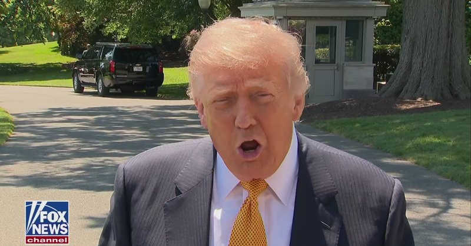

Fox News (Twitter/X)

WATCH LIVE: President Trump departs White House for China https://twitter.com/i/broadcasts/1RKZzjZOjPMKB

## FoxNewsTwitter — post 341602

  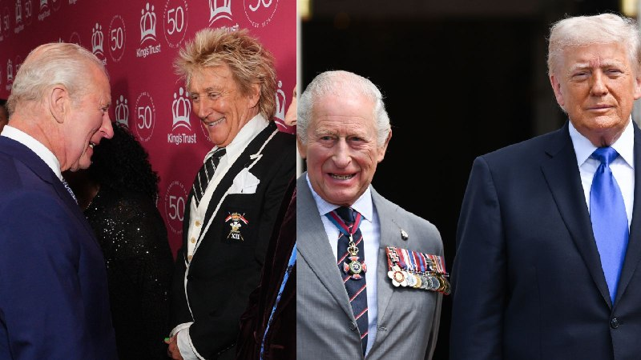

Fox News (Twitter/X)

“You put that little rat bag in his place.”

Rod Stewart delivering a blunt line to King Charles, praising the monarch after his recent meeting with President Trump at a King’s Trust event in London.

## FoxNewsTwitter — post 341601

  <a href="telegram/content/FoxNewsTwitter_341601_1778610616.mp4" target="_blank">🎬 Download video</a>

Fox News (Twitter/X)

NEW: Secretary of War Hegseth clashes with Sen. Chris Coons over claims of a looming "strategic loss" in the Middle East as America’s fragile ceasefire with Iran continues to hold.

COONS: "My concern, Mr. Secretary, is that you've achieved a series of tactical successes, but are on the verge of a strategic loss..."

HEGSETH: "I just think it's so foolish. Here we are in a committee in the United States Senate, 74 days in, and you're talking about ‘strategic loss’?"

"We have the ability to defeat a 47-year threat of a pursuit of a nuclear weapon. We have more leverage than we've ever had. We've had incredible battlefield successes. And you're talking about a ‘strategic loss’?”

## FoxNewsTwitter — post 341600

  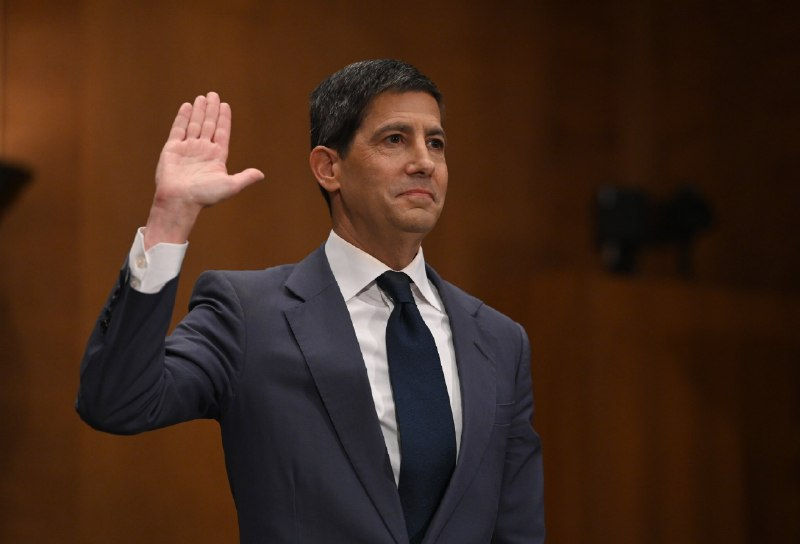

Fox News (Twitter/X)

NEW: Kevin Warsh clears the Senate to take a seat back on the Federal Reserve's Board of Governors — and now the spotlight shifts to the Fed’s top job.

Trump’s pick was confirmed 51–45, pushing past early doubts about whether he had the votes.

The Senate is expected to fully confirm Warsh on Wednesday, ending months of high-stakes drama over his Fed nomination to replace Chair Jerome Powell, whose term is set to end May 15.

## FoxNewsTwitter — post 341599

  <a href="telegram/content/FoxNewsTwitter_341599_1778610618.mp4" target="_blank">🎬 Download video</a>

Fox News (Twitter/X)

JUST IN: Officials reveal details of the harrowing timeline of a fatal security breach at Denver International Airport after a trespasser scaled a barbed-wire fence and was struck by a plane.

"The time between climbing over the fence and being struck by the plane, again, was approximately two minutes. The location of the incident is about two miles away from the terminal. Given the short time period, we were not able to intervene and prevent this person from reaching the runway."

## FoxNewsTwitter — post 341598

  <a href="telegram/content/FoxNewsTwitter_341598_1778610621.mp4" target="_blank">🎬 Download video</a>

Fox News (Twitter/X)

NEW: "If you want to go fast, go alone. But if you want to go far, go together."

Artemis II pilot Victor Glover reflects on the crew's historic mission from inside the U.S. Capitol, shifting the focus away from distance records and onto the team that made it possible.

Glover makes one thing clear: this wasn’t about four names on a crew list, it was a shared journey, powered by everyone watching, supporting, and pushing the mission forward.

## FoxNewsTwitter — post 341597

Fox News (Twitter/X)

JUST IN: WHO reports 2 new cases of hantavirus amid growing concern about the disease:

"As of 12 May, 12h00 CEST, a total of 11 cases, including 3 deaths, have been reported. Nine of the 11 cases are confirmed, and the other 2 are probable. All are among passengers or crew on the ship."

"We expect more cases given the dynamics of spread on a ship and the virus’ incubation period. At the moment, there is no sign that we are seeing the start of a larger outbreak."

## FoxNewsTwitter — post 341596

  <a href="telegram/content/FoxNewsTwitter_341596_1778610623.mp4" target="_blank">🎬 Download video</a>

Fox News (Twitter/X)

NEW: War Secretary Pete Hegseth unveils a massive $1.5 trillion budget aimed at restoring American commercial dominance and overhauling a "broken" military system.

“This budget also includes a historic troop pay increase 7% that builds on the pay increases that Congress has given in previous years, and the budget eliminates all poor or failing barracks.”

“Quality of life for our troops is front and center in this budget. By supercharging our industrial capacity and transforming how the department does business, we are restoring American commercial dominance at a pace unseen in generations, transforming the defense industrial base from the broken, slow-moving systems of the past.”

## FoxNewsTwitter — post 341595

  <a href="telegram/content/FoxNewsTwitter_341595_1778610626.mp4" target="_blank">🎬 Download video</a>

Fox News (Twitter/X)

BREAKING: Sen. Lindsey Graham unloads on Pakistan after reports claim the Middle East mediator allowed Iran to use their bases to park military aircraft.

"I don't trust Pakistan as far as I can throw them. If they actually do have Iranian aircraft parked in Pakistan bases to protect Iranian military assets, that tells me we should be looking maybe for somebody else to mediate. No wonder this damn thing is going nowhere."

## FoxNewsTwitter — post 341594

  <a href="telegram/content/FoxNewsTwitter_341594_1778610629.mp4" target="_blank">🎬 Download video</a>

Fox News (Twitter/X)

NEW: Senate Minority Leader Chuck Schumer lashes out at the White House, claiming the administration's policy decisions have left the nation vulnerable to the recent hantavirus outbreak.

"The Trump administration's gutting of America's public health preparedness has made the recent hantavirus outbreak even more alarming."

## FoxNewsTwitter — post 341593

  <a href="telegram/content/FoxNewsTwitter_341593_1778610630.mp4" target="_blank">🎬 Download video</a>

Fox News (Twitter/X)

RT @AmericaNewsroom: HANTAVIRUS OUTBREAK: @DrMarcSiegel breaks down the likelihood of human-to-human transmission in American communities as cruise passengers undergo medical observation.

“This ship was like a petri dish where everybody came together... it only occurred because of very, very close quarters and conditions.”

## FoxNewsTwitter — post 341592

‌Fox News (Twitter/X)

Read more:

## pm_afshaa — post 90644

🔴زمین لرزه 3.4 ریشتری در پردیس تهران

💧 Rainbet.com the #1 Non-KYC Crypto Casino & Sportsbook @rainbetcom

😁 @Pm_Afshaa

## pm_afshaa — post 90643

  <a href="telegram/content/pm_afshaa_90643_1778610633.webm" target="_blank">🎬 Download video</a>

🔴ترامپ: من به هیچی و هیچکس فکر نمی‌کنم، فقط به یه چیز فکر میکنم، اینکه اجازه ندیم ایران سلاح هسته‌ای داشته باشه.

💧 Rainbet.com the #1 Non-KYC Crypto Casino & Sportsbook @rainbetcom

😁 @Pm_Afshaa

## pm_afshaa — post 90642

  <a href="telegram/content/pm_afshaa_90642_1778610634.webm" target="_blank">🎬 Download video</a>

🔴رویترز: عربستان در اواخر ماه مارس یک سری حملات تلافی جویانه غیرعلنی علیه ایران در طول جنگ انجام داد.

💧 Rainbet.com the #1 Non-KYC Crypto Casino & Sportsbook @rainbetcom

😁 @Pm_Afshaa

## pm_afshaa — post 90641

🔴ترامپ:ما ایران را کاملا تحت کنترل داریم خلاصه یا یک توافق می‌کنیم، یا هم نابودشون میکنیم

💧 Rainbet.com the #1 Non-KYC Crypto Casino & Sportsbook @rainbetcom

😁 @Pm_Afshaa

## pm_afshaa — post 90640

🎙️خبرنگار: در چه مرحله‌ای مذاکره با ایران رو کنار میذارید؟

ترامپ: خواهیم دید چه می‌شود.

💧 Rainbet.com the #1 Non-KYC Crypto Casino & Sportsbook @rainbetcom

😁 @Pm_Afshaa

## pm_afshaa — post 90639

  <a href="telegram/content/pm_afshaa_90639_1778610634.webm" target="_blank">🎬 Download video</a>

🔴ترامپ: ایران نمیتونه سلاح هسته‌ای داشته باشه؛ آنها با این موضوع موافق بودن، اما چیزی که برای من فرستادن، آن نبود. ما بازی نمی‌کنیم.

💧 Rainbet.com the #1 Non-KYC Crypto Casino & Sportsbook @rainbetcom

😁 @Pm_Afshaa

## pm_afshaa — post 90638

🔴سناتور لیندسی گراهام: من به هیچ وجه به پاکستان اعتماد ندارم؛ اونا هیچ صلاحیتی برای میانجیگری ندارن. اونا اصلاً منصف نیستن

💧 Rainbet.com the #1 Non-KYC Crypto Casino & Sportsbook @rainbetcom

😁 @Pm_Afshaa

## pm_afshaa — post 90637

  <a href="telegram/content/pm_afshaa_90637_1778610635.webm" target="_blank">🎬 Download video</a>

🔴کانال 12 اسرائیل:
انتظار میره که ترامپ بعد از بازگشتش از چین در پایان هفته، تصمیمات نهایی و جدیش رو درباره ایران بگیره.

💧 Rainbet.com the #1 Non-KYC Crypto Casino & Sportsbook @rainbetcom

😁 @Pm_Afshaa

## pm_afshaa — post 90636

  <a href="telegram/content/pm_afshaa_90636_1778610636.webm" target="_blank">🎬 Download video</a>

🔴لیست کامل مدیران شرکت‌های بزرگ آمریکایی که ترامپ رو در سفر به چین همراهی خواهند کرد :

💧 Rainbet.com the #1 Non-KYC Crypto Casino & Sportsbook @rainbetcom

😁 @Pm_Afshaa

## pm_afshaa — post 90635

  <a href="telegram/content/pm_afshaa_90635_1778610636.webm" target="_blank">🎬 Download video</a>

🔴تصاویر ماهواره‌ای از حضور بی‌سابقه بیش از 53 جنگنده آمریکایی در پایگاه هوایی سلطان عربستان خبر میده.

💧 Rainbet.com the #1 Non-KYC Crypto Casino & Sportsbook @rainbetcom

😁 @Pm_Afshaa

## pm_afshaa — post 90634

  <a href="telegram/content/pm_afshaa_90634_1778610637.webm" target="_blank">🎬 Download video</a>

🔴تسنیم: به دیوان داوری لاهه علیه آمریکا شکایت کردیم؛ تجاوز نظامی به تاسیسات هسته‌ای، اعمال تحریم‌های اقتصادی و تهدید به توسل به زور از موضوعات این شکایته.

💧 Rainbet.com the #1 Non-KYC Crypto Casino & Sportsbook @rainbetcom

😁 @Pm_Afshaa

## pm_afshaa — post 90633

  <a href="telegram/content/pm_afshaa_90633_1778610638.webm" target="_blank">🎬 Download video</a>

🔴یک مقام ارشد پنتاگون: جنگ ایران تاکنون 29 میلیارد دلار برای آمریکا هزینه داشته.

💧 Rainbet.com the #1 Non-KYC Crypto Casino & Sportsbook @rainbetcom

😁 @Pm_Afshaa

## pm_afshaa — post 90632

شهبازی مجری کونیه صداوسیما:
اگه خیلی به اینترنت علاقه دارید برید سوریه و افغانستان و عراق زندگی کنید

💧 Rainbet.com the #1 Non-KYC Crypto Casino & Sportsbook @rainbetcom

😁 @Pm_Afshaa

## pm_afshaa — post 90631

  <a href="telegram/content/pm_afshaa_90631_1778610638.webm" target="_blank">🎬 Download video</a>

🔴نفتکش حامل نفت عراق به دلیل اینکه چند روز پیش با اجازه ایران از تنگه هرمز عبور کرده بود، امروز توسط نیروی دریایی آمریکا بازگردانده شد.

💧 Rainbet.com the #1 Non-KYC Crypto Casino & Sportsbook @rainbetcom

😁 @Pm_Afshaa

## pm_afshaa — post 90630

سخنگوی دولت: تا سایه‌ جنگ دور نشه اینترنت وصل نمیشه، وقتی دور شد به تدریج وصل میشه

💧 Rainbet.com the #1 Non-KYC Crypto Casino & Sportsbook @rainbetcom

😁 @Pm_Afshaa

## pm_afshaa — post 90629

  <a href="telegram/content/pm_afshaa_90629_1778610639.webm" target="_blank">🎬 Download video</a>

🔴دونالد ترامپ: چین قوی است، اما ما قوی‌تر از چین هستیم. ما از نظر نظامی قوی تر از هر کشور دیگری هستیم.

این رو در مورد ونزوئلا دیدید. این برای اکثر کشورهای دیگر کار سختی بود. ما این کار رو در یک روز انجام دادیم.
نگاهی به ایران بندازید، آنها چیز های بزرگی داشتن و همه چیز از بین رفته.

💧Rainbet.com the #1 Non-KYC Crypto Casino & Sportsbook @rainbetcom

😁 @Pm_Afshaa

## pm_afshaa — post 90628

  <a href="telegram/content/pm_afshaa_90628_1778610640.webm" target="_blank">🎬 Download video</a>

🔴ترامپ: من رابطه خیلی خوبی با بی‌بی نتانیاهو دارم. ما واقعاً مثل دو شریک واقعی کنار هم بودیم؛ اگه ما دوتا نبودیم، اسرائیلی هم وجود نداشت؛ مخصوصاً بدون من قطعاً چنین چیزی ممکن نبود.

💧 Rainbet.com the #1 Non-KYC Crypto Casino & Sportsbook @rainbetcom

😁 @Pm_Afshaa

## pm_afshaa — post 90627

  <a href="telegram/content/pm_afshaa_90627_1778610641.webm" target="_blank">🎬 Download video</a>

🔴ترامپ: آمریکا در تماس مستقیم با مقامات ایرانی است و عجله‌ای برای رسیدن به توافق نداریم!

💧 Rainbet.com the #1 Non-KYC Crypto Casino & Sportsbook @rainbetcom

😁 @Pm_Afshaa

## pm_afshaa — post 90626

  <a href="telegram/content/pm_afshaa_90626_1778610641.mp4" target="_blank">🎬 Download video</a>

🔴دونالد ترامپ: ما لازم نیست عجله کنیم، ما یک محاصره داریم که بهشون اجازه نمیده پولی داشته باشن.

این یه چیز بسیار سادست؛ ما نمیتونیم بهشون اجازه بدیم سلاح هسته‌ای داشته باشن چون صدرصد ازش استفاده میکنن.

ایرانی‌ها به من گفتن غبار هسته‌ای مال تو میشه، اما بعد نظرشون عوض شد.

ما 100 درصد گرد و غبار هسته‌ای و همه چیز رو به دست خواهیم آورد.

💧 Rainbet.com the #1 Non-KYC Crypto Casino & Sportsbook @rainbetcom

😁 @Pm_Afshaa

## pm_afshaa — post 90625

  <a href="telegram/content/pm_afshaa_90625_1778610643.webm" target="_blank">🎬 Download video</a>

🔴هگست، وزیر جنگ آمریکا:
ما مهمات و قابلیت‌های کافی برای تضمین دستیابی به آنچه میخوایم در ایران به دست بیاریم، داریم. وزارت جنگ در آمادگی کامله و در صورت لزوم آماده اقدام علیه ایرانه.

💧 Rainbet.com the #1 Non-KYC Crypto Casino & Sportsbook @rainbetcom

😁 @Pm_Afshaa

## iaghapour — post 2603

✍ آدم راننده شوتی باشه به مراتب اضطرابش كمتر از کسیه كه شغلش تو ايران به اينترنت وابسته هستش...

🆔 @iaghapour

## iaghapour — post 2602

🚀 آپدیت بزرگ و انقلابی پنل 3x-ui (نسخه‌های 3.0.0 و 3.0.1)

بالاخره یکی از مهم‌ترین آپدیت‌های پنل محبوب 3x-ui منتشر شد! در این نسخه‌ها شاهد بازنویسی کامل رابط کاربری، اضافه شدن قابلیت‌های مدیریتی کلان و بهبودهای چشمگیر امنیتی هستیم.

🌐 ۱. بازنویسی کامل و سریع‌تر شدن پنل (مهاجرت به Vue 3) رابط کاربری از پایه بازنویسی شده است! این یعنی سرعت لود بسیار بالاتر، طراحی مدرن‌تر، صفحه لاگین جدید و بهبود چشمگیر تم دارک.

⚡️ ۲. آمار زنده و در لحظه: با جایگزینی سیستم قدیمی با WebSocket، از این پس تمام آمارهای داشبورد، مصرف حجم کلاینت‌ها و وضعیت سرور به صورت «زنده» آپدیت می‌شوند و دیگر نیازی به رفرش کردن صفحه نیست!

🌍 ۳. مدیریت چند سروره (Multi-Node Deployment) - 🌟 ویژگی طلایی یکی از مورد انتظارترین قابلیت‌ها اضافه شد! حالا می‌توانید از طریق یک پنل مرکزی (Manager)، کانفیگ‌ها و اینباندها را روی چندین سرور دیگر (Remote Nodes) مستقر و مدیریت کنید.

📱 ۴. رابط کاربری کاملاً سازگار با موبایل: داشبورد، لیست کلاینت‌ها و بخش لاگ‌ها حالا به صورت "کارتی" و کاملاً بهینه برای نمایشگرهای موبایل طراحی شده‌اند تا مدیریت پنل با گوشی بسیار راحت‌تر شود.

⚙️ ۵. خداحافظی با کدهای JSON و تنظیمات آسان‌تر فرم‌های ساخت کانفیگ (Inbounds) کاملاً ساختاریافته و گرافیکی شده‌اند. دیگر برای تنظیمات پایه نیازی به دستکاری JSON خام نیست (البته تب Advanced برای حرفه‌ای‌ها همچنان وجود دارد). همچنین مدیریت DNSها بسیار پیشرفته‌تر شده است.

👥 ۶. مدیریت گروهی کلاینت‌ها (Bulk Actions) امکان انتخاب گروهی کلاینت‌ها برای حذف یا اعمال تغییرات اضافه شده که کار ادمین‌ها را بسیار راحت می‌کند.

🛠 ۷. امکانات جدید Xray و Outboundها اضافه شدن پروتکل Loopback، دکمه Test All برای تست همزمان همه Outboundها و ارائه گزارش دقیق از تایم‌اوت‌ها، و همچنین خاموش شدن امن هسته Xray.

🔒 ۸. ارتقاء امنیت و نصب راحت‌تر ➖ اضافه شدن سیستم امنیتی CSRF Protection برای جلوگیری از حملات. ➖ اضافه شدن گزینه skip-SSL در اسکریپت نصب (بسیار کاربردی برای کسانی که از ریورس‌پروکسی یا تانل استفاده می‌کنند و نیازی به سرتیفیکیت روی خود سرور ندارند). ➖ اضافه شدن صفحه مستندات API (API Docs) در داخل خود پنل برای برنامه‌نویسان.

و بسیاری از تغییرات دیگه که میتونید در این لینک مطالعه کنید.

💡 نکته: برای تجربه این تغییرات فوق‌العاده، پیشنهاد می‌شود هرچه سریع‌تر پنل خود را آپدیت کنید. (توصیه همیشگی: قبل از آپدیت بکاپ فراموش نشود!)

✍🏻 با تشکر از ثنایی عزیز.

🆔 @iaghapour

## DEJradio — post 4594

  <a href="telegram/content/DEJradio_4594_1778610644.webm" target="_blank">🎬 Download video</a>

🔺📷 بررسی‌ها نشان می‌دهد نرگس افشردی شاغل در دانشگاه هاروارد، برادرزاده محمد باقری (محمدحسین افشردی)، رئیس پیشین ستاد کل نیروهای مسلح جمهوری اسلامی، است که در خرداد ۱۴۰۴ در پی حمله هوایی اسرائیل کشته شد.

کاربران در شبکه‌های اجتماعی که سوابق نرگس افشردی را بررسی کرده‌اند می‌گویند او در حالی خارج از ایران در رفاه زندگی می‌کند که اگر یکی از بستگان دور یک گروهبان در خارج از کشور مقیم باشد هیچگونه انتصابی به او نمی‌دهند اما بسیاری از اقوام و خویشاوندان درجه یک فرماندهان ارشد نظام و مقامات سیاسی و امنیتی خارج از ایران سکونت دارند.

نرگس افشردی فرزند حسن باقری (غلامحسین افشردی)، از فرماندهان سپاه پاسداران در دوران جنگ ایران و عراق، می‌باشد.
همسر او، محسن گودرزی استاد مطالعات اسلامی در دانشگاه «هاروارد» است و خود نرگس نیز به‌عنوان پژوهشگر حوزه روان‌شناسی در همین دانشگاه فعالیت می‌کند.

این موضوع بار دیگر بحث قدیمی درباره تفاوت سبک زندگی و محل اقامت فرزندان و نزدیکان برخی مسئولان جمهوری اسلامی با شرایط عمومی مردم ایران را در فضای مجازی پررنگ کرده است.

#IRGCterrorists #جمهوری_اسلامی
@DEJradio

## DEJradio — post 4593

  <a href="telegram/content/DEJradio_4593_1778610645.webm" target="_blank">🎬 Download video</a>

🤡
🔺 یک سرگرد نیروی انتظامی با ابعاد چاق و بدفرم در تجمعات شبانه طرفداران حکومت خطاب به سلطنت‌طلب‌ها می‌گوید، مجتبی را تنها نمی‌گذاریم!

این در حالی‌ست که مجتبی خامنه‌ای وضعیت نامشخص دارد و اصلا معلوم نیست توان حرکت یا تصمیم‌گیری دارد یاصرفا یک جسم بی‌تحرک در خدمت سرداران است.

#موشتبا #جمهوری_اسلامی
@DEJradio

## DEJradio — post 4592

  <a href="telegram/content/DEJradio_4592_1778610645.mp4" target="_blank">🎬 Download video</a>

🚨
🔸 شکستن تابوی سکوت

*غنچه استوارنیا

#تابوشکنی #جمهوری_اسلامی
@DEJradio

## DEJradio — post 4591

  <a href="telegram/content/DEJradio_4591_1778610648.mp4" target="_blank">🎬 Download video</a>

🚨
🔸 افزایش شمار اعدام‌ها در جمهوری اسلامی؛ انتقام نظام از شهروندان؟

گفت‌وگو با سامان گنجی، زندانی سابق کهریزک

شمار اعدام‌ها در جمهوری اسلامی همچنان رو به افزایش است. اغلب این زندانیان به «ارتباط و همکاری با اسرائیل» و «محاربه» متهم شده‌اند. سامان گنجی، زندانی سیاسی جان‌به‌دربرده از کهریزک در سال ۱۳۸۸، در گفت‌وگو با «دژ» درباره هدف جمهوری اسلامی از اجرای فزاینده احکام اعدام در ایران توضیح می‌دهد.

#اعدام #جمهوری_اسلامی
@DEJradio

## mamlekate — post 103516

📝 پرزیدنت ترامپ: رژیم ایران بسیار ضعیف شده و «محاصره» دریایی منابع مالی آنها را محدود کرده است

پرریدنت ترامپ با اشاره به موثر بودن محاصره دریایی بر محدود کردن دسترسی رژیم ایران به منابع مالی، بار دیگر تاکید کرد که آمریکا اجازه نخواهد داد رژیم ایران به سلاح هسته‌ای دست یابد.

📝 دونالد ترامپ: مطمئنم تهران غنی‌سازی اورانیوم را به‌طور کامل متوقف خواهد کرد

📝 وزیر جنگ: ما در حال پیروزی در جنگ با رژیم ایران هستیم؛ آنها در استفاده از استراتژی کره‌شمالی شکست خوردند

پیت هگست، وزیر جنگ آمریکا، و ژنرال دن کین، رئیس ستاد مشترک نیروهای مسلح ایالات متحده، روز سه‌شنبه ۲۲ اردیبهشت با حضور در جلسه کمیته فرعی تخصیص بودجه مجلس نمایندگان آمریکا از عملکرد دولت ترامپ در عملیات نظامی علیه رژیم ایران دفاع کردند.

یک عضو پنتاگون نیز در پاسخ به پرسشی درباره هزینه جنگ اخیر آمریکا با جمهوری اسلامی گفت که این جنگ از ابتدا تا کنون حدود ۲۹ میلیارد دلار برای ایالات متحده هزینه داشته است.

📝 هگست اعلام کرد برای تشدید یا عقب‌نشینی در خاورمیانه برنامه دارد اما قدم بعدی را فاش نکرد

@mamlekate

## mamlekate — post 103515

  

💥 دعوت به همکاری با خبرگزاری هرانا

خبرگزاری هرانا، با بیش از دو دهه سابقه در حوزه گزارشگری و مستندسازی حقوق بشر، در راستای توسعه فعالیت‌های خود از علاقه‌مندان واجد شرایط برای همکاری دعوت می‌کند.

هرانا در این مرحله بیش از آن‌که به دنبال افراد با سابقه حرفه‌ای باشد، به دنبال افرادی متعهد، دقیق و آموزش‌پذیر است؛ کسانی که دغدغه واقعی حقوق بشر دارند و مایل‌اند در یک چارچوب حرفه‌ای، مهارت‌های خود را توسعه دهند.

زمینه‌های همکاری شامل:
گزارشگری، ویراستاری، ترجمه، مدیریت شبکه‌های اجتماعی و سایر حوزه‌های مرتبط

ویژگی‌های مورد انتظار:

* تسلط کافی به زبان فارسی (خواندن و نوشتن)
* دقت، مسئولیت‌پذیری و توانایی یادگیری مستمر
* علاقه و حساسیت نسبت به موضوعات حقوق بشر
* آمادگی برای فعالیت در چارچوب‌های سازمان‌یافته و حرفه‌ای

❗️ توجه: این فرصت همکاری فقط شامل کسانی است که به زبان فارسی مسلط و ساکن یکی از کشورهای "ترکیه، قبرس شمالی، هندوستان، مصر، قرقیزستان، ازبکستان، کلمبیا، پاراگوئه، قزاقستان، سریلانکا، بلغارستان و رومانی" هستند.

همکاری با هرانا فرصتی است برای کسب تجربه عملی در حوزه مستندسازی و فعالیت‌های حقوق بشری در یک نهاد با سابقه و ساختار حرفه‌ای.

📎 برای ثبت درخواست همکاری، لطفا فرم زیر را تکمیل کنید:
https://hra.news/4cBjHqs

📩 در صورت بروز مشکل در تکمیل فرم، می‌توانید رزومه و اطلاعات تماس خود را به آدرس زیر ارسال نمایید:
info@hra-news.org

↘️
@hranews_bot تماس ✉️ -  @Hranews  کانال هرانا 🆑

## mamlekate — post 103514

  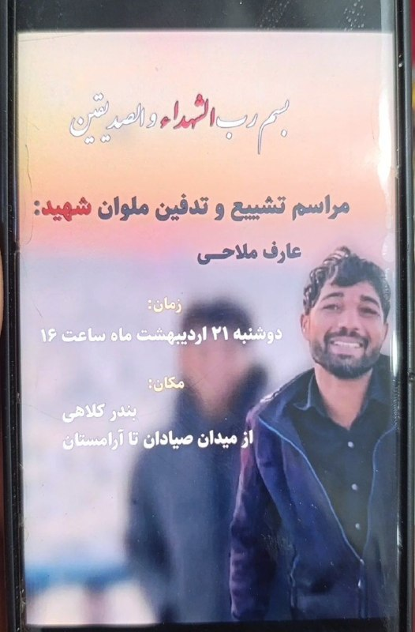

📞 الو یه سری قایق های تیز رو مال مردم جنوب هست که سالهاست دارن از خصب عمان کالا میارن (قایق های شوتی) توی این هفته گذشته تا الان دارم که پیام مینویسم پهپادهای آمریکایی چندتا از این قایق‌ها رو زدند ۱۰ تا ۱۲ نفر تلفات دادند. هر قایق دونفر سرنشین دارند یک ناخدا یک ملوان. این آگهی مربوط به یکی از این قایق‌هاست.

آمریکایی ها فکر می‌کنند اینا مال نیروی دریایی هستش. جمهوری اسلامی هم مهم نیست براش خوشحالم میشه تلفات غیرنظامی بره بالا.

📞 الو توی بندر میگن یه سری سر مشکلات معیشتی سمت به یه کشتی کره ای حرکت می‌کنند غارت کنن که خدمه کشتی از آمریکا کمک میخوان و اونا هم فکر میکنن مهاجمین سپاهی هستن برا همین بهشون شلیک میکنن.

@mamlekate

## mamlekate — post 103513

  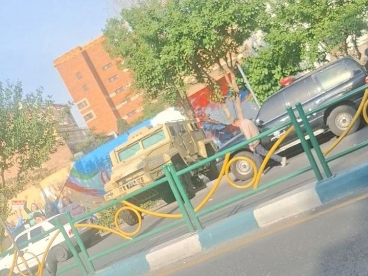

📞 تهران بالاتر از چهارراه ولیعصر ۲۲ اردیبهشت ساعت ۱۲ نفربر نوپو گذاشتن. قبلا هم بوده البته چون بخاطر جنگ هنوز جایی برای پارکشون ندارن. دکوراسیون شهر تهران شدن.

@mamlekate

## VahidOnline — post 75432

  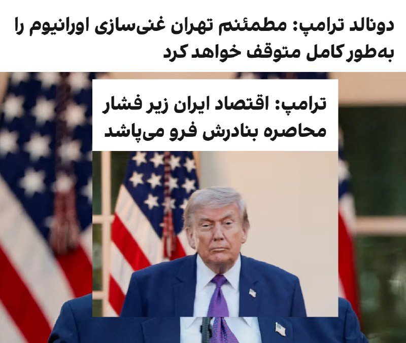

دونالد ترامپ در گفت‌وگو با برنامه رادیویی «سید رازبرگ» گفت: انتظار داریم اقتصاد ایران زیر فشارهای ناشی از محاصره بنادرش فرو بپاشد.
او افزود این درگیری بدون نیاز به شتاب‌زدگی حل‌وفصل خواهد شد و جمهوری اسلامی با انزوایی روبه‌رو است که آن را از منابع درآمدی محروم می‌کند.
ترامپ گفت ایالات متحده در حال انجام ارتباطات مستقیم با مقام‌های تهران است و برای رسیدن به توافق عجله‌ای ندارد و او اطمینان دارد که تهران غنی‌سازی اورانیوم را به‌طور کامل متوقف خواهد کرد.
@VahidOOnLine
دونالد ترامپ گفت حکومت ایران با انزاویی روبه‌روست که آن را از منابع درآمدش محروم می‌کند و انتظار می‌رود اقتصاد ایران زیر فشارهای ناشی از محاصره بندرها دچار فروپاشی شود.
او افزود: «این درگیری بدون نیاز به شتاب‌زدگی حل‌وفصل خواهد شد و جمهوری اسلامی با انزوایی روبه‌رو است که آن را از منابع درآمدی محروم می‌کند.»
دونالد ترامپ درباره اورانیوم غنی‌شده در ایران گفت مقام‌های جمهوری اسلامی به او گفته‌اند قرار است آنچه او «گردوغبار هسته‌ای» می‌نامد در اختیار آمریکا قرار گیرد، اما بعدا نظرشان را تغییر داده‌اند. او تاکید کرد در نهایت این مواد را به دست خواهند آورد و موضوع را جمع‌وجور می‌کنند.
@VahidOOnLine

📡 @VahidOnline

## VahidOnline — post 75431

  

یک مقام ارشد پنتاگون روز سه‌شنبه ۲۲ اردیبهشت اعلام کرد که جنگ ایالات متحده با ایران تاکنون ۲۹ میلیارد دلار هزینه داشته است، رقمی که نسبت به برآورد ارائه‌شده در اواخر ماه گذشته، چهار میلیارد دلار افزایش نشان می‌دهد.

به گزارش خبرگزاری رویترز، در حالی که تنها شش ماه تا انتخابات میان‌دوره‌ای کنگره آمریکا باقی مانده است، دموکرات‌ها در نظرسنجی‌های عمومی موقعیت بهتری پیدا کرده‌اند و تلاش می‌کنند این جنگ را به مسائل مربوط به هزینه‌های زندگی پیوند بزنند.
@VahidHeadline

📡 @VahidOnline

## VahidOnline — post 75430

  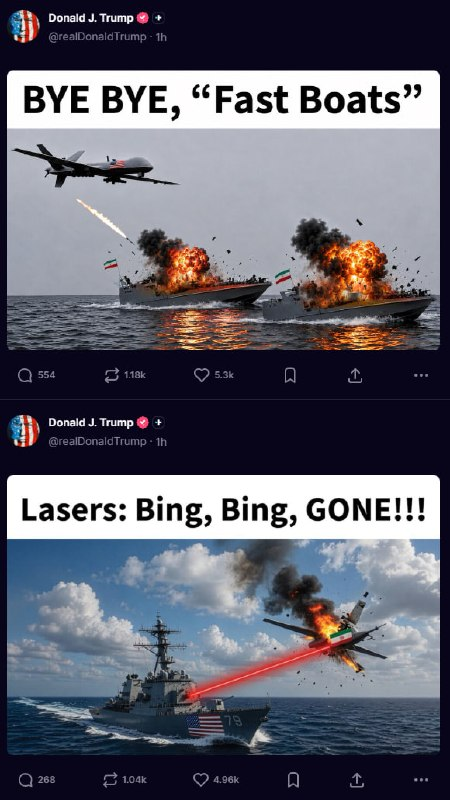

دونالد ترامپ، رییس‌جمهوری آمریکا، روز سه‌شنبه در تروث سوشال دو تصویر گرافیکی منتشر کرد که صحنه‌هایی از حمله به پهپادها و قایق‌های جمهوری اسلامی را نشان می‌دهد.

در یکی از این تصاویر، یک ناو آمریکایی با استفاده از سلاح لیزری یک پهپاد جمهوری اسلامی را هدف قرار داده و نابود می‌کند. در تصویر دیگر، یک پهپاد آمریکایی دو قایق جمهوری اسلامی را هدف قرار داده و منهدم می‌کند.
@VahidOOnLine

📡 @VahidOnline

## VahidOnline — post 75429

  <a href="telegram/content/VahidOnline_75429_1778610654.mp4" target="_blank">🎬 Download video</a>

نشست خبری سخنگوی دولت مسعود پزشکیان روز سه‌شنبه ۲۲ اردیبهشت به دلیل وضعیت اینترنت به بگومگوی خبرنگاران با فاطمه مهاجرانی منجر شد.
سخنگوی دولت تاکید کرد که «اینترنت پرو» با مصوبه شورای عالی امنیت ملی که ریاست آن را مسعود پزشکیان بر عهده دارد،‌ مورد استفاده قرار می‌گیرد.
او در عین حال تاکید کرد که این اینترنت ویژه کسب و کارها است. [در حالیکه خیلی از مردم بدون کسب و کار هم پیامک گرفتند بیاید پرو بخرید]
@VahidHeadline
فاطمه مهاجرانی گفت با توجه به وضعیت جنگی، فعلا اینترنت عمومی وصل نخواهد شد.
مهاجرانی در پاسخ به پرسش‌های متعدد خبرنگاران درباره وضعیت اینترنت و به‌ویژه «اینترنت پرو» گفت ما در وضعیت جنگی هستیم. رئیس جمهوری به‌عنوان رئیس شورای عالی امنیت ملی پیگیر حقوق مردم است اما وضعیت جنگی است و بعد از پایان شرایط ویژه، اینترنت به‌حالت قبل بازخواهد گشت.»
پس از این سخنان، چند خبرنگار تلاش کردند تا با یادآوری تعهدات دولت پیگیر وضعیت وصل اینترنت شوند. مهاجرانی خطاب به آن‌ها گفت: «وقتی رئیس جمهوری آمریکا می‌گوید آتش‌بس به تنفس مصنوعی وصل است، انتظار شما چیست؟»
@VahidOOnLine
فاطمه مهاجرانی، سخنگوی دولت جمهوری اسلامی، با اشاره به قطعی طولانی‌مدت اینترنت در ایران گفت اینترنت حق مردم است و عصبانیت مردم کاملا درست است. اما در ادامه تاکید کرد: «عامل این عصبانیت دشمنانی هستند که باعث می‌شوند فضای امنیتی ما مخدوش شود.»
او افزود: «رسانه‌ها کمک کنند که این ادبیات را جا بیندازند. دولت طرفدار دسترسی آزاد است.»
@VahidOOnLine

📡 @VahidOnline

## VahidOnline — post 75428

  

قوه قضائیه از اجرای حکم اعدام یک زندانی دیگر به نام عبدالجلیل شه‌بخش در بامداد سه‌شنبه ۲۲ اردیبهشت خبر داد.

ارگان رسمی نهاد قضایی ایران، شه‌بخش را «تروریست آموزش‌دیده» گروه «انصارالفرقان» معرفی کرده است.

از زمان حملات آمریکا و اسرائیل به ایران، جمهوری اسلامی اجرای احکام اعدام را افزایش داده است و در برخی روزها چند نفر را اعدام کرده است.
@VahidHeadline

📡 @VahidOnline

## kianmeli1 — post 87370

‏🔴یک مقام ارشد پنتاگون سه‌شنبه اعلام کرد که جنگ آمریکا در ایران تاکنون ۲۹ میلیارد دلار هزینه داشته است؛ رقمی که نسبت به برآورد ارائه‌شده در اواخر ماه گذشته، چهار میلیارد دلار افزایش یافته است
https://t.me/kianmeli1

## kianmeli1 — post 87369

‏🔴وزارت دفاع بریتانیا با انتشار بیانیه‌ای اعلام کرد این کشور تجهیزات خودکار مین‌یابی و سامانه‌های پیشرفته مقابله با پهپادها را به همراه جنگنده‌های تایفون و ناو «اچ‌ام‌اس دراگون» در قالب یک ماموریت دفاعی آینده برای تامین آزادی کشتیرانی در تنگه هرمز مستقر خواهد کرد
https://t.me/kianmeli1

## kianmeli1 — post 87368

‏🔴بلومبرگ گزارش داد امارات متحده عربی از زمان آغاز کارزار آمریکا و اسرائیل علیه تهران در ماه فوریه، بیش از یک‌بار به ایران حمله کرده است. به گفته این رسانه آمریکایی و به نقل از «افراد مطلع»، امارات متحده عربی این حملات را هم پیش از آتش‌بس و هم پس از آن انجام داده است
https://t.me/kianmeli1

## kianmeli1 — post 87367

  <a href="telegram/content/kianmeli1_87367_1778610655.mp4" target="_blank">🎬 Download video</a>

🔴زلنسکی: به تأسیسات گازی روسیه در فاصله ۱۵۰۰ کیلومتری حمله کردیم

ولودیمیر زلنسکی، رئیس‌جمهور اوکراین، حمله به یک تأسیسات صنعت گاز در منطقه اورنبورگ روسیه را تأیید کرد.

این هدف در فاصله بیش از ۱۵۰۰ کیلومتری مرز اوکراین قرار دارد.

به گفته زلنسکی، این عملیات پاسخی به حملات اخیر روسیه با پهپادهای شاهد و بمب‌های سرشی بوده است.

او تأکید کرد که کی‌اف به فشار بر روسیه ادامه می‌دهد تا آن را «به سمت دیپلماسی و صلح» سوق دهد. برخی رسانه‌ها از این اقدام با عنوان «تحریم‌های دوربرد» یاد کرده‌اند.
https://t.me/kianmeli1

## kianmeli1 — post 87366

  <a href="telegram/content/kianmeli1_87366_1778610657.mp4" target="_blank">🎬 Download video</a>

🔴سربازان روسی در حال استفاده از پهپاد رهگیر «یولکا» (Yolka) علیه پهپادهای اوکراینی هستند که براحتی با لانچر بسیار کوچک دستی به سرعت پرتاب میشود
https://t.me/kianmeli1

## kianmeli1 — post 87365

  

🔴ایران قبل از برآورده شدن این شرایط، در مورد مسئله هسته‌ای با آمریکا مذاکره نخواهد کرد.

• پایان جنگ در همه جبهه‌ها
• لغو همه تحریم‌ها
• آزادسازی دارایی‌های مسدود شده ایران
• پرداخت غرامت جنگ
• به رسمیت شناختن حق حاکمیت ایران بر تنگه هرمز
https://t.me/kianmeli1

## kianmeli1 — post 87364

  <a href="telegram/content/kianmeli1_87364_1778610660.mp4" target="_blank">🎬 Download video</a>

‏🔴سپاه پاسداران رزمایشی برای ورود قریب‌الوقوع به جنگ زمینی برگزار کرد
https://t.me/kianmeli1

## kianmeli1 — post 87363

  <a href="telegram/content/kianmeli1_87363_1778610662.mp4" target="_blank">🎬 Download video</a>

🔴تصاویر ماهواره‌ای جدید منتشر شده از پایگاه هوایی پرنس سلطان در عربستان سعودی نشان می‌دهد که تعداد زیادی هواپیما (به احتمال زیاد از نوع F-16) در این پایگاه مستقر شده‌اند. به نظر می‌رسد عربستان سعودی محدودیت‌های خود را علیه «پروژه آزادی» مرتبط با دونالد ترامپ برداشته است و حداقل ۵۳ فروند جنگنده F-16 در این پایگاه حضور دارند.
https://t.me/kianmeli1

## IranIntlTV — post 336861

  

بریتانیا سه‌شنبه اعلام کرد که تجهیزات خودکار مین‌روبی، جنگنده‌های تایفون و ناو جنگی اچ‌ام‌اس دراگون را به یک ماموریت دفاعی چندملیتی با هدف تامین امنیت کشتیرانی در تنگه هرمز اختصاص خواهد داد.

دولت بریتانیا با انتشار بیانیه‌ای نوشت که ماموریت دفاعی بریتانیا با ۱۱۵ میلیون پوند بودجه جدید برای پهپادهای مین‌روب و سامانه‌های مقابله با پهپاد پشتیبانی می‌شود.

جان هیلی، وزیر دفاع بریتانیا که ریاست اولین نشست وزیران دفاع ائتلافی متشکل از ۴۰ کشور را به‌طور مشترک با همتای فرانسوی خود برعهده داشت، گفت: «همراه با متحدان‌مان، این ماموریت چندملیتی، دفاعی، مستقل و معتبر خواهد بود.»
https://iranintl.com/202605128230

## IranIntlTV — post 336860

  

مجتبی یوسفی، نماینده اهواز در مجلس به سایت دیده‌بان ایران گفت: «ناوهای بریتانیا و فرانسه به تنگه هرمز نزدیک شوند، ببینند چه بلایی سرشان می آوریم. ما هم می‌گوییم بیایید نزدیک تنگه هرمز و آن را باز کنید.»

او ادامه داد: «اگر بناست اروپایی‌ها ما را امتحان کنند، بدانند که پایگاه‌های نظامی، کشورهای اروپایی و هر کشور متخاصم هدف مشروع ما است. ما بلوف نمی‌زنیم بلکه عمل می‌کنیم.»
https://iranintl.com/202605125053

## IranIntlTV — post 336859

  <a href="https://t.me/IranintlTV/336859" target="_blank">📎 Download file</a>

🎧نسخه صوتی چرتکه: سناریوهای قدرت خرید تا پایان ۱۴۰۵
@iranintlTV

## IranIntlTV — post 336858

  

🔻تیم ملی فوتبال در پی انزوای جمهوری اسلامی و انصراف همه حریفان تدارکاتی، برای سومین بار با خودش بازی کرد؛ دیداری که به طور مستقیم از صدا و سیمای جمهوری اسلامی پخش شد، وی‌ای‌آر داشت و البته بدون حضور تماشاگران عادی در ورزشگاه پاس قوامین، وابسته به نیروی انتظامی، برگزار شد.

🔹این بازی که در جریان اردوی بازیکنان شاغل در لیگ برتر برگزار شد، با حضور دو تیم قرمز و سفید انجام گرفت و تیم سفید با نتیجه ۴ بر یک تیم قرمز را شکست داد.

علی علیپور، دانیال ایری (دو بار) و آریا یوسفی برای تیم سفید و امیرحسین حسین‌زاده برای تیم قرمز گل زدند.

🔹تیم ملی قرار بود پیش از جام جهانی با تیم‌های ملی پرتغال،‌ اسپانیا،‌ مقدونیه و آنگولا بازی‌های تدارکاتی داشته باشد که همگی از دیدار با ایران منصرف شدند.

🔹امیر قلعه‌نویی، سرمربی تیم ملی، پیش‌تردرباره لغو بازی‌های تدارکاتی گفت: «بازی‌های تدارکاتی هماهنگ شده بود و قرارداد بستند؛ ولی در دقیقه ۹۰ کنسل شد.»

🔹تیم ملی قرار است به زودی در ترکیه اردوی آماده‌سازی خود را برپا کند. فدراسیون فوتبال گفته در جریان این اردو با تیم ملی گامبیا بازی خواهد کرد.

@iranintltvsport

## IranIntlTV — post 336857

  

بلومبرگ گزارش داد امارات متحده عربی از زمان آغاز کارزار آمریکا و اسرائیل علیه جمهوری اسلامی در اسفند ماه، بیش از یک‌بار ایران را هدف حمله قرار داده است.
بلومبرگ به نقل از «افراد مطلع» نوشت این حملات هم پیش از برقراری آتش‌بس و هم پس از آن انجام شده است.

براساس این گزارش، در طول جنگ، همکاری میان امارات متحده عربی و اسرائیل شامل تبادل اطلاعات، شناسایی و رهگیری موشک‌ها و پهپادهای ایرانی و همچنین انتخاب اهداف در ایران بوده است.

طبق گزارش بلومبرگ، یکی از این حملات در پاسخ به حمله جمهوری اسلامی به تاسیسات پتروشیمی بوروج در امارات و در «هماهنگی» با اسرائیل بوده است.

به گفته یکی از منابع، دو طرف در حمله اسرائیل به مجتمع پتروشیمی پارس جنوبی ایران نیز همکاری کرده‌اند.
وال‌استریت ژورنال پیش‌تر گزارش داد که امارات حمله‌ای به جزیره لاوان ایران انجام داده است.
https://iranintl.com/202605123603

## IranIntlTV — post 336856

  <a href="telegram/content/IranIntlTV_336856_1778610666.mp4" target="_blank">🎬 Download video</a>

وال‌استریت ژورنال گزارش داد ابوظبی به اهدافی داخل ایران حمله کرده است و واشینگتن به‌طور غیرعلنی از مشارکت امارات و هر کشور حاشیه خلیح فارس که مایل به ورود به درگیری باشد، استقبال کرده است.

ارزیابی فرزین ندیمی، پژوهشگر ارشد امور دفاعی و امنیتی در موسسه واشینگتن
@iranintltv

## IranIntlTV — post 336855

  

هاکان فیدان، وزیر خارجه ترکیه، در گفت‌وگو با الجزیره گفت اولویت اصلی آنکارا حفظ آتش‌بس میان واشینگتن و تهران است و تاکید کرد فوری‌ترین نگرانی ترکیه تداوم این آتش‌بس است، زیرا در حال حاضر این موضوع بیشترین اهمیت را دارد.

وزیر خارجه ترکیه افزود هیچ‌کس خواهان بازگشت به جنگ نیست، چرا که اقتصاد جهانی و امنیت انرژی جهان همین حالا نیز به اندازه کافی آسیب دیده است.

هاکان فیدان همچنین گفت ترکیه و دیگر کشورهای منطقه از جمله قطر برای حمایت از پاکستان به‌عنوان میانجی اصلی همکاری می‌کنند و در روند میانجی‌گری، زمانی که کار به بن‌بست می‌رسد، دشوارترین بخش یافتن ایده‌های خلاقانه است؛ گاهی طرفین و حتی خود میانجی نیز قادر به ارائه چنین ایده‌هایی نیستند.
https://iranintl.com/202605122251

## IranIntlTV — post 336854

  

هزینه‌ای که جمهوری اسلامی به مردم ایران تحمیل کرده، فقط در اقتصاد خلاصه نمی‌شود؛ از سفره‌های کوچک‌تر تا اینترنت طبقاتی، از اعدام و زندان تا ترس، ناامیدی و خشم فروخورده‌ای که هر روز بزرگ‌تر می‌شود.
مردم تا کی تاب می‌آورند؟
آیا ایران به نقطهٔ انفجار رسیده است؟
خشم انباشتهٔ مردم چه زمانی فوران خواهد کرد؟

امشب در «برنامه با کامبیز حسینی» دربارهٔ هزینه‌های ۴۷ سال حاکمیت جمهوری اسلامی و آیندهٔ ایران حرف می‌زنیم.

«برنامه» صدای شماست.

اگر در ایران به اینترنت دسترسی دارید، بیایید و مشاهدات خود را از جنگ بگویید. ما شما را، بدون نوبت، مستقیم از ایران روی خط می‌آوریم.
بیایید و روایت خود را برای همیشه ثبت کنید.
تاریخ با صدای شما نوشته می‌شود.

برای شرکت در برنامه، همین حالا در واتس‌اپ پیام بدهید:
۰۰۴۴۷۵۲۲۱۱۰۱۱۰
۰۰۴۴۷۵۴۴۱۱۰۱۱۰
۰۰۴۴۷۵۱۱۱۰۲۵۵۳

«برنامه با کامبیز حسینی»
«یک ایران صدای شما را می‌شنود»

@iranintltv

## IranIntlTV — post 336853

  <a href="telegram/content/IranIntlTV_336853_1778610671.mp4" target="_blank">🎬 Download video</a>

در حالی‌ که گزارش‌ها از جدی‌تر شدن بررسی گزینه‌های نظامی جدید آمریکا علیه جمهوری اسلامی خبر می‌دهند، دونالد ترامپ گفت منتظر فروپاشی اقتصادی ایران در اثر محاصره دریایی است.

گفت‌وگو با فرشته پزشک، کارشناس روابط بین‌الملل
@iranintltv

## IranIntlTV — post 336852

  

دادگاه کیفری عالی بحرین سه نفر از جمله یک زن را به اتهام «همکاری» با جمهوری اسلامی به حبس ابد محکوم کرد.
دادستان‌ها اعلام کردند این زن در «ارتباط» با سپاه پاسداران بوده و قصد داشته «اقدامات تروریستی خصمانه» در بحرین انجام دهد.
در پرونده‌های جداگانه، ۱۰ نفر دیگر به اتهام «حمایت و تایید حملات تروریستی جمهوری اسلامی علیه بحرین»، انتشار اطلاعات ممنوع و عکسبرداری از اماکن ممنوعه، به احکام حبس تا ۱۰ سال محکوم شدند.

پیش‌تر نیز وزارت کشور بحرین اعلام کرد دستگاه‌های امنیتی این کشور یک تشکیلات مرتبط با سپاه پاسداران و تفکر «ولایت فقیه» را شناسایی کرده‌اند و ۴۱ نفر از اعضای آن را بازداشت کرده‌اند.
https://iranintl.com/202605122799

## IranIntlTV — post 336849

  

شاهزاده رضا پهلوی در نشست امنیتی سالانه پولیتیکو گفت: «ما فقط زمانی می‌توانیم مردم را به بازگشت به خیابان‌ها فرا بخوانیم که آن‌ها از سطحی از برابری در توان مقابله برخوردار باشند؛ نه زمانی که رژیم بتواند اوباش و نیروهای سرکوبگرش را برای کشتن مردم در خیابان‌ها اعزام کند.»

او ادامه داد: «اما برای رسیدن به آن نقطه، باید پیام روشنی وجود داشته باشد. باید راهبردی شفاف برای پایان دادن به این رژیم وجود داشته باشد؛ فراخوانی روشن برای قیام مردم، و همچنین پیامی برای نیروهای نظامی و امنیتی از حکومت جدا شوند و به مردم بپیوندند. همه این‌ها باید در قالب یک راهبرد منسجم هماهنگ شود.»
https://iranintl.com/202605123516

## IranIntlTV — post 336848

  <a href="https://t.me/IranintlTV/336848" target="_blank">📎 Download file</a>

🎧نسخه صوتی اخبار شبانگاهی | سه‌شنبه ۲۲ اردیبهشت
@iranintlTV

## IranIntlTV — post 336847

  <a href="telegram/content/IranIntlTV_336847_1778610674.mp4" target="_blank">🎬 Download video</a>

تیتراول با نیوشا صارمی، سه‌شنبه ۲۲ اردیبهشت
@iranintltv

## IranIntlTV — post 336846

  <a href="telegram/content/IranIntlTV_336846_1778610676.mp4" target="_blank">🎬 Download video</a>

تیتراول با نیوشا صارمی، سه‌شنبه ۲۲ اردیبهشت
@iranintltv

## IranIntlTV — post 336845

  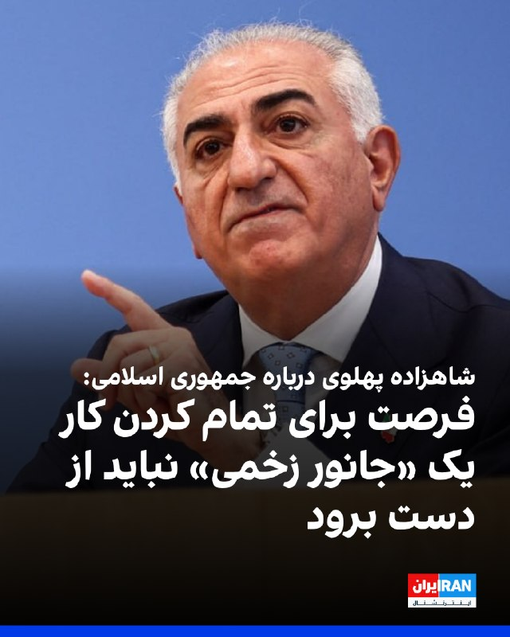

شاهزاده رضا پهلوی در نشست امنیتی سالانه پولیتیکو گفت سیاست مماشات با رژیم جمهوری اسلامی که راهبرد بسیاری از دولت‌ها بود، شکست خورده است.
او افزود اکنون که با یک «جانور زخمی» روبه‌رو هستیم، این فرصتی است که نباید از دست برود، بلکه باید کار را یک‌بار برای همیشه تمام کرد؛ موضوعی که نه‌تنها میلیون‌ها ایرانی، بلکه بسیاری از کشورهای منطقه نیز انتظار آن را دارند.

شاهزاده رضا پهلوی درباره جنگ علیه جمهوری اسلامی نیز گفت مردم به‌اندازه کافی هوشمند هستند که تفاوت میان حمله به یک ملت و حمله به یک رژیم را تشخیص دهند و آن کارزار، حمله‌ای علیه ملت ایران نبود، بلکه علیه رژیم بود.
https://iranintl.com/202605128673

## IranIntlTV — post 336844

  

دبیرکل شورای همکاری خلیج فارس اعلام کرد که نفوذ عناصر وابسته به سپاه پاسداران و برنامه‌ریزی آن‌ها برای اقدامات «خصمانه» را به‌شدت محکوم می‌کند.

دبیرکل شورای همکاری خلیج‌ فارس افزود از هر اقدامی که کویت برای حفظ امنیت و ثبات خود اتخاذ کند، حمایت می‌کند.

‌پیش‌تر نیز وزارت خارجه کویت اعلام کرد که سفیر جمهوری اسلامی را در پی نفوذ یک گروه وابسته به سپاه پاسداران به جزیره بوییان احضار کرده است.
https://iranintl.com/202605128445

## IranIntlTV — post 336843

  <a href="telegram/content/IranIntlTV_336843_1778610679.mp4" target="_blank">🎬 Download video</a>

با ادامه نارضایتی ترامپ از پاسخ تهران، ارم‌نیوز به نقل از منابع آمریکایی خبر داد واشینگتن به دنبال حمله به باقیمانده مراکز هسته‌ای ایران است تا قواعد جدیدی را به تهران تحمیل کند. سی‌ان‌ان هم خبر داد ترامپ در حال بررسی حمله به ایران پس از سفر به چین است.

گزارشی از مجتبا پورمحسن
@iranintltv

## IranIntlTV — post 336842

  

شهروندان در پیام‌هایی به ایران اینترنشنال می‌گویند که بدون رضایت و اطلاع و حتی هیچگونه اقدامی از سوی آن‌ها، نهادهای جمهوری اسلامی نام و مشخصات و تلفن همراه آن‌ها را برای ثبت‌نام در کارزار حکومتی «جان‌فدا» استفاده کرده‌اند.

طبق این پیام‌ها، حکومت پیامک‌هایی به شهروندان فرستاده و بدون اینکه بدانند، به آن‌ها گفته شده که در کارزار «جان‌فدا» ثبت‌نام شده‌اند.

طی روزهای گذشته، رسانه‌های حکومتی نوشتند که بیش از ۳۱ میلیون نفر در این کارزار ثبت‌نام کرده‌اند. این عدد و آمار از سوی شهروندان و ناظران با سوال مواجه شد. شهروندان در حالی که همچنان ده‌ها روز است که از دسترسی به اینترنت محروم‌اند، در پیام‌های خود به ایران اینترنشنال نوشته‌اند اگر حکومت ۳۱ میلیون جان‌فدا و حامی دارد، چرا اینترنت و دسترسی به آن را در کشور باز نمی‌کند.
https://iranintl.com/202605129601

## IranIntlTV — post 336841

  <a href="telegram/content/IranIntlTV_336841_1778610682.mp4" target="_blank">🎬 Download video</a>

ستاد فرماندهی مرکزی آمریکا، سنتکام، اعلام کرد ناو هواپیمابر آبراهام لینکلن به عملیات خود در دریای عرب، از جمله اجرای محاصره دریایی علیه جمهوری اسلامی، ادامه می‌دهد و تاکنون یک کشتی تجاری را وادار به تغییر مسیر کرده است.
جزییات بیشتر با مرضیه حسینی، خبرنگار ایران‌اینترنشنال
@iranintltv

## IranIntlTV — post 336840

  <a href="telegram/content/IranIntlTV_336840_1778610685.mp4" target="_blank">🎬 Download video</a>

روزنامه وال‌استریت ژورنال گزارش داد جمهوری اسلامی در آستانه سفر دونالد ترامپ به چین، از طریق سفیر خود در پکن در تلاش است پیامی را به واشینگتن منتقل کند.
سمیرا قرایی، خبرنگار ایران‌اینترنشنال، گزارش می‌دهد
@iranintltv

## Shin_Persian — post 5973

↩️ Quoted tweet: DefenceGeek 🇬🇧 ✓ @DefenceGeek Tue, 12 May 2026 18:11:27 UTC @hey_itsmyturn Training flight lol ↩️ توییت نقل‌قول شده — برای پاسخ، پست زیر را ببینید. فارسی @hey_itsmyturn پرواز تمرینی خخخ 𝕏 · @shin_persian

## Shin_Persian — post 5972

↩️ Quoted tweet:
DefenceGeek 🇬🇧 ✓ @DefenceGeek
Tue, 12 May 2026 18:11:27 UTC

@hey_itsmyturn Training flight lol

↩️ توییت نقل‌قول شده — برای پاسخ، پست زیر را ببینید.

فارسی

@hey_itsmyturn پرواز تمرینی خخخ

𝕏 · @shin_persian

## Shin_Persian — post 5971

Shin ✓ @hey_itsmyturn
Tue, 12 May 2026 17:54:52 UTC

Initial:
Blast in Sana'a, Yemen

فارسی

انفجار در صنعا، یمن

𝕏 · @shin_persian

## Shin_Persian — post 5970

  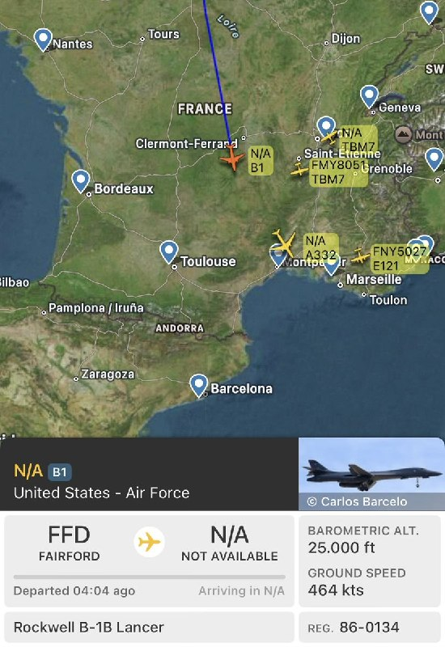

Shin ✓ @hey_itsmyturn
Tue, 12 May 2026 17:49:19 UTC

𝕏 · @shin_persian

## Shin_Persian — post 5969

Shin ✓ @hey_itsmyturn
Tue, 12 May 2026 17:45:43 UTC

Lancer on the move

فارسی

لنسر در حال حرکت

𝕏 · @shin_persian

## Shin_Persian — post 5968

  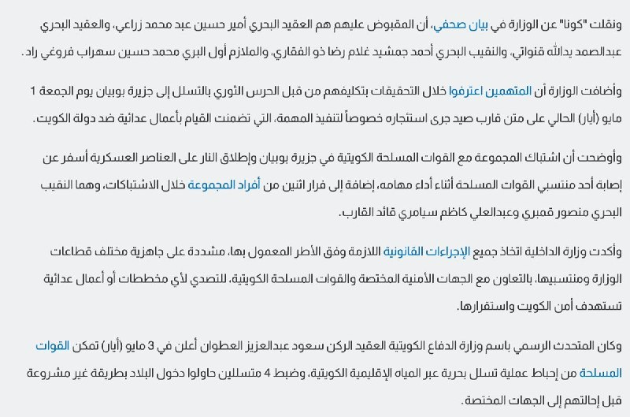

Shin ✓ @hey_itsmyturn Tue, 12 May 2026 14:29:01 UTC #Kuwait 🇰🇼 #Iran Kuwait Thwarts IRGC Infiltration & Hostile Plot Kuwait’s Ministry of Interior has released chilling details regarding the 4 infiltrators captured earlier this month. Interrogations confirm…

## Shin_Persian — post 5967

Shin ✓ @hey_itsmyturn
Tue, 12 May 2026 14:29:01 UTC

#Kuwait 🇰🇼 #Iran
Kuwait Thwarts IRGC Infiltration & Hostile Plot

Kuwait’s Ministry of Interior has released chilling details regarding the 4 infiltrators captured earlier this month. Interrogations confirm they are members of IRGC sent to carry out "hostile acts" within the country.

The Arrested IRGC Members:
Naval Colonel: Amir Hussein Abd Muhammad Zarai
Naval Colonel: Abdul Samad Yadollah Qanawati
Naval Captain: Ahmed Jamshid Ghulam Reza Zulfiqari
First Lieutenant: Muhammad Hussein Sohrab Foroughi Rad

Two others, Captain Mansour Qambari and boat pilot Abdulali Siamari, fled the scene during the initial skirmish

The incident has happened Bubiyan Island. The group used a rented fishing boat to enter Kuwaiti territorial waters illegally.

Upon discovery, the group opened fire on Kuwaiti Armed Forces. One Kuwaiti soldier was injured in the line of duty before the 4 suspects were neutralized and detained.

Source: https://24.ae/article/957997/

فارسی

#کوییت 🇰🇼 #ایران
کوییت نفوذ سپاه پاسداران (سپاه پاسداران انقلاب اسلامی) و توطئه‌ای خصمانه را خنثی کرد

وزارت کشور کوییت جزئیات تکان‌دهنده‌ای را در مورد ۴ نفوذی که اوایل این ماه دستگیر شده بودند، منتشر کرده است. بازجویی‌ها تأیید می‌کند که آن‌ها اعضای سپاه پاسداران هستند که برای انجام «اعمال خصمانه» در داخل کشور اعزام شده بودند.

اعضای دستگیر شده سپاه پاسداران:
سرهنگ دریایی: امیرحسین عبدالمحمد زارعی
سرهنگ دریایی: عبدالصمد یدالله قنواتی
ناخدا: احمد جمشید غلامرضا ذوالفقاری
ستوان یکم: محمدحسین سهراب فروغی راد

دو نفر دیگر، ناخدا منصور قنبری و هدایت‌کننده قایق، عبدالعلی سیامری، در جریان درگیری اولیه از صحنه گریختند.

این حادثه در جزیره بوبیان رخ داده است. این گروه از یک قایق ماهیگیری اجاره‌ای برای ورود غیرقانونی به آب‌های سرزمینی کوییت استفاده کرده بودند.

پس از شناسایی، این گروه به سوی نیروهای مسلح کوییت آتش گشودند. یک سرباز کویتی در حین انجام وظیفه مجروح شد و پس از آن، ۴ مظنون مهار و بازداشت شدند.

منبع: https://24.ae/article/957997/

𝕏 · @shin_persian

## Shin_Persian — post 5966

📦 mhrv-rs v1.9.23 released

• Fix: stream range-parallel downloads larger than Apps Script's 50 MiB cap (#1042 + PR #1085).

Files (Android APKs, Windows, macOS, Linux, OpenWRT) on the files channel:

👉 v1.9.23 — all files with SHA-256

Channel:
https://t.me/mhrv_rs
or: https://t.me/+R1OyoHX2boA1ZDgx

#v1923

## Shin_Persian — post 5965

Shin ✓ @hey_itsmyturn
Tue, 12 May 2026 12:54:39 UTC

State-owned Mehr News:
Islamic Regime files complaint against US at The Hague over "military aggression on nuclear facilities", economic sanctions, and "threat of force" during 12-day conflict. Case A-34 registered under 1981 Algiers Accords.

[😂]

فارسی

خبرگزاری دولتی مهر:
رژیم اسلامی شکایتی را علیه ایالات متحده در لاهه به دلیل «تجاوز نظامی به تاسیسات هسته‌ای»، تحریم‌های اقتصادی و «تهدید به استفاده از زور» در طول درگیری ۱۲ روزه تنظیم کرد. پرونده A-34 تحت بیانیه‌های الجزایر ۱۹۸۱ ثبت شده است.

[😂]

𝕏 · @shin_persian

## Shin_Persian — post 5964

  

U.S. Central Command ✓ @CENTCOM
Tue, 12 May 2026 12:23:13 UTC

USS Abraham Lincoln (CVN 72) continues operations in the Arabian Sea, including enforcement of the U.S. blockade against Iran. CENTCOM forces have redirected 65 commercial vessels and disabled 4.

فارسی

ناو هواپیمابر یواس‌اس آبراهام لینکلن (سی‌وی‌ان ۷۲) به عملیات‌های خود در دریای عرب، از جمله اجرای محاصره ایالات متحده علیه ایران، ادامه می‌دهد. نیروهای سنتکام (فرماندهی مرکزی ایالات متحده) ۶۵ کشتی تجاری را تغییر مسیر داده و ۴ کشتی را از کار انداخته‌اند.

𝕏 · @shin_persian

## ManotoTV — post 105366

اکونومیست می‌نویسد بحران طولانی ایران می‌تواند برای کشورهای خلیج فارس فقط یک چالش امنیتی کوتاه‌مدت نباشد، بلکه به آزمونی جدی برای آینده اقتصادی، سرمایه‌گذاری خارجی، تجارت دریایی و تصویر این منطقه به‌عنوان مقصدی امن و باثبات تبدیل شود. ورق بزنید.

## ManotoTV — post 105365

  <a href="telegram/content/ManotoTV_105365_1778610689.mp4" target="_blank">🎬 Download video</a>

وزیر خارجه پاکستان اعلام کرد در گفت‌وگو با همتای چینی خود، درباره تلاش‌های اسلام‌آباد برای تسهیل مذاکرات میان جمهوری‌اسلامی و آمریکا رایزنی کرده است.
وزارت خارجه پاکستان در بیانیه‌ای اعلام کرد وانگ یی، وزیر خارجه چین، از نقش «سازنده» پاکستان در میانجیگری حمایت و قدردانی کرده است.
دو طرف همچنین بر ضرورت ادامه آتش‌بس پایدار و تضمین عبور عادی کشتی‌ها از تنگه هرمز تأکید کردند.
این گفت‌وگو در حالی انجام شده که دونالد ترامپ قرار است این هفته به‌طور رسمی به چین سفر کند.

## ManotoTV — post 105364

  <a href="telegram/content/ManotoTV_105364_1778610690.mp4" target="_blank">🎬 Download video</a>

ژنرال دن کین، رئیس ستاد مشترک ارتش آمریکا، اعلام کرد جمهوری‌اسلامی تحت فشار شدید ناشی از تحریم‌ها و محاصره قرار دارد و واشنگتن همچنان «طیفی از گزینه‌های نظامی» را در اختیار دارد.
در جلسه استماع سنای آمریکا، کریس مورفی، سناتور دموکرات، با اشاره به افزایش شدید قیمت سوخت پرسید آیا راهی جز دیپلماسی برای بازگشایی تنگه هرمز وجود دارد یا نه.
پیت هگست، وزیر دفاع آمریکا، در پاسخ گفت واشنگتن «قطعاً» ابزارهای نظامی لازم برای باز کردن تنگه هرمز را در اختیار دارد؛ از جمله حمله به اهداف زمینی و استفاده از توان دریایی و محاصره نظامی.

## ManotoTV — post 105363

  <a href="telegram/content/ManotoTV_105363_1778610692.mp4" target="_blank">🎬 Download video</a>

جان هیلی، وزیر دفاع بریتانیا، اعلام کرد لندن جنگنده، پهپاد و یک ناو جنگی را به مأموریت چندملیتی حفاظت از تردد کشتی‌ها در تنگه هرمز اعزام خواهد کرد.

هیلی این خبر را پس از نشست مشترک با وزرای دفاع ۴۰ کشور اعلام کرد؛ نشستی که با هدف جلب حمایت برای مأموریت تحت رهبری بریتانیا جهت تأمین امنیت کشتیرانی در تنگه هرمز برگزار شد.

بریتانیا می‌گوید این مأموریت در واکنش به محاصره تنگه هرمز از سوی جمهوری اسلامی انجام می‌شود.

## ManotoTV — post 105362

  <a href="telegram/content/ManotoTV_105362_1778610693.mp4" target="_blank">🎬 Download video</a>

سازمان جهانی بهداشت هشدار داد شمار موارد ابتلا به هانتاویروس، پس از شیوع این ویروس در یک کشتی گردشگری در اقیانوس اطلس، احتمالاً افزایش پیدا خواهد کرد.
تدروس آدهانوم، مدیرکل سازمان جهانی بهداشت، اعلام کرد تاکنون ۹ مورد ابتلای قطعی و دو مورد مشکوک ثبت شده و انتظار می‌رود افراد بیشتری نیز به ویروس مبتلا شده باشند. با این حال او تأکید کرد خطر شیوع گسترده جهانی همچنان «پایین» ارزیابی می‌شود.
شیوع بیماری در کشتی «ام‌وی هوندیوس» آغاز شد؛ جایی که سه مسافر، شامل یک زوج هلندی و یک زن آلمانی، جان خود را از دست دادند. این کشتی در حال سفر ۳۵ روزه در اقیانوس اطلس بود.
هانتاویروس معمولاً از طریق ادرار، بزاق یا فضولات جوندگان منتقل می‌شود. گونه «آندِس» تنها نوع شناخته‌شده‌ای است که می‌تواند از انسان به انسان منتقل شود.
در پی این بحران، صدها مسافر و خدمه در کشورهای مختلف تحت قرنطینه یا مراقبت پزشکی قرار گرفته‌اند. مقام‌های بهداشتی در اروپا و آمریکا نیز در حال ردیابی تماس‌های مرتبط با مبتلایان هستند.

## ManotoTV — post 105361

  <a href="telegram/content/ManotoTV_105361_1778610693.mp4" target="_blank">🎬 Download video</a>

مقام‌های آمریکایی اعلام کردند نیروهای این کشور مانع عبور یک نفتکش با پرچم جمهوری مالت از تنگه هرمز شده‌اند.
سخنگوی ستاد فرماندهی مرکزی آمریکا سنتکام؛ به الجزیره گفت نفتکش «آگیوس فانوریوس» به‌دلیل نقض محاصره دریایی، اجازه عبور پیدا نکرده است. به گفته او، این کشتی حامل نفت ایران نبوده است.
مقام‌های آمریکایی همچنین اعلام کردند چند نفتکش دیگر نیز به‌دلیل نقض تحریم‌ها و محاصره اعمال‌شده علیه بنادر ایران، متوقف شده‌اند.

## ManotoTV — post 105360

  <a href="telegram/content/ManotoTV_105360_1778610694.mp4" target="_blank">🎬 Download video</a>

«اینترنت را قطع کردند تا صدای مردم خاموش شود.»

## ManotoTV — post 105359

  <a href="telegram/content/ManotoTV_105359_1778610696.mp4" target="_blank">🎬 Download video</a>

شورای همکاری خلیج فارس ورود نیروهایی از سپاه پاسداران به جزیره بوبیان کویت را محکوم کرد.

جاسم البدیوی، دبیرکل شورای همکاری خلیج فارس، گفت: «نفوذ عناصر سپاه پاسداران به جزیره بوبیان کویت و برنامه‌ریزی آن‌ها برای اقدامات خصمانه را محکوم می‌کنیم.»

او همچنین تأکید کرد شورای همکاری خلیج فارس از کویت در همه اقداماتی که برای حفظ امنیت و ثبات خود انجام دهد، حمایت می‌کند.

## ManotoTV — post 105358

  <a href="telegram/content/ManotoTV_105358_1778610697.mp4" target="_blank">🎬 Download video</a>

وزارت خارجه کویت اعلام کرد در پی آنچه «نفوذ» اعضای مسلح وابسته به سپاه پاسداران خوانده شده، سفیر جمهوری‌اسلامی در این کشور را احضار و یادداشت اعتراضی رسمی به او تحویل داده است.
به گفته مقام‌های کویتی، چهار عضو منتسب به سپاه قصد داشتند از راه دریا وارد کویت شوند و «اقدامات خصمانه» انجام دهند. وزارت کشور کویت اعلام کرد در درگیری با نیروهای امنیتی، یک نیروی کویتی زخمی شده و دو نفر از متهمان نیز فرار کرده‌اند.
معاون وزیر خارجه کویت این اقدام را «نقض آشکار حاکمیت کویت» و مغایر با قوانین بین‌المللی و منشور سازمان ملل توصیف کرد و از تهران خواست فوراً چنین اقداماتی را متوقف کند.

## ManotoTV — post 105357

  <a href="telegram/content/ManotoTV_105357_1778610698.mp4" target="_blank">🎬 Download video</a>

تورم در آمریکا افزایش یافته و طبق آمار رسمی اداره آمار کار آمریکا، این افزایش عمدتا به عوامل مرتبط با جنگ ایران مربوط می‌شود.
شاخص قیمت مصرف‌کننده در ماه آوریل به ۳.۸ درصد رسید؛ در حالی‌ که این رقم در ماه مارس ۳.۳ درصد بود. افزایش قیمت بنزین از مهم‌ترین دلایل این رشد اعلام شده است.
این آمار نشان می‌دهد بالا رفتن قیمت نفت، که ناشی از اختلال مؤثر در تردد از تنگه هرمز بوده، باعث افزایش بیشتر قیمت‌ها شده است.
بر اساس این گزارش، افزایش هزینه انرژی و سوخت اصلی‌ترین عامل رشد ۰.۵ واحد درصدی تورم بوده است.
تحلیلگران می‌گویند این وضعیت علاوه بر فشار بر مصرف‌کنندگان آمریکایی و اقتصاد آمریکا، ممکن است یک پیامد سیاسی هم داشته باشد؛ چرا که فشار اقتصادی بر رأی‌دهندگان می‌تواند دونالد ترامپ را به بازگشت به میز مذاکره سوق دهد.

## ManotoTV — post 105356

  <a href="telegram/content/ManotoTV_105356_1778610699.mp4" target="_blank">🎬 Download video</a>

تماسی از ایران؛ «می‌گفت تو این شرایط، به دور و برمون نگاه کنیم و دستِ همدیگه رو بگیریم…
تو هر خانواده و آشنایی یکی هست که بی‌صدا به کمک نیاز داره.»

## ManotoTV — post 105355

  <a href="telegram/content/ManotoTV_105355_1778610701.mp4" target="_blank">🎬 Download video</a>

دونالد ترامپ، رئیس‌جمهور آمریکا، با وجود توقف مذاکرات با جمهوری‌اسلامی، در یک گفتگو، اعلام کرده تهران صددرصد غنی‌سازی اورانیوم و هرگونه تلاش برای ساخت سلاح هسته‌ای را متوقف خواهد کرد.
ترامپ در گفت‌وگو با رادیوی WABC گفت شخصاً با مقام‌های جمهوری‌اسلامی در تماس بوده و افزود: «آن‌ها گفتند ما غبار هسته‌ای را تحویل خواهیم گرفت.»
او همچنین تأکید کرد آمریکا برای رسیدن به توافق عجله‌ای ندارد و گفت: «ما محاصره را در اختیار داریم.»

## ManotoTV — post 105354

  <a href="telegram/content/ManotoTV_105354_1778610701.mp4" target="_blank">🎬 Download video</a>

تماسی از تجربه‌اش با بهزیستی
می‌گفت برای بیمه و تأیید مشکلش هزار تا ایراد گرفتن
اما وقتی پای کمک رسید، گفتن هیچ مشکلی نداری

## ManotoTV — post 105353

  <a href="telegram/content/ManotoTV_105353_1778610703.mp4" target="_blank">🎬 Download video</a>

در جلسه استماع کنگره آمریکا، مقام‌های ارشد پنتاگون اعلام کردند هزینه تسلیحات و تجهیزات مصرف‌شده آمریکا در جنگ با ایران تاکنون به حدود ۲۴ میلیارد دلار رسیده است.
پیت هگست، وزیر دفاع آمریکا، به همراه رئیس ستاد مشترک ارتش و مقام مالی وزارت جنگ در این جلسه حضور داشتند. به گفته جولز هرست، این رقم شامل مهمات، موشک‌ها و سایر تجهیزات نظامی استفاده‌شده در جنگ است.
پنتاگون ماه گذشته نیز اعلام کرده بود مجموع هزینه‌های جنگ با ایران تاکنون به ۲۹ میلیارد دلار رسیده است.

## ManotoTV — post 105352

  <a href="telegram/content/ManotoTV_105352_1778610704.mp4" target="_blank">🎬 Download video</a>

ابراهیم رضایی، سخنگوی کمیسیون امنیت ملی و سیاست خارجی مجلس شورای اسلامی در شبکه اکس تهدید کرده، غنی سازی ۹۰ درصد به عنوان یکی از گزینه‌های جمهوری‌اسلامی در صورت حمله مجدد، بررسی می‌شود.

## ManotoTV — post 105351

  <a href="telegram/content/ManotoTV_105351_1778610705.mp4" target="_blank">🎬 Download video</a>

متاثر از پیچیده‌تر شدن سرنوشت مذاکرات جمهوری‌اسلامی و آمریکا، قیمت جهانی نفت، بیش از ۳ درصد افزایش یافت.
بهای نفت برنت به حدود ۱۰۸ دلار و نفت وست‌تگزاس آمریکا به بیش از ۱۰۱ دلار در هر بشکه رسید. تحلیلگران می‌گویند رد پیشنهادهای دو طرف، نگرانی‌ها درباره اختلال در عرضه نفت را دوباره افزایش داده است.
مدیرعامل آرامکوی عربستان هشدار داد هرگونه اختلال در صادرات نفت از تنگه هرمز می‌تواند بازگشت ثبات به بازار را تا سال ۲۰۲۷ به تعویق بیندازد.
کارشناسان همچنین گفته‌اند در صورت توافق واقعی میان تهران و واشنگتن، قیمت نفت ممکن است ۸ تا ۱۲ دلار کاهش پیدا کند، اما تشدید تنش‌ها می‌تواند قیمت نفت برنت را دوباره به بالای ۱۱۵ دلار برساند.

## FarsiVOA — post 217558

مدیر روابط عمومی فرودگاه خمینی تهران اعلام کرد پروازهای خارجی از این فرودگاه به بیش از ۲۰ مقصد بین‌المللی به ‌صورت عادی در حال انجام است. به گفته اهورا محمدی، بیشترین پروازها به استانبول، مسقط، نجف، مدینه، شانگهای، گوانگژو، بغداد و پکن است.

بر اساس این اعلام، روزانه بین ۳۵ تا ۴۰ پرواز ورودی و خروجی از این فرودگاه انجام می‌شود، و ایروان، مسکو، اربیل، کابل، آنکارا، بانکوک و باکو مقاصد مسافران است.

مدیرعامل شرکت شهر فرودگاهی فرودگاه خمینی نیز آمار پروازهای خارجی انجام شده در این فرودگاه را تا ۲۱ اردیبهشت ۵۳۴ مورد و تعداد مسافران جابه‌جا شده را هم بیش از ۴۸ هزار نفر اعلام کرد.

از زمان آغاز دیگری نظامی با آمریکا و اسرائیل، حریم هوایی ایران به روی پروازهای تجاری و مسافری بسته بود و فرودگاه‌های کشور هم تعطیل بودند اما در روزهای آخر فروردین، مقام‌ها مسئول از ازسرگیری تدریجی پروازها در برخی فرودگاه‌ها خبر دادند.

@FarsiVOA

## FarsiVOA — post 217557

  <a href="telegram/content/FarsiVOA_217557_1778610705.mp4" target="_blank">🎬 Download video</a>

ارتش اسرائیل از انهدام سکوهای پرتاب موشک در مناطق مختلف جنوب لبنان خبر داد که برای شلیک به سمت اسرائیل آماده بودند. این ارتش همچنین اعلام کرد در روز گذشته حدود ۱۵ نیروی حزب‌الله را از پا درآورده است.

تنش‌ها در جنوب لبنان بار دیگر وارد مرحله‌ای حساس شده و احتمال عملیات گسترده‌تر علیه مواضع حزب‌الله افزایش یافته است.

## FarsiVOA — post 217556

در گفت‌وگو با شاهین مدرس، تحلیلگر مطالعات امنیتی، به نشست امنیتی کاخ سفید درباره آینده آتش‌بس با جمهوری اسلامی که به گفته پرزیدنت شانس پایینی برای بقا دارد پرداختیم و پرسیدیم آیا این آتش‌بس شکننده، به پایان خط رسیده است یا هنوز راهی برای مهار تنش و درگیری وجود دارد.

## FarsiVOA — post 217555

در گفت‌وگو با علیرضا فیروزی، مدیر مؤسسه پیشگامان اینترنت آزاد آلمان، به پدیده حکومتی اینترنت سفید و پرسرعت در دل قطع کامل اینترنت در ایران پرداختیم و بررسی کردیم چگونه این سیاست‌های حکومتی به جلوه‌ای از شکاف درون هسته سخت قدرت و بی‌اعتمادی فزاینده میان مردم و حکومت تبدیل شده است.

## FarsiVOA — post 217554

پیت هگست، وزیر جنگ آمریکا، و ژنرال دن کین، رئیس ستاد مشترک نیروهای مسلح آمریکا، روز سه‌شنبه ۲۲ اردیبهشت با حضور در جلسه کمیته فرعی تخصیص بودجه مجلس نمایندگان از عملکرد دولت ترامپ در عملیات نظامی علیه رژیم ایران دفاع کردند. بخش‌هایی از این نشست با ترجمه همزمان پژواک کیومرثی از صدای آمریکا پخش شد.

## FarsiVOA — post 217553

پیت هگست، وزیر جنگ آمریکا، و ژنرال دن کین، رئیس ستاد مشترک نیروهای مسلح آمریکا، روز سه‌شنبه ۲۲ اردیبهشت با حضور در جلسه کمیته فرعی تخصیص بودجه مجلس نمایندگان از عملکرد دولت ترامپ در عملیات نظامی علیه رژیم ایران دفاع کردند. بخش‌هایی از این نشست با ترجمه همزمان پژواک کیومرثی از صدای آمریکا پخش شد.

## FarsiVOA — post 217552

پیت هگست، وزیر جنگ آمریکا، و ژنرال دن کین، رئیس ستاد مشترک نیروهای مسلح آمریکا، روز سه‌شنبه ۲۲ اردیبهشت با حضور در جلسه کمیته فرعی تخصیص بودجه مجلس نمایندگان از عملکرد دولت ترامپ در عملیات نظامی علیه رژیم ایران دفاع کردند. بخش‌هایی از این نشست با ترجمه همزمان پژواک کیومرثی از صدای آمریکا پخش شد.

## FarsiVOA — post 217551

پیت هگست، وزیر جنگ آمریکا، و ژنرال دن کین، رئیس ستاد مشترک نیروهای مسلح ایالات متحده، روز سه‌شنبه ۲۲ اردیبهشت با حضور در جلسه کمیته فرعی تخصیص بودجه مجلس نمایندگان آمریکا از عملکرد دولت ترامپ در عملیات نظامی علیه رژیم ایران دفاع کردند.

## FarsiVOA — post 217550

🔺تعیین پاداش ۱۵ میلیون دلاری برای اطلاعات منجر به مختل شدن سازوکارهای مالی سپاه

▪️آمریکا با انتشار بیانیه‌ای از تعیین جایزه‌ای ۱۵ میلیون دلاری برای مقابله با فعالیت‌های مخرب سپاه خبر داد.

⬇️ بیشتر بخوانید:

https://ir.voanews.com/a/irgc-information-15-million-bonus/8149215.html/?nocach=1

## FarsiVOA — post 217549

پیت هگست: برای همه سناریوهای تداوم مقابله با جمهوری اسلامی آمادگی داریم

## FarsiVOA — post 217548

گفتگو با جمشید اسدی، اقتصاددان و کارشناس اقتصاد دیجیتالی، درباره چشم‌انداز بازار ارز در ایران و تداوم روند فزاینده قیمت دلار

## FarsiVOA — post 217547

گفت‌و‌گو با یاسین اهوازی، کارشناس مسائل خاورمیانه، درباره چرایی و عواقب انتقال هواپیماهای نظامی جمهوری اسلامی به فرودگاه‌های پاکستان

## FarsiVOA — post 217546

  <a href="telegram/content/FarsiVOA_217546_1778610708.mp4" target="_blank">🎬 Download video</a>

فرماندهی مرکزی ایالات متحده، سنتکام، اعلام کرد هزاران نیروی نظامی آمریکا مستقر در خاورمیانه در سال ۲۰۲۶ به دلیل عملکرد برجسته خود مورد تقدیر قرار گرفته‌اند.

به گفته سنتکام، این تقدیرها شامل اعطای مدال، ارتقای درجه، و واگذاری مسئولیت‌های جدید فرماندهی بوده است.

سنتکام تاکید کرد موفقیت عملیات این فرماندهی به تلاش سربازان، ملوانان، تفنگداران دریایی، نیروهای هوایی، گارد ملی و گارد ساحلی آمریکا وابسته است.

@FarsiVOA

## FarsiVOA — post 217545

فشارها برای کنار رفتن کی‌یر استارمر هر ساعت بیشتر می‌شود؛ ۸۴ نماینده حزب کارگر خواهان استعفا یا اعلام زمان خروج او شده‌اند، اما هنوز روند رسمی رقابت رهبری آغاز نشده است.

## FarsiVOA — post 217544

🔺وزیر جنگ: ما در حال پیروزی در جنگ با رژیم ایران هستیم؛ آنها در استفاده از استراتژی کره‌شمالی شکست خوردند

▪️پیت هگست، وزیر جنگ آمریکا، و ژنرال دن کین، رئیس ستاد مشترک نیروهای مسلح ایالات متحده، روز سه‌شنبه ۲۲ اردیبهشت با حضور در جلسه کمیته فرعی تخصیص بودجه مجلس نمایندگان آمریکا از عملکرد دولت ترامپ در عملیات نظامی علیه رژیم ایران دفاع کردند.

⬇️ بیشتر بخوانید:

https://ir.voanews.com/a/iran-us-war-hegseth-caine-testimony-pete-epic-fury/8149212.html/?nocach=1

## FarsiVOA — post 217543

سفرهای محرمانه قاآنی و هشدار آمریکا؛ عراق وارد مرحله‌ای سرنوشت‌ساز شد

## FarsiVOA — post 217542

دونالد ترامپ، رئیس جمهوری آمریکا، قرار است این هفته در پکن با شی جین‌پینگ، رئیس جمهوری چین، دیدار کند. پیش‌بینی می‌شود پرونده‌های امنیتی، اقتصادی، و فناوری، جنگ و برنامه هسته‌ای جمهوری اسلامی، و هوش مصنوعی موضوعاتی باشند که در این دیدار مورد بحث و تبادل نظر قرار بگیرد.

## FarsiVOA — post 217541

  <a href="telegram/content/FarsiVOA_217541_1778610709.mp4" target="_blank">🎬 Download video</a>

ارتش اسرائیل اعلام کرد در ۲۴ ساعت گذشته حدود ۴۵ زیرساخت گروه حزب‌الله را در جنوب لبنان هدف قرار داده است. از جمله این زیرساخت‌ها، «مراکز فرماندهی، ایستگاه‌های دیده‌بانی، نقاط تجمع و ساختمان‌های نظامی است که به گفته ارتش اسرائیل نیروهای حزب‌الله «از طریق آنها، اقدامات تروریستی علیه نیروهای ارتش و کشور اسرائیل را پیش می‌بردند.»

## FarsiVOA — post 217540

🔺بازداشت چهار عضو سپاه در کویت؛ بحرین یک زن را به جرم همکاری با رژیم ایران به حبس ابد محکوم کرد

▪️همزمان با ادامه فعالیت‌های مخرب جمهوری اسلامی علیه کشورهای منطقه، کویت از بازداشت چهار عضو سپاه پاسداران که قصد داشتند وارد این کشور شوند، خبر داد. در بحرین نیز یک زن به اتهام همکاری با سپاه پاسداران به حبس ابد محکوم کرد.

⬇️ بیشتر بخوانید:

https://ir.voanews.com/a/irgc-iran-kuwait-emirates-bahrain-proxy/8149179.html/?nocach=1

## FarsiVOA — post 217539

قطع گسترده اینترنت در ایران وارد هفتاد و چهارمین روز شده و مدت این اختلال از هزار و ۷۵۲ ساعت گذشته است؛ محدودیتی که همزمان با بالا گرفتن جنجال «اینترنت پرو» و «خط‌های سفید»، موضوع دسترسی تبعیض‌آمیز به اینترنت را به یکی از محورهای اختلاف درون ساختار رسمی جمهوری اسلامی تبدیل کرده است.

نت‌بلاکس، نهاد ناظر بر دسترسی به اینترنت، اعلام کرده است این خاموشی اینترنتی از ۲۸ فوریه ۲۰۲۶ آغاز شده و همچنان بخش بزرگی از کاربران داخل ایران را از دسترسی آزاد به اینترنت جهانی محروم کرده است. این نهاد می‌گوید دسترسی آزاد به اینترنت، حقی بنیادین است که بسیاری از آزادی‌های دیگر بر آن تکیه دارند و محروم کردن شهروندان از آن، توان جامعه برای ثبت، پیگیری و مقابله با نقض حقوق اساسی را محدود می‌کند.

گزارش کامل را در وب‌سایت صدای آمریکا بخوانید.

@FarsiVOA

## DW_Farsi — post 124624

🔶 بیش از ۱۱۰ برنده جایزه نوبل خواستار آزادی نرگس محمدی شدند

بیش از ۱۱۰ برنده جایزه نوبل خواستار آزادی فوری و بی قید و شرط نرگس محمدی، فعال زندانی حقوق بشر و برنده جایزه نوبل صلح، و رفع اتهام از او شدند.

این درخواست در پی افزایش نگرانی از وخامت سریع وضعیت جسمانی نرگس محمدی و انتقال او از زندان زنجان به بیمارستانی در تهران مطرح شده است.

در بیانیه‌ای که امروز سه‌شنبه ۱۲ مه (۲۲ اردیبهشت) منتشر شد، ۱۱۲ برنده جایزه نوبل از مقام‌های جمهوری اسلامی و جامعه جهانی خواستند تا "بی‌درنگ" برای آزادی نرگس محمدی و تضمین دسترسی مداوم او به درمان پزشکی اقدام کنند.

نرگس محمدی که در سال ۲۰۲۳ به دلیل دهه‌ها فعالیت در دفاع از حقوق زنان در ایران برنده جایزه نوبل صلح شده بود، یکشنبه گذشته ۲۰ اردیبهشت، به دلیل وضعیت بحرانی جسمانی‌اش جهت درمان تخصصی با آمبولانس به بیمارستان پارس تهران منتقل شد.

@dw_farsi

## DW_Farsi — post 124623

  

🔶 معاون نیروی دریایی سپاه: محدوده تنگه هرمز برای ما بزرگ‌تر شده است

محمد اکبرزاده، معاون سیاسی نیروی دریایی سپاه پاسداران انقلاب اسلامی، در گفت‌وگویی در تلویزیون جمهوری اسلامی مدعی شد که در جریان تحولات جنگ و محاصره دریایی، تنگه هرمز برای حکومت ایران "بزرگ‌تر شده و به یک منطقه وسیع عملیاتی تبدیل شده است."

اکبرزاده با بیان این ادعا که در گذشته، "تنگه هرمز یک گستره محدود در اطراف جزایری مانند هرمز و هنگام تعریف می‌شد"، گفت: «اکنون در چارچوب طرح جدید، محدوده تنگه هرمز به‌طور قابل توجهی گسترش یافته و از سواحل جاسک و سیری تا فراتر از جزایر بزرگ، به‌عنوان یک پهنه راهبردی تعریف شده است.»

معاون سیاسی نیروی دریایی سپاه پاسداران با اشاره به تحولات دهه‌های اخیر این منطقه و نیز در جریان جنگ هشت ساله ایران و عراق، با اشاره به ابعاد ژئوپلیتیکی تنگه هرمز، مدعی شد: «اگر بخواهیم جغرافیای این منطقه را توضیح دهیم، باید به این نکته توجه کنیم که نگاه جمهوری اسلامی ایران به تنگه هرمز، صرفاً یک نگاه محدود جغرافیایی نبوده، بلکه نگاهی راهبردی و متفاوت است.»

اکبرزاده با بیان این ادعا که "این رویکرد ناشی از سیاست تنش‌زدایی و تامین امنیت بوده است"، گفت: «ما به‌دنبال آرامش و امنیت در منطقه بودیم، اما امروز شرایط متفاوت شده و سیاست‌های جدیدی در قبال تنگه هرمز در حال اعمال است که دنیا نتایج آن را خواهد دید.»

با تشدید حملات امریکا و اسرائیل به ایران، سپاه پاسداران اقدام به بستن تنگه هرمز کرد. این اقدام با اعتراضات شدید بین‌المللی روبرو شد چرا که این باریکه یک آبراه بین‌المللی است و بر اساس قوانین بین‌الملل ایران اجازه بستن آن را ندارد.

در حال حاضر این موضوع به یکی از موضوعات اصلی مورد مناقشه میان ایران و آمریکا تبدیل شده است.

@dw_farsi

## DW_Farsi — post 124622

  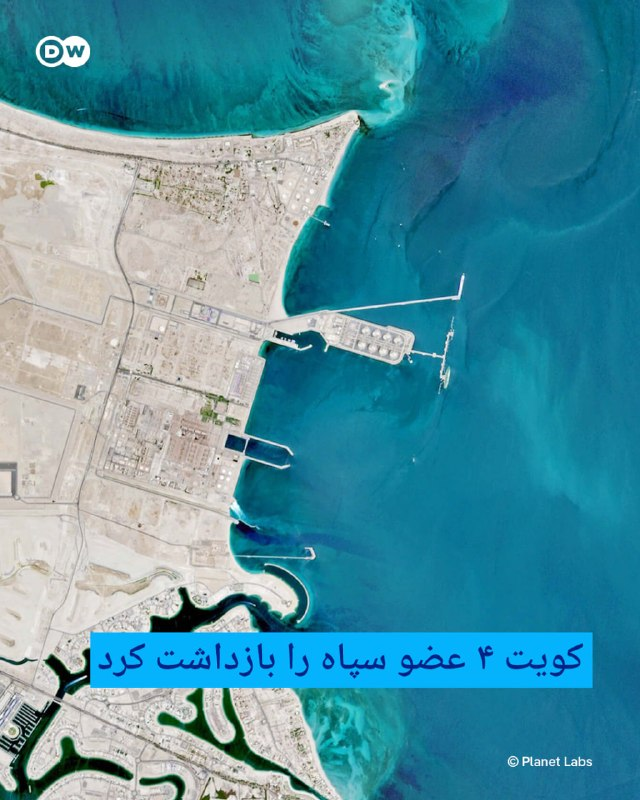

🔶 کویت ۴ عضو سپاه را بازداشت کرد

خبرگزاری دولتی کویت (KUNA) گزارش داد که این کشور، چهار عضو سپاه پاسداران انقلاب اسلامی را که گفته می‌شود تلاش داشتند برای "انجام اقدامات خصمانه" وارد این کشور عربی حاشیه خلیج فارس شوند، بازداشت کرده است.

بر اساس این گزارش، این چهار نفر روز اول مه (۱۱ اردیبهشت) با یک قایق ماهیگیری تلاش کردند وارد کویت شوند و در جریان آن، با نیروهای نظامی کویت درگیر شدند که در نتیجه، یک سرباز کویتی زخمی شد.

این نخستین تلاش شناخته‌شده حکومت ایران برای نفوذ نظامی به یکی از کشورهای همسایه خود در ارتباط با جنگ اخیر به شمار می‌رود. خبرگزاری دولتی کویت، نام چهار فرد بازداشت‌شده، از جمله درجه‌های نظامی آن‌ها را نیز منتشر کرده است.

در همین راستا وزارت کشور کویت اعلام کرد این چهار نفر اعتراف کرده‌اند که از سوی سپاه پاسداران ماموریت داشتندبه جزیره بوبیان، یکی از مراکز مهم تجاری و لجستیکی، نفوذ کنند تا "ماموریتی شامل انجام اقدامات خصمانه علیه کویت" را اجرا کنند. بوبیان بزرگ‌ترین جزیره کشور کویت و دومین جزیره بزرگ در خلیج فارس پس از قشم است.

@dw_farsi

## DW_Farsi — post 124617

🔶 از کلاس درس تا چوبه دار؛ سرکوب نسل جوان در ایران

🔺 گزارشی از آتفه چهارمحالیان

در ماه‌های اخیر، پس از وقایع دی‌ماه ۱۴۰۴ و هم‌زمان با جنگ ایران با آمریکا و اسرائیل و تشدید فضای امنیتی در خیابان‌ها و دانشگاه‌ها، بار دیگر نوجوانان و جوانان ایران به یکی از هدف‌های اصلی سرکوب جمهوری اسلامی بدل شده‌اند.

موج تازه بازداشت‌ها، پرونده‌سازی‌های امنیتی و اعدام‌ها نشان می‌دهد حاکمیت در مواجهه با بحران‌های سیاسی و نظامی، بار دیگر به سراغ نسلی رفته که در سال‌های اخیر به یکی از فعال‌ترین نیروهای اعتراض تبدیل شده است؛ نسلی که حکومت، صدا، شیوه زیست و خواست‌های او را در تعارض با نظم سیاسی می‌بیند.

سازمان ملل اعلام کرده است که از آغاز جنگ اخیر تاکنون بیش از چهار هزار نفر در ایران با اتهام‌های امنیتی بازداشت شده‌اند و نهادهای حقوق بشری گزارش داده‌اند نوجوانان و جوانان نیز در میان بازداشت‌شدگان قرار داشته‌اند. گزارش‌های منتشرشده از شکنجه، ناپدیدسازی‌های قهری، اعترافات اجباری، مرگ در بازداشت و محاکمه‌های شتاب‌زده، تصویری از سرکوب نسلی ارائه می‌دهد که جمهوری اسلامی آن را بیش از هر زمان دیگری خارج از کنترل خود می‌بیند.

در ماه‌های گذشته چندین نوجوان و جوان معترض در معرض اجرای حکم اعدام قرار گرفتند؛ پرونده‌هایی که به گفته نهادهای حقوق بشری بر پایه اعترافات ناشی از شکنجه شکل گرفته‌اند.

📌 برای دسترسی کامل به گزارش به وبسایت دویچه‌وله فارسی مراجعه کنید.

@dw_farsi

## DW_Farsi — post 124616

  

🔶 ترامپ: ایران غنی‌سازی اورانیوم را "صددرصد" متوقف خواهد کرد

دونالد ترامپ، رئیس ‌جمهور ایالات متحده آمریکا در یک مصاحبه با شبکه WABC گفت اطمینان دارد که ایران غنی‌سازی اورانیوم را متوقف خواهد کرد و هرگونه تلاش برای ساخت سلاح هسته‌ای را کنار می‌گذارد.

اظهارات ترامپ در شرایطی بیان می‌شود که مذاکرات میان آمریکا و جمهوری اسلامی همچنان در بن‌بست قرار دارد.

ترامپ در این مصاحبه در پاسخ به این پرسش که آیا به باور او می‌توان مانع غنی‌سازی اورانیوم و ساخت بمب از سوی جمهوری اسلامی شد، گفت: «صد درصد آن‌ها متوقف خواهند شد.»

ترامپ همچنین گفت که مستقیما با مقام‌های حکومت ایران در جریان مذاکرات در ارتباط بوده است. رئیس جمهور آمریکا افزود: «من با آن‌ها سروکار دارم. و آن‌ها گفتند که ما غبار را [از آن‌ها] خواهیم گرفت. من به آن غبار هسته‌ای می‌گویم، چون اسم مناسبی است و ما آن را خواهیم گرفت.»

منظور ترامپ از "غبار هسته‌ای" ۴۰۰ کیلوگرم اورانیوم با غنای بیش از ۶۰ درصد است که یکی از موارد مناقشه اصلی میان ایران و آمریکاست.

ترامپ در عین حال با اشاره به این که "ایالات متحده نیازی ندارد برای دستیابی به توافق عجله کند" گفت: «ما قرار نیست برای هیچ‌چیز عجله کنیم، ما [اهرم] محاصره را در اختیار داریم.»رئیس‌ جمهور آمریکا همزمان روز سه‌شنبه با انتشار پستی در شبکه "تروث سوشال"، دو تصویر گرافیکی را به اشتراک گذاشت که در آن‌ها، حمله به پهپادها و قایق‌های موسوم به قایق تندروی سپاه نشان داده شده‌اند.

@dw_farsi

## DW_Farsi — post 124615

  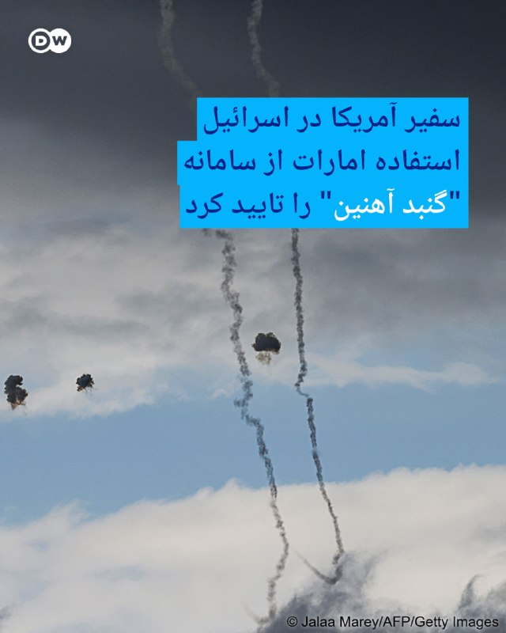

🔶 سفیر آمریکا در اسرائیل استفاده امارات از سامانه "گنبد آهنین" را تایید کرد

مایک هاکبی، سفیر ایالات متحده آمریکا در اسرائیل با بیان این که "امارات متحده عربی، از توافق‌نامه‌های ابراهیم و عادی‌سازی روابط با اسرائیل، سود برده است" از به‌کار‌گیری سامانه دفاع موشکی "گنبد آهنین" اسرائیل در امارات برای مقابله با موشک‌های پرتاب شده از ایران در جریان جنگ خبر داد.

هاکبی با اشاره به پیامدهای حاصل از پیمان ابراهیم برای امارات گفت: «فقط نگاهی به مزایای آن بیندازید. اسرائیل همین حالا سامانه‌های گنبد آهنین و نیروهایی را برای کمک به بهره‌برداری از آن‌ها برایشان فرستاده است.»

امارات متحده عربی در چارچوب توافق‌نامه‌های ابراهیم که در سال ۲۰۲۰ با میانجی‌گری ایالات متحده آمریکا انجام شد، اسرائیل را به رسمیت شناخت.

پیش از این فایننشال تایمز گزارش داده بود که اسرائیل برای کمک به دفاع از امارات، سامانه شناسایی سبک "اسپکترو" و سامانه پدافند موشکی را همراه با ده‌ها نیروی نظامی به این کشور فرستاده است. این گزارش، استقرار این تجهیزات را یکی از نخستین نمونه‌های بزرگ همکاری دفاعی میان اسرائیل و امارات می‌داند؛ همکاری‌ای که در جنگ اخیر برای نخستین بار در مقیاسی گسترده آزموده شد.

@dw_farsi

## DW_Farsi — post 124614

  

🔶 قوه قضاییه از توقیف اموال بیش از ۴۰۰ چهره خارج از کشور خبر داد

خبرگزاری مهر وابسته به سازمان تبلیغات اسلامی، به نقل از قوه قضاییه از توقیف اموال و دارایی‌های بیش از ۴۰۰ نفر از جمله خبرنگاران شبکه‌های "اینترنشنال" و "من‌وتو" خبر داد و مدعی شد که این افراد، "در همکاری با رژیم‌های متخاصم خسارت به زیرساخت‌ها و امنیت ملی وارد کردند".

بر اساس این گزارش، این اقدام در ادامه "دستور مقام قضایی و در راستای قانون تشدید مجازات جاسوسی" صورت گرفته و خبرنگاران یادشده، به همکاری با اسرائیل و "کشورهای متخاصم علیه امنیت و منافع ملی" متهم شده‌اند.

این گزارش، با اشاره به توقیف اموال ثبتی و دارایی‌های این افراد، آن‌ها را بیش از ۴۰۰ نفر از ایرانیان خارج از جمله "عده‌ای از بازیگران، ورزشکاران، مدیران و خبرنگاران" شبکه اینترنشنال و شبکه من‌وتو عنوان کرده است.

قوه قضاییه مدعی شده است که این افراد "در همکاری با دولت‌های متخاصم موجبات ایجاد خسارات گسترده‌ای به زیرساخت‌ها و مکان‌های عمومی نظیر مدارس، دانشگاه‌ها، مراکز تحقیقاتی، مراکز صنعتی و ... را فراهم کرده‌اند."

از زمان آغاز حملات نظامی آمریکا و اسرائیل به ایران در روز ۹ اسفندماه ۱۴۰۴، گزارش‌ها از افزایش بازداشت‌ها، اعدام‌ها و فشار بر فعالان رسانه‌ای و مدنی حکایت دارد. سازمان‌های حقوق بشری نیز نسبت به استفاده از مجازات‌هایی چون اعدام و مصادره اموال به عنوان ابزار سرکوب هشدار داده‌اند.

در این چارچوب، مصادره گسترده اموال را می‌توان بخشی از راهبردی دانست که در آن، جنگ خارجی بهانه‌ای برای بازتعریف و تشدید فشار داخلی شده است. در حالی که حکومت از "مذاکره" و "آتش‌بس" سخن می‌گوید، اقدامات عملی نشان می‌دهد که سطح تقابل با منتقدان و مخالفان نه تنها کاهش نیافته، بلکه در حال گسترش است.

@dw_farsi

## DW_Farsi — post 124613

🔶 هک با قدرت هوش مصنوعی؛ تهدیدی جدی در ابعاد جهانی

بر اساس یک گزارش گوگل، اقدامات هکرها با استفاده از قدرت هوش مصنوعی ، تنها در عرض سه ماه، از یک مشکل نوظهور به یک تهدید جدی در مقیاس وسیع تبدیل شده است.

گزارش‌های پیشین نشان داده بودند که جدیدترین مدل‌های هوش مصنوعی فراتر از حد تصور در کدنویسی توانمند هستند. این مدل‌ها در حال حاضر، به ابزارهایی بسیار قدرتمند برای سوءاستفاده از آسیب‌پذیری‌ سیستم‌ها تبدیل شده‌اند و طیف گسترده‌ای از سامانه‌های نرم‌افزاری را به خطر انداخته‌اند.

این گزارش همچنین دریافته است که گروه‌های تبهکار، همراه با عوامل بین‌المللی وابسته به دولت‌های چین، کره شمالی و روسیه، به طور گسترده از مدل‌های تجاری از جمله جمینای، کلود و ابزارهای شرکت اوپن‌ای‌آی برای بهبود و گسترش حملات استفاده می‌کنند.

به گزارش گاردین، یک کارشناس که در تدوین این گزارش نقش داشته می‌گوید این که چنین چیزی در آینده نزدیک رخ خواهد داد، تصوری اشتباه است. به گفته او "واقعیت این است که این روند همین حالا آغاز شده است".

@dw_farsi

## DW_Farsi — post 124612

🔶 تشکیل دادگاه نظامی در اسرائیل برای عاملان حمله هفت اکتبر

پارلمان اسرائیل شامگاه دوشنبه ۱۱ مه (۲۱ اردیبهشت) قانونی را تصویب کرد که بر اساس آن، یک دادگاه نظامی ویژه تشکیل خواهد شد تا صدها جنگجوی فلسطینی، به دلیل مشارکت در حمله تروریستی هفتم اکتبر ۲۰۲۳، در آن محاکمه شوند.

این قانون جدید با اکثریت ۹۳ رأی موافق، از مجموع ۱۲۰ نماینده کنست، تصویب شد. این طرح از سوی نمایندگانی از هر دو جناح ائتلاف حاکم و اپوزیسیون ارائه شده بود. نمایندگان پارلمان گفتند که این اقدام به التیام "ضربه روحی ملی" ناشی از آن حمله کمک خواهد کرد.

هدف این قانون آن است که تمامی مهاجمان ۷ اکتبر، بر اساس قوانین کیفری موجود اسرائیل، به اتهام‌هایی چون "جنایت علیه ملت یهود"، "جنایت علیه بشریت" و "جنایت جنگی" تحت پیگرد قرار گیرند.

به گفته اسرائیل، در حمله غافلگیرانه نیروهای موسوم به "نخبه" حماس در هفتم اکتبر ۲۰۲۳، دست‌کم ۱۲۰۰ نفر کشته شدند که بیشتر آنها غیرنظامی بودند. مهاجمان همچنین ۲۵۱ گروگان را به نوار غزه منتقل کردند. این روز، مرگبارترین روز تاریخ اسرائیل و شدیدترین حمله علیه یهودیان از زمان هولوکاست تاکنون توصیف شده است.

@dw_farsi

## DW_Farsi — post 124611

🔶 تبعیض دیجیتال در ایران زیر سایه جنگ؛ جدال بر سر اینترنت پرو

بیش از هفتاد روز پس از آغاز قطع گسترده اینترنت در ایران هم‌زمان با شروع جنگ آمریکا و اسرائیل علیه جمهوری اسلامی در نهم اسفند ۱۴۰۴، بحران دسترسی به شبکه جهانی از سطح محدودیتی امنیتی فراتر رفته و به مسئله‌ای سیاسی، اقتصادی و طبقاتی تبدیل شده است.

نت‌بلاکس پیش‌تر اعلام کرده بود که این قطعی در ششم اردیبهشت وارد پنجاه و هشتمین روز پیاپی شده و تا هشتم ماه مه از مرز هفتاد روز گذشته است؛ وضعیتی که به گفته این نهاد، گزارش‌دهی مستقل، ارتباطات عمومی و دسترسی مردم به اطلاعات جهانی را مختل کرده است.

هم‌زمان با این قطعی گسترده، موضوع "اینترنت پرو"، "خط سفید" و "سیم‌کارت سفید" نیز به نشانه‌ای آشکار از تبعیض دیجیتال بدل شده است. اکثریت شهروندان با اینترنت محدود، فیلترشکن‌های پرهزینه و اختلال دائمی روبرو هستند، اما گروه‌هایی خاص، از کسب‌وکارهای منتخب تا برخی چهره‌های رسانه‌ای و سیاسی، به مسیرهایی جداگانه برای دسترسی به اینترنت جهانی دست یافته‌اند.

@dw_farsi

## DW_Farsi — post 124601

📸 مروری بر مهم‌ترین حضورهای ایران در جشنواره سینمایی کن

هم‌زمان با آغاز جشنواره فیلم کن ۲۰۲۶ و نمایش دو فیلم ایرانی "داستان‌های موازی" ساخته اصغر فرهادی و "تمرین‌هایی برای یک انقلاب" به کارگردانی پگاه آهنگرانی، نگاهی داریم به مهم‌ترین فیلم‌های ایرانی که در سال‌های گذشته در این جشنواره حضور داشته‌اند.

از نخل طلای "طعم گیلاس" عباس کیارستمی تا موفقیت‌های اصغر فرهادی، جعفر پناهی و محمد رسول‌اف، سینمای ایران بارها در کن دیده شده و جوایز مهمی به دست آورده است.

این گالری مروری است بر فیلم‌ها، بازیگران و لحظه‌هایی که نام ایران را در یکی از مهم‌ترین جشنواره‌های سینمایی جهان ماندگار کردند.

@dw_farsi

## Persian_Trend_Official — post 13998

  

🔴سرلشگر جعفری :

تا زمانی که پیش شرط ها محقق نشود مذاکره ای انجام نخواهد شد

🫆:Tony

📌 @persian_trend_official
پرشین ترند | متفاوت‌ترین کانال نظامی

## Persian_Trend_Official — post 13997

  

یک مقام ارشد نیروی دریایی سپاه پاسداران انقلاب اسلامی اعلام کرده است که ایران تعریف خود از تنگه هرمز را به یک «منطقه عملیاتی گسترده» تغییر داده؛ تعریفی که به‌مراتب وسیع‌تر از نگاه پیش از جنگ توصیف می‌شود.
به گزارش خبرگزاری فارس در روز سه‌شنبه ۲۲ اردیبهشت، محمد اکبرزاده، معاون سیاسی نیروی دریایی سپاه، تأکید کرد که تنگه هرمز دیگر صرفاً یک آبراه محدود در اطراف چند جزیره نیست و ابعاد و اهمیت نظامی آن به‌طور قابل توجهی گسترش یافته است.
او اظهار داشت: «در گذشته، تنگه هرمز به‌عنوان محدوده‌ای محدود پیرامون جزایری مانند هرمز و هنگام تعریف می‌شد، اما امروز این رویکرد تغییر کرده است.»
بر اساس این گزارش، مقامات رسمی ایران تاکنون به درخواست خبرگزاری رویترز برای ارائه توضیحات بیشتر در این خصوص پاسخی نداده‌اند.

☆Phantom☆

📌 @persian_trend_official
پرشین ترند | متفاوت‌ترین کانال نظامی

## Persian_Trend_Official — post 13996

  <a href="telegram/content/Persian_Trend_Official_13996_1778610716.webm" target="_blank">🎬 Download video</a>

⭕️ شاهزاده رضا پهلوی: به جای توافق با رژیم، بهتر است یک‌بار برای همیشه از شر آن خلاص شوید. جهان امروز در برابر چنین انتخابی قرار دارد.

📝 Nick

📌 @persian_trend_official
پرشین ترند | متفاوت‌ترین کانال نظامی

## Persian_Trend_Official — post 13995

  <a href="telegram/content/Persian_Trend_Official_13995_1778610717.mp4" target="_blank">🎬 Download video</a>

⭕️ خوش‌چشم، کارشناس ارشد صداوسیما:

این دفعه جنگ بشه اصلا مهم نیست ساختمون اینتل تو اسرائیل چند طبقه زیر زمینه، کل دیتاسنترهای اینتل میخوره، پروژه مشترک گوگل و آمازونم که میخوره، بقیشم هرچی هست میخوره.

📝 Nick

📌 @persian_trend_official
پرشین ترند | متفاوت‌ترین کانال نظامی

## Persian_Trend_Official — post 13994

  <a href="telegram/content/Persian_Trend_Official_13994_1778610720.mp4" target="_blank">🎬 Download video</a>

⭕️ سناتور گراهام: اگر میانجی (پاکستان) اجازه می‌دهد هواپیماهای شناسایی در پایگاه‌های هوایی پاکستان پارک شوند، فکر می‌کنید این با نقش میانجی منصفانه سازگار است؟

وزیر جنگ هگسث: من نمی‌خواهم وسط این مذاکرات قرار بگیرم.

سناتور گراهام: خب، من می‌خواهم وسط این مذاکرات قرار بگیرم. من به پاکستان به اندازه‌ای که بتوانم آنها را پرتاب کنم اعتماد ندارم.

اگر واقعاً هواپیماهای ایرانی در پایگاه‌های پاکستانی برای محافظت از دارایی‌های نظامی ایران پارک شده‌اند، این به من می‌گوید که شاید باید به دنبال شخص دیگری برای میانجیگری باشیم. جای تعجب نیست که این لعنتی به جایی نمی‌رسد.

📝 Nick

📌 @persian_trend_official
پرشین ترند | متفاوت‌ترین کانال نظامی

## Persian_Trend_Official — post 13993

https://youtube.com/live/rrGzLhyQoaY?feature=share

## Persian_Trend_Official — post 13992

❤️ اگر از مخاطبان پرشین ترند هستید و تلگرام پرمیوم دارید،
با بوست کردن کانال کمک بزرگی به رشد و دیده‌شدن بیشتر پرشین ترند می‌کنید.
این بوست‌ها باعث می‌شود امکانات بیشتری برای انتشار محتوا، استوری و قابلیت‌های ویژه کانال فعال شود و در شرایط فعلی، به ادامه پوشش سریع و تحلیل‌های روزانه کمک زیادی می‌کند.
🙏 اگر مایل بودید، از طریق لینک زیر کانال را بوست کنید:
https://t.me/boost/persian_trend_official
📌 @persian_trend_official
پرشین ترند | متفاوت‌ترین کانال نظامی

## Persian_Trend_Official — post 13991

لایو امشب ساعت 21 به وقت تهران شروع میشه

## Persian_Trend_Official — post 13990

  <a href="telegram/content/Persian_Trend_Official_13990_1778610722.webm" target="_blank">🎬 Download video</a>

🔴 اختصاصی |تورم آمریکا بالاتر از انتظار ثبت شد

تورم آمریکا در ماه آوریل بار دیگر شتاب گرفت؛ موضوعی که تحت تأثیر افزایش قیمت بنزین، مواد غذایی و تبعات جنگ ایران رخ داده است.

بر اساس داده‌های منتشرشده:

▪️ نرخ تورم سالانه آمریکا به ۳.۸ درصد رسید
▪️ بازار انتظار عدد ۳.۷ درصدی را داشت
▪️ این سریع‌ترین رشد تورم از سال ۲۰۲۳ محسوب می‌شود

همچنین:

▪️ تورم ماهانه ۰.۶ درصد ثبت شد
▪️ تورم هسته ماهانه به ۰.۴ درصد رسید
▪️ تورم هسته سالانه نیز ۲.۸ درصد اعلام شد
▪️ هر دو شاخص هسته بالاتر از پیش‌بینی‌ها بودند

افزایش قیمت:

انرژی
بلیت هواپیما
و مواد غذایی

نشان می‌دهد فشارهای تورمی ممکن است در ماه‌های آینده نیز ادامه پیدا کند؛ حتی در صورت حفظ آتش‌بس یا کاهش تنش‌ها در تنگه هرمز

🫆:Tony

📌 @persian_trend_official
پرشین ترند | متفاوت‌ترین کانال نظامی

## Persian_Trend_Official — post 13989

🔴احضار سفیر جمهوری اسلامی به وزارت خارجه کویت

💢وزارت امور خارجه کویت عصر امروز در بیانیه‌ای اعلام کرد سفیر جمهوری اسلامی را احضار و یادداشت اعتراضی به او تحویل داده شد.

💢وزاتخانه یادشده در توجیه احضار سفیر جمهور اسلامی تأکید کرد این اقدام در پی آنچه «نفوذ گروهی از سپاه پاسداران به بوبیان و درگیری آنها با نیروهای کویتی» خوانده است، انجام گرفت.

🫆:Tony

📌 @persian_trend_official
پرشین ترند | متفاوت‌ترین کانال نظامی

## Persian_Trend_Official — post 13988

  

پیت هگست: آتش‌بس با ایران در حال اجراست
 

💢آتش‌بس با ایران در «وضعیت بسیار پویا» قرار دارد و در حال اجرا ست.
 
💢آتش‌بس به معنای توقف آتش‌پرانی است و می‌دانیم این اتفاق در حین مذاکرات رخ داده است و گفتگوهای مختلف بسیاری با تیم مذاکره ‌کننده ما در حال انجام است.

🫆:Tony

📌 @persian_trend_official
پرشین ترند | متفاوت‌ترین کانال نظامی

## Persian_Trend_Official — post 13987

🔴 دو وزیر دولت بریتانیا در اعتراض به استارمر استعفا دادند

💢گزارش‌ها حاکی است دو وزیر دولت بریتانیا در مخالفت با سیاست‌ها و عملکرد «کی یر استارمر» از سمت خود استعفا داده‌اند.

💢این استعفاها در حالی رخ می‌دهد که فشارهای سیاسی بر نخست‌وزیر بریتانیا افزایش یافته و پیش‌تر نیز گزارش‌هایی درباره نارضایتی گسترده در حزب کارگر منتشر شده بود.

🫆:Tony

📌 @persian_trend_official
پرشین ترند | متفاوت‌ترین کانال نظامی

## Persian_Trend_Official — post 13986

  <a href="telegram/content/Persian_Trend_Official_13986_1778610723.mp4" target="_blank">🎬 Download video</a>

🔴 وزارت دفاع روسیه تصاویر آزمایش موشک «سارمات» را منتشر کرد

وزارت دفاع روسیه ویدئویی از آزمایش موشک بالستیک قاره‌پیمای «سارمات» منتشر کرده است؛ موشکی که از آن به‌عنوان یکی از قدرتمندترین تسلیحات راهبردی هسته‌ای روسیه یاد می‌شود.

بر اساس گزارش‌ها:

▪️ «سارمات» یک موشک بالستیک قاره‌پیما با قابلیت حمل چندین کلاهک هسته‌ای است

▪️ ناتو این موشک را با نام «شیطان ۲» می‌شناسد

▪️ روسیه اعلام کرده این سامانه برای عبور از سپرهای موشکی طراحی شده است

️▪️ برد این موشک بین ۱۰ تا ۱۸ هزار
کیلومتر اعلام شده است

🫆:Tony

📌 @persian_trend_official
پرشین ترند | متفاوت‌ترین کانال نظامی

## Persian_Trend_Official — post 13984

🔴 عبور نفتکش‌های قطری از تنگه هرمز تأیید شد

در حالی که روز گذشته برخی گزارش‌ها مدعی شده بودند نفتکش قطری «مهزم» توسط ایران از تنگه هرمز بازگردانده شده، داده‌های جدید نشان می‌دهد این نفتکش دقایقی پیش موقعیت خود را در دریای عمان ثبت کرده و از مسیر تعیین‌شده عبور کرده است.

بر اساس گزارش‌ها:

▪️ نفتکش «مهزم» موفق به عبور از تنگه هرمز شده است
▪️ بلومبرگ نیز عبور دومین نفتکش حامل گاز طبیعی قطر از مسیر تعیین‌شده ایران را تأیید کرده است
▪️ عبور این کشتی‌ها در شرایط تنش شدید امنیتی در منطقه انجام شده است

🫆:Tony

📌 @persian_trend_official
پرشین ترند | متفاوت‌ترین کانال نظامی

## Persian_Trend_Official — post 13983

  <a href="telegram/content/Persian_Trend_Official_13983_1778610725.mp4" target="_blank">🎬 Download video</a>

🔴 رزمایش ضد هلی‌برن سپاه؛ بدون وجود پدافند هوایی

💢تصاویر منتشرشده از رزمایش «قائد شهید» سپاه تهران، استفاده از:
▪️ پهپادهای انتحاری
▪️ تک‌تیراندازها
▪️ مسلسل‌های سنگین سوار بر وانت تجاری

▪️ آرپی‌جی ۷

▪️ و توپ بدون لگد را نشان می‌دهد.

💢اما یک سؤال مهم مطرح است:
اگر هدف رزمایش مقابله با عملیات هلی‌برن دشمن بوده، چرا تمرینی برای هدف‌گیری بالگردها و اهداف پروازی با موشک‌های دوش‌پرتاب دیدهنمی‌شود؟

💢قاعدتاً جلوگیری از رسیدن و فرود دشمن، بسیار مؤثرتر از ورود به نبرد زمینی پس از پیاده‌سازی نیروهاست.

💢نکته مهم دیگر این است که ارتش آمریکا در صورت اجرای چنین عملیاتی، تنها از بالگرد ترابری استفاده نمی‌کند و عملیات معمولاً با:
▪️ پوشش هوایی
▪️ پهپادهای شناسایی
▪️ جنگ الکترونیک
▪️ و پشتیبانی آتش همراه خواهد بود.

💢به همین دلیل برخی تحلیلگران معتقدند این رزمایش بیشتر بر درگیری زمینی پس از فرود دشمن تمرکز داشته تا مقابله کامل با یک عملیات هوابرد مدرن.

🫆:Tony

📌 @persian_trend_official
پرشین ترند | متفاوت‌ترین کانال نظامی

## Persian_Trend_Official — post 13982

  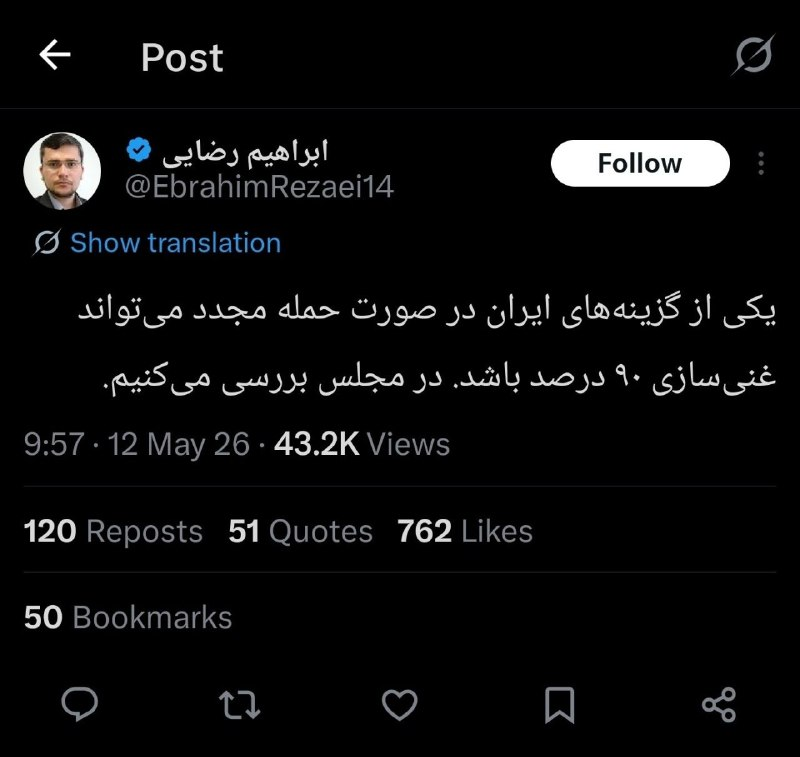

سخنگوی كميسيون امنيت ملی مجلس: غنی‌سازی ۹۰ درصدی اورانیوم در مجلس بررسی خواهد شد.

☆Phantom☆

📌 @persian_trend_official
پرشین ترند | متفاوت‌ترین کانال نظامی

## Persian_Trend_Official — post 13981

  

🚨🇺🇸🇮🇷 آخرین مقاومت سپاه پاسداران: این قایق‌ها تنها چیزی بود که برایشان باقی مانده بود.

☆Phantom☆

📌 @persian_trend_official
پرشین ترند | متفاوت‌ترین کانال نظامی

## Persian_Trend_Official — post 13979

  <a href="telegram/content/Persian_Trend_Official_13979_1778610729.webm" target="_blank">🎬 Download video</a>

اگر اینترنت غزه، اوکراین یا هرجایی که حمایت از آن برای حامی‌نماهای حقوق بشر "ویترین اخلاقی" داشته باشد فقط ۷ روز قطع میشد، دنیا را روی سرشان خراب می‌کردند؛ اما اینترنت ایران ۷۴ روز است عملاً قطع شده و آب از آب تکان نخورده است.

فکر می‌کنید اتفاق خاصی افتاده؟ خیر.
ضریب دسترسی واقعی به اینترنت آزاد در ایران به گواه نت‌بلاکس به حدود ۲ درصد رسیده؛ میلیون‌ها انسان نه ۷ روز، بلکه ۷۴ روز عملاً در یک زندان دیجیتال گروگان گرفته شده‌اند و همزمان که جمهوری اسلامی در پشت پرده به سرکوب، بازداشت و اعدام مشغول است، آشغالی به نام "اینترنت پرو" را به‌عنوان راه‌حل به مردم می‌فروشد، که عقیم‌سازی عمدی دسترسی آزاد به اطلاعات و نقض آشکار حقوق انسانی و حریم خصوصی شهروندان است.

ظاهراً برای جهان مدعی آزادی، فقط آن دسته از رنج‌هایی دیده می‌شوند که موضع‌گیری برایش هزینه‌ای نداشته باشد، یا چشم‌های مردمانش رنگی باشد.

📝 Nick

📌 @persian_trend_official
پرشین ترند | متفاوت‌ترین کانال نظامی

## Persian_Trend_Official — post 13978

💢خلاصه اخرین تحولات مهم

▪️دونالد ترامپ، رئیس‌جمهور آمریکا، اعلام کرد آتش‌بس با ایران «روی دستگاه حفظ حیات» قرار دارد و پیشنهاد اخیر تهران برای پایان جنگ را «کاملاً غیرقابل قبول» و «مزخرف» توصیف کرد.

▪️ قطر ایران را متهم کرد که از تنگه هرمز به‌عنوان ابزار فشار و «باج‌گیری» علیه کشورهای خلیج فارس استفاده می‌کند؛ در حالی که صادرات انرژی و کالاها همچنان با اختلال مواجه است

▪️ محمدباقر قالیباف، رئیس مجلس ایران، گفت تهران برای پاسخ به «هرگونه تجاوز» آماده است و واکنش ایران آمریکا را «غافلگیر» خواهد کرد

▪️ اتحادیه اروپا با اعمال تحریم‌های جدید علیه شهرک‌نشینان اسرائیلی به‌دلیل خشونت علیه فلسطینیان در کرانه باختری موافقت کرد؛ اقدامی که نتانیاهو گفته «موفق نخواهد شد»

▪️ شمار قربانیان جنگ غزه به ۷۲ هزار و ۷۴۰ نفر رسیده است

▪️ لبنان نیز اعلام کرد حملات اسرائیل از دوم مارس تاکنون ۲۸۶۹ کشته در این کشور برجای گذاشته است

🫆:Tony

📌 @persian_trend_official
پرشین ترند | متفاوت‌ترین کانال نظامی

## RadioFarda — post 157103

🔸داده‌های کشتیرانی بورس لندن، ال‌اس‌ای‌جی، نشان می‌دهد که دومین نفتکش گاز طبیعی مایع (ال‌ان‌جی) متعلق به قطر روز سه‌شنبه با موفقیت از تنگه هرمز عبور کرده است. 🔸این اتفاق چند روز پس از آن رخ داده که نخستین محموله از این نوع، با مشارکت ایران و پاکستان، از این…

## RadioFarda — post 157102

  

🔸داده‌های کشتیرانی بورس لندن، ال‌اس‌ای‌جی، نشان می‌دهد که دومین نفتکش گاز طبیعی مایع (ال‌ان‌جی) متعلق به قطر روز سه‌شنبه با موفقیت از تنگه هرمز عبور کرده است.

🔸این اتفاق چند روز پس از آن رخ داده که نخستین محموله از این نوع، با مشارکت ایران و پاکستان، از این آبراه عبور کرده بود.

🔸بر اساس داده‌های ال‌اس‌ای‌جی، کشتی «میهزم» با ظرفیت ۱۷۴ هزار متر مکعب، روز دوشنبه بندر رأس لفان را ترک و روز سه‌شنبه از تنگه هرمز عبور کرد و به‌سوی بندر قاسم پاکستان رفت؛ جایی که انتظار می‌رود اواخر همان روز به آن برسد. این دومین عبور موفق یک نفتکش گاز طبیعی مایع قطری از هرمز از زمان آغاز جنگ ایران است.

🔸روز شنبه، نفتکش«الخریطیات» عبور از تنگه هرمز را از طریق مسیر شمالی مورد تأیید ایران آغاز کرد و روز یکشنبه موفق شد از این آبراه عبور کند. طبق داده‌های بورس لندن، این کشتی اکنون در نزدیکی بندر قاسم لنگر انداخته است.

@RadioFarda

## RadioFarda — post 157101

تشدید فشار بر نخست‌وزیر بریتانیا برای کناره‌گیری؛ استارمر می‌گوید قصد استعفا ندارد

🔸شکست سنگین حزب کارگر بریتانیا در انتخابات شوراهای محلی انگلستان و پارلمان‌های اسکاتلند و ولز، کابوسی را برای نخست‌وزیر بریتانیا رقم زده که گویی پایانی ندارد.

🔸صبح روز سه‌شنبه ۲۲ اردیبهشت‌ماه، کی‌یر استارمر در حالی در خانۀ شماره ۱۰ داونینگ‌‌استریت میزبان اعضای کابینه‌اش بود که می‌دانست دست‌کم ۸۰ تن از نمایندگان حزب کارگر، یعنی تقریباً یکی از هر پنچ نماینده این حزب در پارلمان، خواستار کناره‌گیری او از مقام صدارت شده‌اند؛ یا بلافاصله و یا بر اساس یک برنامۀ زمانبندی مشخص.

🔸در حالی‌که قرار است چارلز سوم پادشاه بریتانیا، روز چهارشنبه در مراسم سنتی افتتاح پارلمان، سخنرانی و برنامه‌های دولت کی‌یر استارمر برای یک‌سال آینده را اعلام کند، مشخص نیست چقدر از عمر این دولت باقی مانده باشد.

🔸پیش از ظهر سه‌شنبه کی‌یر استارمر در جلسۀ کابینه، تأکید کرد که کناره‌گیری نخواهد کرد و قصد دارد به رغم «۴۸ ساعت ناخوشایند گذشته»، رهبری کشور و تلاش برای اجرای برنامه‌های دولت کارگری را ادامه دهد.

🔸این وکیل حقوق بشر که کمتر از دو سال از نخست‌وزیری‌اش می‌گذرد، در جلسۀ کابینه تکرار کرد که گرچه مسئولیت شکست سنگین حزبش در انتخابات آخر هفتۀ قبل را می‌پذیرد، هنوز دلیل قاطعی برای کناره‌گیری نمی‌بیند.

🔸در این جلسه چندین تن از معاونان وزرا و اعضای ارشد کابینه بر ادامۀ حمایت از کی‌یر استارمر تأکید کردند.

🔸با وجود این دقایقی پس از پایان جلسه کابینه، جِس فیلیپس و الکس دیویس-جونز، دو معاون وزیر با انتشار مطالبی در شبکۀ ایکس از کناره‌گیری خود از مقام دولتی خبر دادند. پیش از این دو، میاتا فَنبوله، معاون وزیر در امور جوامع و اقلیت‌ها هم از تصمیمش برای کناره‌گیری از دولت خبر داده بود. اقدامی که با کناره‌گیری ربیر احمد معاون وزیر بهداشت دنبال شد.

🔸در همین حال همراهی شعبانه محمود وزیر کشور کابینۀ کی‌یر استارمر با نمایندگانی که خواهان کناره‌گیری نخست‌وزیر شده‌اند، می‌تواند برای رهبر حزب گران تمام شود.

🔸به گفتۀ منابع نزدیک به داونینگ استریت، انتظار می‌رود در ساعات آینده تعداد بیشتری از اعضای دولت از کناره‌گیری خود خبر داده و خواهان تغییر در رأس حزب کارگر شوند.

🔸گزارش کامل را در وب‌سایت رادیوفردا بخوانید.

@RadioFarda

## RadioFarda — post 157100

  

🔸الناز محمدی، روزنامه‌نگار ایرانی و دبیر گروه اجتماعی روزنامه «هم‌میهن»، در فهرست نامزدهای جایزه آزادی مطبوعات سازمان گزارشگران بدون مرز قرار گرفت.

🔸گزارشگران بدون مرز اعلام کرده است که الناز محمدی در بخش «شجاعت» نامزد این جایزه شده؛ بخشی که به روزنامه‌نگاران و رسانه‌هایی تعلق می‌گیرد که در شرایطی دشوار و با وجود خطر برای امنیت و آزادی‌شان به فعالیت ادامه داده‌اند.

🔸در توضیح این نامزدی آمده است که او پس از اعتراضات «زن، زندگی، آزادی» و پوشش پیامدهای اجتماعی آن، در سال ۲۰۲۳ بازداشت و به سه سال زندان محکوم شد. گزارشگران بدون مرز همچنین به فشارهای قضایی، زندان و محرومیت شغلی علیه او اشاره کرده است.

🔸مراسم اعلام برندگان جوایز آزادی مطبوعات سال ۲۰۲۶ روز ۱۱ خرداد در شهر مارسی فرانسه و همزمان با کنگره جهانی رسانه برگزار خواهد شد.

@RadioFarda

## RadioFarda — post 157099

  <a href="https://t.me/radiofarda/157099" target="_blank">📎 Download file</a>

📻بشنوید: ایستگاه ۱۹ با رادیوفردا، ۲۲ اردیبهشت ۱۴۰۵

@RadioFarda

## RadioFarda — post 157098

🔸دونالد ترامپ، رئیس‌جمهور آمریکا، روز سه‌شنبه گفت که «۱۰۰ درصد» اطمینان دارد که ایران غنی‌سازی اورانیوم را متوقف خواهد کرد و ذخیره اورانیوم خود را به آمریکا تحویل خواهد داد. 🔸او در گفت‌وگو با برنامه رادیویی سید رازنبرگ اعلام کرد که ایرانی‌ها متعهد شده‌اند…

## RadioFarda — post 157097

  

🔸دونالد ترامپ، رئیس‌جمهور آمریکا، روز سه‌شنبه گفت که «۱۰۰ درصد» اطمینان دارد که ایران غنی‌سازی اورانیوم را متوقف خواهد کرد و ذخیره اورانیوم خود را به آمریکا تحویل خواهد داد.

🔸او در گفت‌وگو با برنامه رادیویی سید رازنبرگ اعلام کرد که ایرانی‌ها متعهد شده‌اند غنی‌سازی اورانیوم را متوقف کنند: «آن‌ها قرار است متوقف شوند، و به من گفتند که «غبار» را به ما خواهند داد.»

🔸«غبار» اصطلاحی است که ترامپ به دفعات برای اشاره به اورانیوم غنی‌شده بعد از حملات آمریکا در اول تیر ماه سال گذشته به تأسیسات هسته‌ای ایران در جریان جنگ ۱۲ روزه به کار می‌برد.

🔸رئیس‌جمهور آمریکا در بخش دیگری از این گفت‌وگوی رادیویی گفت: «ما لازم نیست برای هیچ‌چیز عجله کنیم. ما یک محاصره داریم که هیچ پولی برای آن‌ها باقی نمی‌گذارد. مسئله خیلی ساده است: ما نمی‌توانیم اجازه دهیم آن‌ها سلاح هسته‌ای داشته باشند، چون از آن استفاده خواهند کرد.»

@RadioFarda

## RadioFarda — post 157096

🔸بحرین روز سه‌شنبه ۲۲ اردیبهشت سه نفر را به اتهام «همکاری با سپاه پاسداران» به حبس ابد محکوم کرد. 🔸دادگاهی در بحرین همچنین بیش از ۲۰ نفر دیگر را به حداکثر ۱۰ سال زندان محکوم کرد. 🔸این پادشاهی کوچک که تحت حاکمیت یک خاندان سنی است، جمعیت قابل‌توجهی از شیعیان…

## RadioFarda — post 157095

  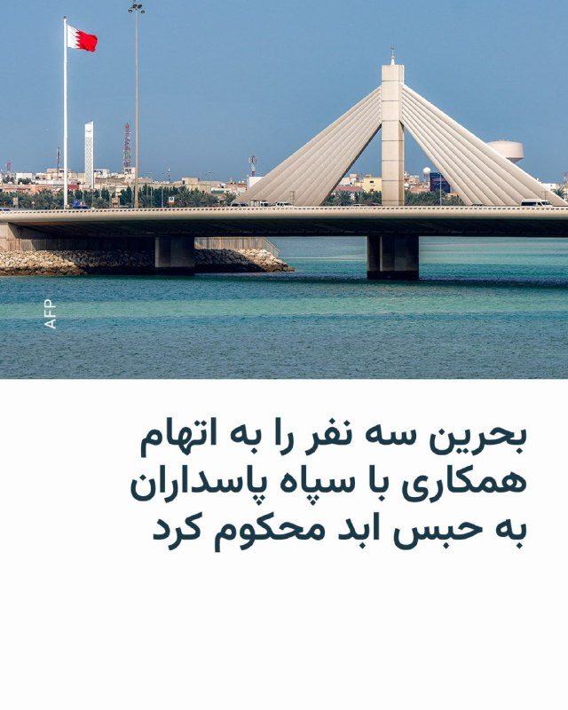

🔸بحرین روز سه‌شنبه ۲۲ اردیبهشت سه نفر را به اتهام «همکاری با سپاه پاسداران» به حبس ابد محکوم کرد.

🔸دادگاهی در بحرین همچنین بیش از ۲۰ نفر دیگر را به حداکثر ۱۰ سال زندان محکوم کرد.

🔸این پادشاهی کوچک که تحت حاکمیت یک خاندان سنی است، جمعیت قابل‌توجهی از شیعیان دارد که مدت‌هاست از حاشیه‌نشینی شکایت دارند.

🔸دادستانی بحرین در بیانیه‌ای اعلام کرد یک زن که «به همکاری با سازمان تروریستی سپاه پاسداران با هدف انجام اقدامات خصمانه و تروریستی» متهم شده بود، به حبس ابد محکوم شده است.

🔸دو نفر دیگر، که یکی از آن‌ها به ایران گریخته، نیز با اتهامات مشابه به حبس ابد و پرداخت جریمه ۱۰ هزار دیناری (۲۶ هزار و ۴۸۷ دلاری) محکوم شدند.

🔸در پرونده‌ای جداگانه، دادگاه ۱۰ متهم را به حبس‌هایی تا ۱۰ سال محکوم کرد که سه نفر از آن‌ها پس از گذراندن دوران محکومیت اخراج خواهند شد.

🔸آن‌ها به حمایت از ایران، فیلم‌برداری از مکان‌های ممنوعه و انتشار بیانیه‌های ممنوعه متهم شده‌اند.

@RadioFarda

## RadioFarda — post 157094

  

🔸یک مقام ارشد پنتاگون روز سه‌شنبه ۲۲ اردیبهشت اعلام کرد که جنگ ایالات متحده با ایران تاکنون ۲۹ میلیارد دلار هزینه داشته است، رقمی که نسبت به برآورد ارائه‌شده در اواخر ماه گذشته، چهار میلیارد دلار افزایش نشان می‌دهد.

🔸به گزارش خبرگزاری رویترز، در حالی که تنها شش ماه تا انتخابات میان‌دوره‌ای کنگره آمریکا باقی مانده است، دموکرات‌ها در نظرسنجی‌های عمومی موقعیت بهتری پیدا کرده‌اند و تلاش می‌کنند این جنگ را به مسائل مربوط به هزینه‌های زندگی پیوند بزنند.

🔸پنتاگون در ۲۹ آوریل اعلام کرده بود که هزینه جنگ تا آن زمان ۲۵ میلیارد دلار بوده است.

🔸جولز هرست، که به‌طور موقت وظایف حسابرس ارشد را بر عهده دارد، روز سه‌شنبه به قانون‌گذاران گفت که برآورد جدید شامل هزینه‌های به‌روزشده تعمیر و جایگزینی تجهیزات و همچنین هزینه‌های عملیاتی است.

🔸او گفت: «تیم ستاد مشترک و تیم حسابرسی به‌طور مداوم این برآورد را بررسی می‌کنند».

🔸هرست در کنار پیت هگست، وزیر دفاع، و ژنرال دن کین، رئیس ستاد مشترک نیروهای مسلح، سخن می‌گفت.

@RadioFarda

## RadioFarda — post 157093

رکوردشکنی شمار نویسندگان زندانی در جهان؛ ایران با ۵۳ نویسندهٔ زندانی در رده دوم

🔸انجمن قلم آمریکا در تازه‌ترین گزارش سالانهٔ خود دربارهٔ وضعیت آزادی بیان در جهان اعلام کرد شمار نویسندگان زندانی در سال ۲۰۲۵ برای نخستین بار از سال ۲۰۱۹ که این شاخص منتشر می‌شود، از مرز ۴۰۰ نفر عبور کرده است.

🔸این گزارش از افزایش چشمگیر بازداشت نویسندگان و فعالان فرهنگی در ایران نیز خبر می‌دهد.

🔸این گزارش که روز سه‌شنبه ۲۲ اردیبهشت منتشر شد، می‌گوید در سال ۲۰۲۵ میلادی در مجموع ۴۰۱ نویسنده در ۴۴ کشور زندانی بوده‌اند، در حالی‌که این رقم در سال پیش ۳۷۵ نفر در ۴۰ کشور بود.

🔸انجمن قلم آمریکا در شاخص «آزادی نوشتن» خود تأکید کرده است که طی هفت سال گذشته شمار نویسندگان زندانی در جهان ۶۸ درصد افزایش یافته و این روند نشان‌دهندهٔ تشدید مداوم سرکوب آزادی بیان و خاموش‌کردن صداهای منتقد در کشورهای مختلف است.

🔸بر اساس این گزارش، چین همچنان بزرگ‌ترین زندان نویسندگان در جهان است و با ۱۱۹ مورد در صدر فهرست قرار دارد. ایران با ۵۳ نویسندهٔ زندانی در رتبهٔ دوم ایستاده و به‌گفتۀ پن آمریکا، شدیدترین افزایش بازداشت‌ها در ایران طی سال گذشته رخ داده است.

🔸این سازمان می‌گوید مقام‌های جمهوری اسلامی در سال ۲۰۲۵ دست‌کم ۱۷ بازداشت تازه انجام دادند و شمار نویسندگان زندانی را بار دیگر به سطح دوران اعتراض‌های «زن، زندگی، آزادی» در سال ۱۴۰۱ نزدیک کرده‌اند.

🔸کارین دویچ کارلکار، مدیر برنامهٔ نویسندگان در معرض خطر در پن آمریکا، در این‌باره گفت مقام‌های جمهوری اسلامی در میان کشورهای جهان «کارزاری به‌ویژه خشن علیه صداهای مستقل» به راه انداخته‌اند.

🔸او افزود شاعران، مترجمان، پژوهشگران، ترانه‌سرایان، تحلیلگران آنلاین، مدافعان حقوق بشر و ستون‌نویسان همگی هدف بازداشت و سرکوب قرار گرفته‌اند، زیرا حکومت ایران در تلاش است «بحث و مخالفت» را خاموش کند.

🔸گزارش کامل را در وب‌سایت رادیوفردا بخوانید.

@RadioFarda

## RadioFarda — post 157092

🔸رسانه‌های ایران روز سه‌شنبه ۲۲ اردیبهشت مدعی شدند که هیئت‌های نمایندگی جمهوری اسلامی و عمان در مسقط دیدار کردند و «آخرین تحولات مربوط به تنگه هرمز و ترتیبات مربوط به عبور ایمن کشتی‌ها» را مورد بررسی قرار دادند. 🔸بر اساس این گزارش، عباس باقرپور مدیرکل حقوقی…

## RadioFarda — post 157091

  

🔸رسانه‌های ایران روز سه‌شنبه ۲۲ اردیبهشت مدعی شدند که هیئت‌های نمایندگی جمهوری اسلامی و عمان در مسقط دیدار کردند و «آخرین تحولات مربوط به تنگه هرمز و ترتیبات مربوط به عبور ایمن کشتی‌ها» را مورد بررسی قرار دادند.

🔸بر اساس این گزارش، عباس باقرپور مدیرکل حقوقی بین‌المللی وزارت خارجه، ریاست هیئت نمایندگی ایران را برعهده داشت و «نمایندگان دستگاه‌های ذیربط» جمهوری اسلامی نیز در آن حضور داشتند.

🔸به ادعای این رسانه‌ها، «دو طرف بر حقوق و صلاحیت‌های حاکمیتی خود بر این تنگه به عنوان بخشی از آب‌های سرزمینی ایران و عمان تأکید کردند».

🔸تنگه هرمز از ۹ اسفند پارسال که آمریکا و اسرائیل به ایران حمله کردند، از سوی سپاه پاسداران عملاً مسدود شده است؛ آبراهی حیاتی که حدود ۲۰ درصد از نفت و گاز جهان از این مسیر عبور می‌کند.

@RadioFarda

## RadioFarda — post 157090

  

🔸فرماندهی مرکزی ایالات متحده، سنتکام، روز سه‌شنبه خبر داد از ابتدای محاصره دریایی علیه بنادر ایران تاکنون، ۶۵ کشتی تجاری را وادار به «تغییر مسیر» کرده است.

🔸در اطلاعیه سنتکام که در حساب شبکه ایکس آن منتشر شده است، آمده که نیروهای نظامی آمریکا در خاورمیانه در این مدت چهار کشتی ایرانی را هم «از کار انداخته‌اند».

🔸ارتش آمریکا جمعه از شلیک به دو نفتکش ایرانی «ام‌تی سی استار» و «ام‌تی سودا» و از کار انداختن آنها خبر داد و روز چهارشنبه نیز نفتکش «ام‌تی حسنا» با پرچم ایران هدف قرار گرفته بود.

🔸ماه گذشته نیز نیروهای آمریکایی یک کشتی باری ایرانی را توقیف کرده بودند.

🔸آمریکا و ایران بعد از یک دور مذاکره حضوری در پاکستان که چند روز بعد از برقراری آتش‌بس در اسلام‌آباد برگزار شد، با ارسال طرح‌های پیشنهادی متقابل مشغول مذاکره بودند. آمریکا بعد از بی‌نتیجه ماندن مذاکره حضوری، محاصره دریایی بنادر ایران را آغاز کرد، در حالی که ایران از ابتدای جنگ تنگهٔ هرمز را مسدود کرده است.

@RadioFarda

## IranianMinds — post 20032

🔴 رئیس کمیسیون انرژی :

به دلیل آسیب به پتروشیمی ها امسال قطعی برق خیلی بیشتری داریم

@IranianMinds

## IranianMinds — post 20031

  <a href="telegram/content/IranianMinds_20031_1778610736.mp4" target="_blank">🎬 Download video</a>

🔴 ترامپ:

ما ایران را کاملا تحت کنترل داریم.

خلاصه یا یک توافق می‌کنیم، یا هم نابودشون میکنیم .

@IranianMinds

## IranianMinds — post 20030

🔴 خبرنگار: در مذاکرات با ایران چه زمانی عقب می‌نشینید؟

ترامپ:

می‌خواهیم ببینیم اوضاع چطور پیش می‌رود. هدف‌مان فقط یک توافق خوب است.
باور دارم این برای مردم آمریکا مفید خواهد بود و برای مردم ایران هم مفید است !

@IranianMinds

## IranianMinds — post 20029

بقیه صحبتاش تکراریه پوشش نمیدیم حرف جدیدی زد پوشش میدیم

## IranianMinds — post 20028

  <a href="telegram/content/IranianMinds_20028_1778610738.mp4" target="_blank">🎬 Download video</a>

🔴 ترامپ:

رهبران ایران یا کار درست را انجام خواهند داد، یا ما کار را تمام خواهیم کرد.

@IranianMinds

## IranianMinds — post 20027

  <a href="telegram/content/IranianMinds_20027_1778610741.mp4" target="_blank">🎬 Download video</a>

🔴 ترامپ:

من به وضعیت مالی آمریکایی‌ها فکر نمی‌کنم. به هیچ‌کس فکر نمی‌کنم.

فقط به یک چیز فکر می‌کنم: نمی‌توانیم اجازه دهیم ایران به سلاح هسته‌ای دست پیدا کند. همین!

@IranianMinds

## IranianMinds — post 20026

🔴 ترامپ:

فکر نمی‌کنم در مورد ایران به کمک نیاز داشته باشیم و به هر طریقی چه مسالمت‌آمیز و چه به شکلی دیگر پیروز خواهیم شد.

@IranianMinds

## IranianMinds — post 20025

🔴 ترامپ:

خواهیم دید در مورد ایران چه پیش می‌آید و ما فقط به دنبال رسیدن به یک توافق خوب هستیم.

@IranianMinds

## IranianMinds — post 20024

  <a href="telegram/content/IranianMinds_20024_1778610743.mp4" target="_blank">🎬 Download video</a>

🔴 خبرنگار: آیا در مورد پاکستان به‌عنوان میانجی تجدیدنظر می‌کنید؟

ترامپ: نه، آن‌ها عالی هستند. فیلد مارشال و نخست‌وزیر پاکستان فوق‌العاده عمل کرده‌اند!

@IranianMinds

## IranianMinds — post 20023

🔴 ترامپ:

کسی که می خواهد به دیوانه های ایران اجازه دهد به سلاح هسته ای دست پیدا کنند، احمق است.

@IranianMinds

## IranianMinds — post 20022

🔴 ترامپ:

گفتگوی طولانی با رئیس جمهور چین درباره جنگ ایران خواهم داشت

@IranianMinds

## IranianMinds — post 20021

🔴 ترامپ :

ما ارتش ایران رو از بین بردیم ، و فقط با ایران یک‌ توافق خوب میکنیم

@IranianMinds

## IranianMinds — post 20020

  <a href="telegram/content/IranianMinds_20020_1778610745.mp4" target="_blank">🎬 Download video</a>

عرفان شکورزاده 💔

@IranianMinds

## IranianMinds — post 20019

  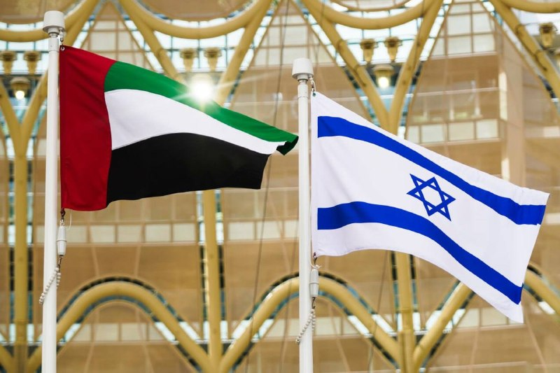

🔴 به گزارش بلومبرگ، امارات قبل و بعد از آتش‌بس ۸ آوریل، حملات تلافی‌جویانه‌ای علیه ایران انجام داد.

یکی از این حملات با اسرائیل هماهنگ شد، در پاسخ به حمله ایران به تأسیسات پتروشیمی بروجۀ امارات در ماه گذشته.

@IranianMinds

## IranianMinds — post 20018

  

🔴 سی‌ ان‌ ان به نقل از تصاویر ماهواره‌ای:

نشت عظیم نفت در نزدیکی جزیره خارک ایران ادامه دارد

@IranianMinds

## IranianMinds — post 20017

  

🔴 سناتور لیندزی گراهام به وزیر جنگ:

اگر میانجی (پاکستان) اجازه می‌دهد هواپیماهای شناسایی در پایگاه‌های هوایی پاکستان پارک شوند، آیا فکر می‌کنید این با نقش یک میانجی منصفانه سازگار است؟

وزیر جنگ پیت هگزت : من نمی‌خواهم وسط این مذاکرات قرار بگیرم.

سناتور گراهام: خب، من می‌خواهم وسط این مذاکرات باشم. من به پاکستان حتی به اندازه‌ای که بتوانم آن را پرتاب کنم هم اعتماد ندارم.

اگر واقعاً هواپیماهای ایرانی در پایگاه‌های پاکستان برای حفاظت از دارایی‌های نظامی ایران پارک شده باشند، این به من می‌گوید که شاید باید دنبال شخص دیگری برای میانجیگری باشیم. عجیب نیست که این قضیه هیچ‌جا نمی‌رسد

@IranianMinds

## IranianMinds — post 20016

  

شما فک کن گوشی که کلا قیمتش هزار دلاره رو‌ تو ایران به شما میدن سه هزار دلار !!

@IranianMinds

## IranianMinds — post 20015

💙 خان وی‌پی‌ان 
⚡️ سرعت بالا 
🛡 پینگ و پایداری عالی 
🔐 مناسب تلگرام، اینستا، یوتیوب، گیم و استریم 
💸 قیمت اقتصادی با پلن‌های متنوع 
🎁 تست ۵۰ مگ فقط ۷۵ تومن 
🛎 کانال: https://t.me/+qNjExGEJztE2OGI0 
🤖 ربات خرید: @Xan_vpn_bot

## IranianMinds — post 20014

🔴 ترامپ:

چین قدرتمنده، اما ما از نظر نظامی قوی تریم.

@IranianMinds

## IranianMinds — post 20013

  <a href="telegram/content/IranianMinds_20013_1778610750.mp4" target="_blank">🎬 Download video</a>

🔴 پیت هگزت درباره ایران:

ما برنامه‌ای برای تشدید اوضاع داریم، در صورت لزوم.

و همچنین ما برنامه‌ای برای عقب‌نشینی داریم، در صورت لزوم.

@IranianMinds

## BBCPersian — post 280875

  <a href="https://t.me/bbcpersian/280875" target="_blank">📎 Download file</a>

پادکست جام جهان‌نما، سه‌شنبه ۲۲ اردیبهشت ۱۴۰۵
در این برنامه می‌شنوید:

رئیس جمهور آمریکا سرخورده از بن‌بست در مواجهه با ایران؛ گفته می‌شود ترامپ جدی‌تر از گذشته به از سرگیری جنگ فکر می‌کند. در گپ روز این جام جهان نما می‌پرسیم آیا چین می تواند گره کور اختلافات بین ایران و آمریکا را باز کند؟

ترکیه و قطر بر بازگشایی بی‌قید‌و‌شرط تنگه هرمز تأکید کردند. هر دو از مذاکره برای برقراری صلح بین ایران و آمریکا حمایت می‌کنند.

هفتاد و چهار روز از قطع اینترنت در ایران می‌گذرد. دولت می‌گوید تا تهدید جنگ رفع نشود، از دسترسی عمومی خبری نیست.

این برنامه رادیویی را می‌توانید هر شب ساعت ۲۰ به وقت ایران، روی موج متوسط ۷۰۲ کیلوهرتز و موج کوتاه ۹۴۶۵ کیلوهرتز بشنوید.
تکرار برنامه را هم می‌توانید ساعت ۲۱:۳۰ روی موج متوسط ۷۰۲ کیلوهرتز و موج کوتاه ۵۳۹۵ کیلوهرتز گوش کنید.
@BBCPersian

## BBCPersian — post 280874

🔻وزارت خارجه کویت سفیر ایران را احضار کرد

در پی بازداشت چهار فرد «وابسته به سپاه پاسداران» که تلاش می‌کردند از طریق دریا به این کشور وارد شوند، وزارت خارجه کویت اعلام کرده که محمد توتونچی، سفیر ایران در این کشور را احضار کرده است تا «نامه اعتراضی» این کشور را به او تحویل دهد.

این وزارت‌خانه اقدام اخیر جمهوری اسلامی را به عنوان «اقدامی خصمانه» و «حمله‌ای آشکار» به حاکمیت کویت خوانده و آن را محکوم کرده است.

کویت گفته است که «حق دفاع از خود» را محفوظ می‌دارد.

این چهارمین باری است که از زمان آغاز جنگ آمریکا و اسرائیل با ایران و آغاز حملات ایران علیه کشورهای خلیج فارس، سفیر جمهوری اسلامی احضار می‌شود.

وزارت کشور کویت امروز اعلام کرد که «چهار نفوذی وابسته به سپاه پاسداران» که تلاش می‌کردند از طریق دریا به این کشور وارد شوند را بازداشت کرده است.

خبرگزاری دولتی کونا به نقل از این وزارتخانه گزارش داده است که یک نفر از نیروهای مسلح کویت در درگیری با این چهار نفر مجروح شده است.

بر اساس بیانیه وزارت کشور کویت، دستگیرشدگان دو سرهنگ، یک سروان و یک ستوان نیروی دریایی سپاه بوده‌اند که «اذعان» کرده‌اند ماموریت داشتند به جزیره بوبیان «نفوذ» کنند.

در این بیانیه آمده است که این چهار نفر در اول ماه مه (۱۱ اردیبهشت) سعی کردند «سوار بر یک قایق ماهیگیری که مخصوص انجام اقدامات خصمانه علیه کویت تدارک داده شده بود» وارد کویت شوند.

بوبیان بزرگترین جزیره کویت است و با سواحل ایران و عراق فاصله کمی دارد.

@BBCPersian

## BBCPersian — post 280864

  <a href="telegram/content/BBCPersian_280864_1778610753.mp4" target="_blank">🎬 Download video</a>

بیش از ۷۰ روز است که اینترنت جهانی در ایران قطع شده و هزینه‌های بسیاری بر اقتصاد اشخاص و کشور بر جا گذاشته است. در روزهای اخیر صداهای بیشتر از کاربران اینترنت در ایران شنیده می‌شود و به نظر می‌رسد تعداد بیشتری توانسته‌اند به اینترنت جهانی وصل شوند.

تعدادی از کاربران با پرداخت مبلغ «۴۰ هزار تومان به ازای هر گیگ» از اپراتور‌ها خدمات اینترنتی ایران موسوم به «اینترنت پرو» خریده‌اند و تعدادی با فیلترشکن‌های گران‌تر به اینترنت جهانی وصل شده‌اند.

حدود چهار ماه است که دسترسی کاربرانی که در ایران هستند به اینترنت جهانی بسیار دشوار شده است. پس از اعتراضات دی ۱۴۰۴ و سپس جنگ آمریکا و اسرائیل با ایران، دسترسی به اینترنت جهانی به طور کامل قطع شد. اما تعداد اندکی افراد دارای سیم‌کارت بااصطلاح «سفید» به اینترنت دسترسی داشته‌اند.

📷Getty Images
EPA/Shutterstock
https://bbc.in/49rKNBi
https://bbc.in/4uIjf2M
@BBCPersian

## BBCPersian — post 280863

🔻‌محمدرضا شهبازی، مجری برنامه پاورقی شبکه ۲ تلویزیون دولتی ایران که به عنوان یک چهره حامی حکومت شناخته می‌شود، در واکنش به مقایسه وضعیت اینترنت در ایران و آزمایش اینترنت ۵جی در افغانستان و شروع استفاده از کردیت کارت‌های بین‌المللی در سوریه گفت: «اگر این چیزها…

## BBCPersian — post 280862

🔻‌محمدرضا شهبازی، مجری برنامه پاورقی شبکه ۲ تلویزیون دولتی ایران که به عنوان یک چهره حامی حکومت شناخته می‌شود، در واکنش به مقایسه وضعیت اینترنت در ایران و آزمایش اینترنت ۵جی در افغانستان و شروع استفاده از کردیت کارت‌های بین‌المللی در سوریه گفت: «اگر این چیزها اینقدر مهم است بروید همانجا (سوریه و افغانستان) زندگی کنید.»

 مجری برنامه پاورقی با خواندن یک توییت از پوریا زراعتی، مجری تلویزیون اینترنشنال که شرایط اینترنت در ایران را با افغانستان و سوریه مقایسه کرده بود و همچنین اشاره به یک پست از یک کانال تلگرامی که اشاره مشابهی به اینترنت در ایران داشت، گفت: «بروید سوریه با کردیت کارت از آمازون چسب پهن بخرید و زمان بمباران شیشه‌هایتان را چسب بزنید.»

@BBCPersian

## BBCPersian — post 280861

🔻مخالفت دوباره حزب‌الله با هرگونه مذاکره مستقیم لبنان با اسرائیل

در آستانه دور جدید مذاکرات اسرائیل و دولت لبنان، حزب‌الله یک بار دیگر خواستار خودداری از هرگونه مذاکره مستقیم با اسرائیل شد.

نعیم قاسم، دبیرکل حزب‌الله، هشدار داد که هرگونه مذاکره مستقیم فقط به نفع اسرائیل خواهد بود.

او همچنین تاکید کرد که موضوع سلاح‌های حزب‌الله «یک امر داخلی است و در مذاکرات با دشمن جایی ندارد.»

نعیم قاسم در پیام صوتی خود خطاب به نیروهای حزب‌الله گفت که «مقاومت» هرگز تسلیم فشار آمریکا و اسرائیل نخواهد شد و قول داد که میدان نبرد برای اسرائیل به «جهنم» تبدیل شود.

دبیرکل حزب‌الله در بخشی دیگر از سخنانش از توجه ایران به لبنان و مردمش قدردانی کرد و گفت: «توافق ایران و آمریکا که شامل پایان تجاوز به لبنان می‌شود، تقریبا محکم‌ترین سند برای توقف این تجاوز است.»

با این حال او افزود که مسئولیت مذاکره برای تامین اهداف ملی لبنان همچنان بر عهده مقام‌های لبنان است و قول داد که همکاری کند.

دور سوم مذاکرات لبنان و اسرائیل قرار است روزهای پنجشنبه و جمعه این هفته برگزار شود.

باوجود ادامه آتش‌بس با ایران، تبادل آتش میان حزب‌الله لبنان و اسرائیل همچنان ادامه داشته است.

آمریکا و اسرائیل از دولت لبنان می‌خواهند که حزب‌الله را خلع سلاح کند اما حزب‌الله می‌گوید تسلیم نخواهد شد.

@BBCPersian

## BBCPersian — post 280860

🔻ثبت بالاترین نرخ تورم آمریکا در سه سال اخیر در پی افزایش قیمت سوخت

نرخ تورم در آمریکا به بالاترین حد خود در سه سال اخیر رسید و دلیل اصلی آن هم گرانی انرژی ناشی از جنگ با ایران عنوان شده است.

افزایش ۱۸ درصدی قیمت سوخت در ماه گذشته در کنار گرانتر شدن هزینه‌های خوراک، مسکن، پوشاک و مسافرت‌های هوایی، شاخص قیمت مصرف‌کننده را بالا برد و نرخ تورم در دوازده منتهی به آوریل را به ۳/۸ درصد رساند. این رقم در ماه قبل از آن ۳/۳ درصد بود.

اداره آمار کار آمریکا اعلام کرده است که تقریبا نیمی از افزایش قیمت‌ها در ماه آوریل متاثر از بالا رفتن هزینه‌های انرژی بوده است.

جنگ آمریکا و اسرائیل با ایران و بسته شدن تنگه هرمز، باعث جهش قیمت نفت و گرانی شدید بنزین در آمریکا شد.

بنابر اعلام انجمن خودروسازان آمریکا، قیمت متوسط یک گالن بنزین بدون سرب اکنون ۴ و نیم دلار است که بالاترین قیمت آن از ژوئیه ۲۰۲۲ میلادی است.

افزایش نرخ تورم در ماه آوریل، احتمال کاهش نرخ بهره بانکی در سال جاری را به طور فزاینده‌ای کاهش می‌دهد.
@BBCPersian

## BBCPersian — post 280859

  

🔻دادگاه عالی کیفری بحرین امروز دو نفر را برای «همکاری و ارتباط با سپاه پاسداران تروریستی ایران» به حبس ابد محکوم کرد.

به گزارش رسانه‌های بحرین، یکی از این دو فرد زن است.

آنها متهم به «اقدامات خصمانه و تروریستی» علیه پادشاهی بحرین بودند. دادگاه علاوه بر دستور ضبط اشیاء توقیف‌شده، آنها را ۱۰ هزار دینار بحرین (۲۶۵۲۵ دلار) جریمه کرد.

اداره کل تحقیقات کیفری و علوم جرم‌شناسی بحرین گفت که سرویس‌های اطلاعاتی ایران و سپاه پاسداران،به «رهبران برخی گروه‌های تروریستی مستقر در جمهوری اسلامی ایران» پول داده‌ و آنها را مامور کرده بودند تا چندین مرکز حیاتی را در بحرین زیر نظر بگیرند. هدف از این اقدام، «آماده‌سازی برای هدف قرار دادن این مراکز و اجرای عملیات‌های تروریستی» بود تا امنیت و ثبات پادشاهی بحرین را مختل کنند.

علاوه بر این، دادستانی جرایم تروریستی بحرین گفت که دادگاه عالی کیفری در جلسه امروز، در ۹ پرونده مربوط به افراد متهم به «حمایت و تایید حملات تروریستی ایران علیه پادشاهی بحرین، انتشار اطلاعات حیاتی ممنوعه و تصویربرداری از مکان‌های محدودشده» حکم صادر کرد.

مطلب کامل:

https://bbc.in/4d49cPM
📷Getty
@BBCPersian

## BBCPersian — post 280858

  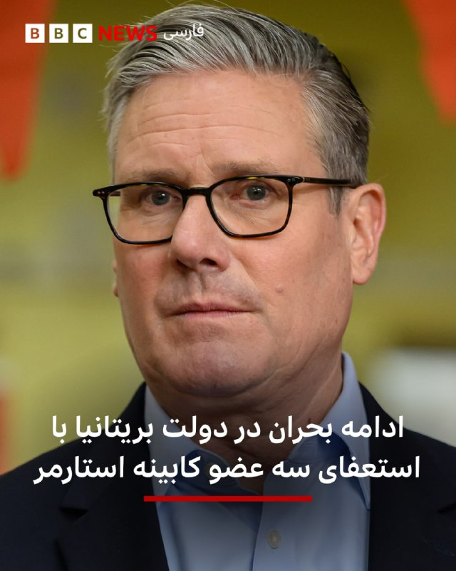

🔻بحران در دولت بریتانیا با استعفای سه عضو پایین‌رتبه کابینه امروز ادامه یافت.

بیش از ۸۴ نماینده حزب کارگر در پارلمان از کی‌یر استارمر خواسته‌اند که برای کناره‌گیری از نخست‌وزیری یک جدول زمانی اعلام کند.

پس از آنکه دیروز آقای استارمر گفت که اشتباهات را می‌پذیرد اما به کارش ادامه می‌دهد، بعضی از اعضای دولت از او حمایت کردند و گفتند اکنون زمان مناسبی برای به چالش کشیدن او به‌عنوان رهبر حزب نیست اما شمار فزاینده‌ای هم می‌گویند که کار دولت با ادامه نخست‌وزیری آقای استارمر ممکن نیست.

گمانه‌زنی‌ها درباره آینده سیاسی نخست‌وزیر بریتانیا از زمان انتخابات محلی پنجشنبه (۷ مه) شدت گرفته است؛ انتخاباتی که حزب کارگر، به رهبری کی‌یر استارمر، نزدیک به ۱۵۰۰ کرسی شوراهای محلی در انگلستان را از دست داد، در اسکاتلند هم عقب‌تر نشست، در ولز نیز پس از ۲۷ سال در صدر، به رتبه سوم سقوط کرد.

این شکست سنگین انتخاباتی باعث شد تعدادی از نمایندگان حزب کارگر خواستار کناره‌گیری یا تعیین زمانی برای آن شوند. برای به چالش کشیدن رهبر حزب، رای ۸۱ نماینده حزب کارگر لازم است.

مطلب کامل:
https://bbc.in/3Po91FI
📷Getty Images
@BBCPersian

## BBCPersian — post 280857

  <a href="https://t.me/bbcpersian/280857" target="_blank">📎 Download file</a>

کِلسی داونپورت: ایران تا سلاح اتمی، فقط یک تصمیم سیاسی فاصله دارد_ گفت‌وگوی ویژه
کِلسی داونپورت، از چهره‌های شناخته‌شده در حوزهٔ منع گسترش سلاح‌های هسته‌ای و مدیر سیاست‌گذاری عدم‌اشاعه در انجمن کنترل تسلیحات در آمریکا، یکی از دقیق‌ترین و صریح‌ترین تحلیلگران دربارهٔ برنامه هسته‌ای ایران است. او سال‌هاست تحولات مربوط به ایران، آمریکا و آژانس بین‌المللی انرژی اتمی را دنبال می‌کند و از منتقدان جدی سیاست‌های دولت ترامپ در این پرونده است.
در گفت‌وگویی با فرناز قاضی‌زاده، خانم داونپورت با جزئیات توضیح می‌دهد که چرا حملات اخیر به تأسیسات هسته‌ای ایران نه‌تنها این برنامه را نابود نکرده، بلکه ممکن است انگیزهٔ سیاسی ایران برای حرکت به سمت سلاح را افزایش داده باشد. او می‌گوید تا زمانی که ذخایر اورانیوم غنی‌شدهٔ ایران باقی است و آژانس دسترسی لازم برای بررسی این برنامه را ندارد، در صورت تصمیم سیاسی برای ساخت سلاح، ایران از دانش و امکانات لازم برخوردار است.
@BBCPersian

## BBCPersian — post 280853

  

🔻پنتاگون روز سه‌شنبه اعلام کرد که جدیدترین ارزیابی از هزینه جنگ با ایران حدود ۲۹ میلیارد دلار است.

این آمار جدید که در جلسه استماع بودجه در کنگره اعلام شد، حدود ۴ میلیارد دلار بیشتر از تخمینی است که پیت هگست، وزیر دفاع آمریکا، حدود دو هفته پیش ارائه کرده بود.

پیت هگست، وزیر دفاع و ژنرال دن کین، رئیس ستاد مشترک ارتش آمریکا، در حال شهادت دادن در مورد درخواست بودجه یک و نیم تریلیون دلاری برای سال ۲۰۲۷ میلادی بودند که از آنها خواسته شد تا در مورد هزینه جنگ با ایران هم توضیحاتی ارائه دهند.

جولز هرست، رئیس امور مالی پنتاگون هم که در این جلسه حضور داشت با اشاره به تخمین وزیر دفاع این کشور در ۲۹ آوریل در کنگره گفت: «در زمان شهادت... این مبلغ ۲۵ میلیارد دلار بود.»

او همچنین گفت: «اما تیم مشترک کارکنان و حسابرسی دائما تخمین‌ها را زیر نظر دارند و اکنون فکر می‌کنیم که این مبلغ به ۲۹ میلیارد دلار نزدیک‌تر است.»

📷Getty Images
@BBCPersian

## Dirty_Kids — post 389335

  

👑 رضا پهلوی تو نشست امنیتی سالانه پولیتیکو:

الان ما با یه جونورِ زخمی طرفیم و نباید بذاریم فرصت از دست بره، کار رو باید یه بار واسه همیشه تموم کنیم.

سیاست مماشات با جمهوری اسلامی که راهبرد خیلی از دولت‌ها بود، شکست خورده.
مردم به‌اندازه کافی هوشمند هستنن که تفاوت بین حمله به یه ملت و حمله به یه رژیم رو تشخیص بدن.
ما فقط زمانی می‌تونیم مردم رو به بازگشت به خیابون‌ها فرا بخوانیم که اونا هم سطحی از توان مقابله رو داشته باشن.

@Dirty_Kids 👻

## Dirty_Kids — post 389334

  

طرف قبل جنگ رفته جنس آورده بعد گرون شده همه‌چی همینجوری بدون دوخت گذاشته برای فروش

@Dirty_Kids 👻

## Dirty_Kids — post 389333

  

پس کجا خوبه؟ قعله حسن‌خان؟

@Dirty_Kids 👻

## Dirty_Kids — post 389332

  <a href="telegram/content/Dirty_Kids_389332_1778610758.mp4" target="_blank">🎬 Download video</a>

طرف با AI, بازی تاج و تخت رو اونجوری که دلش خنک میشده درست کرده

@Dirty_Kids 👻

## Dirty_Kids — post 389331

  

داداش تو اسلحه دست نگیر همینجوریش کلی استرس داریم.

@Dirty_Kids 👻

## Dirty_Kids — post 389330

  <a href="telegram/content/Dirty_Kids_389330_1778610761.mp4" target="_blank">🎬 Download video</a>

تراپی

اگر از تماشای آن لذت بردید، آن را برای دوستانتان ارسال کنید تا آنها نیز از آن لذت ببرند. 😃♥️

@Dirty_Kids 👻

## Dirty_Kids — post 389329

  <a href="telegram/content/Dirty_Kids_389329_1778610763.mp4" target="_blank">🎬 Download video</a>

هر جا هستی خواستم بگم دمت گرم ، اینجا‌ عرزشی میسوزونیم‌‌😂✌️

@Dirty_Kids 👻

## Dirty_Kids — post 389328

✖️ سایت بین المللی bet120x 
✖️  
👍دارای مجوز رسمی Gambling Judge سوئد
👍       
💳شارژ حساب از طریق ارز و یووچر و پرمیوم ووچر 
💳تسویه حساب دلاری سریع 💊بیمه شرط میکس 
⚠️فروش شرط 
🔔ویرایش شرط                    
3️⃣
2️⃣ 
🎁20%هدیه واریز از طریق ارز و ووچر ┅━━━━━━━━━━━…

## Dirty_Kids — post 389327

  

✖️ سایت بین المللی bet120x 
✖️

 
👍دارای مجوز رسمی Gambling Judge سوئد
👍
     

💳شارژ حساب از طریق ارز و یووچر و پرمیوم ووچر

💳تسویه حساب دلاری سریع
💊بیمه شرط میکس

⚠️فروش شرط

🔔ویرایش شرط                    
3️⃣
2️⃣

🎁20%هدیه واریز از طریق ارز و ووچر
┅━━━━━━━━━━━

🎁 10%برگشت باخت به صورت روزانه

🎁 10%برگشت باخت به صورت هفتگی

🎁10%برگشت باخت به صورت ماهانه

💻ادرس ورود به سایت:
https://bet120x.com/fa/?btag=971470
➖➖➖➖➖
   
👈 آموزش واریز و برداشت دلاری
👉

🔪کانال اطلاع رسانی:
👇

✈️https://t.me/+1Wv5nGY_a54xNzlk

## Dirty_Kids — post 389326

  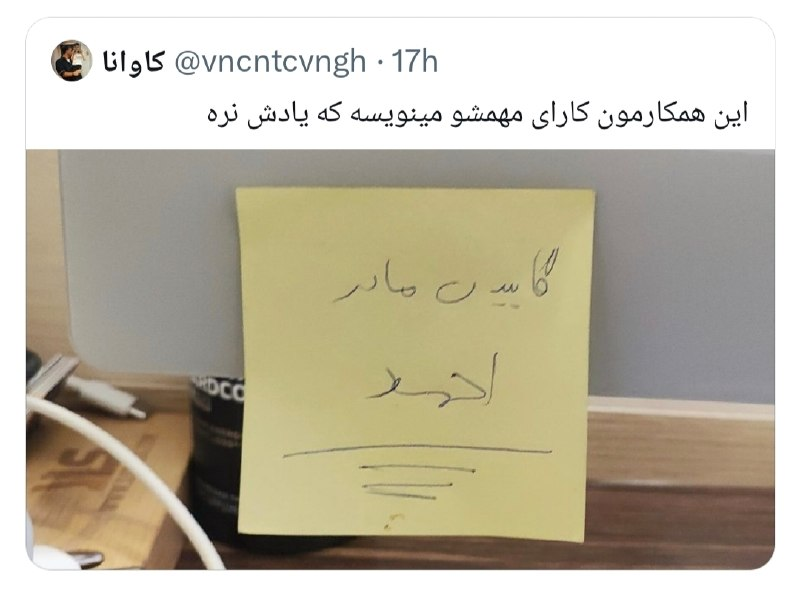

پلن نتانیاهو برای احمد وحیدی:

@Dirty_Kids 👻

## Dirty_Kids — post 389324

یه سر تیز رفتم اینستاگرام و واقعا ارزششو داشت جیغ میزنم از میزان جذابیت دو عزیز

@Dirty_Kids 👻

## Dirty_Kids — post 389323

‏این bdsm و این کسشرا چیه یاد گرفتین دختر مردمو می‌بندین به داربست کتک متک میزنین، کسخلید؟
بیفت پاهاشو بوس کن بگو خدیاشکرت، موجود به اون نازی و لطیفی.

@Dirty_Kids 👻

## Dirty_Kids — post 389322

  

بی‌بی‌سی اینارو از کجا پیدا میکنه؟

@Dirty_Kids 👻

## Dirty_Kids — post 389321

  

🌪وقتی اینترنت طوفانیه... کافیه بادبان ها رو بکشی تا

⚫️با بالاترین کیفیت ممکن
⚡️ 

⚫️100 هزار تومان شارژ هدیه 
🎁

⚫️پایین ترین قیمت گیگی 250
🌐 

⚫️و ارائه پورسانت %10 در ازای هر معرفی
💼

بتونی یه اتصال پایدار با پشتیبانی 24 ساعته داشته باشی
🚀

بادبان راهتو باز می‌کنه
⛵️

🛡@BadBan_VPN | کانال 

🤖@BadBan_VPNBot | ربات 

📞@BadBan_VPNSupport | پشتیبانی

## Dirty_Kids — post 389320

  <a href="telegram/content/Dirty_Kids_389320_1778610766.mp4" target="_blank">🎬 Download video</a>

لامین یامال بازیکن بی اخلاق و خانم‌باز بارسا توی جشن قهرمانی بارسلونا پرچم فلسطین را برافراشته. + این در جریان ۱ ماه دیگه باید بره امریکا لای کلی ایرانی؟ @Dirty_Kids 👻

## Dirty_Kids — post 389319

  

قل أعوذ برب الناس
آدم خارکسه از دور پیداس!

@Dirty_Kids 👻

## Dirty_Kids — post 389318

  <a href="telegram/content/Dirty_Kids_389318_1778610767.mp4" target="_blank">🎬 Download video</a>

یه قشری هم هستن توی اینستا این شکلی دارن با وصل بودنشون پز میدن.

@Dirty_Kids 👻

## Dirty_Kids — post 389317

  <a href="telegram/content/Dirty_Kids_389317_1778610769.mp4" target="_blank">🎬 Download video</a>

ابداع عبارت جدید برای توصیف شرایط فعلی لازم بود ! 😆✋

@Dirty_Kids 👻

## Dirty_Kids — post 389316

  <a href="telegram/content/Dirty_Kids_389316_1778610771.mp4" target="_blank">🎬 Download video</a>

کلیپ چقدر عرزشیا رو سوزونده

@Dirty_Kids 👻

## Hranews — post 112912

دو شهروند از جمله یک نوجوان در مهاباد بازداشت شدند

❗️
❗️
❗️
❗️
❗️– بامداد امروز سه‌شنبه ۲۲ اردیبهشت‌ماه، میکائیل دودکانلو میلان و احسان خرم‌آباد، نوجوان ۱۷ ساله، توسط نیروهای امنیتی در مهاباد #بازداشت و به مکان نامعلومی منتقل شدند.

ادامه مطلب

#میکائیل_دودکانلو_میلان
#احسان_خرم‌آباد

↘️
@hranews_bot تماس ✉️ -  @Hranews  کانال هرانا 🆑

## Hranews — post 112911

معوقات مزدی کارگران داروگر تهران و ثبت نام گسترده برای بیمه بیکاری

❗️
❗️
❗️
❗️
❗️ – #کارگران شرکت داروگر تهران از تاخیر بیش از پنج ماهه در پرداخت دستمزد و تعویق در واریز حق بیمه خود خبر دادند. همچنین، نماینده مشهد در مجلس اعلام کرد که از ابتدای جنگ اخیر، ۲۰۵ هزار نفر برای دریافت بیمه بیکاری ثبت نام کرده‌اند.

ادامه مطلب

↘️
@hranews_bot تماس ✉️ -  @Hranews  کانال هرانا 🆑

## Hranews — post 112910

  

معاون توسعه کارآفرینی و اشتغال وزیر کار، اعلام کرد که #قطع_اینترنت و توقف فروش اینترنتی، مهم‌ترین مشکل مشاغل خانگی در ماه‌های اخیر بوده است. مالک حسینی، در نشست روز ملی مشاغل خانگی گفت که همزمان با محدودیت‌های اینترنتی و توقف نمایشگاه‌های فصلی، بسیاری از فعالان این حوزه امکان فروش محصولات خود را از دست داده‌اند. وی با اشاره به اینکه حدود ۸۰٪ مشاغل خانگی را زنان تشکیل می‌دهند، اظهار داشت که بخش عمده این افراد از خانوارهای کم‌درآمد هستند.

صبح امروز، نت‌بلاکس، نهاد ناظر بر اختلالات #اینترنت در جهان، اعلام کرد که قطع گسترده اینترنت در ایران وارد هفتاد و چهارمین روز خود شده و از مرز ۱۷۵۲ ساعت گذشته است.

↘️
@hranews_bot تماس ✉️ - @Hranews کانال هرانا 🆑

## Hranews — post 112909

  

انجمن قلم (پن) آمریکا در گزارش سالانه «شاخص آزادی نوشتن» اعلام کرده است که ایران با ۵۳ نویسنده زندانی، پس از چین در رتبه دوم جهان از نظر شمار #نویسندگان در بند قرار گرفته است. بر اساس این گزارش، طی سال گذشته شدیدترین موج بازداشت نویسندگان در ایران ثبت شده و با ۱۷ مورد بازداشت جدید، شمار نویسندگان زندانی بار دیگر به سطح دوران اعتراض‌های «زن، زندگی، آزادی» در سال ۱۴۰۱ نزدیک شده است. این گزارش همچنین به تشدید سرکوب‌ها در ایران پس از جنگ ۱۲ روزه میان ایران و اسرائیل اشاره دارد و آن را عامل گسترش فضای امنیتی در کشور دانسته است.

کارین دویچ کارلکار، مدیر برنامه «نویسندگان در معرض خطر» در انجمن قلم، در این رابطه گفته است: «مقام‌های جمهوری اسلامی ایران به‌دلیل کارزار بی‌رحمانه‌شان علیه صداهای مستقل بیش از همه جلب توجه می‌کنند. شاعران، مترجمان، پژوهشگران، ترانه‌سرایان، دیدگاه‌نویسان، مدافعان حقوق بشر و ستون‌نویسان همگی در زندان‌های ایران گرفتار می‌شوند، در حالی که حکومت تلاش دارد بحث، انتقاد و مخالفت را خاموش کند.»

↘️
@hranews_bot تماس ✉️ - @Hranews کانال هرانا 🆑

## Hranews — post 112908

  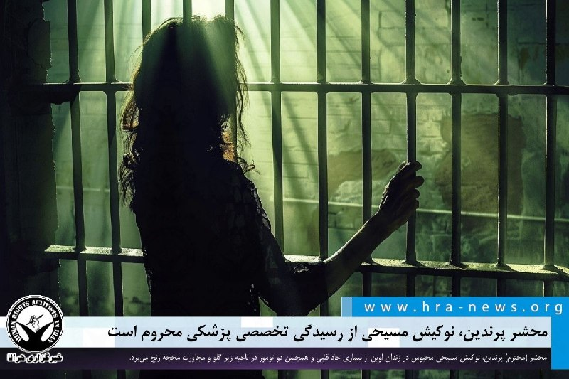

عدم رسیدگی پزشکی؛ گزارش جدید از وضعیت محشر پرندین، نوکیش مسیحی در زندان اوین

❗️
❗️
❗️
❗️
❗️– محشر (محترم) پرندین، نوکیش مسیحی محبوس در زندان اوین، با وجود ابتلا به بیماری قلبی و همچنین دو تومور در ناحیه زیر گلو و مجاورت مخچه، از رسیدگی تخصصی پزشکی و اعزام به مراکز درمانی خارج از زندان محروم مانده است.

به گزارش خبرگزاری هرانا، ارگان خبری مجموعه فعالان حقوق بشر در ایران، محشر (محترم) پرندین، نوکیش مسیحی محبوس در #زندان_اوین از رسیدگی درمانی محروم مانده است.

یک منبع مطلع از وضعیت جسمانی این نوکیش مسیحی، ضمن تایید این خبر به هرانا گفت: “محشر پرندین از بیماری حاد قلبی و همچنین دو تومور در ناحیه زیر گلو و مجاورت مخچه رنج می‌برد. بنا بر تشخیص پزشک زندان، وضعیت جسمی وی نگران‌کننده بوده و این تومورها نیازمند جراحی فوری هستند. با این حال، وی تاکنون از اعزام به مراکز درمانی تخصصی محروم مانده است.”
به گفته یک منبع مطلع، تومور قرارگرفته در مجاورت مخچه بر وضعیت جسمانی خانم پرندین اثر گذاشته و موجب اختلال در تعادل، حرکت و تکلم او شده است؛ به‌طوری که گفتار وی با مکث‌های محسوس همراه است.

ادامه مطلب

#محشر_پرندین
#محترم_پرندین

↘️
@hranews_bot تماس ✉️ -  @Hranews  کانال هرانا 🆑

## Hranews — post 112907

  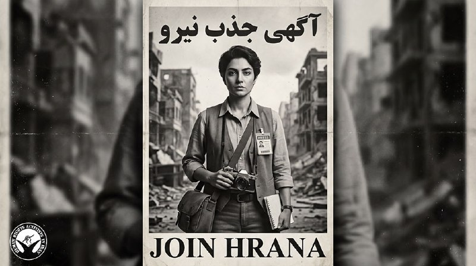

💥 دعوت به همکاری با خبرگزاری هرانا

خبرگزاری هرانا، با بیش از دو دهه سابقه در حوزه گزارشگری و مستندسازی حقوق بشر، در راستای توسعه فعالیت‌های خود از علاقه‌مندان واجد شرایط برای همکاری دعوت می‌کند.

هرانا در این مرحله بیش از آن‌که به دنبال افراد با سابقه حرفه‌ای باشد، به دنبال افرادی متعهد، دقیق و آموزش‌پذیر است؛ کسانی که دغدغه واقعی حقوق بشر دارند و مایل‌اند در یک چارچوب حرفه‌ای، مهارت‌های خود را توسعه دهند.

زمینه‌های همکاری شامل:
گزارشگری، ویراستاری، ترجمه، مدیریت شبکه‌های اجتماعی و سایر حوزه‌های مرتبط

ویژگی‌های مورد انتظار:

* تسلط کافی به زبان فارسی (خواندن و نوشتن)
* دقت، مسئولیت‌پذیری و توانایی یادگیری مستمر
* علاقه و حساسیت نسبت به موضوعات حقوق بشر
* آمادگی برای فعالیت در چارچوب‌های سازمان‌یافته و حرفه‌ای

❗️ توجه: این فرصت همکاری فقط شامل کسانی است که به زبان فارسی مسلط و ساکن یکی از کشورهای "ترکیه، قبرس شمالی، هندوستان، مصر، قرقیزستان، ازبکستان، کلمبیا، پاراگوئه، قزاقستان، سریلانکا، بلغارستان و رومانی" هستند.

همکاری با هرانا فرصتی است برای کسب تجربه عملی در حوزه مستندسازی و فعالیت‌های حقوق بشری در یک نهاد با سابقه و ساختار حرفه‌ای.

📎 برای ثبت درخواست همکاری، لطفا فرم زیر را تکمیل کنید:
https://hra.news/4cBjHqs

📩 در صورت بروز مشکل در تکمیل فرم، می‌توانید رزومه و اطلاعات تماس خود را به آدرس زیر ارسال نمایید:
info@hra-news.org

↘️
@hranews_bot تماس ✉️ -  @Hranews  کانال هرانا 🆑

## Hranews — post 112906

یک شهروند توسط نیروهای اداره اطلاعات در ازنا بازداشت شد

❗️
❗️
❗️
❗️
❗️– یک شهروند در شهرستان ازنا به دلیل آنچه ارتباط و همکاری با یکی از گروه‌های مخالف نظام عنوان شده است، توسط نیروهای اداره اطلاعات #بازداشت شد.

ادامه مطلب

↘️
@hranews_bot تماس ✉️ -  @Hranews  کانال هرانا 🆑

## Hranews — post 112905

  

افزایش هزینه مسکن و اجاره‌بها، فشار معیشتی بر خانوارهای کارگری را تشدید کرده و سهم مسکن را به بخش عمده سبد هزینه خانواده‌ها در برخی کلان‌شهرها رسانده است. خبرگزاری ایلنا با انتشار گزارشی در این رابطه، به پیامدهای رشد #تورم، افزایش هزینه ساخت‌وساز و کاهش قدرت خرید پرداخته است. بر اساس این گزارش، بسیاری از خانواده‌ها ناچار شده‌اند برای تامین هزینه سرپناه، از مخارج ضروری مانند خوراک، درمان و آموزش بکاهند.

کارشناسان اقتصادی همچنین از گسترش فقر مسکن، افزایش جابه‌جایی اجباری مستاجران به مناطق پایین‌تر و تشدید فشار بر خانوارهای کم‌درآمد خبر می‌دهند. به گفته آنان، ادامه رکود اقتصادی و #بیکاری، در کنار ناکارآمدی سیاست‌های حمایتی دولت، موجب شده بخش قابل توجهی از مستاجران با دشواری بیشتری در تامین هزینه‌های زندگی روبه‌رو شوند.

↘️
@hranews_bot تماس ✉️ - @Hranews کانال هرانا 🆑

## Hranews — post 112904

پخش اعترافات اجباری؛ گزارشی از بازداشت سه شهروند توسط ماموران اطلاعات سپاه

❗️
❗️
❗️
❗️
❗️– سه شهروند در استان کهگیلویه و بویراحمد به دلایلی همچون استفاده از استارلینک برای ارتباط با گروه‌های مخالف نظام و تصویربرداری از اماکن خاص و ارسال تصاویر آن به رسانه‌های خارج از کشور توسط ماموران سازمان اطلاعات سپاه #بازداشت شدند. ویدیویی از اعترافات اجباری این افراد نیز منتشر شده که شرایط ضبط آن مشخص نیست.

ادامه مطلب

↘️
@hranews_bot تماس ✉️ -  @Hranews  کانال هرانا 🆑

## Hranews — post 112903

  

مطهره گونه‌ای مجددا به دادسرا فراخوانده شد

❗️
❗️
❗️
❗️
❗️– مطهره گونه‌ای، فعال دانشجویی، برای دومین بار طی یک ماه اخیر به دادسرای عمومی و انقلاب ناحیه ۳۱ تهران احضار شد.

به گزارش خبرگزاری هرانا، ارگان خبری مجموعه فعالان حقوق بشر در ایران، مطهره گونه‌ای، فعال دانشجویی احضار شد.

وی با انتشار مطلبی در این خصوص نوشت: «امروز احضاریه جدید آمد. این بار، جهت دفاع از اتهام انتسابی نشر اکاذیب باید به دادسرای عمومی و انقلاب ناحیه ۳۱ تهران مراجعه کنم.»

ادامه مطلب

#مطهره_گونه‌ای

↘️
@hranews_bot تماس ✉️ -  @Hranews  کانال هرانا 🆑

## Hranews — post 112902

  

زندان وکیل‌آباد؛ احراز هویت ۳۰ زن بازداشت‌شده در اعتراضات و تحولات امنیتی همزمان با جنگ

❗️
❗️
❗️
❗️
❗️– دست‌کم ۳۰ زن در جریان اعتراضات دی‌ماه ۱۴۰۴ و همچنین تحولات امنیتی همزمان با جنگ، در استان خراسان رضوی بازداشت و به بند «آرامش» و قرنطینه زندان وکیل‌آباد مشهد منتقل شدند. هم‌اکنون ۲۵ نفر از این شهروندان کماکان در این زندان نگهداری می‌شوند و ۵ نفر از آنها نیز با تأمین قرار کیفری آزاد شده‌اند. گزارش پیش رو، به هویت و جزئیات پرونده آنان میپردازد.

به گزارش خبرگزاری هرانا، ارگان خبری مجموعه فعالان حقوق بشر در ایران، هویت ۳۰ زن بازداشت‌شده در استان خراسان رضوی احراز شده است.

بر اساس اطلاعات دریافتی هرانا، این شهروندان در جریان اعتراضات دی‌ماه ۱۴۰۴ و همچنین تحولات امنیتی همزمان با جنگ بازداشت شده‌اند و ۲۵ تن از آنها همچنان در زندان به سر می‌برند. مریم نوری، آرزو دهقان، نادیا صدق‌علی، سهیلا حسینی، نجمه امینی، مهدیه افقهی، حدیثه مرواریدی، فائره صالح‌آبادی، شهرزاد ضمیری، طاهره دهقان، آذر یاهو، آسیه نعیمی، عادله نعیمی، مهسا بهداری، محبوبه شعبانی، مرضیه مشهدی، سیما انبایی، زهرا موسوی، معصومه یعقوبی، فاطمه رضوانی‌فر، سیده زینب موسوی، حدیثه بابازاده، ملیکا خاوری خراسانی، مینا زارعی و ریحانه کفشکنان ۲۵ زندانی هستند که هویتشان توسط هرانا احراز شده و کماکان در زندان وکیل‌آباد مشهد محبوس هستند.
همچنین هویت پنج بازداشتی که اخیراً از این زندان آزاد شده‌اند، سمیرا بیات، نگار فرهمند، فاطمه ارم، نجمه روحند و الناز اقبالی نیز توسط هرانا احراز شده است.

ادامه مطلب

↘️
@hranews_bot تماس ✉️ -  @Hranews  کانال هرانا 🆑

## Hranews — post 112901

  

کیفرخواست پرونده روح الله کرکی صادر شد

❗️
❗️
❗️
❗️
❗️– پرونده روح الله کرکی، شهروند اهل اندیمشک، با صدور کیفرخواست توسط شعبه ۹ دادسرای عمومی و انقلاب اهواز به دادگاه کیفری ۲ این شهرستان ارجاع شد.

به گزارش خبرگزاری هرانا، ارگان خبری مجموعه فعالان حقوق بشر در ایران، کیفرخواست پرونده روح الله کرکی صادر شد.

براساس اطلاعات دریافتی هرانا، پرونده آقای کرکی با صدور کیفرخواست از بابت اتهامات «انتشار و افشای اسناد محرمانه»، «همکاری با سازمان مجاهدین خلق»، «جاسوسی برای اسرائیل و تبادل اطلاعات نظامی و امنیتی»، «توهین به مقدسات و مقامات» و «اقدام علیه امنیت ملی» توسط شعبه ۹ اظهارنظر دادسرای عمومی و انقلاب اهواز صادر و به دادگاه کیفری ۲ این شهرستان ارجاع شده است.

ادامه مطلب

#روح_الله_کرکی

↘️
@hranews_bot تماس ✉️ -  @Hranews  کانال هرانا 🆑

## Hranews — post 112900

  

روز یکشنبه ۲۰ اردیبهشت‌ماه، شماری از اساتید اخراجی دانشگاه فرهنگیان در مقابل ساختمان های سازمان بازرسی کل کشور و وزارت آموزش و پرورش دست به #تجمع اعتراضی زدند.

این اساتید نسبت به اخراج بیش از ۳۰۰ عضو هیئت علمی دانشگاه و قطع حدود ۱۰ ماه از حقوق و مزایای‌شان اعتراض کرده و خواستار رسیدگی به مطالبات خود و عزل رئیس دانشگاه فرهنگیان شدند.

↘️
@hranews_bot تماس ✉️ - @Hranews کانال هرانا 🆑

## manototv — post 105371

  <a href="telegram/content/manototv_105371_1778610780.mp4" target="_blank">🎬 Download video</a>

تماسی از مشهد:
«می‌گفت بلاتکلیفی کنکور، گرونی منابع و قطعی اینترنت، دانش‌آموزها رو زیر فشار شدید گذاشته.»

## manototv — post 105366

اکونومیست می‌نویسد بحران طولانی ایران می‌تواند برای کشورهای خلیج فارس فقط یک چالش امنیتی کوتاه‌مدت نباشد، بلکه به آزمونی جدی برای آینده اقتصادی، سرمایه‌گذاری خارجی، تجارت دریایی و تصویر این منطقه به‌عنوان مقصدی امن و باثبات تبدیل شود. ورق بزنید.

## manototv — post 105365

  <a href="telegram/content/manototv_105365_1778610782.mp4" target="_blank">🎬 Download video</a>

وزیر خارجه پاکستان اعلام کرد در گفت‌وگو با همتای چینی خود، درباره تلاش‌های اسلام‌آباد برای تسهیل مذاکرات میان جمهوری‌اسلامی و آمریکا رایزنی کرده است.
وزارت خارجه پاکستان در بیانیه‌ای اعلام کرد وانگ یی، وزیر خارجه چین، از نقش «سازنده» پاکستان در میانجیگری حمایت و قدردانی کرده است.
دو طرف همچنین بر ضرورت ادامه آتش‌بس پایدار و تضمین عبور عادی کشتی‌ها از تنگه هرمز تأکید کردند.
این گفت‌وگو در حالی انجام شده که دونالد ترامپ قرار است این هفته به‌طور رسمی به چین سفر کند.

## manototv — post 105364

  <a href="telegram/content/manototv_105364_1778610783.mp4" target="_blank">🎬 Download video</a>

ژنرال دن کین، رئیس ستاد مشترک ارتش آمریکا، اعلام کرد جمهوری‌اسلامی تحت فشار شدید ناشی از تحریم‌ها و محاصره قرار دارد و واشنگتن همچنان «طیفی از گزینه‌های نظامی» را در اختیار دارد.
در جلسه استماع سنای آمریکا، کریس مورفی، سناتور دموکرات، با اشاره به افزایش شدید قیمت سوخت پرسید آیا راهی جز دیپلماسی برای بازگشایی تنگه هرمز وجود دارد یا نه.
پیت هگست، وزیر دفاع آمریکا، در پاسخ گفت واشنگتن «قطعاً» ابزارهای نظامی لازم برای باز کردن تنگه هرمز را در اختیار دارد؛ از جمله حمله به اهداف زمینی و استفاده از توان دریایی و محاصره نظامی.

## manototv — post 105363

  <a href="telegram/content/manototv_105363_1778610785.mp4" target="_blank">🎬 Download video</a>

جان هیلی، وزیر دفاع بریتانیا، اعلام کرد لندن جنگنده، پهپاد و یک ناو جنگی را به مأموریت چندملیتی حفاظت از تردد کشتی‌ها در تنگه هرمز اعزام خواهد کرد.

هیلی این خبر را پس از نشست مشترک با وزرای دفاع ۴۰ کشور اعلام کرد؛ نشستی که با هدف جلب حمایت برای مأموریت تحت رهبری بریتانیا جهت تأمین امنیت کشتیرانی در تنگه هرمز برگزار شد.

بریتانیا می‌گوید این مأموریت در واکنش به محاصره تنگه هرمز از سوی جمهوری اسلامی انجام می‌شود.

## manototv — post 105362

  <a href="telegram/content/manototv_105362_1778610786.mp4" target="_blank">🎬 Download video</a>

سازمان جهانی بهداشت هشدار داد شمار موارد ابتلا به هانتاویروس، پس از شیوع این ویروس در یک کشتی گردشگری در اقیانوس اطلس، احتمالاً افزایش پیدا خواهد کرد.
تدروس آدهانوم، مدیرکل سازمان جهانی بهداشت، اعلام کرد تاکنون ۹ مورد ابتلای قطعی و دو مورد مشکوک ثبت شده و انتظار می‌رود افراد بیشتری نیز به ویروس مبتلا شده باشند. با این حال او تأکید کرد خطر شیوع گسترده جهانی همچنان «پایین» ارزیابی می‌شود.
شیوع بیماری در کشتی «ام‌وی هوندیوس» آغاز شد؛ جایی که سه مسافر، شامل یک زوج هلندی و یک زن آلمانی، جان خود را از دست دادند. این کشتی در حال سفر ۳۵ روزه در اقیانوس اطلس بود.
هانتاویروس معمولاً از طریق ادرار، بزاق یا فضولات جوندگان منتقل می‌شود. گونه «آندِس» تنها نوع شناخته‌شده‌ای است که می‌تواند از انسان به انسان منتقل شود.
در پی این بحران، صدها مسافر و خدمه در کشورهای مختلف تحت قرنطینه یا مراقبت پزشکی قرار گرفته‌اند. مقام‌های بهداشتی در اروپا و آمریکا نیز در حال ردیابی تماس‌های مرتبط با مبتلایان هستند.

## manototv — post 105361

  <a href="telegram/content/manototv_105361_1778610786.mp4" target="_blank">🎬 Download video</a>

مقام‌های آمریکایی اعلام کردند نیروهای این کشور مانع عبور یک نفتکش با پرچم جمهوری مالت از تنگه هرمز شده‌اند.
سخنگوی ستاد فرماندهی مرکزی آمریکا سنتکام؛ به الجزیره گفت نفتکش «آگیوس فانوریوس» به‌دلیل نقض محاصره دریایی، اجازه عبور پیدا نکرده است. به گفته او، این کشتی حامل نفت ایران نبوده است.
مقام‌های آمریکایی همچنین اعلام کردند چند نفتکش دیگر نیز به‌دلیل نقض تحریم‌ها و محاصره اعمال‌شده علیه بنادر ایران، متوقف شده‌اند.

## manototv — post 105360

  <a href="telegram/content/manototv_105360_1778610787.mp4" target="_blank">🎬 Download video</a>

«اینترنت را قطع کردند تا صدای مردم خاموش شود.»

## manototv — post 105359

  <a href="telegram/content/manototv_105359_1778610790.mp4" target="_blank">🎬 Download video</a>

شورای همکاری خلیج فارس ورود نیروهایی از سپاه پاسداران به جزیره بوبیان کویت را محکوم کرد.

جاسم البدیوی، دبیرکل شورای همکاری خلیج فارس، گفت: «نفوذ عناصر سپاه پاسداران به جزیره بوبیان کویت و برنامه‌ریزی آن‌ها برای اقدامات خصمانه را محکوم می‌کنیم.»

او همچنین تأکید کرد شورای همکاری خلیج فارس از کویت در همه اقداماتی که برای حفظ امنیت و ثبات خود انجام دهد، حمایت می‌کند.

## manototv — post 105358

  <a href="telegram/content/manototv_105358_1778610790.mp4" target="_blank">🎬 Download video</a>

وزارت خارجه کویت اعلام کرد در پی آنچه «نفوذ» اعضای مسلح وابسته به سپاه پاسداران خوانده شده، سفیر جمهوری‌اسلامی در این کشور را احضار و یادداشت اعتراضی رسمی به او تحویل داده است.
به گفته مقام‌های کویتی، چهار عضو منتسب به سپاه قصد داشتند از راه دریا وارد کویت شوند و «اقدامات خصمانه» انجام دهند. وزارت کشور کویت اعلام کرد در درگیری با نیروهای امنیتی، یک نیروی کویتی زخمی شده و دو نفر از متهمان نیز فرار کرده‌اند.
معاون وزیر خارجه کویت این اقدام را «نقض آشکار حاکمیت کویت» و مغایر با قوانین بین‌المللی و منشور سازمان ملل توصیف کرد و از تهران خواست فوراً چنین اقداماتی را متوقف کند.

## manototv — post 105357

  <a href="telegram/content/manototv_105357_1778610791.mp4" target="_blank">🎬 Download video</a>

تورم در آمریکا افزایش یافته و طبق آمار رسمی اداره آمار کار آمریکا، این افزایش عمدتا به عوامل مرتبط با جنگ ایران مربوط می‌شود.
شاخص قیمت مصرف‌کننده در ماه آوریل به ۳.۸ درصد رسید؛ در حالی‌ که این رقم در ماه مارس ۳.۳ درصد بود. افزایش قیمت بنزین از مهم‌ترین دلایل این رشد اعلام شده است.
این آمار نشان می‌دهد بالا رفتن قیمت نفت، که ناشی از اختلال مؤثر در تردد از تنگه هرمز بوده، باعث افزایش بیشتر قیمت‌ها شده است.
بر اساس این گزارش، افزایش هزینه انرژی و سوخت اصلی‌ترین عامل رشد ۰.۵ واحد درصدی تورم بوده است.
تحلیلگران می‌گویند این وضعیت علاوه بر فشار بر مصرف‌کنندگان آمریکایی و اقتصاد آمریکا، ممکن است یک پیامد سیاسی هم داشته باشد؛ چرا که فشار اقتصادی بر رأی‌دهندگان می‌تواند دونالد ترامپ را به بازگشت به میز مذاکره سوق دهد.

## manototv — post 105356

  <a href="telegram/content/manototv_105356_1778610792.mp4" target="_blank">🎬 Download video</a>

تماسی از ایران؛ «می‌گفت تو این شرایط، به دور و برمون نگاه کنیم و دستِ همدیگه رو بگیریم…
تو هر خانواده و آشنایی یکی هست که بی‌صدا به کمک نیاز داره.»

## manototv — post 105355

  <a href="telegram/content/manototv_105355_1778610794.mp4" target="_blank">🎬 Download video</a>

دونالد ترامپ، رئیس‌جمهور آمریکا، با وجود توقف مذاکرات با جمهوری‌اسلامی، در یک گفتگو، اعلام کرده تهران صددرصد غنی‌سازی اورانیوم و هرگونه تلاش برای ساخت سلاح هسته‌ای را متوقف خواهد کرد.
ترامپ در گفت‌وگو با رادیوی WABC گفت شخصاً با مقام‌های جمهوری‌اسلامی در تماس بوده و افزود: «آن‌ها گفتند ما غبار هسته‌ای را تحویل خواهیم گرفت.»
او همچنین تأکید کرد آمریکا برای رسیدن به توافق عجله‌ای ندارد و گفت: «ما محاصره را در اختیار داریم.»

## manototv — post 105354

  <a href="telegram/content/manototv_105354_1778610795.mp4" target="_blank">🎬 Download video</a>

تماسی از تجربه‌اش با بهزیستی
می‌گفت برای بیمه و تأیید مشکلش هزار تا ایراد گرفتن
اما وقتی پای کمک رسید، گفتن هیچ مشکلی نداری

## manototv — post 105353

  <a href="telegram/content/manototv_105353_1778610797.mp4" target="_blank">🎬 Download video</a>

در جلسه استماع کنگره آمریکا، مقام‌های ارشد پنتاگون اعلام کردند هزینه تسلیحات و تجهیزات مصرف‌شده آمریکا در جنگ با ایران تاکنون به حدود ۲۴ میلیارد دلار رسیده است.
پیت هگست، وزیر دفاع آمریکا، به همراه رئیس ستاد مشترک ارتش و مقام مالی وزارت جنگ در این جلسه حضور داشتند. به گفته جولز هرست، این رقم شامل مهمات، موشک‌ها و سایر تجهیزات نظامی استفاده‌شده در جنگ است.
پنتاگون ماه گذشته نیز اعلام کرده بود مجموع هزینه‌های جنگ با ایران تاکنون به ۲۹ میلیارد دلار رسیده است.

## manototv — post 105352

  <a href="telegram/content/manototv_105352_1778610797.mp4" target="_blank">🎬 Download video</a>

ابراهیم رضایی، سخنگوی کمیسیون امنیت ملی و سیاست خارجی مجلس شورای اسلامی در شبکه اکس تهدید کرده، غنی سازی ۹۰ درصد به عنوان یکی از گزینه‌های جمهوری‌اسلامی در صورت حمله مجدد، بررسی می‌شود.

## alonews — post 119561

  <a href="telegram/content/alonews_119561_1778610798.webm" target="_blank">🎬 Download video</a>

👈فارس با تایید پیش شرط های ایران؛ به نقل از یک منبع آگاه گزارش داد: ایران به میانجی پاکستانی اعلام کرده است که تداوم محاصره دریایی در محدوده دریای عرب و خلیج عمان پس از برقراری آتش‌بس، گزاره غیرقابل اعتماد بودن مذاکره با آمریکا را بیش از پیش تقویت کرده است

✅ @AloNews خبر جنگ

## alonews — post 119560

  <a href="telegram/content/alonews_119560_1778610798.webm" target="_blank">🎬 Download video</a>

👈 ترامپ: شما دوران طلایی آمریکا را زمانی خواهید دید که این جنگ به پایان برسد، و شما اکنون آن را می‌بینید

🔴من به وضعیت مالی آمریکایی‌ها فکر نمی‌کنم. به هیچ‌کس فکر نمی‌کنم.

🔴فقط به یک چیز فکر می‌کنم: نمی‌توانیم اجازه دهیم ایران سلاح هسته‌ای داشته باشد. همین.

✅ @AloNews خبر جنگ

## alonews — post 119559

  <a href="telegram/content/alonews_119559_1778610798.webm" target="_blank">🎬 Download video</a>

👈خبرنگار به ترامپ : آیا بین شما و پوتین درک متقابلی وجود دارد که روسیه باید کل دونباس را به دست آورد؟

🔴ترامپ: خیر.

✅ @AloNews خبر جنگ

## alonews — post 119558

  <a href="telegram/content/alonews_119558_1778610799.webm" target="_blank">🎬 Download video</a>

👈زمین لرزه ۳.۴ ریشتری پردیس تهران را لرزاند

✅ @AloNews خبر جنگ

## alonews — post 119557

  <a href="telegram/content/alonews_119557_1778610799.webm" target="_blank">🎬 Download video</a>

👈ترامپ درباره نفت : قراره یه فوران نفتی داشته باشید، چیزی که تا حالا ندیدید

🔴 من فکر می‌کردم خیلی بیشتر بالا بره،ما انتظار داشتیم قیمت نفت خیلی بالاتر بره

🔴 هر کاری لازم باشه انجام می‌دم، من هشت تا جنگ رو تموم کردم

✅ @AloNews خبر جنگ

## alonews — post 119556

  <a href="telegram/content/alonews_119556_1778610799.webm" target="_blank">🎬 Download video</a>

👈ترامپ: ما و چین، دو ابرقدرت جهان هستی

🔴ترامپ درباره ایران: ما یا یه توافق می‌کنیم، یا اونا نابود می‌شن - به هر حال ما برنده‌ایم

✅ @AloNews خبر جنگ

## alonews — post 119555

## alonews — post 119553

## alonews — post 119552

  <a href="telegram/content/alonews_119552_1778610799.webm" target="_blank">🎬 Download video</a>

👈هم اکنون طوفان شدید در تهران

✅ @AloNews خبر جنگ

## alonews — post 119550

  <a href="telegram/content/alonews_119550_1778610800.mp4" target="_blank">🎬 Download video</a>

👈ترامپ : از پاکستان به‌عنوان میانجی تو ماجرای ایران حمایت می‌کنم و معتقدم میشه به یه توافق خوب رسید

🔴این قضیه هم برای مردم آمریکا خوبه، هم برای ایرانی‌ها، پاکستانی‌ آدمای خوبی‌ان

✅ @AloNews خبر جنگ

## alonews — post 119549

اخبار جنگ الونیوز AloNews pinned «»

## alonews — post 119548

  <a href="telegram/content/alonews_119548_1778610801.webm" target="_blank">🎬 Download video</a>

👈ترامپ: فکر نمی‌کنم در مورد ایران به کمک نیاز داشته باشیم و به هر طریقی چه مسالمت‌آمیز و چه به شکلی دیگر پیروز خواهیم شد

🔴 یا ایران کار درست را انجام می دهد یا کار را تمام می کنیم

✅ @AloNews خبر جنگ

## alonews — post 119547

  <a href="telegram/content/alonews_119547_1778610801.webm" target="_blank">🎬 Download video</a>

👈ترامپ: با ایران یک توافق خوب منعقد خواهیم کرد

🔴ارتش ایران را حذف کردیم

🔴ماشین جنگی ایران از بین رفته است

🔴گفتگوی طولانی با رئیس جمهور چین درباره جنگ ایران خواهم داشت

🔴کسی که می‌خواهد به دیوانه‌های ایران اجازه دهد به سلاح هسته‌ای دست پیدا کنند، احمق است

🔴نمی‌توان اجازه داد ایران به سلاح هسته‌ای دست یابد و این را می‌داند و ما بازی نمی‌کنیم

🔴فکر نمی‌کنم در مورد ایران به کمک رئیس‌جمهور چین نیاز داشته باشیم

🔴خواهیم دید در مورد ایران چه اتفاقی می افتد و فقط به دنبال انعقاد یک توافق خوب هستیم

🔴ناتو من را ناامید کرده است و نیازی به کمک آن نداریم

✅ @AloNews خبر جنگ

## alonews — post 119546

  <a href="telegram/content/alonews_119546_1778610802.webm" target="_blank">🎬 Download video</a>

👈 ترامپ در پاسخ به این سؤال که آیا آمریکا برای حل مسئله ایران به کمک چین نیاز دارد:

🔴«نه، فکر نمی‌کنم به هیچ کمکی برای مسئله ایران نیاز داشته باشیم. به هر طریقی که شده، پیروز خواهیم شد. چه مسالمت‌آمیز باشد، چه غیر از آن!»

✅ @AloNews خبر جنگ

## alonews — post 119545

  <a href="telegram/content/alonews_119545_1778610802.mp4" target="_blank">🎬 Download video</a>

👈ترامپ، از کاخ سفید خارج شد تا به چین سفر کنه

✅ @AloNews خبر جنگ

## alonews — post 119544

  <a href="telegram/content/alonews_119544_1778610804.webm" target="_blank">🎬 Download video</a>

👈پاپ لئو چهاردهم: مسیحیان و مسلمانان، بی‌تفاوتی را به همبستگی تبدیل کنند

✅ @AloNews خبر جنگ

## alonews — post 119543

  <a href="telegram/content/alonews_119543_1778610804.webm" target="_blank">🎬 Download video</a>

👈سفیر ایران در چین: آمریکا نمی‌تواند مواضع چین درباره ایران را تغییر دهد

✅ @AloNews خبر جنگ

## alonews — post 119542

  <a href="telegram/content/alonews_119542_1778610805.mp4" target="_blank">🎬 Download video</a>

👈خوش‌چشم کارشناس ارشد صداوسیما:
این دفعه جنگ بشه اصلا مهم نیست ساختمون اینتل تو اسرائیل چند طبقه زیر زمینه، کل دیتاسنترهای اینتل میخوره، پروژه مشترک گوگل و آمازونم که میخوره، بقیشم هرچی هست میخوره

✅ @AloNews خبر جنگ

## alonews — post 119541

  <a href="telegram/content/alonews_119541_1778610807.webm" target="_blank">🎬 Download video</a>

👈وزارت دفاع عراق: هیچ‌گونه فعالیت یا تأسیسات نظامی ناشناس در صحرای نجف وجود ندارد

✅ @AloNews خبر جنگ

## alonews — post 119540

  <a href="telegram/content/alonews_119540_1778610807.webm" target="_blank">🎬 Download video</a>

👈تصاویر ماهواره‌ای نشان می‌دهد یک فروند نفتکش ایرانی در ۱۰ می در جزیره خارک در حال بارگیری نفت ایران بوده است که نشان از تداوم بارگیری نفت خام در جزیره خارک دارد.این نفتکش بدون مشکل بارگیری کرد

✅ @AloNews خبر جنگ

<!-- MSG END -->

<!-- NAV START -->

<!-- NAV END -->
